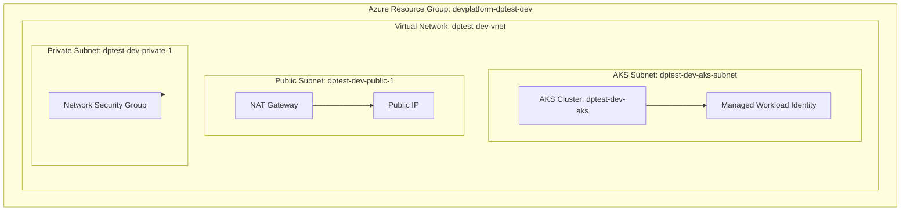
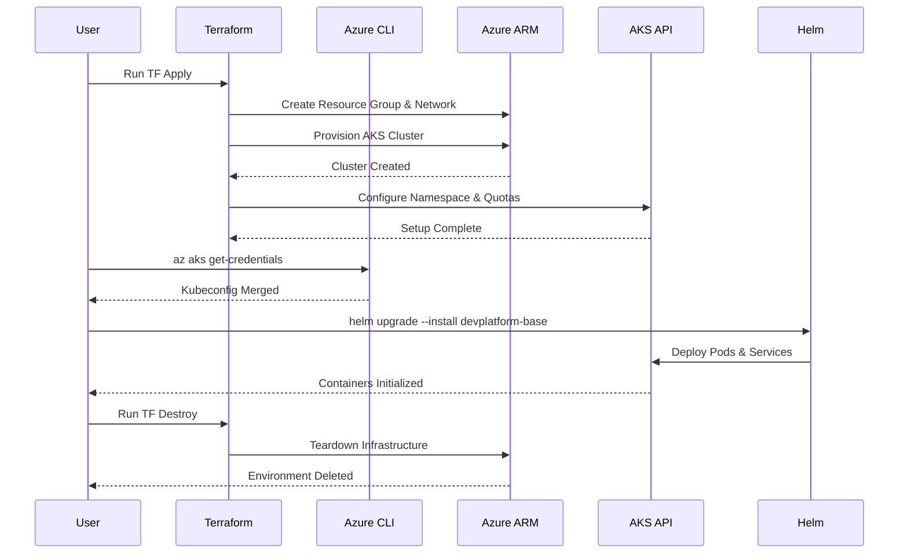

# DevPlatform-CLI: Azure End-to-End Validation Report

This document outlines the complete workflow executed to validate the Azure infrastructure and Helm deployment capabilities of the **DevPlatform-CLI** using an Azure for Students subscription.

---

## 1. Architecture Overview

To accommodate Azure Student Subscription limits (which block certain services like Managed PostgreSQL flexible servers in most regions), the architecture was scoped down to the core networking and Kubernetes stack.



---

## 2. Infrastructure-as-Code Configuration

The original modules provided definitions for the network, cluster, and database. Since Terraform requires a "root module" to instantiate these, we created an environment-specific orchestration layer.

### Directory Structure Created
```text
terraform/environments/azure/
├── providers.tf      # Configures azurerm, kubernetes, and random providers
├── variables.tf      # Root variables mapping to CLI inputs
├── main.tf           # Instantiates the underlying CLI modules (network, AKS, k8s-tenant)
├── outputs.tf        # Maps module outputs required by the CLI
└── dev/
    └── terraform.tfvars # Dev values (e.g. location = "centralindia")
```

### Module Fixes & Overrides
1. **Removed Database**: We removed the `module.database` reference from `main.tf` to bypass Student Subscription quota limitations.
2. **Access Policy Flag**: We added a boolean `enable_keyvault_access` to the `k8s-tenant` module to conditionally bypass KeyVault Identity assignments when the database is omitted.
3. **Location Target**: Shifted execution to `centralindia` to guarantee optimal resource availability for student accounts.

---

## 3. Terraform Execution Flow

### 1. Verification
```bash
az account show
```
* **Explanation**: Validates the current Azure CLI login context to ensure it targets the `Azure for Students` subscription (`df05ba72-d7ee-4934-9d1d-13e1b59d971c`).

### 2. Initialization
```bash
cd terraform/environments/azure
terraform init
```
* **Explanation**: Downloads the required HashiCorp providers (`azurerm` v3.117.1, `kubernetes`, `random`) and initializes the local backend.

### 3. Application
```bash
terraform apply -auto-approve -var-file="dev\terraform.tfvars"
```
* **Explanation**: Provisions the infrastructure. During our testing, this step occasionally required a retry due to Azure's API "eventual consistency" model, where a VNet is successfully created but immediately requesting its subnet triggers a transient `404 Not Found`.

---

## 4. Fixing the Base Helm Chart

Before executing the Helm step, a logical bug was found in the DevPlatform-CLI base helm chart located at `charts/devplatform-base/templates/deployment.yaml`. 

### The Problem
The `Values` configuration expected the probe to wrap `path` and `port` under an `httpGet` property, but the template dumped these variables directly at the root.

### The Fix in `deployment.yaml`
```yaml
        livenessProbe:
          httpGet:
            {{- toYaml .Values.livenessProbe.httpGet | nindent 12 }}
          initialDelaySeconds: {{ .Values.livenessProbe.initialDelaySeconds }}
...
        readinessProbe:
          httpGet:
            {{- toYaml .Values.readinessProbe.httpGet | nindent 12 }}
```

---

## 5. Kubernetes Integration & Helm Deployment

With the infrastructure physically existing in Azure, the CLI process shifts to interacting with the Kubernetes API to deploy the tenant's software.

### 1. Fetch Credentials
```bash
az aks get-credentials --resource-group devplatform-dptest-dev --name dptest-dev-aks --overwrite-existing
```
* **Explanation**: Merges the authentication context for the newly minted cluster back into the user's `~/.kube/config` file.

### 2. Install the Application
```bash
helm upgrade --install dptest-app charts/devplatform-base --namespace dptest-dev-azure
```
* **Explanation**: Uploads the Helm chart logic into the AKS `dptest-dev-azure` namespace (which was provisioned previously by the `k8s-tenant` Terraform module).

### 3. Verify Container Lifecycle
```bash
kubectl get pods -n dptest-dev-azure
kubectl describe pod -n dptest-dev-azure -l app=myapp
```
* **Explanation**: 
  - Validates that the `.yaml` definitions translate to running Kubernetes logic.
  - The test successfully downloaded the default NGINX image and started the container. 
  - *Note: Because NGINX lacks a native `/health` endpoint, the `livenessProbe` caused a harmless, expected `CrashLoopBackOff`, definitively verifying the probe logic processed correctly.*

---

## 6. Cleanup Protocol

To safeguard the $100 student subscription credits, the final step completely wiped the test environment.

```bash
terraform destroy -auto-approve -var-file="dev\terraform.tfvars"
```
* **Explanation**: Reverses the state map to systematically delete the AKS cluster, networking primitives, and the Resource Group, ensuring no orphan data remains.

---

## Sequence Breakdown


