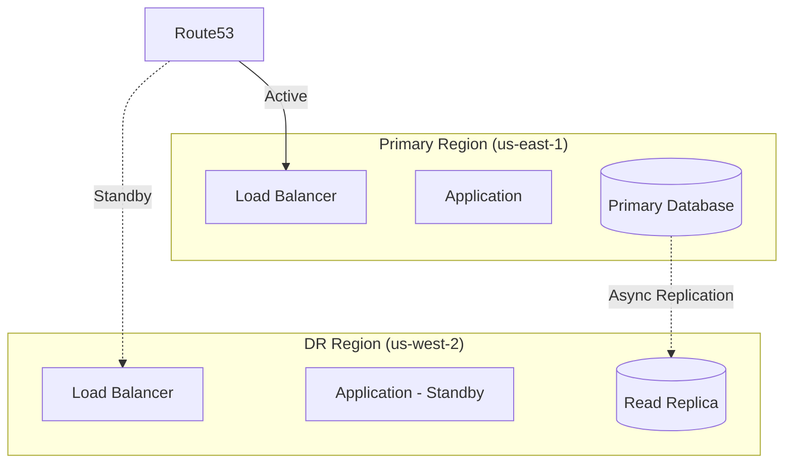

Ensure business continuity with comprehensive disaster recovery planning for DevPlatform CLI deployments.

## Recovery Objectives

<CardGroup cols={2}>
  <Card title="RTO" icon="clock">
    Recovery Time Objective
    
    Target time to restore service after disaster
  </Card>
  <Card title="RPO" icon="database">
    Recovery Point Objective
    
    Maximum acceptable data loss measured in time
  </Card>
</CardGroup>

## Backup Strategy

<Tabs>
  <Tab title="Database Backups">
    <Tabs>
      <Tab title="AWS RDS">
        ```yaml
        # Automated backups
        database:
          backup_retention_period: 30  # Days
          backup_window: "03:00-04:00"  # UTC
          preferred_backup_window: "03:00-04:00"
          
          # Manual snapshots for long-term retention
          snapshot_retention: 90  # Days
        ```
        
        Create manual snapshot:
        ```bash
        aws rds create-db-snapshot \
          --db-instance-identifier myapp-prod \
          --db-snapshot-identifier myapp-prod-$(date +%Y%m%d)
        ```
        
        Restore from snapshot:
        ```bash
        aws rds restore-db-instance-from-db-snapshot \
          --db-instance-identifier myapp-prod-restored \
          --db-snapshot-identifier myapp-prod-20240101
        ```
      </Tab>
      
      <Tab title="Azure Database">
        ```yaml
        # Automated backups
        database:
          backup_retention_days: 30
          geo_redundant_backup_enabled: true
        ```
        
        Create manual backup:
        ```bash
        az postgres server backup create \
          --resource-group myapp-rg \
          --server-name myapp-prod \
          --backup-name myapp-prod-$(date +%Y%m%d)
        ```
        
        Restore from backup:
        ```bash
        az postgres server restore \
          --resource-group myapp-rg \
          --name myapp-prod-restored \
          --restore-point-in-time "2024-01-01T00:00:00Z" \
          --source-server myapp-prod
        ```
      </Tab>
    </Tabs>
  </Tab>
  
  <Tab title="Terraform State">
    <Tabs>
      <Tab title="AWS S3">
        ```hcl
        # Enable versioning
        resource "aws_s3_bucket_versioning" "terraform_state" {
          bucket = aws_s3_bucket.terraform_state.id
          
          versioning_configuration {
            status = "Enabled"
          }
        }
        
        # Lifecycle policy
        resource "aws_s3_bucket_lifecycle_configuration" "terraform_state" {
          bucket = aws_s3_bucket.terraform_state.id
          
          rule {
            id     = "retain-versions"
            status = "Enabled"
            
            noncurrent_version_transition {
              noncurrent_days = 30
              storage_class   = "STANDARD_IA"
            }
            
            noncurrent_version_expiration {
              noncurrent_days = 90
            }
          }
        }
        ```
        
        Restore previous version:
        ```bash
        # List versions
        aws s3api list-object-versions \
          --bucket terraform-state-bucket \
          --prefix myapp-prod.tfstate
        
        # Download specific version
        aws s3api get-object \
          --bucket terraform-state-bucket \
          --key myapp-prod.tfstate \
          --version-id <version-id> \
          myapp-prod.tfstate.backup
        ```
      </Tab>
      
      <Tab title="Azure Storage">
        ```hcl
        # Enable versioning
        resource "azurerm_storage_account" "terraform_state" {
          name                     = "tfstate"
          resource_group_name      = azurerm_resource_group.main.name
          location                 = azurerm_resource_group.main.location
          account_tier             = "Standard"
          account_replication_type = "GRS"
          
          blob_properties {
            versioning_enabled = true
          }
        }
        ```
        
        Restore previous version:
        ```bash
        # List versions
        az storage blob list \
          --account-name tfstate \
          --container-name tfstate \
          --include v \
          --query "[?name=='myapp-prod.tfstate'].{Name:name,Version:versionId}"
        
        # Download specific version
        az storage blob download \
          --account-name tfstate \
          --container-name tfstate \
          --name myapp-prod.tfstate \
          --version-id <version-id> \
          --file myapp-prod.tfstate.backup
        ```
      </Tab>
    </Tabs>
  </Tab>
  
  <Tab title="Application Data">
    ```bash
    # Backup persistent volumes
    kubectl get pvc -n prod-myapp
    
    # Create volume snapshot (AWS)
    aws ec2 create-snapshot \
      --volume-id vol-abc123 \
      --description "Backup $(date +%Y%m%d)"
    
    # Create disk snapshot (Azure)
    az snapshot create \
      --resource-group myapp-rg \
      --name myapp-disk-snapshot-$(date +%Y%m%d) \
      --source /subscriptions/{sub-id}/resourceGroups/{rg}/providers/Microsoft.Compute/disks/myapp-disk
    ```
  </Tab>
  
  <Tab title="Configuration">
    ```bash
    # Backup Kubernetes resources
    kubectl get all -n prod-myapp -o yaml > k8s-backup.yaml
    
    # Backup ConfigMaps
    kubectl get configmap -n prod-myapp -o yaml > configmaps-backup.yaml
    
    # Backup Secrets (encrypted)
    kubectl get secret -n prod-myapp -o yaml > secrets-backup.yaml
    
    # Store in version control (encrypted)
    git add k8s-backup.yaml configmaps-backup.yaml
    git commit -m "Backup $(date +%Y%m%d)"
    git push
    ```
  </Tab>
</Tabs>

## Disaster Recovery Procedures

### Complete Infrastructure Recovery

<Steps>
  <Step title="Assess Damage">
    Determine scope of disaster:
    
    - Database corruption/loss
    - Infrastructure deletion
    - Region outage
    - Application failure
  </Step>
  
  <Step title="Restore Terraform State">
    ```bash
    # Download backup state
    aws s3 cp s3://terraform-state-bucket/myapp-prod.tfstate.backup ./
    
    # Push to current state
    cd .devplatform/terraform/myapp/prod
    terraform state push myapp-prod.tfstate.backup
    ```
  </Step>
  
  <Step title="Restore Infrastructure">
    ```bash
    # Verify state
    terraform plan
    
    # Recreate missing resources
    terraform apply
    ```
  </Step>
  
  <Step title="Restore Database">
    <Tabs>
      <Tab title="AWS">
        ```bash
        # Restore from snapshot
        aws rds restore-db-instance-from-db-snapshot \
          --db-instance-identifier myapp-prod \
          --db-snapshot-identifier myapp-prod-latest
        
        # Wait for availability
        aws rds wait db-instance-available \
          --db-instance-identifier myapp-prod
        ```
      </Tab>
      <Tab title="Azure">
        ```bash
        # Restore from backup
        az postgres server restore \
          --resource-group myapp-rg \
          --name myapp-prod \
          --restore-point-in-time "2024-01-01T00:00:00Z" \
          --source-server myapp-prod-backup
        ```
      </Tab>
    </Tabs>
  </Step>
  
  <Step title="Restore Application">
    ```bash
    # Redeploy application
    devplatform update \
      --app myapp \
      --env prod \
      --image myapp:v1.0.0
    
    # Verify deployment
    kubectl rollout status deployment/myapp -n prod-myapp
    ```
  </Step>
  
  <Step title="Verify Recovery">
    ```bash
    # Check application health
    curl https://myapp.example.com/health
    
    # Check database connectivity
    kubectl exec -it <pod-name> -n prod-myapp -- \
      psql -h <db-endpoint> -U admin -d myapp -c "SELECT COUNT(*) FROM users"
    
    # Run smoke tests
    npm run test:smoke -- --env=prod
    ```
  </Step>
</Steps>

## Multi-Region Disaster Recovery

### Active-Passive Setup



Setup:

<Tabs>
  <Tab title="AWS">
    ```yaml
    # Primary region
    provider: aws
    region: us-east-1
    
    database:
      multi_az: true
      read_replicas:
        - region: us-west-2  # Cross-region replica
          instance_class: db.r5.large
    ```
    
    Failover procedure:
    ```bash
    # Promote read replica
    aws rds promote-read-replica \
      --db-instance-identifier myapp-prod-dr \
      --region us-west-2
    
    # Update Route53
    aws route53 change-resource-record-sets \
      --hosted-zone-id Z123456 \
      --change-batch file://failover-to-dr.json
    ```
  </Tab>
  
  <Tab title="Azure">
    ```yaml
    # Primary region
    provider: azure
    location: eastus
    
    database:
      geo_redundant_backup_enabled: true
      replica:
        location: westus2
    ```
    
    Failover procedure:
    ```bash
    # Initiate failover
    az postgres server replica stop \
      --name myapp-prod-dr \
      --resource-group myapp-rg
    
    # Update Traffic Manager
    az network traffic-manager endpoint update \
      --name primary \
      --profile-name myapp-tm \
      --resource-group myapp-rg \
      --type azureEndpoints \
      --endpoint-status Disabled
    ```
  </Tab>
</Tabs>

## Automated Backup Scripts

```bash
#!/bin/bash
# backup.sh - Automated backup script

set -e

APP_NAME="myapp"
ENV="prod"
DATE=$(date +%Y%m%d-%H%M%S)
BACKUP_DIR="/backups/${APP_NAME}/${ENV}/${DATE}"

mkdir -p ${BACKUP_DIR}

echo "Starting backup for ${APP_NAME}-${ENV}..."

# Backup database
echo "Backing up database..."
aws rds create-db-snapshot \
  --db-instance-identifier ${APP_NAME}-${ENV} \
  --db-snapshot-identifier ${APP_NAME}-${ENV}-${DATE}

# Backup Terraform state
echo "Backing up Terraform state..."
aws s3 cp \
  s3://terraform-state-bucket/${APP_NAME}-${ENV}.tfstate \
  ${BACKUP_DIR}/terraform-state.tfstate

# Backup Kubernetes resources
echo "Backing up Kubernetes resources..."
kubectl get all -n ${ENV}-${APP_NAME} -o yaml > ${BACKUP_DIR}/k8s-resources.yaml
kubectl get configmap -n ${ENV}-${APP_NAME} -o yaml > ${BACKUP_DIR}/configmaps.yaml
kubectl get secret -n ${ENV}-${APP_NAME} -o yaml > ${BACKUP_DIR}/secrets.yaml

# Backup persistent volumes
echo "Backing up persistent volumes..."
kubectl get pvc -n ${ENV}-${APP_NAME} -o json | \
  jq -r '.items[].spec.volumeName' | \
  while read volume; do
    aws ec2 create-snapshot \
      --volume-id ${volume} \
      --description "Backup ${DATE}"
  done

# Upload to S3
echo "Uploading backup to S3..."
aws s3 sync ${BACKUP_DIR} s3://backups-bucket/${APP_NAME}/${ENV}/${DATE}/

echo "Backup completed successfully!"
```

Schedule with cron:
```bash
# Run daily at 2 AM
0 2 * * * /usr/local/bin/backup.sh >> /var/log/backup.log 2>&1
```

## Testing Recovery

Regular DR testing is critical:

<Steps>
  <Step title="Schedule DR Test">
    Plan quarterly DR tests in non-production environment
  </Step>
  
  <Step title="Simulate Disaster">
    ```bash
    # Delete resources in test environment
    devplatform destroy --app myapp --env dr-test --confirm
    ```
  </Step>
  
  <Step title="Execute Recovery">
    Follow recovery procedures to restore environment
  </Step>
  
  <Step title="Measure RTO/RPO">
    Document actual recovery time and data loss
  </Step>
  
  <Step title="Update Procedures">
    Refine procedures based on test results
  </Step>
</Steps>

## Recovery Checklist

<AccordionGroup>
  <Accordion title="Pre-Disaster">
    - [ ] Automated backups configured
    - [ ] Backup retention policies set
    - [ ] Cross-region replication enabled
    - [ ] DR procedures documented
    - [ ] Team trained on procedures
    - [ ] Regular DR tests scheduled
  </Accordion>
  
  <Accordion title="During Disaster">
    - [ ] Assess scope of disaster
    - [ ] Notify stakeholders
    - [ ] Activate DR team
    - [ ] Begin recovery procedures
    - [ ] Document actions taken
    - [ ] Communicate status updates
  </Accordion>
  
  <Accordion title="Post-Recovery">
    - [ ] Verify all services operational
    - [ ] Validate data integrity
    - [ ] Monitor for issues
    - [ ] Conduct post-mortem
    - [ ] Update DR procedures
    - [ ] Test recovered environment
  </Accordion>
</AccordionGroup>

## Related Resources

<CardGroup cols={2}>
  <Card title="Multi-Environment Setup" icon="layer-group" href="/guides/multi-environment">
    Configure multiple environments
  </Card>
  <Card title="Migration Guide" icon="arrow-right-arrow-left" href="/guides/migration">
    Migrate existing infrastructure
  </Card>
</CardGroup>
