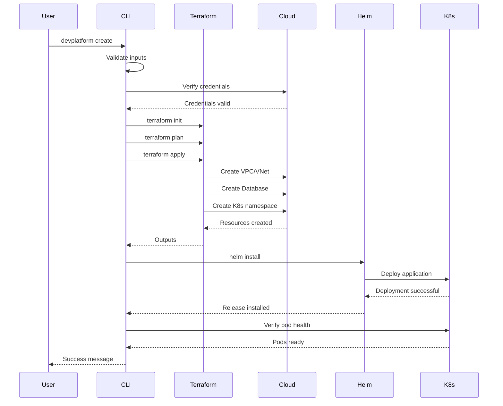

## Overview

The `create` command provisions a complete infrastructure environment including network, database, Kubernetes namespace, and application deployment.

## Syntax

```bash
devplatform create [flags]
```

## Required Flags

<ParamField path="app" type="string" required>
  Application name (lowercase alphanumeric and hyphens only)
  
  **Example:** `payment`, `user-service`, `api-gateway`
</ParamField>

<ParamField path="env" type="string" required>
  Environment type
  
  **Options:** `dev`, `staging`, `prod`
</ParamField>

## Optional Flags

<ParamField path="provider" type="string" default="aws">
  Cloud provider to use
  
  **Options:** `aws`, `azure`
</ParamField>

<ParamField path="dry-run" type="boolean" default="false">
  Preview changes without applying them
</ParamField>

<ParamField path="values-file" type="string">
  Path to custom Helm values file
  
  **Example:** `./custom-values.yaml`
</ParamField>

<ParamField path="config-file" type="string" default="~/.devplatform/config.yaml">
  Path to configuration file
</ParamField>

<ParamField path="verbose" type="boolean" default="false">
  Enable verbose output
</ParamField>

<ParamField path="debug" type="boolean" default="false">
  Enable debug logging
</ParamField>

<ParamField path="no-color" type="boolean" default="false">
  Disable colored output
</ParamField>

<ParamField path="timeout" type="integer" default="30">
  Operation timeout in minutes
</ParamField>

## Examples

### Basic AWS Deployment

```bash
devplatform create --app payment --env dev --provider aws
```

### Azure Deployment with Custom Values

```bash
devplatform create \
  --app payment \
  --env prod \
  --provider azure \
  --values-file ./prod-values.yaml
```

### Dry Run

```bash
devplatform create \
  --app payment \
  --env dev \
  --dry-run
```

This shows what would be created without actually provisioning resources.

### Verbose Output

```bash
devplatform create \
  --app payment \
  --env dev \
  --verbose
```

## What Gets Created

<Tabs>
  <Tab title="AWS">
    ### Network Infrastructure
    - VPC with configurable CIDR
    - Public and private subnets across multiple AZs
    - Internet Gateway
    - NAT Gateways (one per AZ)
    - Route tables
    - Security groups

    ### Database
    - RDS PostgreSQL instance
    - DB subnet group
    - Automated backups
    - Secrets Manager entry for credentials

    ### Kubernetes
    - Namespace in shared EKS cluster
    - Resource quotas
    - Service account with IRSA
    - Network policies

    ### Application
    - Helm release
    - Deployment with configurable replicas
    - Service (ClusterIP)
    - Ingress with ALB
    - ConfigMap
    - Secrets
  </Tab>

  <Tab title="Azure">
    ### Network Infrastructure
    - VNet with configurable CIDR
    - Public and private subnets across multiple zones
    - NAT Gateways
    - Network Security Groups (NSGs)
    - Route tables

    ### Database
    - Azure Database for PostgreSQL
    - Subnet delegation
    - Automated backups
    - Key Vault entry for credentials

    ### Kubernetes
    - Namespace in shared AKS cluster
    - Resource quotas
    - Service account with Workload Identity
    - Network policies

    ### Application
    - Helm release
    - Deployment with configurable replicas
    - Service (ClusterIP)
    - Ingress with Application Gateway
    - ConfigMap
    - Secrets
  </Tab>
</Tabs>

## Execution Flow



## Output

### Success Output

```
✓ Validating credentials...
✓ Loading configuration...
✓ Initializing Terraform...
✓ Creating VPC (10.0.0.0/16)...
✓ Creating RDS instance (db.t3.micro)...
✓ Creating EKS namespace (dev-payment)...
✓ Deploying Helm chart...
✓ Verifying pod health...

✅ Environment created successfully!

Connection Information:
  Database Endpoint: payment-dev.abc123.us-east-1.rds.amazonaws.com:5432
  Kubernetes Namespace: dev-payment
  Ingress URL: https://payment-dev.example.com

Estimated Monthly Cost: $75

Next Steps:
  1. Update kubeconfig: aws eks update-kubeconfig --name shared-cluster
  2. View pods: kubectl get pods -n dev-payment
  3. Check status: devplatform status --app payment --env dev
```

### Error Output

```
❌ Error: Authentication (1001)

AWS credentials not found or expired.

Details:
Unable to locate credentials. You can configure credentials by running "aws configure".

Resolution:
1. Run: aws configure
2. Enter your AWS Access Key ID
3. Enter your AWS Secret Access Key
4. Set default region (e.g., us-east-1)

For more information, see the log file:
/Users/username/.devplatform/logs/devplatform-2024-01-15.log
```

## Exit Codes

| Code | Meaning |
|------|---------|
| 0 | Success |
| 1 | General error |
| 1001-1099 | Authentication errors |
| 1100-1199 | Validation errors |
| 1200-1299 | Terraform errors |
| 1300-1399 | Helm errors |
| 1400-1499 | Network errors |
| 1500-1599 | Configuration errors |
| 2000-2099 | Azure-specific errors |

## Error Handling

### Automatic Rollback

If an error occurs during provisioning, the CLI automatically rolls back:

1. **Helm Installation Failure**: Uninstalls the Helm release
2. **Terraform Apply Failure**: Destroys partially created infrastructure
3. **Pod Verification Failure**: Uninstalls Helm and destroys infrastructure

### Manual Recovery

If automatic rollback fails:

```bash
# Check current state
devplatform status --app payment --env dev

# Manual cleanup
devplatform destroy --app payment --env dev --force

# Check Terraform state
cd ~/.devplatform/terraform/payment-dev
terraform state list
terraform destroy
```

## Performance

| Environment | Typical Duration |
|-------------|------------------|
| Dev | 2-3 minutes |
| Staging | 3-4 minutes |
| Prod | 4-5 minutes |

<Note>
  First-time provisioning may take longer due to Terraform provider downloads and Docker image pulls.
</Note>

## Best Practices

<AccordionGroup>
  <Accordion title="Use Dry Run First">
    Always run with `--dry-run` first to preview changes:

    ```bash
    devplatform create --app payment --env prod --dry-run
    ```
  </Accordion>

  <Accordion title="Version Control Configuration">
    Store your configuration files in version control:

    ```bash
    git add .devplatform/config.yaml
    git commit -m "Add DevPlatform configuration"
    ```
  </Accordion>

  <Accordion title="Use Environment-Specific Values">
    Create separate values files for each environment:

    ```
    values/
      dev.yaml
      staging.yaml
      prod.yaml
    ```

    ```bash
    devplatform create --app payment --env prod --values-file values/prod.yaml
    ```
  </Accordion>

  <Accordion title="Monitor Costs">
    Review cost estimates before provisioning:

    ```bash
    devplatform create --app payment --env prod --dry-run | grep "Estimated Cost"
    ```
  </Accordion>
</AccordionGroup>

## Related Commands

<CardGroup cols={2}>
  <Card title="status" icon="chart-line" href="/api-reference/status">
    Check environment status
  </Card>
  <Card title="destroy" icon="trash" href="/api-reference/destroy">
    Teardown environment
  </Card>
</CardGroup>

## See Also

- [Deployment Guide](/guides/first-deployment)
- [Multi-Environment Setup](/guides/multi-environment)
- [Troubleshooting](/guides/troubleshooting)
