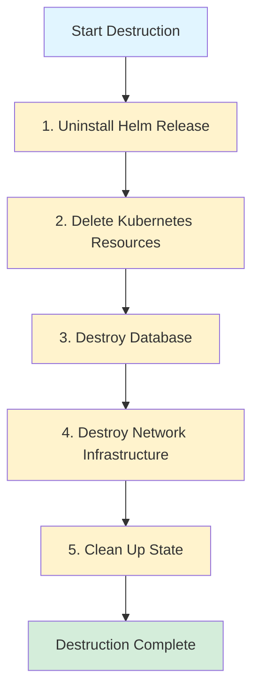

## Overview

The `destroy` command safely tears down a complete infrastructure environment, removing all provisioned resources including network, database, Kubernetes resources, and application deployment.

<Warning>
  This operation is destructive and cannot be undone. Always backup important data before destroying an environment.
</Warning>

## Syntax

```bash
devplatform destroy [flags]
```

## Required Flags

<ParamField path="app" type="string" required>
  Application name
  
  **Example:** `payment`, `user-service`
</ParamField>

<ParamField path="env" type="string" required>
  Environment type
  
  **Options:** `dev`, `staging`, `prod`
</ParamField>

## Optional Flags

<ParamField path="confirm" type="boolean" default="false">
  Skip confirmation prompt (use with caution)
</ParamField>

<ParamField path="force" type="boolean" default="false">
  Force destroy even if errors occur
</ParamField>

<ParamField path="keep-state" type="boolean" default="false">
  Keep Terraform state file after destruction
</ParamField>

<ParamField path="verbose" type="boolean" default="false">
  Enable verbose output
</ParamField>

<ParamField path="no-color" type="boolean" default="false">
  Disable colored output
</ParamField>

<ParamField path="timeout" type="integer" default="30">
  Operation timeout in minutes
</ParamField>

## Examples

### Interactive Destroy (with confirmation)

```bash
devplatform destroy --app payment --env dev
```

Output:

```
⚠️  WARNING: This will destroy the following resources:

Environment: payment-dev
Provider: aws
Region: us-east-1

Resources to be destroyed:
  • VPC: vpc-abc123 (10.0.0.0/16)
  • Database: payment-dev-db (db.t3.micro)
  • Namespace: dev-payment
  • Helm Release: payment
  • All Kubernetes resources in namespace

Estimated Monthly Savings: $75

Are you sure you want to destroy this environment? (yes/no): 
```

Type `yes` to proceed:

```
✓ Uninstalling Helm release...
✓ Destroying Kubernetes resources...
✓ Destroying database...
✓ Destroying network infrastructure...
✓ Cleaning up Terraform state...

✅ Environment destroyed successfully!

Resources Removed:
  • VPC: vpc-abc123
  • Database: payment-dev-db
  • Namespace: dev-payment
  • 12 Kubernetes resources

Monthly Cost Savings: $75
```

### Non-Interactive Destroy

```bash
devplatform destroy --app payment --env dev --confirm
```

Skips the confirmation prompt and proceeds directly with destruction.

<Warning>
  Use `--confirm` carefully, especially in production environments. Consider requiring manual confirmation for prod.
</Warning>

### Force Destroy

```bash
devplatform destroy --app payment --env dev --confirm --force
```

Forces destruction even if some resources fail to delete. Useful for cleaning up partially failed deployments.

### Keep State File

```bash
devplatform destroy --app payment --env dev --confirm --keep-state
```

Destroys all resources but keeps the Terraform state file for audit purposes.

## Destruction Order

Resources are destroyed in this order to handle dependencies:



<Steps>
  <Step title="Helm Release">
    Uninstalls the Helm release, removing all Kubernetes resources managed by Helm
  </Step>
  <Step title="Kubernetes Resources">
    Deletes any remaining Kubernetes resources in the namespace
  </Step>
  <Step title="Database">
    Destroys the RDS/Azure Database instance (final snapshot may be created)
  </Step>
  <Step title="Network Infrastructure">
    Removes VPC/VNet, subnets, security groups, NAT gateways
  </Step>
  <Step title="State Cleanup">
    Removes Terraform state (unless --keep-state is specified)
  </Step>
</Steps>

## What Gets Destroyed

<Tabs>
  <Tab title="AWS">
    ### Network Infrastructure
    - VPC and all subnets
    - Internet Gateway
    - NAT Gateways
    - Route tables
    - Security groups
    - Network ACLs

    ### Database
    - RDS instance (final snapshot created automatically)
    - DB subnet group
    - Secrets Manager entries

    ### Kubernetes
    - Namespace and all resources within it
    - Deployments, Services, Ingresses
    - ConfigMaps and Secrets
    - Service Account and IRSA role
    - Resource quotas and network policies

    ### Application
    - Helm release
    - All application pods
    - Load balancers created by ingress
  </Tab>

  <Tab title="Azure">
    ### Network Infrastructure
    - VNet and all subnets
    - NAT Gateways
    - Network Security Groups (NSGs)
    - Route tables

    ### Database
    - Azure Database for PostgreSQL instance
    - Subnet delegation
    - Key Vault entries

    ### Kubernetes
    - Namespace and all resources within it
    - Deployments, Services, Ingresses
    - ConfigMaps and Secrets
    - Service Account and Workload Identity
    - Resource quotas and network policies

    ### Application
    - Helm release
    - All application pods
    - Application Gateway rules
  </Tab>
</Tabs>

## Safety Features

### Confirmation Prompt

By default, the command requires explicit confirmation:

```
Are you sure you want to destroy this environment? (yes/no): 
```

Only typing `yes` (case-sensitive) will proceed. Any other input cancels the operation.

### Production Protection

For production environments, consider adding additional safeguards:

```bash
#!/bin/bash
# safe-destroy.sh

APP=$1
ENV=$2

if [ "$ENV" = "prod" ]; then
  echo "⚠️  PRODUCTION ENVIRONMENT"
  echo "Please type the full environment name to confirm: $APP-$ENV"
  read -r CONFIRMATION
  
  if [ "$CONFIRMATION" != "$APP-$ENV" ]; then
    echo "Confirmation failed. Aborting."
    exit 1
  fi
fi

devplatform destroy --app $APP --env $ENV --confirm
```

### Backup Recommendations

Before destroying production environments:

<AccordionGroup>
  <Accordion title="Database Backup">
    Create a manual database snapshot:

    **AWS:**
    ```bash
    aws rds create-db-snapshot \
      --db-instance-identifier payment-prod-db \
      --db-snapshot-identifier payment-prod-manual-$(date +%Y%m%d)
    ```

    **Azure:**
    ```bash
    az postgres server backup create \
      --resource-group rg-payment-prod \
      --server-name payment-prod-db \
      --backup-name payment-prod-manual-$(date +%Y%m%d)
    ```
  </Accordion>

  <Accordion title="Terraform State Backup">
    Backup the Terraform state:

    ```bash
    # Copy state file
    cp ~/.devplatform/terraform/payment-prod/terraform.tfstate \
       ~/backups/payment-prod-$(date +%Y%m%d).tfstate

    # Or download from S3/Azure Storage
    aws s3 cp s3://terraform-state-bucket/payment-prod.tfstate \
       ~/backups/payment-prod-$(date +%Y%m%d).tfstate
    ```
  </Accordion>

  <Accordion title="Configuration Backup">
    Save all configuration files:

    ```bash
    # Backup Helm values
    helm get values payment -n prod-payment > payment-prod-values.yaml

    # Backup Kubernetes resources
    kubectl get all -n prod-payment -o yaml > payment-prod-k8s.yaml

    # Backup ConfigMaps and Secrets
    kubectl get configmap,secret -n prod-payment -o yaml > payment-prod-config.yaml
    ```
  </Accordion>
</AccordionGroup>

## Error Handling

### Partial Destruction

If destruction fails partway through:

```
✓ Uninstalling Helm release...
✓ Destroying Kubernetes resources...
✗ Destroying database...
  Error: Database has deletion protection enabled

⚠️  Partial destruction occurred. Some resources may still exist.

Manual cleanup required:
  1. Disable deletion protection on database
  2. Re-run destroy command with --force flag
```

**Solution:**

```bash
# AWS: Disable deletion protection
aws rds modify-db-instance \
  --db-instance-identifier payment-dev-db \
  --no-deletion-protection

# Azure: Disable delete lock
az lock delete \
  --name DoNotDelete \
  --resource-group rg-payment-dev \
  --resource-name payment-dev-db \
  --resource-type Microsoft.DBforPostgreSQL/servers

# Retry destruction
devplatform destroy --app payment --env dev --confirm --force
```

### Stuck Resources

If resources are stuck in "deleting" state:

```bash
# Check Terraform state
cd ~/.devplatform/terraform/payment-dev
terraform state list

# Manually remove stuck resources from state
terraform state rm aws_vpc.main

# Force destroy
devplatform destroy --app payment --env dev --confirm --force
```

### Orphaned Resources

To find orphaned resources after failed destruction:

```bash
# AWS: Find resources by tag
aws resourcegroupstaggingapi get-resources \
  --tag-filters Key=ManagedBy,Values=devplatform \
                 Key=App,Values=payment \
                 Key=Environment,Values=dev

# Azure: Find resources by tag
az resource list \
  --tag ManagedBy=devplatform \
  --tag App=payment \
  --tag Environment=dev
```

## Use Cases

### Temporary Environments

Destroy dev environments at end of day to save costs:

```bash
#!/bin/bash
# nightly-cleanup.sh

# Destroy all dev environments
for APP in payment user-service api-gateway; do
  devplatform destroy --app $APP --env dev --confirm
done

echo "Dev environments destroyed. Estimated monthly savings: \$225"
```

### CI/CD Cleanup

Clean up ephemeral test environments:

```bash
#!/bin/bash
# cleanup-pr-environment.sh

PR_NUMBER=$1
APP_NAME="myapp-pr-${PR_NUMBER}"

# Destroy PR environment
devplatform destroy --app $APP_NAME --env dev --confirm

# Remove from tracking
rm -rf ~/.devplatform/terraform/$APP_NAME-dev
```

### Environment Refresh

Destroy and recreate to apply infrastructure changes:

```bash
#!/bin/bash
# refresh-environment.sh

APP=$1
ENV=$2

# Backup data
echo "Creating database backup..."
# ... backup commands ...

# Destroy environment
devplatform destroy --app $APP --env $ENV --confirm

# Recreate with new configuration
devplatform create --app $APP --env $ENV

# Restore data
echo "Restoring database..."
# ... restore commands ...
```

## Exit Codes

| Code | Meaning |
|------|---------|
| 0 | Destruction completed successfully |
| 1 | Destruction failed or was cancelled |
| 1001-1099 | Authentication errors |
| 1200-1299 | Terraform errors |
| 1300-1399 | Helm errors |
| 1500-1599 | Configuration errors |

## Performance

Typical destruction times:

| Environment | Duration |
|-------------|----------|
| Dev | 2-3 minutes |
| Staging | 3-4 minutes |
| Prod | 4-6 minutes |

<Note>
  Database deletion is usually the slowest step, especially if final snapshots are being created.
</Note>

## Best Practices

<AccordionGroup>
  <Accordion title="Always Backup Production">
    Create manual backups before destroying production environments:

    ```bash
    # Create database snapshot
    # Backup Terraform state
    # Export Kubernetes resources
    # Then destroy
    devplatform destroy --app myapp --env prod --confirm
    ```
  </Accordion>

  <Accordion title="Use Scripts for Safety">
    Wrap destroy commands in scripts with additional checks:

    ```bash
    #!/bin/bash
    if [ "$ENV" = "prod" ]; then
      echo "Requires manual approval for production"
      exit 1
    fi
    devplatform destroy --app $APP --env $ENV --confirm
    ```
  </Accordion>

  <Accordion title="Tag Resources Properly">
    Ensure all resources are properly tagged for tracking:

    ```yaml
    # config.yaml
    terraform:
      default_tags:
        ManagedBy: devplatform
        Team: platform
        CostCenter: engineering
    ```
  </Accordion>

  <Accordion title="Monitor Costs">
    Track cost savings from destroyed environments:

    ```bash
    SAVINGS=$(devplatform destroy --app myapp --env dev --confirm | grep "Monthly Cost Savings" | awk '{print $4}')
    echo "Saved: $SAVINGS/month"
    ```
  </Accordion>

  <Accordion title="Clean Up Regularly">
    Schedule regular cleanup of unused environments:

    ```bash
    # Cron job: Daily at 6 PM
    0 18 * * * /usr/local/bin/cleanup-dev-environments.sh
    ```
  </Accordion>
</AccordionGroup>

## Related Commands

<CardGroup cols={2}>
  <Card title="create" icon="plus" href="/api-reference/create">
    Create a new environment
  </Card>
  <Card title="status" icon="chart-line" href="/api-reference/status">
    Check environment status
  </Card>
</CardGroup>

## See Also

- [Cost Optimization Guide](/guides/cost-optimization)
- [Disaster Recovery](/advanced/disaster-recovery)
- [Troubleshooting](/guides/troubleshooting)
