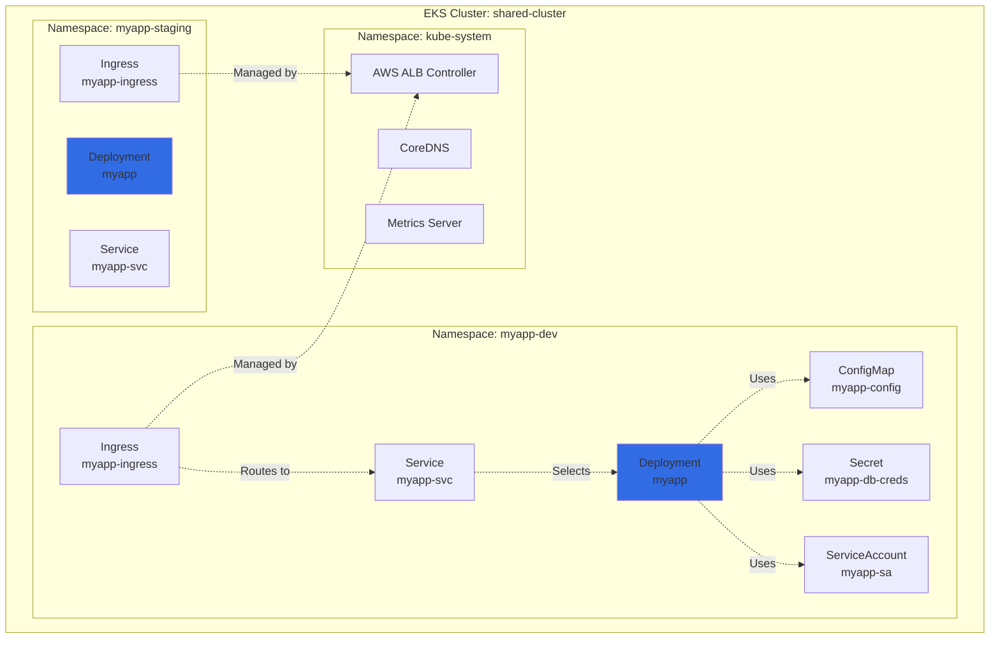
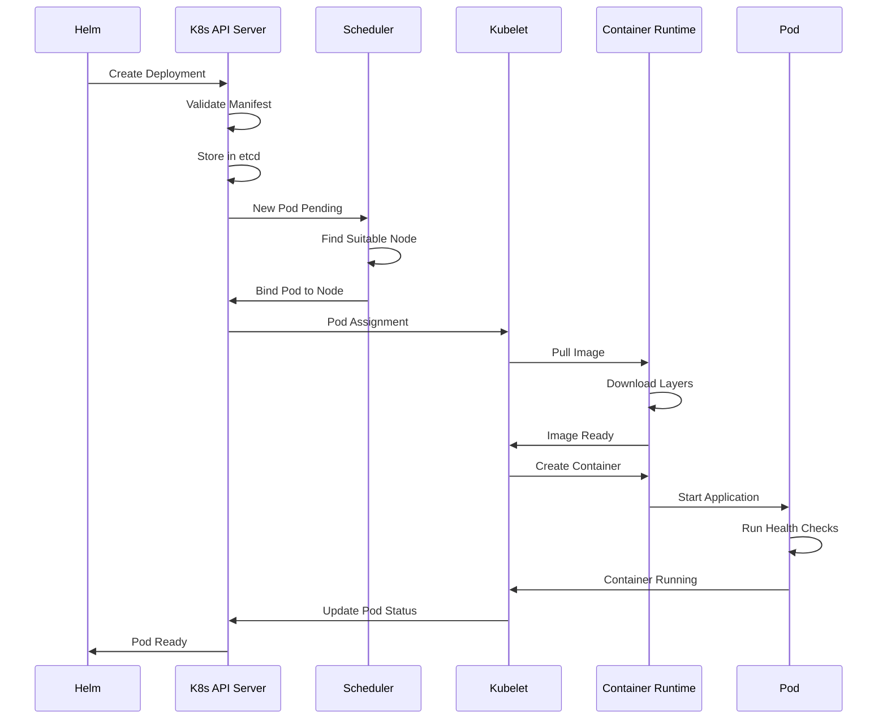
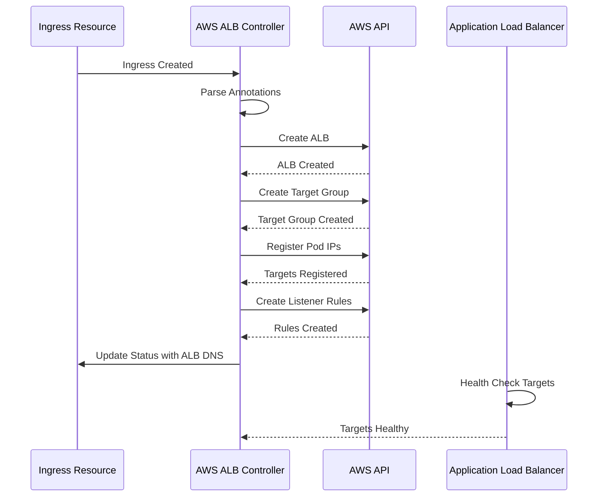
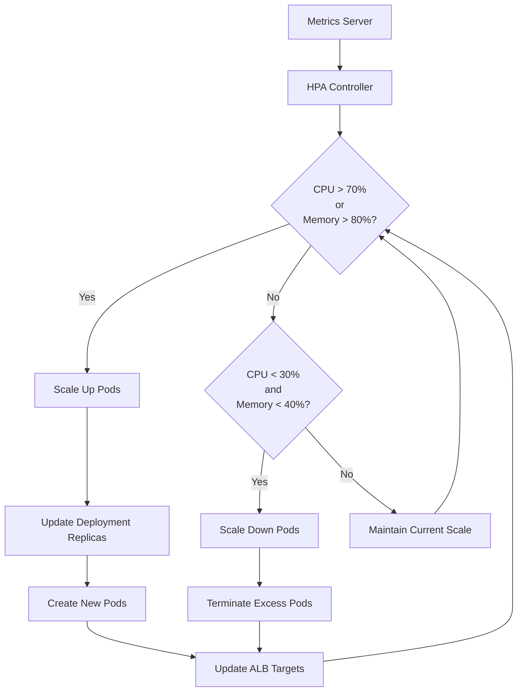

DevPlatform CLI deploys applications to Amazon EKS using Helm charts, with automatic namespace creation, RBAC configuration, and resource management.

## Overview

Each environment gets a dedicated Kubernetes namespace in a shared EKS cluster, with resource quotas, network policies, and service accounts configured automatically.

<CardGroup cols={3}>
  <Card title="Namespace Setup" icon="layer-group" href="#namespace-configuration">
    Isolated namespaces with resource quotas
  </Card>
  <Card title="Pod Deployment" icon="cube" href="#pod-deployment">
    Helm-based application deployment
  </Card>
  <Card title="RBAC & IRSA" icon="user-lock" href="#rbac-and-irsa">
    Kubernetes RBAC and AWS IAM integration
  </Card>
</CardGroup>

## Namespace Configuration

### Namespace Structure



### Creating Namespaces

DevPlatform CLI creates namespaces with labels and annotations:

```yaml
apiVersion: v1
kind: Namespace
metadata:
  name: myapp-dev
  labels:
    app: myapp
    environment: dev
    managed-by: devplatform-cli
  annotations:
    devplatform.io/created-at: "2024-01-15T10:30:00Z"
    devplatform.io/app-name: myapp
    devplatform.io/env-type: dev
```

### Resource Quotas

Each namespace has resource quotas to prevent resource exhaustion:

<Tabs>
  <Tab title="Development">
```yaml
apiVersion: v1
kind: ResourceQuota
metadata:
  name: myapp-dev-quota
  namespace: myapp-dev
spec:
  hard:
    requests.cpu: "2"
    requests.memory: 4Gi
    limits.cpu: "4"
    limits.memory: 8Gi
    pods: "10"
    services: "5"
    persistentvolumeclaims: "3"
```

**Limits:**
- CPU requests: 2 cores
- Memory requests: 4 GB
- CPU limits: 4 cores
- Memory limits: 8 GB
- Max pods: 10
  </Tab>
  <Tab title="Staging">
```yaml
apiVersion: v1
kind: ResourceQuota
metadata:
  name: myapp-staging-quota
  namespace: myapp-staging
spec:
  hard:
    requests.cpu: "4"
    requests.memory: 8Gi
    limits.cpu: "8"
    limits.memory: 16Gi
    pods: "20"
    services: "10"
    persistentvolumeclaims: "5"
```

**Limits:**
- CPU requests: 4 cores
- Memory requests: 8 GB
- CPU limits: 8 cores
- Memory limits: 16 GB
- Max pods: 20
  </Tab>
  <Tab title="Production">
```yaml
apiVersion: v1
kind: ResourceQuota
metadata:
  name: myapp-prod-quota
  namespace: myapp-prod
spec:
  hard:
    requests.cpu: "10"
    requests.memory: 20Gi
    limits.cpu: "20"
    limits.memory: 40Gi
    pods: "50"
    services: "20"
    persistentvolumeclaims: "10"
```

**Limits:**
- CPU requests: 10 cores
- Memory requests: 20 GB
- CPU limits: 20 cores
- Memory limits: 40 GB
- Max pods: 50
  </Tab>
</Tabs>

### Limit Ranges

Default resource limits for pods without explicit requests/limits:

```yaml
apiVersion: v1
kind: LimitRange
metadata:
  name: myapp-dev-limits
  namespace: myapp-dev
spec:
  limits:
  - default:
      cpu: 500m
      memory: 512Mi
    defaultRequest:
      cpu: 250m
      memory: 256Mi
    max:
      cpu: "2"
      memory: 2Gi
    min:
      cpu: 100m
      memory: 128Mi
    type: Container
```

## Pod Deployment

### Helm Chart Structure

DevPlatform CLI uses Helm to deploy applications:

```
devplatform-base/
├── Chart.yaml
├── values.yaml
├── values-dev.yaml
├── values-staging.yaml
├── values-prod.yaml
└── templates/
    ├── deployment.yaml
    ├── service.yaml
    ├── ingress.yaml
    ├── configmap.yaml
    ├── serviceaccount.yaml
    ├── hpa.yaml
    └── _helpers.tpl
```

### Deployment Configuration

<Tabs>
  <Tab title="Development">
```yaml
# values-dev.yaml
replicaCount: 1

image:
  repository: myapp
  tag: latest
  pullPolicy: Always

resources:
  requests:
    cpu: 250m
    memory: 512Mi
  limits:
    cpu: 500m
    memory: 1Gi

autoscaling:
  enabled: false

ingress:
  enabled: true
  className: alb
  annotations:
    alb.ingress.kubernetes.io/scheme: internet-facing
    alb.ingress.kubernetes.io/target-type: ip
    alb.ingress.kubernetes.io/certificate-arn: arn:aws:acm:...
  hosts:
    - host: myapp-dev.example.com
      paths:
        - path: /
          pathType: Prefix

database:
  host: myapp-dev.abc123.us-east-1.rds.amazonaws.com
  port: 5432
  name: myapp
```
  </Tab>
  <Tab title="Staging">
```yaml
# values-staging.yaml
replicaCount: 2

image:
  repository: myapp
  tag: v1.2.3
  pullPolicy: IfNotPresent

resources:
  requests:
    cpu: 500m
    memory: 1Gi
  limits:
    cpu: 1000m
    memory: 2Gi

autoscaling:
  enabled: true
  minReplicas: 2
  maxReplicas: 5
  targetCPUUtilizationPercentage: 70
  targetMemoryUtilizationPercentage: 80

ingress:
  enabled: true
  className: alb
  annotations:
    alb.ingress.kubernetes.io/scheme: internet-facing
    alb.ingress.kubernetes.io/target-type: ip
    alb.ingress.kubernetes.io/certificate-arn: arn:aws:acm:...
  hosts:
    - host: myapp-staging.example.com
      paths:
        - path: /
          pathType: Prefix

database:
  host: myapp-staging.abc123.us-east-1.rds.amazonaws.com
  port: 5432
  name: myapp
```
  </Tab>
  <Tab title="Production">
```yaml
# values-prod.yaml
replicaCount: 3

image:
  repository: myapp
  tag: v1.2.3
  pullPolicy: IfNotPresent

resources:
  requests:
    cpu: 1000m
    memory: 2Gi
  limits:
    cpu: 2000m
    memory: 4Gi

autoscaling:
  enabled: true
  minReplicas: 3
  maxReplicas: 10
  targetCPUUtilizationPercentage: 70
  targetMemoryUtilizationPercentage: 80

podDisruptionBudget:
  enabled: true
  minAvailable: 2

ingress:
  enabled: true
  className: alb
  annotations:
    alb.ingress.kubernetes.io/scheme: internet-facing
    alb.ingress.kubernetes.io/target-type: ip
    alb.ingress.kubernetes.io/certificate-arn: arn:aws:acm:...
    alb.ingress.kubernetes.io/ssl-policy: ELBSecurityPolicy-TLS-1-2-2017-01
  hosts:
    - host: myapp.example.com
      paths:
        - path: /
          pathType: Prefix

database:
  host: myapp-prod.abc123.us-east-1.rds.amazonaws.com
  port: 5432
  name: myapp
```
  </Tab>
</Tabs>

### Deployment Template

```yaml
# templates/deployment.yaml
apiVersion: apps/v1
kind: Deployment
metadata:
  name: {{ include "devplatform-base.fullname" . }}
  namespace: {{ .Release.Namespace }}
  labels:
    {{- include "devplatform-base.labels" . | nindent 4 }}
spec:
  {{- if not .Values.autoscaling.enabled }}
  replicas: {{ .Values.replicaCount }}
  {{- end }}
  selector:
    matchLabels:
      {{- include "devplatform-base.selectorLabels" . | nindent 6 }}
  template:
    metadata:
      annotations:
        checksum/config: {{ include (print $.Template.BasePath "/configmap.yaml") . | sha256sum }}
      labels:
        {{- include "devplatform-base.selectorLabels" . | nindent 8 }}
    spec:
      serviceAccountName: {{ include "devplatform-base.serviceAccountName" . }}
      containers:
      - name: {{ .Chart.Name }}
        image: "{{ .Values.image.repository }}:{{ .Values.image.tag }}"
        imagePullPolicy: {{ .Values.image.pullPolicy }}
        ports:
        - name: http
          containerPort: 8080
          protocol: TCP
        env:
        - name: DATABASE_HOST
          value: {{ .Values.database.host }}
        - name: DATABASE_PORT
          value: "{{ .Values.database.port }}"
        - name: DATABASE_NAME
          value: {{ .Values.database.name }}
        - name: DATABASE_USER
          valueFrom:
            secretKeyRef:
              name: {{ include "devplatform-base.fullname" . }}-db-creds
              key: username
        - name: DATABASE_PASSWORD
          valueFrom:
            secretKeyRef:
              name: {{ include "devplatform-base.fullname" . }}-db-creds
              key: password
        livenessProbe:
          httpGet:
            path: /health
            port: http
          initialDelaySeconds: 30
          periodSeconds: 10
        readinessProbe:
          httpGet:
            path: /ready
            port: http
          initialDelaySeconds: 5
          periodSeconds: 5
        resources:
          {{- toYaml .Values.resources | nindent 12 }}
```

### Pod Deployment Flow



## Service and Ingress

### Service Configuration

```yaml
# templates/service.yaml
apiVersion: v1
kind: Service
metadata:
  name: {{ include "devplatform-base.fullname" . }}
  namespace: {{ .Release.Namespace }}
  labels:
    {{- include "devplatform-base.labels" . | nindent 4 }}
spec:
  type: ClusterIP
  ports:
  - port: 80
    targetPort: http
    protocol: TCP
    name: http
  selector:
    {{- include "devplatform-base.selectorLabels" . | nindent 4 }}
```

### Ingress with AWS ALB

```yaml
# templates/ingress.yaml
apiVersion: networking.k8s.io/v1
kind: Ingress
metadata:
  name: {{ include "devplatform-base.fullname" . }}
  namespace: {{ .Release.Namespace }}
  annotations:
    alb.ingress.kubernetes.io/scheme: internet-facing
    alb.ingress.kubernetes.io/target-type: ip
    alb.ingress.kubernetes.io/certificate-arn: {{ .Values.ingress.certificateArn }}
    alb.ingress.kubernetes.io/listen-ports: '[{"HTTP": 80}, {"HTTPS": 443}]'
    alb.ingress.kubernetes.io/ssl-redirect: '443'
    alb.ingress.kubernetes.io/healthcheck-path: /health
    alb.ingress.kubernetes.io/healthcheck-interval-seconds: '15'
    alb.ingress.kubernetes.io/healthcheck-timeout-seconds: '5'
    alb.ingress.kubernetes.io/healthy-threshold-count: '2'
    alb.ingress.kubernetes.io/unhealthy-threshold-count: '2'
spec:
  ingressClassName: alb
  rules:
  {{- range .Values.ingress.hosts }}
  - host: {{ .host }}
    http:
      paths:
      {{- range .paths }}
      - path: {{ .path }}
        pathType: {{ .pathType }}
        backend:
          service:
            name: {{ include "devplatform-base.fullname" $ }}
            port:
              number: 80
      {{- end }}
  {{- end }}
```

**ALB Creation Flow:**



## RBAC and IRSA

### Service Account with IRSA

```yaml
# templates/serviceaccount.yaml
apiVersion: v1
kind: ServiceAccount
metadata:
  name: {{ include "devplatform-base.serviceAccountName" . }}
  namespace: {{ .Release.Namespace }}
  annotations:
    eks.amazonaws.com/role-arn: {{ .Values.serviceAccount.roleArn }}
  labels:
    {{- include "devplatform-base.labels" . | nindent 4 }}
```

### IAM Role for Service Account

```hcl
# Create IAM role for pods
resource "aws_iam_role" "pod_role" {
  name = "myapp-dev-pod-role"
  
  assume_role_policy = jsonencode({
    Version = "2012-10-17"
    Statement = [{
      Effect = "Allow"
      Principal = {
        Federated = "arn:aws:iam::123456789012:oidc-provider/${local.oidc_provider}"
      }
      Action = "sts:AssumeRoleWithWebIdentity"
      Condition = {
        StringEquals = {
          "${local.oidc_provider}:sub" = "system:serviceaccount:myapp-dev:myapp-sa"
          "${local.oidc_provider}:aud" = "sts.amazonaws.com"
        }
      }
    }]
  })
}

# Attach policies to role
resource "aws_iam_role_policy" "pod_policy" {
  name = "myapp-dev-pod-policy"
  role = aws_iam_role.pod_role.id
  
  policy = jsonencode({
    Version = "2012-10-17"
    Statement = [
      {
        Effect = "Allow"
        Action = [
          "secretsmanager:GetSecretValue",
          "secretsmanager:DescribeSecret"
        ]
        Resource = "arn:aws:secretsmanager:us-east-1:123456789012:secret:myapp-dev-*"
      },
      {
        Effect = "Allow"
        Action = [
          "s3:GetObject",
          "s3:PutObject"
        ]
        Resource = "arn:aws:s3:::myapp-dev-bucket/*"
      }
    ]
  })
}
```

### Kubernetes RBAC

```yaml
# Role for developers
apiVersion: rbac.authorization.k8s.io/v1
kind: Role
metadata:
  name: developer
  namespace: myapp-dev
rules:
- apiGroups: [""]
  resources: ["pods", "pods/log"]
  verbs: ["get", "list", "watch"]
- apiGroups: [""]
  resources: ["services"]
  verbs: ["get", "list"]
- apiGroups: ["apps"]
  resources: ["deployments", "replicasets"]
  verbs: ["get", "list", "watch"]
---
# RoleBinding
apiVersion: rbac.authorization.k8s.io/v1
kind: RoleBinding
metadata:
  name: developer-binding
  namespace: myapp-dev
subjects:
- kind: User
  name: john.doe@example.com
  apiGroup: rbac.authorization.k8s.io
roleRef:
  kind: Role
  name: developer
  apiGroup: rbac.authorization.k8s.io
```

## Horizontal Pod Autoscaling

```yaml
# templates/hpa.yaml
{{- if .Values.autoscaling.enabled }}
apiVersion: autoscaling/v2
kind: HorizontalPodAutoscaler
metadata:
  name: {{ include "devplatform-base.fullname" . }}
  namespace: {{ .Release.Namespace }}
  labels:
    {{- include "devplatform-base.labels" . | nindent 4 }}
spec:
  scaleTargetRef:
    apiVersion: apps/v1
    kind: Deployment
    name: {{ include "devplatform-base.fullname" . }}
  minReplicas: {{ .Values.autoscaling.minReplicas }}
  maxReplicas: {{ .Values.autoscaling.maxReplicas }}
  metrics:
  - type: Resource
    resource:
      name: cpu
      target:
        type: Utilization
        averageUtilization: {{ .Values.autoscaling.targetCPUUtilizationPercentage }}
  - type: Resource
    resource:
      name: memory
      target:
        type: Utilization
        averageUtilization: {{ .Values.autoscaling.targetMemoryUtilizationPercentage }}
  behavior:
    scaleDown:
      stabilizationWindowSeconds: 300
      policies:
      - type: Percent
        value: 50
        periodSeconds: 60
    scaleUp:
      stabilizationWindowSeconds: 0
      policies:
      - type: Percent
        value: 100
        periodSeconds: 15
      - type: Pods
        value: 2
        periodSeconds: 15
      selectPolicy: Max
{{- end }}
```

**HPA Scaling Behavior:**



## Pod Disruption Budget

Ensure minimum availability during voluntary disruptions:

```yaml
# templates/pdb.yaml
{{- if .Values.podDisruptionBudget.enabled }}
apiVersion: policy/v1
kind: PodDisruptionBudget
metadata:
  name: {{ include "devplatform-base.fullname" . }}
  namespace: {{ .Release.Namespace }}
  labels:
    {{- include "devplatform-base.labels" . | nindent 4 }}
spec:
  minAvailable: {{ .Values.podDisruptionBudget.minAvailable }}
  selector:
    matchLabels:
      {{- include "devplatform-base.selectorLabels" . | nindent 6 }}
{{- end }}
```

## Accessing the Cluster

### Update Kubeconfig

```bash
# Update kubeconfig for EKS cluster
aws eks update-kubeconfig \
  --name shared-cluster \
  --region us-east-1

# Verify access
kubectl get nodes

# View namespaces
kubectl get namespaces

# View pods in your namespace
kubectl get pods -n myapp-dev
```

### Common kubectl Commands

```bash
# View pod logs
kubectl logs -n myapp-dev deployment/myapp --tail=100 -f

# Execute command in pod
kubectl exec -n myapp-dev deployment/myapp -- env

# Port forward to pod
kubectl port-forward -n myapp-dev deployment/myapp 8080:8080

# View pod resource usage
kubectl top pods -n myapp-dev

# Describe pod
kubectl describe pod -n myapp-dev <pod-name>

# View events
kubectl get events -n myapp-dev --sort-by='.lastTimestamp'
```

## Monitoring and Logging

### CloudWatch Container Insights

Enable Container Insights for EKS monitoring:

```bash
# Install CloudWatch agent
kubectl apply -f https://raw.githubusercontent.com/aws-samples/amazon-cloudwatch-container-insights/latest/k8s-deployment-manifest-templates/deployment-mode/daemonset/container-insights-monitoring/quickstart/cwagent-fluentd-quickstart.yaml
```

**Metrics Available:**
- Pod CPU and memory usage
- Node CPU and memory usage
- Network traffic
- Disk I/O

### Application Logs

View application logs in CloudWatch Logs:

```bash
# View logs in CloudWatch
aws logs tail /aws/containerinsights/shared-cluster/application --follow
```

## Troubleshooting

<AccordionGroup>
  <Accordion title="Pods Not Starting">
    
**Symptoms:**
- Pods stuck in Pending or CrashLoopBackOff

**Solutions:**

1. Check pod status:
```bash
kubectl describe pod -n myapp-dev <pod-name>
```

2. Check events:
```bash
kubectl get events -n myapp-dev --sort-by='.lastTimestamp'
```

3. Check logs:
```bash
kubectl logs -n myapp-dev <pod-name> --previous
```

4. Common issues:
   - Insufficient resources (check resource quotas)
   - Image pull errors (check image name and registry access)
   - Failed health checks (check liveness/readiness probes)

  </Accordion>

  <Accordion title="Can't Access Application via Ingress">
    
**Symptoms:**
- 502/503 errors from ALB
- Can't reach application URL

**Solutions:**

1. Check ingress status:
```bash
kubectl get ingress -n myapp-dev
kubectl describe ingress -n myapp-dev myapp
```

2. Verify ALB was created:
```bash
aws elbv2 describe-load-balancers --query 'LoadBalancers[?contains(LoadBalancerName, `myapp-dev`)]'
```

3. Check target health:
```bash
aws elbv2 describe-target-health --target-group-arn <target-group-arn>
```

4. Verify pods are ready:
```bash
kubectl get pods -n myapp-dev
```

  </Accordion>

  <Accordion title="High Memory Usage">
    
**Symptoms:**
- Pods being OOMKilled
- High memory utilization

**Solutions:**

1. Check current usage:
```bash
kubectl top pods -n myapp-dev
```

2. Increase memory limits:
```yaml
resources:
  limits:
    memory: 2Gi  # Increase from 1Gi
```

3. Check for memory leaks in application
4. Enable HPA to scale horizontally

  </Accordion>
</AccordionGroup>

## Best Practices

<CardGroup cols={2}>
  <Card title="Set Resource Limits" icon="gauge">
    Always define CPU and memory requests/limits for predictable scheduling
  </Card>
  <Card title="Use Health Checks" icon="heart-pulse">
    Implement liveness and readiness probes for automatic recovery
  </Card>
  <Card title="Enable HPA" icon="arrows-up-down">
    Use Horizontal Pod Autoscaling for production workloads
  </Card>
  <Card title="Use IRSA" icon="key">
    Never store AWS credentials in pods - use IRSA instead
  </Card>
  <Card title="Implement PDB" icon="shield">
    Use Pod Disruption Budgets to maintain availability during updates
  </Card>
  <Card title="Monitor Resources" icon="chart-line">
    Use Container Insights and CloudWatch for proactive monitoring
  </Card>
</CardGroup>

## Next Steps

<CardGroup cols={2}>
  <Card title="Azure Deployment" icon="microsoft" href="/azure/overview">
    Learn about deploying to Azure AKS
  </Card>
  <Card title="Security Overview" icon="shield" href="/security/overview">
    Kubernetes security best practices
  </Card>
  <Card title="CI/CD Integration" icon="code-branch" href="/advanced/ci-cd-integration">
    Automate deployments with CI/CD
  </Card>
  <Card title="Troubleshooting" icon="wrench" href="/guides/troubleshooting">
    Common Kubernetes issues and solutions
  </Card>
</CardGroup>

