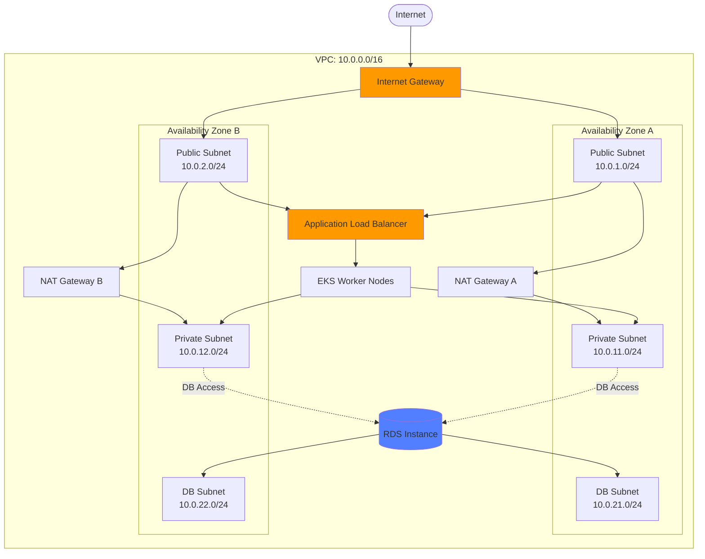
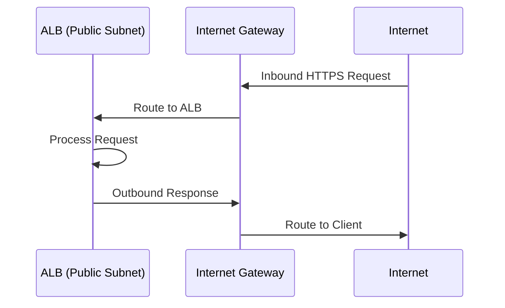
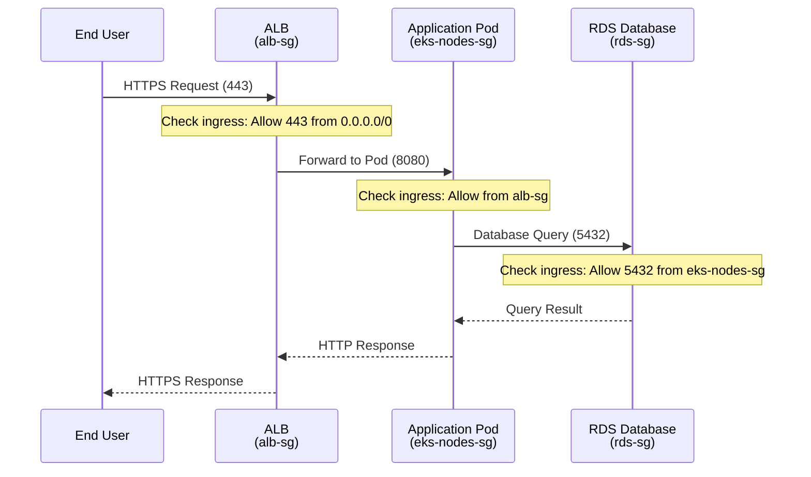

DevPlatform CLI creates a complete VPC networking infrastructure for each environment, including public and private subnets, NAT gateways, security groups, and routing tables.

## Overview

Each environment gets its own isolated VPC with a multi-tier subnet architecture designed for security and high availability.

<CardGroup cols={3}>
  <Card title="VPC Architecture" icon="sitemap" href="#vpc-architecture">
    Multi-AZ VPC with public/private subnets
  </Card>
  <Card title="Security Groups" icon="shield" href="#security-groups">
    Least-privilege network access control
  </Card>
  <Card title="Routing" icon="route" href="#routing-configuration">
    Internet and NAT gateway routing
  </Card>
</CardGroup>

## VPC Architecture

### Network Topology



### CIDR Block Allocation

DevPlatform CLI uses different CIDR blocks for each environment to prevent conflicts:

| Environment | VPC CIDR | Public Subnets | Private Subnets | DB Subnets |
|-------------|----------|----------------|-----------------|------------|
| Dev | 10.0.0.0/16 | 10.0.1.0/24, 10.0.2.0/24 | 10.0.11.0/24, 10.0.12.0/24 | 10.0.21.0/24, 10.0.22.0/24 |
| Staging | 10.1.0.0/16 | 10.1.1.0/24, 10.1.2.0/24 | 10.1.11.0/24, 10.1.12.0/24 | 10.1.21.0/24, 10.1.22.0/24 |
| Prod | 10.2.0.0/16 | 10.2.1.0/24, 10.2.2.0/24, 10.2.3.0/24 | 10.2.11.0/24, 10.2.12.0/24, 10.2.13.0/24 | 10.2.21.0/24, 10.2.22.0/24, 10.2.23.0/24 |

<Note>
Production environments span 3 availability zones for higher availability, while dev and staging use 2 AZs to reduce costs.
</Note>

## Subnet Types

### Public Subnets

Public subnets have direct internet access via an Internet Gateway and host resources that need to be publicly accessible.

**Resources in Public Subnets:**
- Application Load Balancer (ALB)
- NAT Gateways
- Bastion hosts (if configured)

**Configuration:**
```hcl
resource "aws_subnet" "public" {
  count             = 2
  vpc_id            = aws_vpc.main.id
  cidr_block        = "10.0.${count.index + 1}.0/24"
  availability_zone = data.aws_availability_zones.available.names[count.index]
  
  map_public_ip_on_launch = true
  
  tags = {
    Name                     = "myapp-dev-public-${count.index + 1}"
    "kubernetes.io/role/elb" = "1"
  }
}
```

### Private Subnets

Private subnets have no direct internet access and use NAT Gateways for outbound connectivity.

**Resources in Private Subnets:**
- EKS worker nodes
- Application pods
- Internal services

**Configuration:**
```hcl
resource "aws_subnet" "private" {
  count             = 2
  vpc_id            = aws_vpc.main.id
  cidr_block        = "10.0.${count.index + 11}.0/24"
  availability_zone = data.aws_availability_zones.available.names[count.index]
  
  tags = {
    Name                              = "myapp-dev-private-${count.index + 1}"
    "kubernetes.io/role/internal-elb" = "1"
  }
}
```

### Database Subnets

Database subnets are isolated subnets for RDS instances with no internet access.

**Resources in Database Subnets:**
- RDS instances
- ElastiCache clusters (if configured)

**Configuration:**
```hcl
resource "aws_subnet" "database" {
  count             = 2
  vpc_id            = aws_vpc.main.id
  cidr_block        = "10.0.${count.index + 21}.0/24"
  availability_zone = data.aws_availability_zones.available.names[count.index]
  
  tags = {
    Name = "myapp-dev-database-${count.index + 1}"
  }
}

resource "aws_db_subnet_group" "main" {
  name       = "myapp-dev"
  subnet_ids = aws_subnet.database[*].id
  
  tags = {
    Name = "myapp-dev-db-subnet-group"
  }
}
```

## Internet Connectivity

### Internet Gateway

The Internet Gateway provides internet access for resources in public subnets.



**Configuration:**
```hcl
resource "aws_internet_gateway" "main" {
  vpc_id = aws_vpc.main.id
  
  tags = {
    Name = "myapp-dev-igw"
  }
}
```

### NAT Gateways

NAT Gateways provide outbound internet access for resources in private subnets.

<Tabs>
  <Tab title="High Availability (Prod)">
```hcl
# One NAT Gateway per AZ for high availability
resource "aws_eip" "nat" {
  count  = 3  # One per AZ
  domain = "vpc"
  
  tags = {
    Name = "myapp-prod-nat-eip-${count.index + 1}"
  }
}

resource "aws_nat_gateway" "main" {
  count         = 3
  allocation_id = aws_eip.nat[count.index].id
  subnet_id     = aws_subnet.public[count.index].id
  
  tags = {
    Name = "myapp-prod-nat-${count.index + 1}"
  }
}
```

**Cost:** ~$120/month for 3 NAT Gateways (prod)
  </Tab>
  <Tab title="Cost-Optimized (Dev)">
```hcl
# Single NAT Gateway for cost savings
resource "aws_eip" "nat" {
  domain = "vpc"
  
  tags = {
    Name = "myapp-dev-nat-eip"
  }
}

resource "aws_nat_gateway" "main" {
  allocation_id = aws_eip.nat.id
  subnet_id     = aws_subnet.public[0].id
  
  tags = {
    Name = "myapp-dev-nat"
  }
}
```

**Cost:** ~$40/month for 1 NAT Gateway (dev)

<Warning>
Single NAT Gateway means no redundancy. If the AZ fails, private subnets lose internet access.
</Warning>
  </Tab>
</Tabs>

## Routing Configuration

### Public Subnet Route Table

Routes all internet traffic through the Internet Gateway.

```hcl
resource "aws_route_table" "public" {
  vpc_id = aws_vpc.main.id
  
  route {
    cidr_block = "0.0.0.0/0"
    gateway_id = aws_internet_gateway.main.id
  }
  
  tags = {
    Name = "myapp-dev-public-rt"
  }
}

resource "aws_route_table_association" "public" {
  count          = 2
  subnet_id      = aws_subnet.public[count.index].id
  route_table_id = aws_route_table.public.id
}
```

**Route Table:**

| Destination | Target | Purpose |
|-------------|--------|---------|
| 10.0.0.0/16 | local | VPC internal traffic |
| 0.0.0.0/0 | igw-xxx | Internet access |

### Private Subnet Route Tables

Routes internet traffic through NAT Gateways.

<Tabs>
  <Tab title="High Availability">
```hcl
# Separate route table per AZ for HA
resource "aws_route_table" "private" {
  count  = 3
  vpc_id = aws_vpc.main.id
  
  route {
    cidr_block     = "0.0.0.0/0"
    nat_gateway_id = aws_nat_gateway.main[count.index].id
  }
  
  tags = {
    Name = "myapp-prod-private-rt-${count.index + 1}"
  }
}

resource "aws_route_table_association" "private" {
  count          = 3
  subnet_id      = aws_subnet.private[count.index].id
  route_table_id = aws_route_table.private[count.index].id
}
```
  </Tab>
  <Tab title="Cost-Optimized">
```hcl
# Single route table for all private subnets
resource "aws_route_table" "private" {
  vpc_id = aws_vpc.main.id
  
  route {
    cidr_block     = "0.0.0.0/0"
    nat_gateway_id = aws_nat_gateway.main.id
  }
  
  tags = {
    Name = "myapp-dev-private-rt"
  }
}

resource "aws_route_table_association" "private" {
  count          = 2
  subnet_id      = aws_subnet.private[count.index].id
  route_table_id = aws_route_table.private.id
}
```
  </Tab>
</Tabs>

### Database Subnet Route Table

No internet access - database subnets are completely isolated.

```hcl
resource "aws_route_table" "database" {
  vpc_id = aws_vpc.main.id
  
  # No default route - only local VPC traffic
  
  tags = {
    Name = "myapp-dev-database-rt"
  }
}

resource "aws_route_table_association" "database" {
  count          = 2
  subnet_id      = aws_subnet.database[count.index].id
  route_table_id = aws_route_table.database.id
}
```

**Route Table:**

| Destination | Target | Purpose |
|-------------|--------|---------|
| 10.0.0.0/16 | local | VPC internal traffic only |

## Security Groups

Security groups act as virtual firewalls controlling inbound and outbound traffic.

### ALB Security Group

```hcl
resource "aws_security_group" "alb" {
  name        = "myapp-dev-alb-sg"
  description = "Security group for Application Load Balancer"
  vpc_id      = aws_vpc.main.id
  
  ingress {
    description = "HTTPS from internet"
    from_port   = 443
    to_port     = 443
    protocol    = "tcp"
    cidr_blocks = ["0.0.0.0/0"]
  }
  
  ingress {
    description = "HTTP from internet"
    from_port   = 80
    to_port     = 80
    protocol    = "tcp"
    cidr_blocks = ["0.0.0.0/0"]
  }
  
  egress {
    description     = "To EKS worker nodes"
    from_port       = 0
    to_port         = 65535
    protocol        = "tcp"
    security_groups = [aws_security_group.eks_nodes.id]
  }
  
  tags = {
    Name = "myapp-dev-alb-sg"
  }
}
```

### EKS Worker Nodes Security Group

```hcl
resource "aws_security_group" "eks_nodes" {
  name        = "myapp-dev-eks-nodes-sg"
  description = "Security group for EKS worker nodes"
  vpc_id      = aws_vpc.main.id
  
  ingress {
    description     = "From ALB"
    from_port       = 0
    to_port         = 65535
    protocol        = "tcp"
    security_groups = [aws_security_group.alb.id]
  }
  
  ingress {
    description = "Node to node communication"
    from_port   = 0
    to_port     = 65535
    protocol    = "-1"
    self        = true
  }
  
  egress {
    description     = "To RDS"
    from_port       = 5432
    to_port         = 5432
    protocol        = "tcp"
    security_groups = [aws_security_group.rds.id]
  }
  
  egress {
    description = "To internet"
    from_port   = 0
    to_port     = 0
    protocol    = "-1"
    cidr_blocks = ["0.0.0.0/0"]
  }
  
  tags = {
    Name = "myapp-dev-eks-nodes-sg"
  }
}
```

### RDS Security Group

```hcl
resource "aws_security_group" "rds" {
  name        = "myapp-dev-rds-sg"
  description = "Security group for RDS database"
  vpc_id      = aws_vpc.main.id
  
  ingress {
    description     = "PostgreSQL from EKS nodes"
    from_port       = 5432
    to_port         = 5432
    protocol        = "tcp"
    security_groups = [aws_security_group.eks_nodes.id]
  }
  
  # No egress rules - database doesn't initiate connections
  
  tags = {
    Name = "myapp-dev-rds-sg"
  }
}
```

### Security Group Traffic Flow



## Network ACLs

Network ACLs provide an additional layer of security at the subnet level.

### Public Subnet NACL

```hcl
resource "aws_network_acl" "public" {
  vpc_id     = aws_vpc.main.id
  subnet_ids = aws_subnet.public[*].id
  
  ingress {
    protocol   = "tcp"
    rule_no    = 100
    action     = "allow"
    cidr_block = "0.0.0.0/0"
    from_port  = 443
    to_port    = 443
  }
  
  ingress {
    protocol   = "tcp"
    rule_no    = 110
    action     = "allow"
    cidr_block = "0.0.0.0/0"
    from_port  = 80
    to_port    = 80
  }
  
  ingress {
    protocol   = "tcp"
    rule_no    = 120
    action     = "allow"
    cidr_block = "0.0.0.0/0"
    from_port  = 1024
    to_port    = 65535
  }
  
  egress {
    protocol   = "-1"
    rule_no    = 100
    action     = "allow"
    cidr_block = "0.0.0.0/0"
    from_port  = 0
    to_port    = 0
  }
  
  tags = {
    Name = "myapp-dev-public-nacl"
  }
}
```

### Private Subnet NACL

```hcl
resource "aws_network_acl" "private" {
  vpc_id     = aws_vpc.main.id
  subnet_ids = aws_subnet.private[*].id
  
  ingress {
    protocol   = "-1"
    rule_no    = 100
    action     = "allow"
    cidr_block = aws_vpc.main.cidr_block
    from_port  = 0
    to_port    = 0
  }
  
  ingress {
    protocol   = "tcp"
    rule_no    = 110
    action     = "allow"
    cidr_block = "0.0.0.0/0"
    from_port  = 1024
    to_port    = 65535
  }
  
  egress {
    protocol   = "-1"
    rule_no    = 100
    action     = "allow"
    cidr_block = "0.0.0.0/0"
    from_port  = 0
    to_port    = 0
  }
  
  tags = {
    Name = "myapp-dev-private-nacl"
  }
}
```

## VPC Flow Logs

Enable VPC Flow Logs for network traffic monitoring and troubleshooting.

```hcl
resource "aws_flow_log" "main" {
  vpc_id          = aws_vpc.main.id
  traffic_type    = "ALL"
  iam_role_arn    = aws_iam_role.flow_logs.arn
  log_destination = aws_cloudwatch_log_group.flow_logs.arn
  
  tags = {
    Name = "myapp-dev-vpc-flow-logs"
  }
}

resource "aws_cloudwatch_log_group" "flow_logs" {
  name              = "/aws/vpc/myapp-dev"
  retention_in_days = 7
  
  tags = {
    Name = "myapp-dev-vpc-flow-logs"
  }
}
```

**Flow Log Format:**
```
<version> <account-id> <interface-id> <srcaddr> <dstaddr> <srcport> <dstport> <protocol> <packets> <bytes> <start> <end> <action> <log-status>
```

**Example Log Entry:**
```
2 123456789012 eni-abc123 10.0.11.5 10.0.21.10 45678 5432 6 10 5000 1234567890 1234567900 ACCEPT OK
```

## DNS Configuration

### VPC DNS Settings

```hcl
resource "aws_vpc" "main" {
  cidr_block = "10.0.0.0/16"
  
  enable_dns_support   = true
  enable_dns_hostnames = true
  
  tags = {
    Name = "myapp-dev-vpc"
  }
}
```

**DNS Resolution:**
- Internal DNS: `ip-10-0-11-5.ec2.internal`
- RDS Endpoint: `myapp-dev.abc123.us-east-1.rds.amazonaws.com`
- EKS API: `ABC123.gr7.us-east-1.eks.amazonaws.com`

### Route 53 Private Hosted Zone (Optional)

```hcl
resource "aws_route53_zone" "private" {
  name = "myapp-dev.internal"
  
  vpc {
    vpc_id = aws_vpc.main.id
  }
  
  tags = {
    Name = "myapp-dev-private-zone"
  }
}

resource "aws_route53_record" "database" {
  zone_id = aws_route53_zone.private.zone_id
  name    = "database.myapp-dev.internal"
  type    = "CNAME"
  ttl     = 300
  records = [aws_db_instance.main.endpoint]
}
```

## Network Performance

### Bandwidth Limits

| Resource | Bandwidth | Notes |
|----------|-----------|-------|
| NAT Gateway | Up to 45 Gbps | Automatically scales |
| Internet Gateway | No limit | Scales automatically |
| VPC Peering | No limit | Same-region |
| VPC Peering | 5 Gbps | Cross-region |
| EKS Node (t3.medium) | Up to 5 Gbps | Burstable |
| EKS Node (m5.large) | Up to 10 Gbps | Baseline |

### Latency Considerations

<Tabs>
  <Tab title="Same AZ">
```
Pod → RDS (Same AZ): < 1ms
Pod → S3 (Same Region): 5-10ms
Pod → External API: 50-200ms (varies)
```
  </Tab>
  <Tab title="Cross AZ">
```
Pod (AZ-A) → RDS (AZ-B): 1-2ms
Pod (AZ-A) → Pod (AZ-B): 1-2ms
Additional cost: $0.01/GB data transfer
```
  </Tab>
</Tabs>

## Cost Optimization

<CardGroup cols={2}>
  <Card title="Single NAT Gateway (Dev)" icon="dollar-sign">
    Use one NAT Gateway instead of one per AZ to save ~$80/month
  </Card>
  <Card title="VPC Endpoints" icon="plug">
    Use VPC endpoints for S3/DynamoDB to avoid NAT Gateway data charges
  </Card>
  <Card title="Right-Size Subnets" icon="ruler">
    Use /24 subnets (254 IPs) for most environments instead of /16
  </Card>
  <Card title="Delete Unused Resources" icon="trash">
    Remove unused Elastic IPs, NAT Gateways, and VPCs to avoid charges
  </Card>
</CardGroup>

### VPC Endpoints for Cost Savings

```hcl
# S3 VPC Endpoint (Gateway Endpoint - Free)
resource "aws_vpc_endpoint" "s3" {
  vpc_id       = aws_vpc.main.id
  service_name = "com.amazonaws.us-east-1.s3"
  
  route_table_ids = concat(
    [aws_route_table.private.id],
    [aws_route_table.database.id]
  )
  
  tags = {
    Name = "myapp-dev-s3-endpoint"
  }
}

# DynamoDB VPC Endpoint (Gateway Endpoint - Free)
resource "aws_vpc_endpoint" "dynamodb" {
  vpc_id       = aws_vpc.main.id
  service_name = "com.amazonaws.us-east-1.dynamodb"
  
  route_table_ids = [aws_route_table.private.id]
  
  tags = {
    Name = "myapp-dev-dynamodb-endpoint"
  }
}
```

<Tip>
VPC Gateway Endpoints for S3 and DynamoDB are free and eliminate NAT Gateway data transfer charges for these services.
</Tip>

## Troubleshooting

<AccordionGroup>
  <Accordion title="No Internet Access from Private Subnet">
    
**Symptoms:**
- Pods can't pull images
- Can't reach external APIs
- `curl` commands timeout

**Solutions:**

1. Check NAT Gateway status:
```bash
aws ec2 describe-nat-gateways --filter "Name=vpc-id,Values=vpc-xxx"
```

2. Verify route table has NAT Gateway route:
```bash
aws ec2 describe-route-tables --filters "Name=vpc-id,Values=vpc-xxx"
# Should show: 0.0.0.0/0 → nat-xxx
```

3. Check NAT Gateway has Elastic IP:
```bash
aws ec2 describe-addresses --filters "Name=domain,Values=vpc"
```

4. Verify security group allows outbound traffic:
```bash
aws ec2 describe-security-groups --group-ids sg-xxx
```

  </Accordion>

  <Accordion title="Can't Connect to RDS from Pods">
    
**Symptoms:**
- Connection timeout to database
- "No route to host" errors

**Solutions:**

1. Verify RDS is in database subnets:
```bash
aws rds describe-db-instances --db-instance-identifier myapp-dev
# Check SubnetGroup
```

2. Check RDS security group allows traffic from EKS nodes:
```bash
aws ec2 describe-security-groups --group-ids sg-xxx
# Should have ingress rule from eks-nodes-sg on port 5432
```

3. Verify pods are in private subnets:
```bash
kubectl get pods -n myapp-dev -o wide
# Check NODE column
```

4. Test connectivity from pod:
```bash
kubectl exec -n myapp-dev deployment/myapp -- \
  nc -zv myapp-dev.abc123.us-east-1.rds.amazonaws.com 5432
```

  </Accordion>

  <Accordion title="High NAT Gateway Costs">
    
**Symptoms:**
- Unexpected AWS bill
- High data transfer charges

**Solutions:**

1. Check NAT Gateway data transfer:
```bash
aws cloudwatch get-metric-statistics \
  --namespace AWS/NATGateway \
  --metric-name BytesOutToDestination \
  --dimensions Name=NatGatewayId,Value=nat-xxx \
  --start-time 2024-01-01T00:00:00Z \
  --end-time 2024-01-31T23:59:59Z \
  --period 86400 \
  --statistics Sum
```

2. Implement VPC endpoints for S3/DynamoDB
3. Review application traffic patterns
4. Consider using a single NAT Gateway for non-prod environments

  </Accordion>
</AccordionGroup>

## Best Practices

<CardGroup cols={2}>
  <Card title="Multi-AZ for Production" icon="layer-group">
    Always deploy production across multiple AZs for high availability
  </Card>
  <Card title="Separate Subnet Tiers" icon="layer-group">
    Use separate subnets for public, private, and database resources
  </Card>
  <Card title="Least Privilege Security Groups" icon="shield">
    Only allow required ports and sources in security group rules
  </Card>
  <Card title="Enable Flow Logs" icon="chart-line">
    Monitor network traffic for security and troubleshooting
  </Card>
  <Card title="Use VPC Endpoints" icon="plug">
    Reduce NAT Gateway costs with S3 and DynamoDB endpoints
  </Card>
  <Card title="Tag All Resources" icon="tag">
    Tag VPCs, subnets, and security groups for cost tracking
  </Card>
</CardGroup>

## Next Steps

<CardGroup cols={2}>
  <Card title="AWS Database" icon="database" href="/aws/database">
    Configure RDS in database subnets
  </Card>
  <Card title="AWS Kubernetes" icon="dharmachakra" href="/aws/kubernetes">
    Deploy applications to EKS
  </Card>
  <Card title="Security Overview" icon="shield" href="/security/overview">
    Learn about network security best practices
  </Card>
  <Card title="Troubleshooting" icon="wrench" href="/guides/troubleshooting">
    Common networking issues and solutions
  </Card>
</CardGroup>

