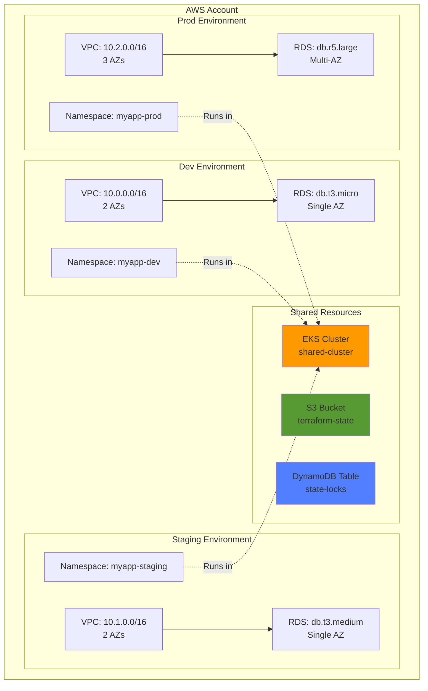
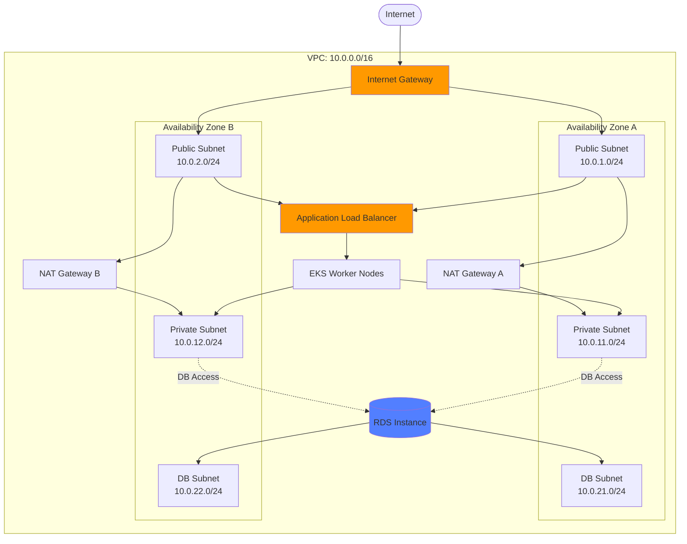
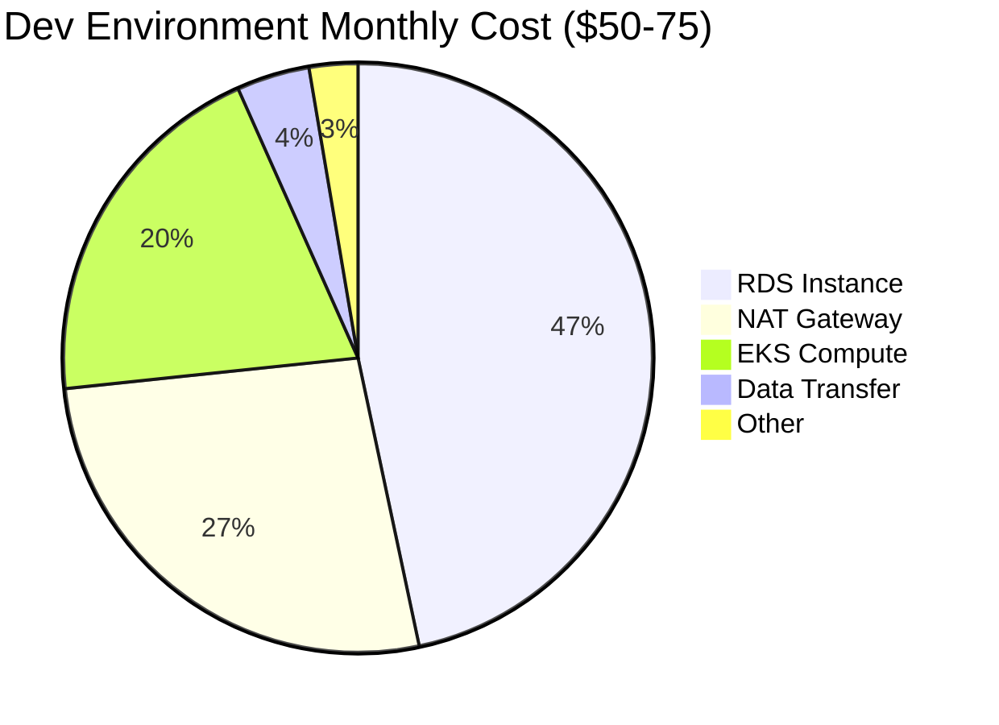
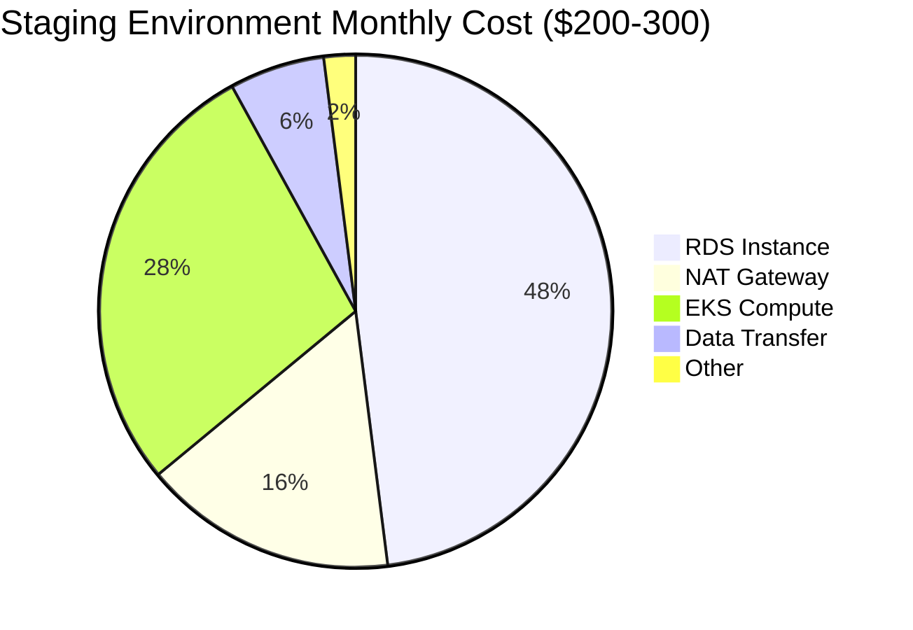
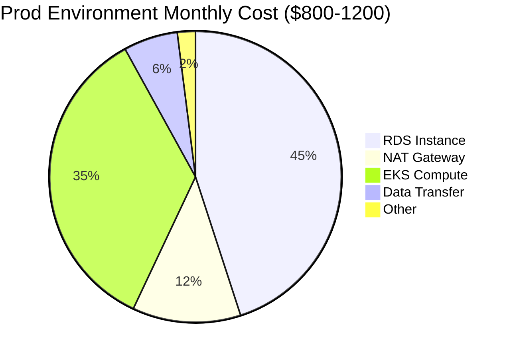
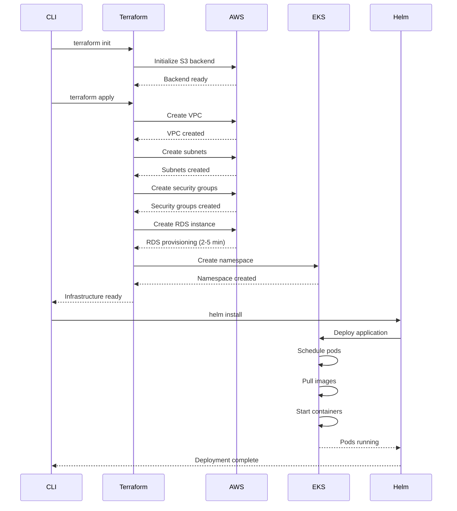
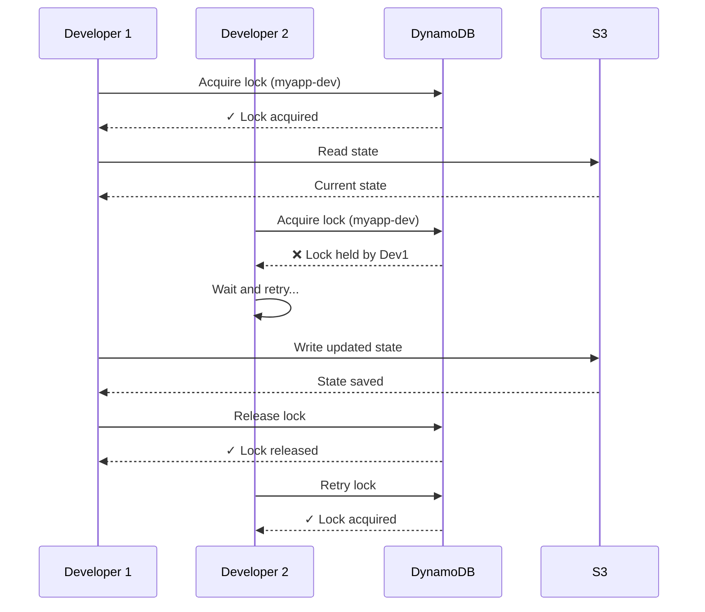
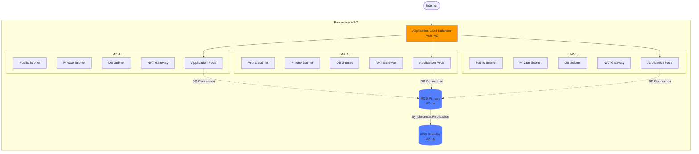

DevPlatform CLI provides seamless deployment of complete development environments on AWS, including VPC networking, RDS databases, and EKS-based Kubernetes workloads.

## Overview

The CLI automates the provisioning of AWS infrastructure using Terraform and deploys applications to Amazon EKS using Helm. All resources are organized by environment (dev, staging, prod) with appropriate sizing and high availability configurations.

<CardGroup cols={3}>
  <Card title="Network (VPC)" icon="network-wired" href="/aws/networking">
    VPC, subnets, security groups, NAT gateways
  </Card>
  <Card title="Database (RDS)" icon="database" href="/aws/database">
    PostgreSQL instances with automated backups
  </Card>
  <Card title="Kubernetes (EKS)" icon="dharmachakra" href="/aws/kubernetes">
    Namespaces, pods, services, and ingress
  </Card>
</CardGroup>

## AWS Architecture

### Environment Topology

DevPlatform CLI creates isolated environments with dedicated VPCs and databases, while sharing a common EKS cluster for cost efficiency.



### Network Architecture

Each environment gets its own VPC with public and private subnets across multiple availability zones:



## Resource Sizing by Environment

DevPlatform CLI automatically configures resources based on the environment type.

### Development Environment

<Tabs>
  <Tab title="Resources">
**Infrastructure:**
- VPC with 2 availability zones
- 2 public subnets (for NAT gateways and ALB)
- 2 private subnets (for EKS nodes)
- 2 database subnets
- 2 NAT gateways (one per AZ)
- Internet gateway
- Security groups for app and database

**Database:**
- Instance class: `db.t3.micro` (2 vCPU, 1 GB RAM)
- Storage: 20 GB GP2
- Single AZ deployment
- Automated backups: 7 days retention
- No read replicas

**Kubernetes:**
- Namespace with resource quotas
- Pod resources: 0.25 CPU, 512 MB RAM
- Replicas: 1
- No horizontal pod autoscaling

</Tab>
  <Tab title="Cost Estimate">


**Monthly Cost Breakdown:**
- RDS db.t3.micro: ~$35
- NAT Gateway (2x): ~$20
- EKS compute: ~$15
- Data transfer: ~$3
- Other (S3, CloudWatch): ~$2

**Total: $50-75/month**
  </Tab>
</Tabs>

### Staging Environment

<Tabs>
  <Tab title="Resources">
**Infrastructure:**
- VPC with 2 availability zones
- 2 public subnets
- 2 private subnets
- 2 database subnets
- 2 NAT gateways
- Internet gateway
- Security groups

**Database:**
- Instance class: `db.t3.medium` (2 vCPU, 4 GB RAM)
- Storage: 100 GB GP2
- Single AZ deployment
- Automated backups: 14 days retention
- Performance Insights enabled
- Enhanced monitoring

**Kubernetes:**
- Namespace with resource quotas
- Pod resources: 0.5 CPU, 1 GB RAM
- Replicas: 2
- Horizontal pod autoscaling: 2-5 pods
  </Tab>
  <Tab title="Cost Estimate">


**Monthly Cost Breakdown:**
- RDS db.t3.medium: ~$120
- NAT Gateway (2x): ~$40
- EKS compute: ~$70
- Data transfer: ~$15
- Other: ~$5

**Total: $200-300/month**
  </Tab>
</Tabs>

### Production Environment

<Tabs>
  <Tab title="Resources">
**Infrastructure:**
- VPC with 3 availability zones
- 3 public subnets
- 3 private subnets
- 3 database subnets
- 3 NAT gateways
- Internet gateway
- Security groups

**Database:**
- Instance class: `db.r5.large` (2 vCPU, 16 GB RAM)
- Storage: 500 GB GP3 (provisioned IOPS)
- Multi-AZ deployment (automatic failover)
- Automated backups: 30 days retention
- Read replicas: 1-2 replicas
- Performance Insights enabled
- Enhanced monitoring
- Encryption at rest (KMS)

**Kubernetes:**
- Namespace with resource quotas
- Pod resources: 1 CPU, 2 GB RAM
- Replicas: 3 minimum
- Horizontal pod autoscaling: 3-10 pods
- Pod disruption budgets
- Resource limits enforced
  </Tab>
  <Tab title="Cost Estimate">


**Monthly Cost Breakdown:**
- RDS db.r5.large (Multi-AZ): ~$450
- NAT Gateway (3x): ~$120
- EKS compute: ~$350
- Data transfer: ~$60
- Other (backups, monitoring): ~$20

**Total: $800-1200/month**
  </Tab>
</Tabs>

## Deployment Process

### Complete Provisioning Flow



### Provisioning Timeline

<Steps>
  <Step title="Validation (5-10 seconds)">
    - Parse command arguments
    - Validate inputs
    - Check AWS credentials
    - Load configuration
  </Step>

  <Step title="Terraform Init (10-15 seconds)">
    - Initialize S3 backend
    - Download provider plugins
    - Configure state locking
  </Step>

  <Step title="Infrastructure Provisioning (3-5 minutes)">
    - Create VPC and subnets (20-30 seconds)
    - Create security groups (10-15 seconds)
    - Create NAT gateways (1-2 minutes)
    - Create RDS instance (2-5 minutes)
    - Create EKS namespace (5-10 seconds)
  </Step>

  <Step title="Application Deployment (30-60 seconds)">
    - Prepare Helm chart (5 seconds)
    - Install Helm release (10 seconds)
    - Wait for pods to start (30-45 seconds)
    - Verify health checks (5 seconds)
  </Step>

  <Step title="Finalization (5 seconds)">
    - Extract outputs
    - Display results
    - Log success
  </Step>
</Steps>

**Total Time: 4-7 minutes** (varies by environment size and AWS region)

## State Management

DevPlatform CLI uses S3 and DynamoDB for Terraform state management.

### State Backend Configuration

```hcl
terraform {
  backend "s3" {
    bucket         = "devplatform-terraform-state"
    key            = "myapp-dev/terraform.tfstate"
    region         = "us-east-1"
    encrypt        = true
    kms_key_id     = "arn:aws:kms:us-east-1:123456789012:key/abc123"
    dynamodb_table = "devplatform-state-lock"
  }
}
```

### State Locking with DynamoDB



**Lock Table Schema:**

| Attribute | Type | Purpose |
|-----------|------|---------|
| LockID | String (Partition Key) | Unique identifier for state file |
| Info | String | Lock metadata (user, timestamp, operation) |
| Digest | String | State file hash for integrity |

## High Availability

Production environments are deployed across multiple availability zones for high availability.

### Multi-AZ Architecture



### Failover Scenarios

<AccordionGroup>
  <Accordion title="AZ Failure">
    
**Scenario:** One availability zone becomes unavailable.

**Automatic Response:**
- ALB stops routing traffic to affected AZ
- Kubernetes reschedules pods to healthy AZs
- RDS automatically fails over to standby (Multi-AZ only)
- NAT gateway in other AZs handle traffic

**Recovery Time:**
- Pod rescheduling: 30-60 seconds
- RDS failover: 60-120 seconds
- Total downtime: 1-2 minutes

  </Accordion>

  <Accordion title="RDS Primary Failure">
    
**Scenario:** RDS primary instance fails (Multi-AZ deployment).

**Automatic Response:**
- RDS detects failure (health checks)
- Automatic failover to standby instance
- DNS record updated to point to new primary
- Application reconnects automatically

**Recovery Time:**
- Failover detection: 30-60 seconds
- DNS propagation: 30-60 seconds
- Total downtime: 1-2 minutes

  </Accordion>

  <Accordion title="Pod Failure">
    
**Scenario:** Application pod crashes or becomes unhealthy.

**Automatic Response:**
- Kubernetes detects failed health checks
- Pod is marked as not ready
- ALB stops routing traffic to failed pod
- Kubernetes restarts pod automatically
- New pod passes health checks
- ALB resumes routing traffic

**Recovery Time:**
- Health check detection: 10-30 seconds
- Pod restart: 20-40 seconds
- Total downtime: 30-70 seconds (per pod)

  </Accordion>
</AccordionGroup>

## Security

DevPlatform CLI implements AWS security best practices.

### Security Layers

<CardGroup cols={2}>
  <Card title="Network Security" icon="shield">
    - Private subnets for workloads
    - Security groups with least privilege
    - NACLs for subnet-level filtering
    - VPC Flow Logs enabled
  </Card>
  <Card title="Data Security" icon="lock">
    - RDS encryption at rest (KMS)
    - Encryption in transit (TLS)
    - Automated backups encrypted
    - Secrets in AWS Secrets Manager
  </Card>
  <Card title="Access Control" icon="user-lock">
    - IAM roles for service accounts (IRSA)
    - Least privilege IAM policies
    - MFA for human access
    - CloudTrail audit logging
  </Card>
  <Card title="Compliance" icon="file-shield">
    - Encryption meets compliance standards
    - Audit logs for all API calls
    - Resource tagging for governance
    - Automated security scanning
  </Card>
</CardGroup>

### Security Group Rules

<Tabs>
  <Tab title="Application Security Group">
```hcl
# Inbound rules
- Port 80/443 from ALB security group
- Port 5432 to RDS security group (outbound)

# Outbound rules
- All traffic to 0.0.0.0/0 (for external APIs)
- Port 5432 to RDS security group
```
  </Tab>
  <Tab title="Database Security Group">
```hcl
# Inbound rules
- Port 5432 from application security group only

# Outbound rules
- None (database doesn't initiate outbound connections)
```
  </Tab>
  <Tab title="ALB Security Group">
```hcl
# Inbound rules
- Port 80 from 0.0.0.0/0
- Port 443 from 0.0.0.0/0

# Outbound rules
- Port 80/443 to application security group
```
  </Tab>
</Tabs>

## Cost Optimization

<CardGroup cols={2}>
  <Card title="Right-Size Resources" icon="gauge">
    Use appropriate instance sizes for each environment (dev uses t3.micro, prod uses r5.large)
  </Card>
  <Card title="Use Spot Instances" icon="dollar-sign">
    Consider spot instances for non-prod EKS node groups (up to 70% savings)
  </Card>
  <Card title="Auto-Scaling" icon="arrows-up-down">
    Enable HPA for pods and consider Aurora Serverless for variable workloads
  </Card>
  <Card title="Destroy Unused Environments" icon="trash">
    Run `devplatform destroy` for dev/staging environments when not in use
  </Card>
</CardGroup>

### Cost Monitoring

```bash
# View estimated monthly cost before creating
devplatform create --app myapp --env dev --dry-run

# Example output
Estimated monthly cost: $65.00
  - RDS db.t3.micro: $35.00
  - NAT Gateway (2x): $20.00
  - EKS compute: $10.00
```

## Getting Started

<Steps>
  <Step title="Configure AWS Credentials">
```bash
# Configure AWS CLI
aws configure

# Or use environment variables
export AWS_ACCESS_KEY_ID=your_access_key
export AWS_SECRET_ACCESS_KEY=your_secret_key
export AWS_DEFAULT_REGION=us-east-1
```
  </Step>

  <Step title="Create Development Environment">
```bash
# Create dev environment
devplatform create --app myapp --env dev --provider aws

# Wait 4-7 minutes for provisioning
```
  </Step>

  <Step title="Verify Deployment">
```bash
# Check environment status
devplatform status --app myapp --env dev --provider aws

# Update kubeconfig
aws eks update-kubeconfig --name shared-cluster --region us-east-1

# View pods
kubectl get pods -n myapp-dev
```
  </Step>

  <Step title="Access Application">
```bash
# Get ingress URL from status output
# Example: https://myapp-dev.example.com

# Or get from kubectl
kubectl get ingress -n myapp-dev
```
  </Step>
</Steps>

## Next Steps

<CardGroup cols={2}>
  <Card title="AWS Authentication" icon="key" href="/aws/authentication">
    Configure IAM roles and IRSA
  </Card>
  <Card title="AWS Networking" icon="network-wired" href="/aws/networking">
    Deep dive into VPC configuration
  </Card>
  <Card title="AWS Database" icon="database" href="/aws/database">
    RDS configuration and management
  </Card>
  <Card title="AWS Kubernetes" icon="dharmachakra" href="/aws/kubernetes">
    EKS namespace and pod management
  </Card>
</CardGroup>

