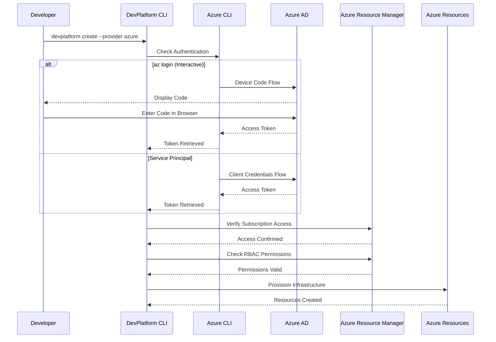
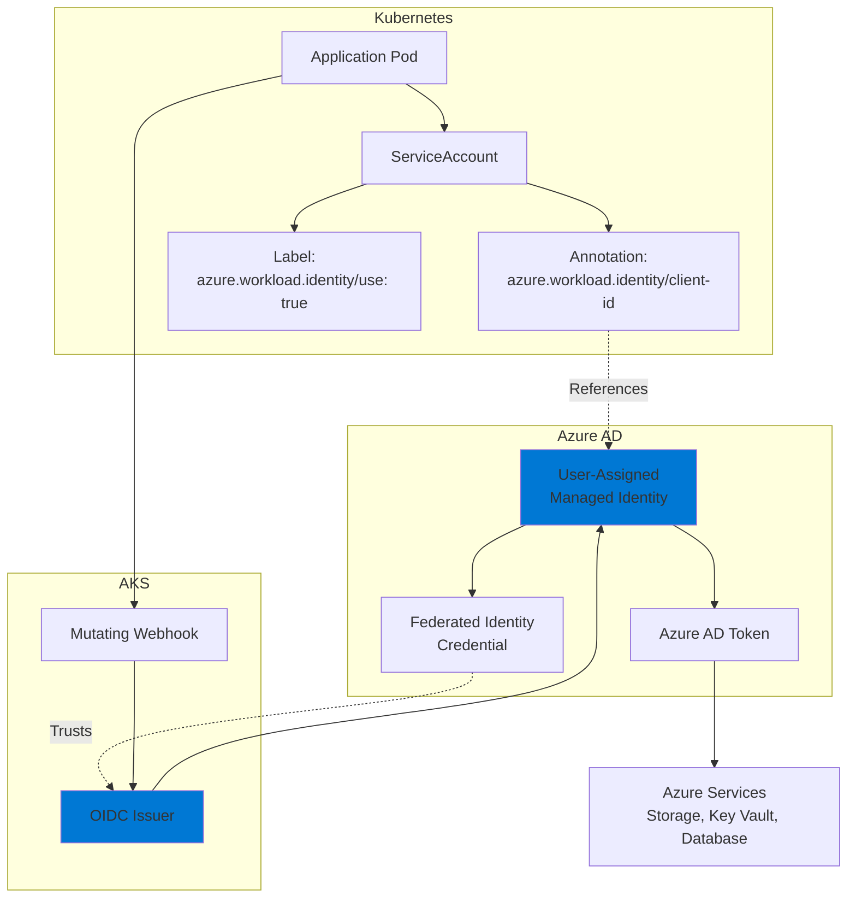

DevPlatform CLI requires Azure credentials to provision infrastructure and manage resources. This guide covers authentication methods, required RBAC permissions, and Workload Identity configuration.

## Overview

The CLI uses Azure credentials to authenticate with Azure services through the Azure SDK. It supports multiple authentication methods and implements least-privilege RBAC for secure operations.

<CardGroup cols={3}>
  <Card title="Credentials Setup" icon="id-card" href="#authentication-methods">
    Configure Azure CLI or service principals
  </Card>
  <Card title="RBAC Permissions" icon="shield-check" href="#required-rbac-permissions">
    Required roles for Terraform operations
  </Card>
  <Card title="Workload Identity" icon="user-lock" href="#workload-identity">
    Secure pod-to-Azure authentication
  </Card>
</CardGroup>

## Authentication Flow



## Authentication Methods

### 1. Azure CLI (Interactive)

<Tabs>
  <Tab title="Interactive Login">
```bash
# Login to Azure (opens browser)
az login

# Select subscription
az account set --subscription "My Subscription"

# Verify authentication
az account show

# Run DevPlatform CLI
devplatform create --app myapp --env dev --provider azure
```

**Best for:** Local development, individual developers
  </Tab>
  <Tab title="Device Code Flow">
```bash
# Login with device code (for remote/SSH sessions)
az login --use-device-code

# Follow the instructions to authenticate
# Visit https://microsoft.com/devicelogin and enter the code

# Verify authentication
az account show
```

**Best for:** Remote sessions, CI/CD pipelines without browser access
  </Tab>
</Tabs>

### 2. Service Principal

<Tabs>
  <Tab title="Create Service Principal">
```bash
# Create service principal
az ad sp create-for-rbac \
  --name "devplatform-cli-sp" \
  --role Contributor \
  --scopes /subscriptions/{subscription-id}

# Output (save these securely):
{
  "appId": "abc123-def456-ghi789",
  "displayName": "devplatform-cli-sp",
  "password": "secret-password",
  "tenant": "tenant-id"
}
```
  </Tab>
  <Tab title="Use Service Principal">
```bash
# Set environment variables
export AZURE_CLIENT_ID="abc123-def456-ghi789"
export AZURE_CLIENT_SECRET="secret-password"
export AZURE_TENANT_ID="tenant-id"
export AZURE_SUBSCRIPTION_ID="subscription-id"

# Or login with service principal
az login --service-principal \
  --username $AZURE_CLIENT_ID \
  --password $AZURE_CLIENT_SECRET \
  --tenant $AZURE_TENANT_ID

# Run DevPlatform CLI
devplatform create --app myapp --env dev --provider azure
```

**Best for:** CI/CD pipelines, automation, production deployments
  </Tab>
</Tabs>

### 3. Managed Identity

When running on Azure compute services, use Managed Identity:

```bash
# No credentials needed - automatically provided by Azure
# Works on:
# - Azure VMs
# - Azure Container Instances
# - Azure Functions
# - Azure DevOps agents

# The CLI automatically detects and uses managed identity
devplatform create --app myapp --env dev --provider azure
```

## Required RBAC Permissions

### Minimum Required Roles

<Tabs>
  <Tab title="Subscription Level">
```bash
# Assign Contributor role at subscription level
az role assignment create \
  --assignee user@example.com \
  --role Contributor \
  --scope /subscriptions/{subscription-id}

# Or use custom role with specific permissions
az role assignment create \
  --assignee user@example.com \
  --role "DevPlatform Operator" \
  --scope /subscriptions/{subscription-id}
```

**Required Built-in Roles:**
- Contributor (for resource creation)
- Storage Blob Data Contributor (for state backend)

</Tab>
  <Tab title="Resource Group Level">
```bash
# Create resource group
az group create \
  --name devplatform-rg \
  --location eastus

# Assign Contributor role at resource group level
az role assignment create \
  --assignee user@example.com \
  --role Contributor \
  --scope /subscriptions/{subscription-id}/resourceGroups/devplatform-rg
```

**Best for:** Limiting access to specific resource groups
  </Tab>
  <Tab title="Custom Role">
```json
{
  "Name": "DevPlatform Operator",
  "Description": "Can manage DevPlatform resources",
  "Actions": [
    "Microsoft.Network/*",
    "Microsoft.DBforPostgreSQL/*",
    "Microsoft.ContainerService/managedClusters/read",
    "Microsoft.ContainerService/managedClusters/listClusterUserCredential/action",
    "Microsoft.Storage/storageAccounts/*",
    "Microsoft.KeyVault/*",
    "Microsoft.Resources/deployments/*",
    "Microsoft.Resources/subscriptions/resourceGroups/*"
  ],
  "NotActions": [],
  "AssignableScopes": [
    "/subscriptions/{subscription-id}"
  ]
}
```

```bash
# Create custom role
az role definition create --role-definition devplatform-role.json

# Assign custom role
az role assignment create \
  --assignee user@example.com \
  --role "DevPlatform Operator" \
  --scope /subscriptions/{subscription-id}
```
  </Tab>
</Tabs>

### Permission Verification

```bash
# Check your role assignments
az role assignment list --assignee user@example.com --output table

# Test specific permissions
az network vnet create --dry-run \
  --name test-vnet \
  --resource-group devplatform-rg \
  --address-prefix 10.0.0.0/16

# If command fails with authorization error, you're missing permissions
```

## Workload Identity

Workload Identity allows AKS pods to authenticate to Azure services without storing credentials.

### Workload Identity Architecture



### Setting Up Workload Identity

<Steps>
  <Step title="Enable Workload Identity on AKS">
```bash
# Enable OIDC issuer and workload identity
az aks update \
  --resource-group devplatform-rg \
  --name shared-cluster \
  --enable-oidc-issuer \
  --enable-workload-identity

# Get OIDC issuer URL
OIDC_ISSUER=$(az aks show \
  --resource-group devplatform-rg \
  --name shared-cluster \
  --query "oidcIssuerProfile.issuerUrl" \
  --output tsv)

echo $OIDC_ISSUER
# https://eastus.oic.prod-aks.azure.com/tenant-id/oidc-issuer-id/
```
  </Step>

  <Step title="Create Managed Identity">
```bash
# Create user-assigned managed identity
az identity create \
  --name myapp-dev-identity \
  --resource-group devplatform-rg \
  --location eastus

# Get client ID
CLIENT_ID=$(az identity show \
  --name myapp-dev-identity \
  --resource-group devplatform-rg \
  --query clientId \
  --output tsv)

echo $CLIENT_ID
```
  </Step>

  <Step title="Create Federated Credential">
```bash
# Create federated identity credential
az identity federated-credential create \
  --name myapp-dev-federated-credential \
  --identity-name myapp-dev-identity \
  --resource-group devplatform-rg \
  --issuer $OIDC_ISSUER \
  --subject system:serviceaccount:myapp-dev:myapp-sa \
  --audience api://AzureADTokenExchange
```
  </Step>

  <Step title="Assign Azure RBAC Roles">
```bash
# Get managed identity principal ID
PRINCIPAL_ID=$(az identity show \
  --name myapp-dev-identity \
  --resource-group devplatform-rg \
  --query principalId \
  --output tsv)

# Assign roles to managed identity
az role assignment create \
  --assignee $PRINCIPAL_ID \
  --role "Storage Blob Data Contributor" \
  --scope /subscriptions/{subscription-id}/resourceGroups/devplatform-rg

az role assignment create \
  --assignee $PRINCIPAL_ID \
  --role "Key Vault Secrets User" \
  --scope /subscriptions/{subscription-id}/resourceGroups/devplatform-rg/providers/Microsoft.KeyVault/vaults/myapp-dev-kv
```
  </Step>

  <Step title="Create Kubernetes ServiceAccount">
```yaml
# serviceaccount.yaml
apiVersion: v1
kind: ServiceAccount
metadata:
  name: myapp-sa
  namespace: myapp-dev
  annotations:
    azure.workload.identity/client-id: ${CLIENT_ID}
  labels:
    azure.workload.identity/use: "true"
```

```bash
# Apply ServiceAccount
kubectl apply -f serviceaccount.yaml
```
  </Step>

  <Step title="Use ServiceAccount in Pod">
```yaml
# deployment.yaml
apiVersion: apps/v1
kind: Deployment
metadata:
  name: myapp
  namespace: myapp-dev
spec:
  replicas: 2
  selector:
    matchLabels:
      app: myapp
  template:
    metadata:
      labels:
        app: myapp
        azure.workload.identity/use: "true"
    spec:
      serviceAccountName: myapp-sa
      containers:
      - name: myapp
        image: myapp:latest
        env:
        - name: AZURE_CLIENT_ID
          value: ${CLIENT_ID}
```

```bash
# Apply Deployment
kubectl apply -f deployment.yaml

# Verify Workload Identity
kubectl exec -n myapp-dev deployment/myapp -- \
  az account show

# Should show the managed identity
```
  </Step>
</Steps>

## Troubleshooting

<AccordionGroup>
  <Accordion title="Credentials Not Found">
    
**Error:**
```
Error: No valid Azure credentials found
Please run 'az login' to authenticate
```

**Solutions:**

1. Login to Azure:
```bash
az login
```

2. Set subscription:
```bash
az account set --subscription "My Subscription"
```

3. Verify authentication:
```bash
az account show
```

  </Accordion>

  <Accordion title="Insufficient Permissions">
    
**Error:**
```
Error: AuthorizationFailed
The client does not have authorization to perform action
```

**Solutions:**

1. Check your role assignments:
```bash
az role assignment list --assignee user@example.com
```

2. Request Contributor role from administrator
3. Use `--dry-run` to test permissions without making changes

  </Accordion>

  <Accordion title="Workload Identity Not Working">
    
**Error:**
```
Error: DefaultAzureCredential failed to retrieve a token
```

**Solutions:**

1. Verify OIDC issuer is enabled:
```bash
az aks show --resource-group devplatform-rg --name shared-cluster \
  --query "oidcIssuerProfile.enabled"
```

2. Check ServiceAccount annotation:
```bash
kubectl get sa myapp-sa -n myapp-dev -o yaml
# Should have: azure.workload.identity/client-id annotation
```

3. Verify federated credential:
```bash
az identity federated-credential list \
  --identity-name myapp-dev-identity \
  --resource-group devplatform-rg
```

4. Check pod has the label:
```bash
kubectl get pods -n myapp-dev -l azure.workload.identity/use=true
```

  </Accordion>
</AccordionGroup>

## Best Practices

<CardGroup cols={2}>
  <Card title="Use Service Principals for CI/CD" icon="robot">
    Use service principals with limited scope for automated deployments
  </Card>
  <Card title="Enable MFA" icon="mobile">
    Require multi-factor authentication for human users
  </Card>
  <Card title="Rotate Credentials" icon="rotate">
    Regularly rotate service principal secrets (every 90 days)
  </Card>
  <Card title="Least Privilege" icon="shield-halved">
    Grant only minimum permissions required for each identity
  </Card>
  <Card title="Use Workload Identity" icon="dharmachakra">
    Never store Azure credentials in Kubernetes Secrets
  </Card>
  <Card title="Monitor Access" icon="eye">
    Enable Activity Log and monitor for suspicious authentication
  </Card>
</CardGroup>

## Next Steps

<CardGroup cols={2}>
  <Card title="Azure Networking" icon="network-wired" href="/azure/networking">
    Configure VNet, subnets, and NSGs
  </Card>
  <Card title="Azure Database" icon="database" href="/azure/database">
    Set up Azure Database with proper authentication
  </Card>
  <Card title="Security Overview" icon="shield" href="/security/overview">
    Learn about comprehensive security practices
  </Card>
  <Card title="Troubleshooting" icon="wrench" href="/guides/troubleshooting">
    Common authentication issues and solutions
  </Card>
</CardGroup>

