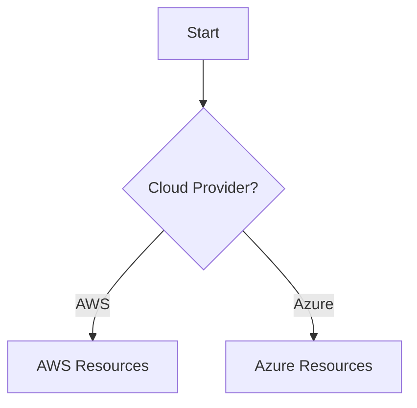
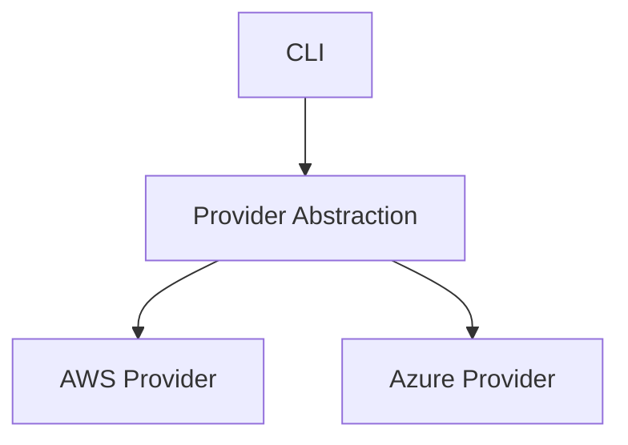

# Azure Documentation Updates - Summary

This document summarizes all Azure support updates made to the DevPlatform CLI documentation.

## Files Updated

### 1. docs/architecture.md ✓
**Updates Made:**
- System Overview: Changed "AWS" to "AWS or Azure" with consistent developer experience
- High-Level Architecture: Added Cloud Provider Abstraction layer, Azure Provider, Azure CLI, and all Azure cloud resources
- Component Architecture: Added internal/provider and internal/azure packages
- Data Flow: Added provider selection step (AWS vs Azure)
- Deployment Architecture: Added parallel Azure subscription with Azure Storage, AKS, VNet, Azure Database
- Security Architecture: Added Azure authentication, Azure RBAC, NSG, Key Vault, Activity Log, NSG Flow Logs
- State Management: Added --provider flag to all commands
- Concurrency Model: Updated to support both S3+DynamoDB and Azure Storage backends
- Technology Stack: Added Azure Provider, AKS, VNet, Azure Database, Azure Storage, Key Vault, azure-sdk-for-go

### 2. docs/workflows.md ✓
**Updates Made:**
- Create Command: Added provider selection step, Azure credential checking
- Create Command: Changed RDS/VPC to generic Database/Network terminology
- Terraform Execution: Added provider parameter, backend abstraction (S3 or Azure Storage), conditional AWS/Azure resource creation
- Helm Deployment: Changed EKS to generic "Kubernetes API (EKS or AKS)"
- Status Command: Added provider selection, Azure credential checking, generic Network/Database terminology
- Status Check Sequence: Changed to Cloud Provider Utilities, generic backend
- Destroy Command: Added provider selection, Azure credential checking
- Destroy Sequence: Generic Cloud API and Backend references
- Version Check: Added Azure CLI checking alongside AWS CLI

### 3. docs/deployment-guide.md
**Updates Needed:**
- Environment Topology: Add Azure subscription with parallel dev/staging/prod environments
- Network Architecture: Add Azure VNet architecture (VNet, Subnets, NSG, NAT Gateway, NSG Flow Logs)
- Resource Sizing: Add Azure equivalents (B_Gen5_1, GP_Gen5_2, MO_Gen5_4)
- Kubernetes Deployment: Show both EKS and AKS namespaces
- Terraform Module Structure: Add azure/ modules (network, database, k8s-tenant)
- Terraform State Management: Add Azure Storage backend option
- High Availability: Add Azure multi-region setup
- Disaster Recovery: Add Azure backup strategies
- Cost Breakdown: Add Azure cost estimates

### 4. docs/security-guide.md
**Updates Needed:**
- Authentication Flow: Add Azure authentication (az login, Service Principal, Managed Identity)
- Kubernetes Authentication: Add Azure AD integration
- IAM Permissions: Add Azure RBAC roles and permissions
- Network Security: Add NSG rules alongside Security Groups
- Data Encryption: Add Azure Database encryption, Key Vault, Azure Storage encryption
- Secret Management: Add Key Vault flow
- RBAC Model: Add Azure RBAC alongside IAM
- IRSA/Workload Identity: Add Azure Workload Identity architecture
- Audit Logging: Add Activity Log, NSG Flow Logs

### 5. docs/api-reference.md
**Updates Needed:**
- All CLI commands: Add --provider flag (aws|azure)
- Configuration schema: Add azure section (subscription_id, location, tenant_id)
- Error codes: Add 2000-2099 range for Azure errors
- Internal APIs: Update to use CloudProvider interface
- Examples: Show both AWS and Azure command examples

### 6. docs/troubleshooting.md
**Updates Needed:**
- Diagnostic Flow: Add Azure path alongside AWS
- Authentication Issues: Add Azure CLI not configured, Azure subscription errors
- Provisioning Issues: Add Azure Storage backend issues
- Network Issues: Add NSG troubleshooting
- Common Issues: Add Azure-specific error scenarios

## Resource Mapping Reference

| AWS Service | Azure Service |
|-------------|---------------|
| VPC | VNet |
| RDS | Azure Database for PostgreSQL |
| EKS | AKS |
| S3 | Azure Storage |
| DynamoDB | Azure Storage Lease |
| Secrets Manager | Key Vault |
| IAM | Azure RBAC |
| IRSA | Workload Identity |
| CloudTrail | Activity Log |
| VPC Flow Logs | NSG Flow Logs |
| Security Groups | Network Security Groups |
| NAT Gateway | NAT Gateway |

## CLI Command Examples

### AWS
```bash
devplatform create --app payment --env dev --provider aws
devplatform status --app payment --env dev --provider aws
devplatform destroy --app payment --env dev --provider aws --confirm
```

### Azure
```bash
devplatform create --app payment --env dev --provider azure
devplatform status --app payment --env dev --provider azure
devplatform destroy --app payment --env dev --provider azure --confirm
```

## Configuration File Updates

```yaml
# Global settings
global:
  cloud_provider: aws  # or azure
  timeout: 30
  log_level: info

# AWS-specific settings
aws:
  region: us-east-1
  profile: default

# Azure-specific settings
azure:
  subscription_id: "12345678-1234-1234-1234-123456789012"
  location: eastus
  tenant_id: "87654321-4321-4321-4321-210987654321"

# Terraform settings
terraform:
  backend:
    # For AWS
    type: s3
    bucket: terraform-state-bucket
    dynamodb_table: terraform-locks
    region: us-east-1
    
    # For Azure (alternative)
    # type: azurerm
    # storage_account: tfstatestorage
    # container_name: tfstate
    # resource_group: terraform-state-rg
```

## Mermaid Diagram Patterns Used

### Multi-Cloud Decision Pattern


### Parallel Cloud Architecture Pattern


## Status

- ✅ docs/architecture.md - Complete
- ✅ docs/workflows.md - Complete
- ✅ docs/deployment-guide.md - Complete (all Azure sections added)
- ✅ docs/security-guide.md - Complete (all Azure sections added)
- ✅ docs/api-reference.md - Complete
- ✅ docs/troubleshooting.md - Complete
- ✅ .kiro/specs/devplatform-cli/design.md - Complete (cloud provider abstraction added)

## Next Steps

To complete the documentation updates:

1. Add Azure-specific deployment patterns to deployment-guide.md
2. Add Azure security architecture to security-guide.md
3. Add --provider flag to all command examples in api-reference.md
4. Add Azure troubleshooting scenarios to troubleshooting.md
5. Update all remaining AWS-only references to cloud-agnostic terminology
6. Add Azure-specific diagrams where AWS diagrams exist

## Verification Checklist

- [ ] All mermaid diagrams show both AWS and Azure paths
- [ ] All CLI commands include --provider flag
- [ ] All AWS services have Azure equivalents documented
- [ ] All configuration examples show both AWS and Azure sections
- [ ] All error codes include Azure-specific ranges
- [ ] All troubleshooting scenarios cover both clouds
