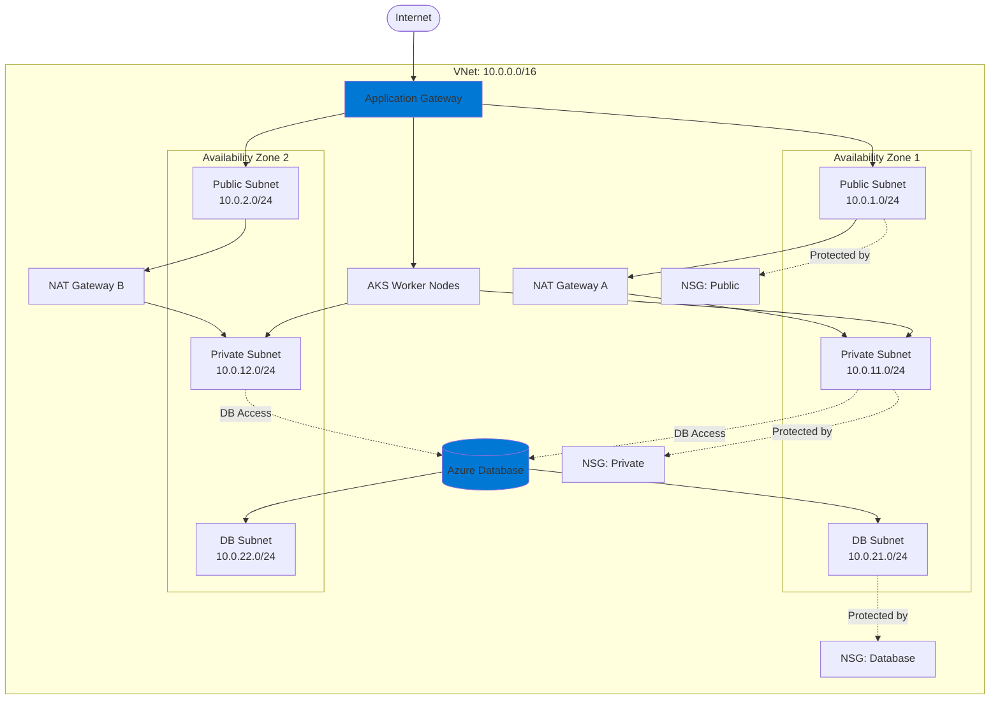

DevPlatform CLI creates a complete VNet networking infrastructure for each environment, including public and private subnets, NAT gateways, Network Security Groups, and routing tables.

## Overview

Each environment gets its own isolated VNet with a multi-tier subnet architecture designed for security and high availability.

<CardGroup cols={3}>
  <Card title="VNet Architecture" icon="sitemap" href="#vnet-architecture">
    Multi-zone VNet with public/private subnets
  </Card>
  <Card title="Network Security Groups" icon="shield" href="#network-security-groups">
    Least-privilege network access control
  </Card>
  <Card title="Routing" icon="route" href="#routing-configuration">
    Internet and NAT gateway routing
  </Card>
</CardGroup>

## VNet Architecture

### Network Topology



### CIDR Block Allocation

| Environment | VNet CIDR | Public Subnets | Private Subnets | DB Subnets |
|-------------|-----------|----------------|-----------------|------------|
| Dev | 10.0.0.0/16 | 10.0.1.0/24, 10.0.2.0/24 | 10.0.11.0/24, 10.0.12.0/24 | 10.0.21.0/24, 10.0.22.0/24 |
| Staging | 10.1.0.0/16 | 10.1.1.0/24, 10.1.2.0/24 | 10.1.11.0/24, 10.1.12.0/24 | 10.1.21.0/24, 10.1.22.0/24 |
| Prod | 10.2.0.0/16 | 10.2.1.0/24, 10.2.2.0/24, 10.2.3.0/24 | 10.2.11.0/24, 10.2.12.0/24, 10.2.13.0/24 | 10.2.21.0/24, 10.2.22.0/24, 10.2.23.0/24 |

## Network Security Groups

### Application NSG

```hcl
resource "azurerm_network_security_group" "app" {
  name                = "myapp-dev-app-nsg"
  location            = azurerm_resource_group.main.location
  resource_group_name = azurerm_resource_group.main.name
  
  security_rule {
    name                       = "AllowAppGateway"
    priority                   = 100
    direction                  = "Inbound"
    access                     = "Allow"
    protocol                   = "Tcp"
    source_port_range          = "*"
    destination_port_range     = "8080"
    source_address_prefix      = "10.0.1.0/24"
    destination_address_prefix = "*"
  }
  
  security_rule {
    name                       = "AllowInterPod"
    priority                   = 110
    direction                  = "Inbound"
    access                     = "Allow"
    protocol                   = "*"
    source_port_range          = "*"
    destination_port_range     = "*"
    source_address_prefix      = "10.0.11.0/24"
    destination_address_prefix = "*"
  }
  
  security_rule {
    name                       = "AllowOutboundInternet"
    priority                   = 100
    direction                  = "Outbound"
    access                     = "Allow"
    protocol                   = "*"
    source_port_range          = "*"
    destination_port_range     = "*"
    source_address_prefix      = "*"
    destination_address_prefix = "Internet"
  }
}
```

### Database NSG

```hcl
resource "azurerm_network_security_group" "database" {
  name                = "myapp-dev-db-nsg"
  location            = azurerm_resource_group.main.location
  resource_group_name = azurerm_resource_group.main.name
  
  security_rule {
    name                       = "AllowPostgreSQL"
    priority                   = 100
    direction                  = "Inbound"
    access                     = "Allow"
    protocol                   = "Tcp"
    source_port_range          = "*"
    destination_port_range     = "5432"
    source_address_prefix      = "10.0.11.0/24"
    destination_address_prefix = "*"
  }
  
  security_rule {
    name                       = "DenyAllInbound"
    priority                   = 4096
    direction                  = "Inbound"
    access                     = "Deny"
    protocol                   = "*"
    source_port_range          = "*"
    destination_port_range     = "*"
    source_address_prefix      = "*"
    destination_address_prefix = "*"
  }
}
```

## NAT Gateways

```hcl
resource "azurerm_public_ip" "nat" {
  count               = 2
  name                = "myapp-dev-nat-pip-${count.index + 1}"
  location            = azurerm_resource_group.main.location
  resource_group_name = azurerm_resource_group.main.name
  allocation_method   = "Static"
  sku                 = "Standard"
  zones               = [count.index + 1]
}

resource "azurerm_nat_gateway" "main" {
  count               = 2
  name                = "myapp-dev-nat-${count.index + 1}"
  location            = azurerm_resource_group.main.location
  resource_group_name = azurerm_resource_group.main.name
  sku_name            = "Standard"
  zones               = [count.index + 1]
}

resource "azurerm_nat_gateway_public_ip_association" "main" {
  count                = 2
  nat_gateway_id       = azurerm_nat_gateway.main[count.index].id
  public_ip_address_id = azurerm_public_ip.nat[count.index].id
}

resource "azurerm_subnet_nat_gateway_association" "private" {
  count          = 2
  subnet_id      = azurerm_subnet.private[count.index].id
  nat_gateway_id = azurerm_nat_gateway.main[count.index].id
}
```

## Routing Configuration

### Route Tables

```hcl
resource "azurerm_route_table" "private" {
  name                = "myapp-dev-private-rt"
  location            = azurerm_resource_group.main.location
  resource_group_name = azurerm_resource_group.main.name
  
  route {
    name                   = "ToInternet"
    address_prefix         = "0.0.0.0/0"
    next_hop_type          = "VirtualAppliance"
    next_hop_in_ip_address = azurerm_nat_gateway.main[0].id
  }
}

resource "azurerm_subnet_route_table_association" "private" {
  count          = 2
  subnet_id      = azurerm_subnet.private[count.index].id
  route_table_id = azurerm_route_table.private.id
}
```

## Service Endpoints

```hcl
resource "azurerm_subnet" "private" {
  count                = 2
  name                 = "myapp-dev-private-${count.index + 1}"
  resource_group_name  = azurerm_resource_group.main.name
  virtual_network_name = azurerm_virtual_network.main.name
  address_prefixes     = ["10.0.${count.index + 11}.0/24"]
  
  service_endpoints = [
    "Microsoft.Storage",
    "Microsoft.KeyVault",
    "Microsoft.Sql"
  ]
}
```

## Best Practices

<CardGroup cols={2}>
  <Card title="Multi-Zone for Production" icon="layer-group">
    Deploy production across multiple zones for high availability
  </Card>
  <Card title="Use Service Endpoints" icon="plug">
    Reduce NAT Gateway costs with VNet service endpoints
  </Card>
  <Card title="Least Privilege NSGs" icon="shield">
    Only allow required ports and sources in NSG rules
  </Card>
  <Card title="Enable Flow Logs" icon="chart-line">
    Monitor network traffic for security and troubleshooting
  </Card>
</CardGroup>

## Next Steps

<CardGroup cols={2}>
  <Card title="Azure Database" icon="database" href="/azure/database">
    Configure Azure Database in database subnets
  </Card>
  <Card title="Azure Kubernetes" icon="dharmachakra" href="/azure/kubernetes">
    Deploy applications to AKS
  </Card>
  <Card title="Security Overview" icon="shield" href="/security/overview">
    Network security best practices
  </Card>
  <Card title="Troubleshooting" icon="wrench" href="/guides/troubleshooting">
    Common networking issues
  </Card>
</CardGroup>

