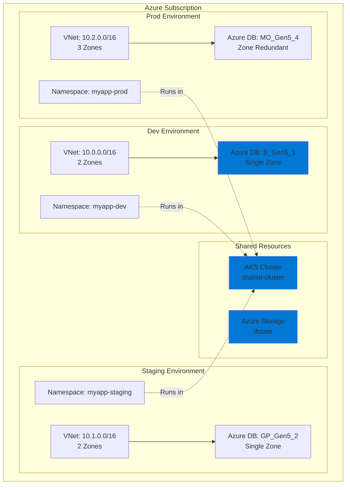
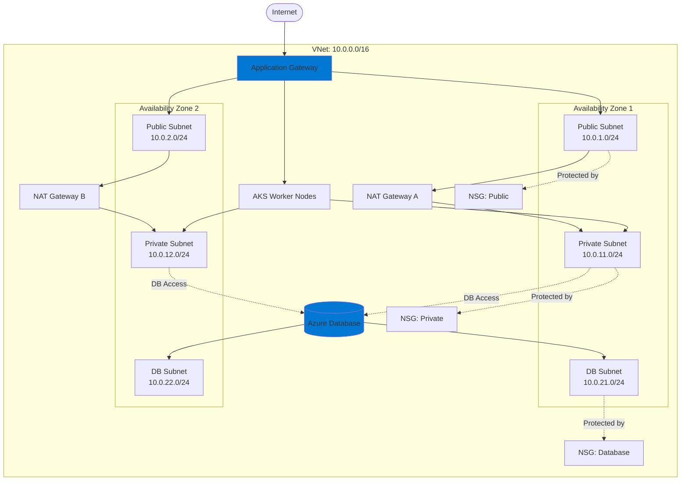
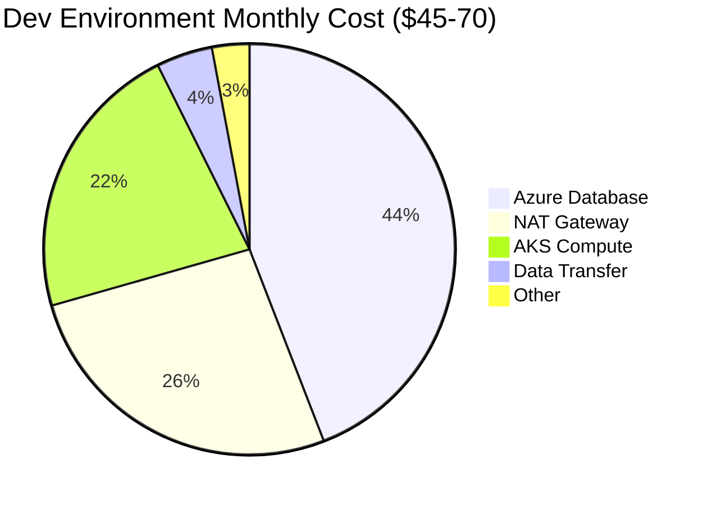
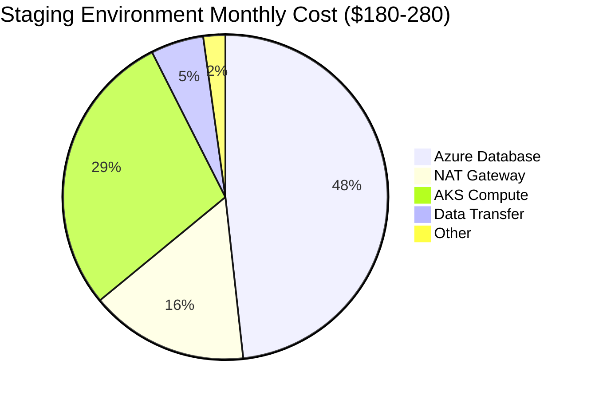
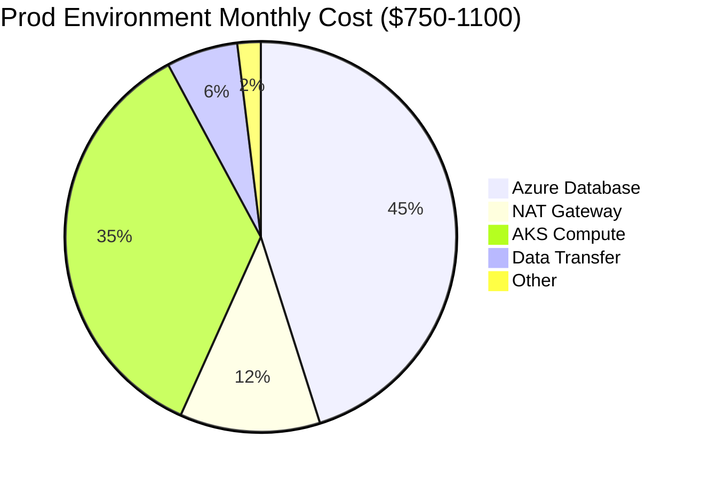
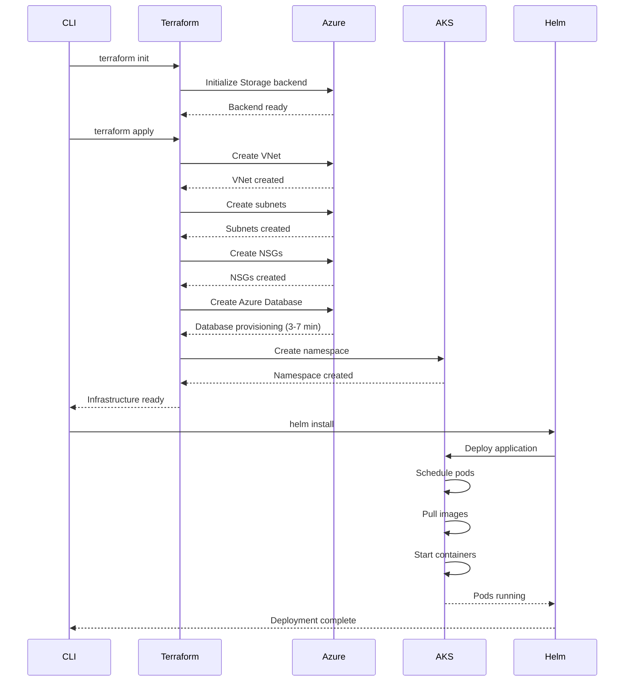
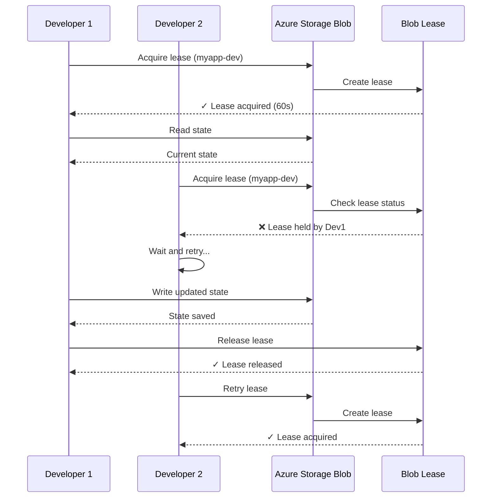
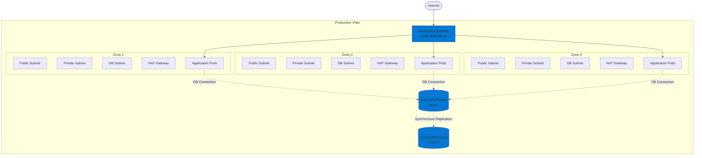

DevPlatform CLI provides seamless deployment of complete development environments on Azure, including VNet networking, Azure Database for PostgreSQL, and AKS-based Kubernetes workloads.

## Overview

The CLI automates the provisioning of Azure infrastructure using Terraform and deploys applications to Azure Kubernetes Service using Helm. All resources are organized by environment (dev, staging, prod) with appropriate sizing and high availability configurations.

<CardGroup cols={3}>
  <Card title="Network (VNet)" icon="network-wired" href="/azure/networking">
    VNet, subnets, NSGs, NAT gateways
  </Card>
  <Card title="Database (Azure DB)" icon="database" href="/azure/database">
    PostgreSQL instances with automated backups
  </Card>
  <Card title="Kubernetes (AKS)" icon="dharmachakra" href="/azure/kubernetes">
    Namespaces, pods, services, and ingress
  </Card>
</CardGroup>

## Azure Architecture

### Environment Topology

DevPlatform CLI creates isolated environments with dedicated VNets and databases, while sharing a common AKS cluster for cost efficiency.



### Network Architecture

Each environment gets its own VNet with public and private subnets across multiple availability zones:



## Resource Sizing by Environment

DevPlatform CLI automatically configures resources based on the environment type.

### Development Environment

<Tabs>
  <Tab title="Resources">
**Infrastructure:**
- VNet with 2 availability zones
- 2 public subnets (for NAT gateways and App Gateway)
- 2 private subnets (for AKS nodes)
- 2 database subnets
- 2 NAT gateways (one per zone)
- Network Security Groups (NSGs)

**Database:**
- SKU: `B_Gen5_1` (1 vCore, 2 GB RAM)
- Storage: 32 GB
- Single zone deployment
- Automated backups: 7 days retention
- No read replicas

**Kubernetes:**
- Namespace with resource quotas
- Pod resources: 0.25 CPU, 512 MB RAM
- Replicas: 1
- No horizontal pod autoscaling

</Tab>
  <Tab title="Cost Estimate">


**Monthly Cost Breakdown:**
- Azure Database B_Gen5_1: ~$30
- NAT Gateway (2x): ~$18
- AKS compute: ~$15
- Data transfer: ~$3
- Other (Storage, monitoring): ~$2

**Total: $45-70/month**
  </Tab>
</Tabs>

### Staging Environment

<Tabs>
  <Tab title="Resources">
**Infrastructure:**
- VNet with 2 availability zones
- 2 public subnets
- 2 private subnets
- 2 database subnets
- 2 NAT gateways
- Network Security Groups

**Database:**
- SKU: `GP_Gen5_2` (2 vCores, 10 GB RAM)
- Storage: 128 GB
- Single zone deployment
- Automated backups: 14 days retention
- Performance monitoring enabled

**Kubernetes:**
- Namespace with resource quotas
- Pod resources: 0.5 CPU, 1 GB RAM
- Replicas: 2
- Horizontal pod autoscaling: 2-5 pods

</Tab>
  <Tab title="Cost Estimate">


**Monthly Cost Breakdown:**
- Azure Database GP_Gen5_2: ~$110
- NAT Gateway (2x): ~$36
- AKS compute: ~$65
- Data transfer: ~$12
- Other: ~$5

**Total: $180-280/month**
  </Tab>
</Tabs>

### Production Environment

<Tabs>
  <Tab title="Resources">
**Infrastructure:**
- VNet with 3 availability zones
- 3 public subnets
- 3 private subnets
- 3 database subnets
- 3 NAT gateways
- Network Security Groups

**Database:**
- SKU: `MO_Gen5_4` (4 vCores, 20 GB RAM)
- Storage: 512 GB
- Zone-redundant deployment (automatic failover)
- Automated backups: 30 days retention
- Read replicas: 1-2 replicas
- Performance monitoring enabled
- Advanced threat protection

**Kubernetes:**
- Namespace with resource quotas
- Pod resources: 1 CPU, 2 GB RAM
- Replicas: 3 minimum
- Horizontal pod autoscaling: 3-10 pods
- Pod disruption budgets
- Resource limits enforced

</Tab>
  <Tab title="Cost Estimate">


**Monthly Cost Breakdown:**
- Azure Database MO_Gen5_4 (Zone-redundant): ~$420
- NAT Gateway (3x): ~$108
- AKS compute: ~$330
- Data transfer: ~$55
- Other (backups, monitoring): ~$18

**Total: $750-1100/month**
  </Tab>
</Tabs>

## Deployment Process

### Complete Provisioning Flow



### Provisioning Timeline

<Steps>
  <Step title="Validation (5-10 seconds)">
    - Parse command arguments
    - Validate inputs
    - Check Azure credentials
    - Load configuration
  </Step>

  <Step title="Terraform Init (10-15 seconds)">
    - Initialize Azure Storage backend
    - Download provider plugins
    - Configure state locking
  </Step>

  <Step title="Infrastructure Provisioning (4-8 minutes)">
    - Create VNet and subnets (30-45 seconds)
    - Create NSGs (15-20 seconds)
    - Create NAT gateways (1-2 minutes)
    - Create Azure Database (3-7 minutes)
    - Create AKS namespace (5-10 seconds)
  </Step>

  <Step title="Application Deployment (30-60 seconds)">
    - Prepare Helm chart (5 seconds)
    - Install Helm release (10 seconds)
    - Wait for pods to start (30-45 seconds)
    - Verify health checks (5 seconds)
  </Step>

  <Step title="Finalization (5 seconds)">
    - Extract outputs
    - Display results
    - Log success
  </Step>
</Steps>

**Total Time: 5-10 minutes** (varies by environment size and Azure region)

## State Management

DevPlatform CLI uses Azure Storage for Terraform state management.

### State Backend Configuration

```hcl
terraform {
  backend "azurerm" {
    resource_group_name  = "devplatform-state-rg"
    storage_account_name = "devplatformtfstate"
    container_name       = "tfstate"
    key                  = "myapp-dev.tfstate"
    use_azuread_auth     = true
  }
}
```

### State Locking with Blob Lease



**Lease Properties:**

| Property | Value | Purpose |
|----------|-------|---------|
| Lease Duration | 60 seconds | Auto-renewed during operation |
| Lease State | Available/Leased/Expired | Current lock status |
| Lease ID | UUID | Unique identifier for lock |

## High Availability

Production environments are deployed across multiple availability zones for high availability.

### Multi-Zone Architecture



### Failover Scenarios

<AccordionGroup>
  <Accordion title="Zone Failure">
    
**Scenario:** One availability zone becomes unavailable.

**Automatic Response:**
- Application Gateway stops routing traffic to affected zone
- Kubernetes reschedules pods to healthy zones
- Azure Database automatically fails over to standby (Zone-redundant only)
- NAT gateway in other zones handle traffic

**Recovery Time:**
- Pod rescheduling: 30-60 seconds
- Database failover: 60-120 seconds
- Total downtime: 1-2 minutes

</Accordion>

  <Accordion title="Database Primary Failure">
    
**Scenario:** Azure Database primary instance fails (Zone-redundant deployment).

**Automatic Response:**
- Azure detects failure (health checks)
- Automatic failover to standby instance
- DNS record updated to point to new primary
- Application reconnects automatically

**Recovery Time:**
- Failover detection: 30-60 seconds
- DNS propagation: 30-60 seconds
- Total downtime: 1-2 minutes

</Accordion>

  <Accordion title="Pod Failure">
    
**Scenario:** Application pod crashes or becomes unhealthy.

**Automatic Response:**
- Kubernetes detects failed health checks
- Pod is marked as not ready
- Application Gateway stops routing traffic to failed pod
- Kubernetes restarts pod automatically
- New pod passes health checks
- Application Gateway resumes routing traffic

**Recovery Time:**
- Health check detection: 10-30 seconds
- Pod restart: 20-40 seconds
- Total downtime: 30-70 seconds (per pod)

</Accordion>
</AccordionGroup>

## Security

DevPlatform CLI implements Azure security best practices.

### Security Layers

<CardGroup cols={2}>
  <Card title="Network Security" icon="shield">
    - Private subnets for workloads
    - NSGs with least privilege
    - VNet service endpoints
    - Azure Firewall integration
  </Card>
  <Card title="Data Security" icon="lock">
    - Database encryption at rest
    - Encryption in transit (TLS)
    - Automated backups encrypted
    - Secrets in Azure Key Vault
  </Card>
  <Card title="Access Control" icon="user-lock">
    - Workload Identity for pods
    - Azure RBAC for resources
    - Azure AD authentication
    - Activity Log audit logging
  </Card>
  <Card title="Compliance" icon="file-shield">
    - Encryption meets compliance standards
    - Audit logs for all operations
    - Resource tagging for governance
    - Azure Policy enforcement
  </Card>
</CardGroup>

### Network Security Group Rules

<Tabs>
  <Tab title="Application NSG">
```hcl
# Inbound rules
- Port 80/443 from App Gateway NSG
- Port 5432 to Database NSG (outbound)

# Outbound rules
- All traffic to 0.0.0.0/0 (for external APIs)
- Port 5432 to Database NSG
```
  </Tab>
  <Tab title="Database NSG">
```hcl
# Inbound rules
- Port 5432 from application NSG only

# Outbound rules
- None (database doesn't initiate outbound connections)
```
  </Tab>
  <Tab title="App Gateway NSG">
```hcl
# Inbound rules
- Port 80 from 0.0.0.0/0
- Port 443 from 0.0.0.0/0
- Port 65200-65535 from GatewayManager (required)

# Outbound rules
- Port 80/443 to application NSG
```
  </Tab>
</Tabs>

## Cost Optimization

<CardGroup cols={2}>
  <Card title="Right-Size Resources" icon="gauge">
    Use appropriate SKUs for each environment (dev uses B_Gen5_1, prod uses MO_Gen5_4)
  </Card>
  <Card title="Use Spot Instances" icon="dollar-sign">
    Consider spot node pools for non-prod AKS workloads (up to 90% savings)
  </Card>
  <Card title="Auto-Scaling" icon="arrows-up-down">
    Enable HPA for pods and consider serverless options for variable workloads
  </Card>
  <Card title="Destroy Unused Environments" icon="trash">
    Run `devplatform destroy` for dev/staging environments when not in use
  </Card>
</CardGroup>

### Cost Monitoring

```bash
# View estimated monthly cost before creating
devplatform create --app myapp --env dev --provider azure --dry-run

# Example output
Estimated monthly cost: $55.00
  - Azure Database B_Gen5_1: $30.00
  - NAT Gateway (2x): $18.00
  - AKS compute: $7.00
```

## Getting Started

<Steps>
  <Step title="Configure Azure Credentials">
```bash
# Login to Azure
az login

# Set subscription
az account set --subscription "My Subscription"

# Verify access
az account show
```
  </Step>

  <Step title="Create Development Environment">
```bash
# Create dev environment
devplatform create --app myapp --env dev --provider azure

# Wait 5-10 minutes for provisioning
```
  </Step>

  <Step title="Verify Deployment">
```bash
# Check environment status
devplatform status --app myapp --env dev --provider azure

# Update kubeconfig
az aks get-credentials --name shared-cluster --resource-group devplatform-rg

# View pods
kubectl get pods -n myapp-dev
```
  </Step>

  <Step title="Access Application">
```bash
# Get ingress URL from status output
# Example: https://myapp-dev.example.com

# Or get from kubectl
kubectl get ingress -n myapp-dev
```
  </Step>
</Steps>

## Next Steps

<CardGroup cols={2}>
  <Card title="Azure Authentication" icon="key" href="/azure/authentication">
    Configure Azure AD and Workload Identity
  </Card>
  <Card title="Azure Networking" icon="network-wired" href="/azure/networking">
    Deep dive into VNet configuration
  </Card>
  <Card title="Azure Database" icon="database" href="/azure/database">
    Azure Database configuration and management
  </Card>
  <Card title="Azure Kubernetes" icon="dharmachakra" href="/azure/kubernetes">
    AKS namespace and pod management
  </Card>
</CardGroup>

