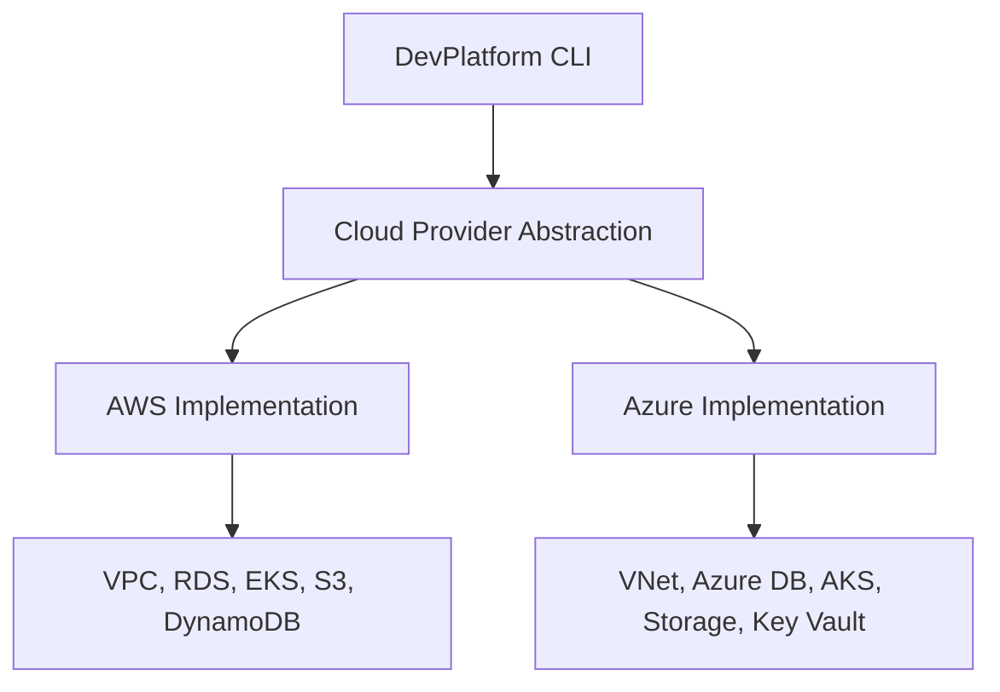
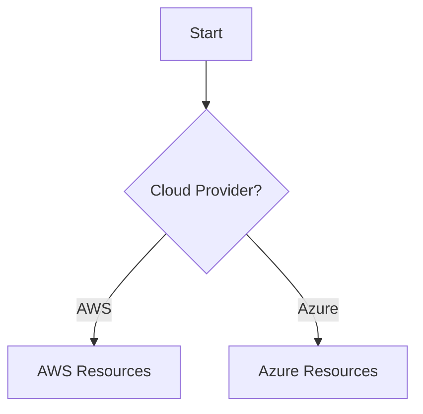
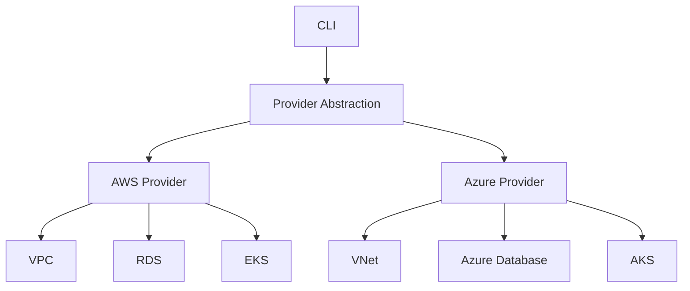
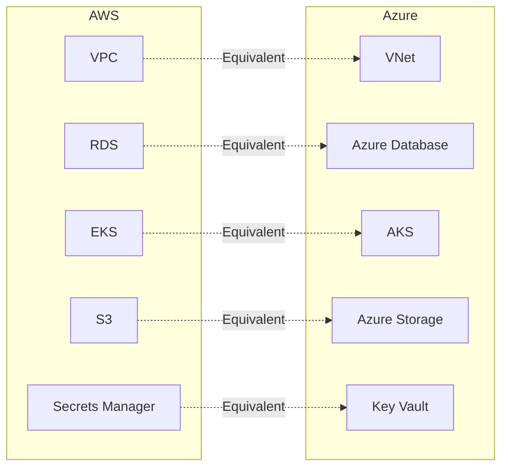

# Azure Documentation Update Guide

This guide provides the systematic changes needed to update all documentation files to include Azure support.

## Global Find & Replace Patterns

### Terminology Updates
- "AWS" → "AWS or Azure" (in general contexts)
- "AWS Cloud" → "Cloud Provider (AWS or Azure)"
- "VPC" → "VPC (AWS) or VNet (Azure)" or "Network"
- "RDS" → "RDS (AWS) or Azure Database (Azure)" or "Database"
- "EKS" → "EKS (AWS) or AKS (Azure)" or "Kubernetes Cluster"
- "S3" → "S3 (AWS) or Azure Storage (Azure)"
- "DynamoDB" → "DynamoDB (AWS) or Azure Storage Lease (Azure)"
- "Secrets Manager" → "Secrets Manager (AWS) or Key Vault (Azure)"
- "IAM" → "IAM (AWS) or Azure RBAC (Azure)"
- "IRSA" → "IRSA (AWS) or Workload Identity (Azure)"
- "CloudTrail" → "CloudTrail (AWS) or Activity Log (Azure)"
- "VPC Flow Logs" → "VPC Flow Logs (AWS) or NSG Flow Logs (Azure)"

### CLI Command Updates
Add `--provider aws` or `--provider azure` to all command examples:
```bash
# Before
devplatform create --app payment --env dev

# After (show both)
devplatform create --app payment --env dev --provider aws
devplatform create --app payment --env dev --provider azure
```

### Architecture Diagram Updates
Add parallel paths for AWS and Azure in all architecture diagrams.

## File-Specific Updates

### docs/architecture.md

#### System Overview
- Change: "enables self-service infrastructure provisioning on AWS"
- To: "enables self-service infrastructure provisioning on AWS or Azure"

#### High-Level Architecture Diagram
Add cloud provider abstraction layer and show both AWS and Azure clouds:


#### Component Architecture
Add:
- internal/provider (CloudProvider interface, factory)
- internal/azure (auth.go, kubeconfig.go, pricing.go)

#### Technology Stack Mindmap
Add Azure branch:
```
Cloud Provider
  AWS (VPC, RDS, EKS, S3, DynamoDB, Secrets Manager)
  Azure (VNet, Azure Database, AKS, Storage, Key Vault)
Dependencies
  aws-sdk-go-v2
  azure-sdk-for-go
```

### docs/workflows.md

#### All Command Workflows
- Add provider selection step after input validation
- Show parallel execution paths for AWS and Azure
- Update credential checking to support both clouds

#### Create Command Workflow
Add decision node:
```mermaid
CheckProvider{Cloud Provider?}
CheckProvider -->|AWS| CheckAWS[Check AWS Credentials]
CheckProvider -->|Azure| CheckAzure[Check Azure Credentials]
```

#### Terraform Execution Detail
Show both backends:
```mermaid
alt AWS Backend
    TF->>S3: Initialize State Backend
    TF->>DynamoDB: Acquire Lock
else Azure Backend
    TF->>AzureStorage: Initialize State Backend
    TF->>AzureStorage: Acquire Blob Lease
end
```

### docs/deployment-guide.md

#### Environment Topology
Show both AWS and Azure topologies side by side

#### Network Architecture
Add Azure VNet architecture alongside AWS VPC:
- Subnets → Subnets
- NAT Gateway → NAT Gateway
- Security Groups → Network Security Groups
- VPC Flow Logs → NSG Flow Logs

#### Resource Sizing
Add Azure equivalents:
- db.t3.micro → B_Gen5_1
- db.t3.medium → GP_Gen5_2
- db.r5.large → MO_Gen5_4

### docs/security-guide.md

#### Authentication Flow
Add Azure authentication flow:
- Azure CLI (az login)
- Service Principal
- Managed Identity

#### IAM/RBAC
Show both:
- AWS IAM Policies
- Azure RBAC Roles

#### Network Security
Add Azure NSG rules alongside AWS Security Groups

#### Data Encryption
Add:
- Azure Database encryption
- Azure Key Vault
- Azure Storage encryption

### docs/api-reference.md

#### CLI Command Structure
Update all commands to include --provider flag:
```bash
devplatform create --app <app-name> --env <env-type> --provider <aws|azure>
```

#### Configuration File Schema
Add Azure section:
```yaml
azure:
  subscription_id: "..."
  location: "eastus"
  tenant_id: "..."
```

#### Error Codes
Add Azure-specific error codes:
- 2000-2099: Azure Authentication Errors
- 2100-2199: Azure Resource Errors

### docs/troubleshooting.md

#### Diagnostic Flow
Add Azure path alongside AWS

#### Common Issues
Add Azure-specific issues:
- Azure CLI not configured
- Azure subscription not found
- Azure RBAC permissions insufficient
- Azure Storage backend issues
- AKS connection issues

### README.md
Already updated by subagent ✓

## Mermaid Diagram Patterns

### Multi-Cloud Decision Pattern


### Parallel Cloud Architecture Pattern


### Resource Mapping Pattern


## Implementation Checklist

- [ ] docs/architecture.md - Add Azure to all diagrams and descriptions
- [ ] docs/workflows.md - Add Azure paths to all workflows
- [ ] docs/deployment-guide.md - Add Azure deployment patterns
- [ ] docs/security-guide.md - Add Azure security architecture
- [ ] docs/api-reference.md - Add --provider flag and Azure config
- [ ] docs/troubleshooting.md - Add Azure troubleshooting
- [ ] All files - Update terminology (VPC→Network, RDS→Database, etc.)
- [ ] All files - Add --provider flag to CLI examples
- [ ] All files - Show both AWS and Azure examples
