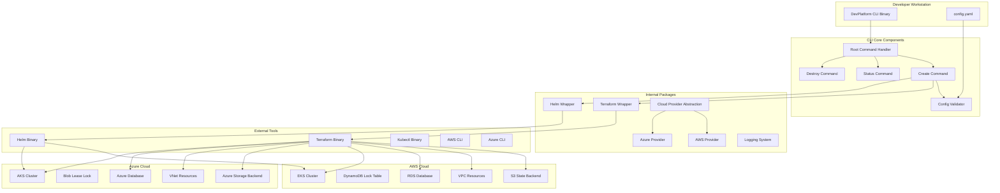
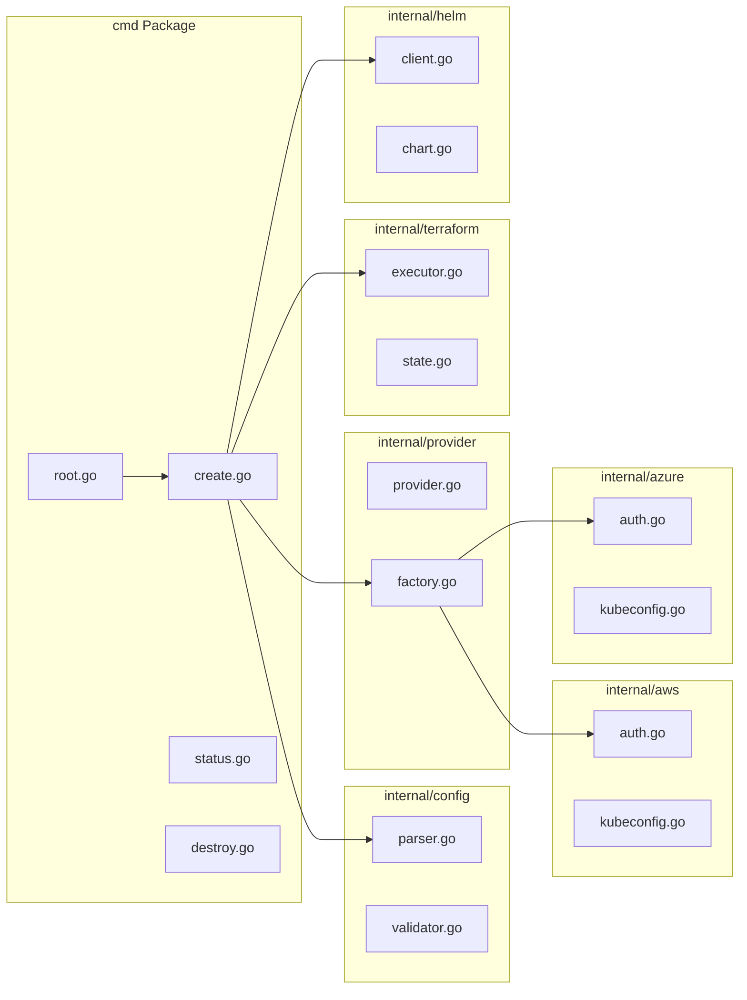
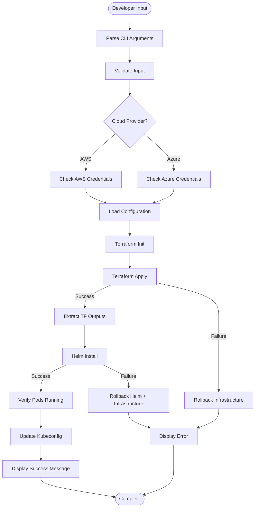
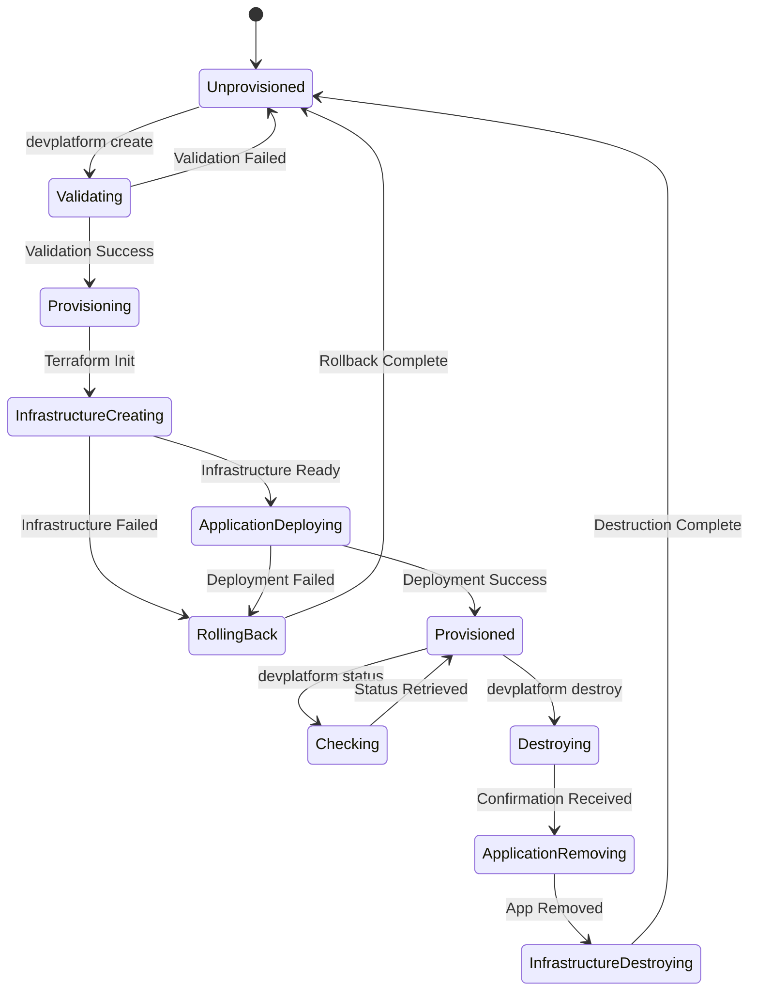
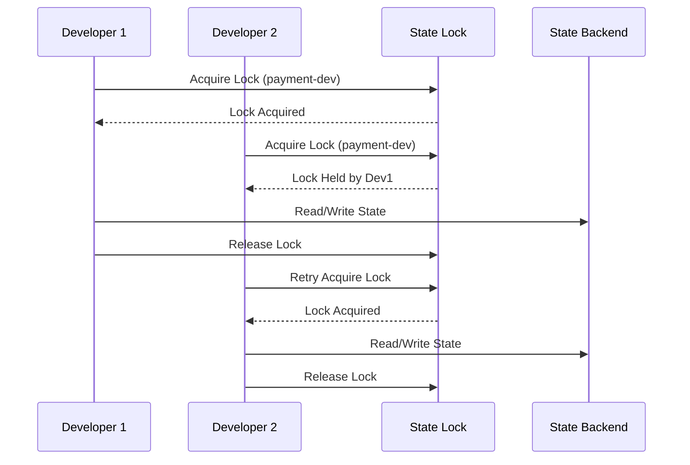
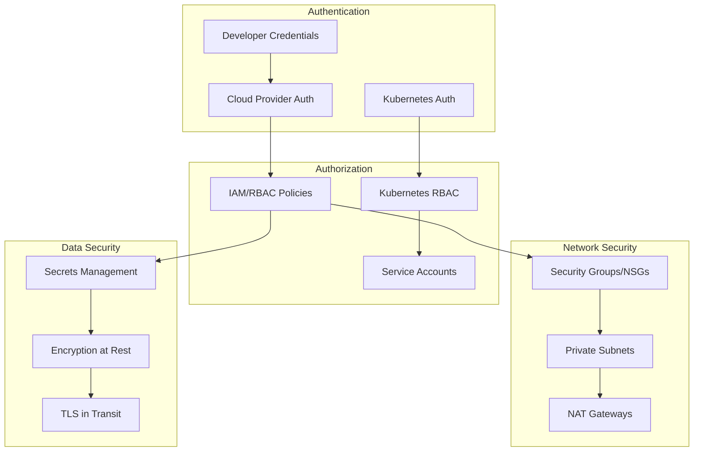
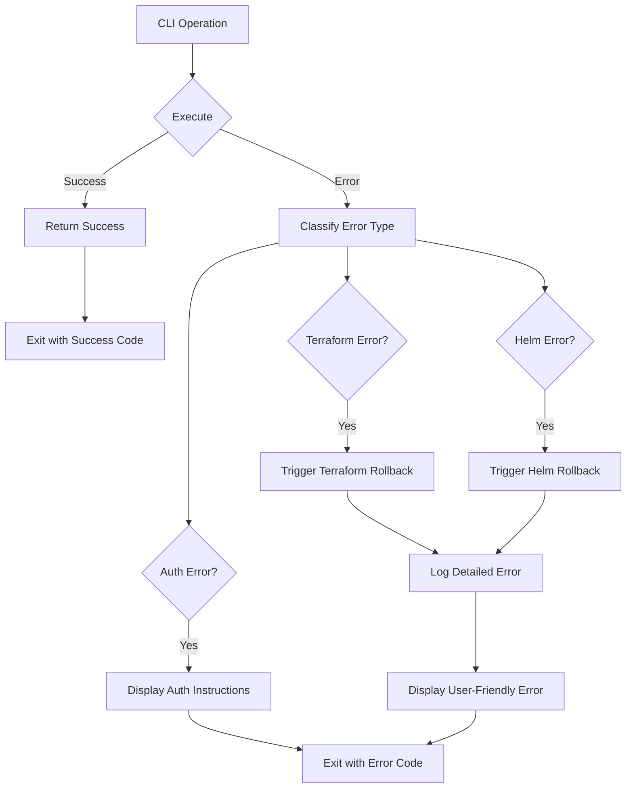

## System Overview

The DevPlatform CLI is an Internal Developer Platform (IDP) that enables self-service infrastructure provisioning on **AWS** or **Azure**. It orchestrates Terraform for infrastructure management and Helm for Kubernetes deployments, providing a consistent developer experience across both cloud providers.

<CardGroup cols={2}>
  <Card title="Multi-Cloud" icon="cloud">
    Single CLI for AWS and Azure deployments
  </Card>
  <Card title="Orchestration" icon="gears">
    Coordinates Terraform and Helm automatically
  </Card>
  <Card title="Self-Service" icon="user">
    Developers provision without DevOps tickets
  </Card>
  <Card title="State Management" icon="database">
    Safe concurrent operations with locking
  </Card>
</CardGroup>

## High-Level Architecture

The CLI follows a layered architecture with clear separation of concerns:



### Architecture Layers

<AccordionGroup>
  <Accordion title="CLI Interface Layer" icon="terminal">
    **Purpose:** User interaction and command routing
    
    **Components:**
    - Root command handler with global flags
    - Subcommand implementations (create, status, destroy, version)
    - Flag parsing and validation
    - Output formatting and user feedback
    
    **Technology:** Cobra framework for CLI structure
  </Accordion>

  <Accordion title="Business Logic Layer" icon="brain">
    **Purpose:** Core application logic and orchestration
    
    **Components:**
    - Configuration validation
    - Workflow orchestration
    - Error handling and rollback
    - Cost calculation
    
    **Responsibilities:**
    - Coordinate between Terraform and Helm
    - Implement retry logic
    - Handle partial failures
  </Accordion>

  <Accordion title="Cloud Provider Abstraction" icon="cloud">
    **Purpose:** Multi-cloud support with consistent interface
    
    **Components:**
    - CloudProvider interface
    - AWS provider implementation
    - Azure provider implementation
    - Provider factory
    
    **Benefits:**
    - Single codebase for multiple clouds
    - Easy to add new providers
    - Consistent developer experience
  </Accordion>

  <Accordion title="Infrastructure Adapters" icon="plug">
    **Purpose:** Integration with external tools
    
    **Components:**
    - Terraform wrapper (execution, state management)
    - Helm wrapper (chart management, releases)
    - Cloud utilities (authentication, kubeconfig)
    
    **Responsibilities:**
    - Execute external binaries
    - Parse outputs
    - Handle errors
  </Accordion>

  <Accordion title="External Dependencies" icon="box">
    **Purpose:** Actual infrastructure provisioning
    
    **Tools:**
    - Terraform (infrastructure as code)
    - Helm (Kubernetes package manager)
    - AWS SDK / Azure SDK
    - Kubernetes client-go
    
    **Note:** These must be installed separately
  </Accordion>
</AccordionGroup>

## Component Architecture

The system is organized into focused packages:



### Package Responsibilities

| Package | Purpose | Key Files |
|---------|---------|-----------|
| `cmd/` | CLI commands | root.go, create.go, status.go, destroy.go |
| `internal/config/` | Configuration management | parser.go, validator.go, schema.go |
| `internal/provider/` | Cloud abstraction | provider.go, factory.go |
| `internal/terraform/` | Terraform integration | executor.go, state.go, output.go |
| `internal/helm/` | Helm integration | client.go, chart.go, values.go |
| `internal/aws/` | AWS utilities | auth.go, kubeconfig.go, pricing.go |
| `internal/azure/` | Azure utilities | auth.go, kubeconfig.go, pricing.go |
| `internal/logger/` | Logging system | logger.go, file.go |

## Data Flow

### Provisioning Flow



### Key Data Flows

<Steps>
  <Step title="Input Validation">
    CLI flags and configuration files are parsed and validated before any cloud operations
  </Step>
  <Step title="Credential Verification">
    Cloud provider credentials are checked early to fail fast
  </Step>
  <Step title="Infrastructure Provisioning">
    Terraform creates network, database, and Kubernetes namespace
  </Step>
  <Step title="Application Deployment">
    Helm deploys the application to the Kubernetes namespace
  </Step>
  <Step title="Verification">
    Pod health and ingress availability are verified
  </Step>
  <Step title="Output">
    Connection information and cost estimates are displayed
  </Step>
</Steps>

## Deployment Architecture

### Multi-Cloud Deployment

<Tabs>
  <Tab title="AWS">
    ```mermaid
    graph TB
        CLI[DevPlatform CLI]
        
        subgraph "Shared Infrastructure"
            S3[S3 State Backend]
            DynamoDB[DynamoDB Locks]
            EKS[EKS Cluster]
        end
        
        subgraph "App Environment"
            VPC[VPC 10.0.0.0/16]
            RDS[RDS Database]
            NS[Namespace]
            Pods[Application Pods]
            ALB[ALB Ingress]
        end
        
        CLI --> VPC
        CLI --> RDS
        CLI --> NS
        
        VPC --> RDS
        NS --> Pods
        Pods --> ALB
        Pods -.-> RDS
        
        CLI -.-> S3
        CLI -.-> DynamoDB
        NS -.-> EKS
    ```
  </Tab>

  <Tab title="Azure">
    ```mermaid
    graph TB
        CLI[DevPlatform CLI]
        
        subgraph "Shared Infrastructure"
            Storage[Azure Storage Backend]
            Lease[Blob Lease Locks]
            AKS[AKS Cluster]
        end
        
        subgraph "App Environment"
            VNet[VNet 10.0.0.0/16]
            AzureDB[Azure Database]
            NS[Namespace]
            Pods[Application Pods]
            AppGW[App Gateway Ingress]
        end
        
        CLI --> VNet
        CLI --> AzureDB
        CLI --> NS
        
        VNet --> AzureDB
        NS --> Pods
        Pods --> AppGW
        Pods -.-> AzureDB
        
        CLI -.-> Storage
        CLI -.-> Lease
        NS -.-> AKS
    ```
  </Tab>
</Tabs>

## State Management

### State Lifecycle



### Concurrent Operations

The CLI supports safe concurrent operations through distributed locking:



<Note>
  Each environment (app + env + provider) has a unique state key, allowing different environments to be provisioned concurrently.
</Note>

## Security Architecture

### Security Layers



### Security Principles

<AccordionGroup>
  <Accordion title="Least Privilege">
    - Minimal IAM/RBAC permissions required
    - Separate roles for different operations
    - Time-limited credentials where possible
  </Accordion>

  <Accordion title="Defense in Depth">
    - Multiple security layers
    - Network isolation (private subnets)
    - Encryption at rest and in transit
    - Audit logging enabled
  </Accordion>

  <Accordion title="Secure by Default">
    - Encryption enabled automatically
    - Private subnets for databases
    - Security groups with minimal access
    - Secrets stored in managed services
  </Accordion>
</AccordionGroup>

## Error Handling

### Error Classification and Recovery



### Rollback Strategy

<Steps>
  <Step title="Helm Failure">
    If Helm installation fails, uninstall the release and proceed to Terraform rollback
  </Step>
  <Step title="Terraform Failure">
    If Terraform apply fails, execute `terraform destroy` to remove partial infrastructure
  </Step>
  <Step title="Pod Verification Failure">
    If pods don't become ready, uninstall Helm and destroy Terraform resources
  </Step>
  <Step title="Manual Cleanup">
    If automatic rollback fails, provide manual cleanup instructions
  </Step>
</Steps>

## Technology Stack

<CardGroup cols={2}>
  <Card title="Core Language" icon="golang">
    **Go 1.21+**
    - Strong standard library
    - Excellent concurrency
    - Cross-platform compilation
    - Static binary distribution
  </Card>

  <Card title="CLI Framework" icon="terminal">
    **Cobra + Viper**
    - Industry-standard CLI framework
    - Built-in help generation
    - Configuration management
    - Flag parsing
  </Card>

  <Card title="Infrastructure" icon="terraform">
    **Terraform 1.5+**
    - Declarative infrastructure
    - State management
    - Modular architecture
    - Multi-cloud support
  </Card>

  <Card title="Kubernetes" icon="kubernetes">
    **Helm 3.x + kubectl**
    - Templated manifests
    - Release management
    - Cluster interaction
    - Resource management
  </Card>
</CardGroup>

## Performance Characteristics

### Typical Operation Times

| Operation | Dev | Staging | Prod |
|-----------|-----|---------|------|
| Create | 2-3 min | 3-4 min | 4-5 min |
| Status | < 5 sec | < 5 sec | < 5 sec |
| Destroy | 2-3 min | 3-4 min | 4-6 min |

### Performance Factors

<AccordionGroup>
  <Accordion title="Network Latency">
    - API calls to cloud providers
    - Terraform state operations
    - Docker image pulls
  </Accordion>

  <Accordion title="Resource Creation Time">
    - Database provisioning (slowest)
    - Network infrastructure
    - Kubernetes resources
  </Accordion>

  <Accordion title="Optimization Strategies">
    - Parallel resource creation (Terraform)
    - Cached provider plugins
    - Pre-pulled container images
    - Optimized Terraform modules
  </Accordion>
</AccordionGroup>

## Scalability

### Horizontal Scalability

- **Multiple Developers**: Concurrent operations with state locking
- **Multiple Environments**: Isolated state per environment
- **Multiple Applications**: Independent infrastructure per app
- **Multiple Clouds**: Separate state backends per provider

### Vertical Scalability

- **Resource Sizing**: Configurable per environment (dev/staging/prod)
- **Database Scaling**: Vertical and horizontal scaling supported
- **Kubernetes Scaling**: HPA for application pods
- **Cost Optimization**: Right-sizing based on usage

## Next Steps

<CardGroup cols={2}>
  <Card title="Multi-Cloud" icon="cloud" href="/concepts/multi-cloud">
    Learn about multi-cloud support
  </Card>
  <Card title="Workflows" icon="diagram-project" href="/concepts/workflows">
    Understand operational workflows
  </Card>
  <Card title="State Management" icon="database" href="/concepts/state-management">
    Deep dive into state management
  </Card>
  <Card title="Security" icon="shield" href="/security/overview">
    Explore security architecture
  </Card>
</CardGroup>
