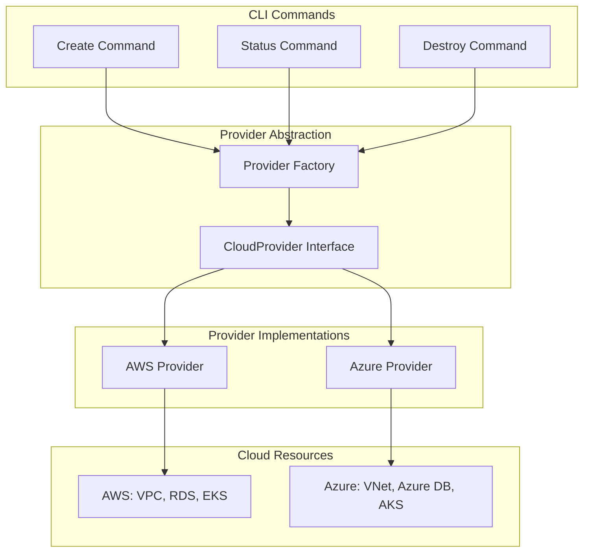

## Overview

DevPlatform CLI provides **true multi-cloud support** through a provider abstraction layer, enabling developers to deploy to AWS or Azure with a consistent experience. The same CLI commands, configuration structure, and workflows work across both cloud providers.

<CardGroup cols={2}>
  <Card title="Single CLI" icon="terminal">
    One tool for both AWS and Azure deployments
  </Card>
  <Card title="Consistent Experience" icon="equals">
    Same commands, flags, and workflows
  </Card>
  <Card title="Provider Abstraction" icon="layer-group">
    Cloud-specific details hidden behind interface
  </Card>
  <Card title="Easy Switching" icon="arrows-rotate">
    Change providers with a single flag
  </Card>
</CardGroup>

## Provider Selection

### Command-Line Flag

The simplest way to select a provider:

<Tabs>
  <Tab title="AWS">
    ```bash
    devplatform create --app payment --env dev --provider aws
    ```
  </Tab>
  <Tab title="Azure">
    ```bash
    devplatform create --app payment --env dev --provider azure
    ```
  </Tab>
</Tabs>

### Configuration File

Set a default provider in your configuration:

```yaml
global:
  cloud_provider: aws  # or azure
  timeout: 30
  log_level: info
```

<Note>
  Command-line flags override configuration file settings, allowing you to easily switch providers per deployment.
</Note>

## Provider Abstraction Architecture

### CloudProvider Interface

All cloud providers implement a common interface:



### Interface Methods

The CloudProvider interface defines these common operations:

<AccordionGroup>
  <Accordion title="Authentication" icon="key">
    ```go
    ValidateCredentials() error
    GetIdentity() (*Identity, error)
    ```
    
    Verifies cloud credentials and retrieves account/subscription information.
  </Accordion>

  <Accordion title="Kubernetes" icon="kubernetes">
    ```go
    UpdateKubeconfig(clusterName string) error
    GetKubernetesClient() (kubernetes.Interface, error)
    ```
    
    Manages kubeconfig and provides Kubernetes API access.
  </Accordion>

  <Accordion title="Cost Calculation" icon="dollar-sign">
    ```go
    CalculateNetworkCost(config NetworkConfig) float64
    CalculateDatabaseCost(config DatabaseConfig) float64
    GetTotalCost(env string) float64
    ```
    
    Estimates infrastructure costs based on configuration.
  </Accordion>

  <Accordion title="Terraform Backend" icon="database">
    ```go
    GetBackendConfig() BackendConfig
    ```
    
    Returns provider-specific Terraform backend configuration.
  </Accordion>
</AccordionGroup>

## Resource Mapping

DevPlatform CLI maps equivalent resources across clouds:

### Infrastructure Mapping

| Component | AWS | Azure |
|-----------|-----|-------|
| **Network** | VPC | Virtual Network (VNet) |
| **Subnets** | Subnets | Subnets |
| **Security** | Security Groups | Network Security Groups (NSGs) |
| **NAT** | NAT Gateway | NAT Gateway |
| **Database** | RDS PostgreSQL | Azure Database for PostgreSQL |
| **Kubernetes** | EKS | AKS |
| **Storage** | S3 | Azure Blob Storage |
| **Secrets** | Secrets Manager | Key Vault |
| **Identity** | IAM | Azure RBAC |
| **Pod Identity** | IRSA | Workload Identity |
| **Audit** | CloudTrail | Activity Log |
| **Network Logs** | VPC Flow Logs | NSG Flow Logs |

### State Backend Mapping

<Tabs>
  <Tab title="AWS">
    **State Storage**: S3 Bucket
    
    **Locking**: DynamoDB Table
    
    ```yaml
    terraform:
      backend:
        type: s3
        bucket: terraform-state-bucket
        dynamodb_table: terraform-locks
        region: us-east-1
    ```
  </Tab>

  <Tab title="Azure">
    **State Storage**: Azure Storage Account
    
    **Locking**: Blob Lease
    
    ```yaml
    terraform:
      backend:
        type: azurerm
        storage_account_name: tfstatestorage
        container_name: tfstate
        resource_group_name: terraform-state-rg
    ```
  </Tab>
</Tabs>

## Configuration Structure

### Multi-Cloud Configuration

A complete configuration supporting both providers:

```yaml
# Global settings
global:
  cloud_provider: aws  # Default provider
  timeout: 30
  log_level: info

# AWS-specific settings
aws:
  region: us-east-1
  profile: default

# Azure-specific settings
azure:
  subscription_id: "12345678-1234-1234-1234-123456789012"
  location: eastus
  tenant_id: "87654321-4321-4321-4321-210987654321"

# Environment configuration (cloud-agnostic)
environments:
  dev:
    network_cidr: "10.0.0.0/16"
    db_instance_class: "db.t3.micro"  # AWS
    # db_instance_class: "B_Gen5_1"   # Azure equivalent
    db_allocated_storage: 20
    db_multi_az: false
    k8s_node_count: 2

# Terraform backend (provider-specific)
terraform:
  backend:
    # AWS backend
    type: s3
    bucket: terraform-state-bucket
    dynamodb_table: terraform-locks
    region: us-east-1
    
    # Azure backend (alternative)
    # type: azurerm
    # storage_account_name: tfstatestorage
    # container_name: tfstate
    # resource_group_name: terraform-state-rg
```

### Provider-Specific Overrides

You can override settings per provider:

```yaml
environments:
  prod:
    # Common settings
    network_cidr: "10.2.0.0/16"
    k8s_node_count: 3
    
    # AWS-specific
    aws:
      db_instance_class: "db.r5.large"
      db_allocated_storage: 500
      db_multi_az: true
    
    # Azure-specific
    azure:
      db_instance_class: "MO_Gen5_4"
      db_allocated_storage: 512
      db_multi_az: true  # Zone redundant
```

## Deployment Comparison

### Side-by-Side Deployment

<Tabs>
  <Tab title="AWS Deployment">
    ```bash
    # Create AWS environment
    devplatform create \
      --app payment \
      --env dev \
      --provider aws
    ```
    
    **What Gets Created:**
    - VPC with public/private subnets
    - Internet Gateway + NAT Gateways
    - Security Groups
    - RDS PostgreSQL instance
    - EKS namespace with IRSA
    - Helm release with ALB ingress
    
    **Estimated Cost:** $75/month (dev)
    **Provisioning Time:** 2-3 minutes
  </Tab>

  <Tab title="Azure Deployment">
    ```bash
    # Create Azure environment
    devplatform create \
      --app payment \
      --env dev \
      --provider azure
    ```
    
    **What Gets Created:**
    - VNet with public/private subnets
    - NAT Gateways
    - Network Security Groups (NSGs)
    - Azure Database for PostgreSQL
    - AKS namespace with Workload Identity
    - Helm release with App Gateway ingress
    
    **Estimated Cost:** $70/month (dev)
    **Provisioning Time:** 2-3 minutes
  </Tab>
</Tabs>

## Architecture Comparison

### Network Architecture

<Tabs>
  <Tab title="AWS">
    ```mermaid
    graph TB
        Internet([Internet]) --> IGW[Internet Gateway]
        IGW --> PublicSubnet[Public Subnet]
        PublicSubnet --> NAT[NAT Gateway]
        PublicSubnet --> ALB[Application Load Balancer]
        NAT --> PrivateSubnet[Private Subnet]
        PrivateSubnet --> EKS[EKS Pods]
        PrivateSubnet --> RDS[(RDS Database)]
        ALB --> EKS
        EKS -.-> RDS
        
        SG1[Security Group: ALB] --> ALB
        SG2[Security Group: EKS] --> EKS
        SG3[Security Group: RDS] --> RDS
    ```
  </Tab>

  <Tab title="Azure">
    ```mermaid
    graph TB
        Internet([Internet]) --> PublicSubnet[Public Subnet]
        PublicSubnet --> NAT[NAT Gateway]
        PublicSubnet --> AppGW[Application Gateway]
        NAT --> PrivateSubnet[Private Subnet]
        PrivateSubnet --> AKS[AKS Pods]
        PrivateSubnet --> AzureDB[(Azure Database)]
        AppGW --> AKS
        AKS -.-> AzureDB
        
        NSG1[NSG: Public] --> PublicSubnet
        NSG2[NSG: Private] --> PrivateSubnet
        NSG3[NSG: Database] --> AzureDB
    ```
  </Tab>
</Tabs>

### Authentication Flow

<Tabs>
  <Tab title="AWS">
    ```mermaid
    sequenceDiagram
        participant Dev as Developer
        participant CLI as DevPlatform CLI
        participant AWS as AWS
        participant EKS as EKS
        
        Dev->>CLI: devplatform create --provider aws
        CLI->>AWS: Verify IAM credentials
        AWS-->>CLI: Credentials valid
        CLI->>AWS: Create VPC, RDS
        AWS-->>CLI: Resources created
        CLI->>EKS: Deploy to namespace
        EKS-->>CLI: Deployment successful
        CLI-->>Dev: Environment ready
    ```
  </Tab>

  <Tab title="Azure">
    ```mermaid
    sequenceDiagram
        participant Dev as Developer
        participant CLI as DevPlatform CLI
        participant Azure as Azure
        participant AKS as AKS
        
        Dev->>CLI: devplatform create --provider azure
        CLI->>Azure: Verify Azure AD credentials
        Azure-->>CLI: Credentials valid
        CLI->>Azure: Create VNet, Azure DB
        Azure-->>CLI: Resources created
        CLI->>AKS: Deploy to namespace
        AKS-->>CLI: Deployment successful
        CLI-->>Dev: Environment ready
    ```
  </Tab>
</Tabs>

## Provider-Specific Features

### AWS-Specific

<AccordionGroup>
  <Accordion title="IAM Roles for Service Accounts (IRSA)">
    AWS-specific feature for pod-level IAM permissions:
    
    ```yaml
    # Automatically configured
    serviceAccount:
      annotations:
        eks.amazonaws.com/role-arn: arn:aws:iam::123456789012:role/payment-dev-sa
    ```
  </Accordion>

  <Accordion title="AWS Secrets Manager">
    Database credentials stored in Secrets Manager:
    
    ```bash
    aws secretsmanager get-secret-value \
      --secret-id payment-dev-db-password
    ```
  </Accordion>

  <Accordion title="CloudTrail Logging">
    All API calls logged to CloudTrail:
    
    ```bash
    aws cloudtrail lookup-events \
      --lookup-attributes AttributeKey=ResourceName,AttributeValue=payment-dev
    ```
  </Accordion>
</AccordionGroup>

### Azure-Specific

<AccordionGroup>
  <Accordion title="Workload Identity">
    Azure-specific feature for pod-level Azure AD permissions:
    
    ```yaml
    # Automatically configured
    serviceAccount:
      annotations:
        azure.workload.identity/client-id: "12345678-1234-1234-1234-123456789012"
      labels:
        azure.workload.identity/use: "true"
    ```
  </Accordion>

  <Accordion title="Azure Key Vault">
    Database credentials stored in Key Vault:
    
    ```bash
    az keyvault secret show \
      --vault-name payment-dev-kv \
      --name db-password
    ```
  </Accordion>

  <Accordion title="Activity Log">
    All operations logged to Activity Log:
    
    ```bash
    az monitor activity-log list \
      --resource-group rg-payment-dev
    ```
  </Accordion>
</AccordionGroup>

## Cost Comparison

### Development Environment

| Component | AWS | Azure |
|-----------|-----|-------|
| Network | $5/month | $5/month |
| NAT Gateway | $20/month | $20/month |
| Database | $35/month (db.t3.micro) | $30/month (B_Gen5_1) |
| Kubernetes | $15/month | $15/month |
| **Total** | **~$75/month** | **~$70/month** |

### Production Environment

| Component | AWS | Azure |
|-----------|-----|-------|
| Network | $15/month | $15/month |
| NAT Gateway | $120/month (3 AZs) | $60/month (2 zones) |
| Database | $450/month (db.r5.large Multi-AZ) | $400/month (MO_Gen5_4 Zone Redundant) |
| Kubernetes | $350/month | $300/month |
| **Total** | **~$935/month** | **~$775/month** |

<Note>
  Costs are estimates and vary by region, usage, and specific configuration. Always check current pricing.
</Note>

## Switching Providers

### Migration Workflow

To migrate an application from one provider to another:

<Steps>
  <Step title="Backup Data">
    Export database and application data:
    
    ```bash
    # AWS
    aws rds create-db-snapshot \
      --db-instance-identifier payment-dev-db \
      --db-snapshot-identifier payment-dev-migration
    
    # Azure
    az postgres server backup create \
      --resource-group rg-payment-dev \
      --server-name payment-dev-db \
      --backup-name payment-dev-migration
    ```
  </Step>

  <Step title="Create New Environment">
    Deploy to the new provider:
    
    ```bash
    # If currently on AWS, deploy to Azure
    devplatform create --app payment --env dev --provider azure
    ```
  </Step>

  <Step title="Migrate Data">
    Restore data to new database:
    
    ```bash
    # Use pg_dump/pg_restore or cloud-native tools
    pg_dump -h old-db-endpoint > backup.sql
    psql -h new-db-endpoint < backup.sql
    ```
  </Step>

  <Step title="Update DNS">
    Point DNS to new ingress:
    
    ```bash
    # Update DNS records to new ingress URL
    # AWS: ALB DNS name
    # Azure: Application Gateway IP
    ```
  </Step>

  <Step title="Verify">
    Test the new environment:
    
    ```bash
    devplatform status --app payment --env dev --provider azure
    curl https://payment-dev.example.com/health
    ```
  </Step>

  <Step title="Destroy Old Environment">
    Clean up the old provider:
    
    ```bash
    devplatform destroy --app payment --env dev --provider aws --confirm
    ```
  </Step>
</Steps>

## Best Practices

<AccordionGroup>
  <Accordion title="Use Configuration Files">
    Store provider-specific settings in configuration files:
    
    ```yaml
    # .devplatform/config.yaml
    global:
      cloud_provider: aws  # Default
    
    aws:
      region: us-east-1
      profile: production
    
    azure:
      subscription_id: "..."
      location: eastus
    ```
  </Accordion>

  <Accordion title="Consistent Naming">
    Use the same app and environment names across providers:
    
    ```bash
    # AWS
    devplatform create --app payment --env dev --provider aws
    
    # Azure (same names)
    devplatform create --app payment --env dev --provider azure
    ```
  </Accordion>

  <Accordion title="Test Both Providers">
    Regularly test deployments on both clouds:
    
    ```bash
    # CI/CD pipeline
    - devplatform create --app myapp --env test --provider aws
    - devplatform create --app myapp --env test --provider azure
    ```
  </Accordion>

  <Accordion title="Document Provider Choice">
    Document why you chose a specific provider:
    
    ```yaml
    # README.md
    ## Cloud Provider
    
    We use AWS for production because:
    - Existing AWS infrastructure
    - Team expertise with AWS
    - Cost optimization with Reserved Instances
    ```
  </Accordion>
</AccordionGroup>

## Limitations

<Warning>
  **Cross-Cloud Limitations:**
  
  - Cannot share resources between AWS and Azure
  - Separate state backends required
  - Different pricing models
  - Provider-specific features (IRSA vs Workload Identity)
  - Network connectivity requires VPN/peering
</Warning>

## Next Steps

<CardGroup cols={2}>
  <Card title="AWS Guide" icon="aws" href="/aws/overview">
    Learn about AWS-specific features
  </Card>
  <Card title="Azure Guide" icon="microsoft" href="/azure/overview">
    Learn about Azure-specific features
  </Card>
  <Card title="Workflows" icon="diagram-project" href="/concepts/workflows">
    Understand operational workflows
  </Card>
  <Card title="Migration Guide" icon="arrows-rotate" href="/guides/migration">
    Migrate between providers
  </Card>
</CardGroup>
