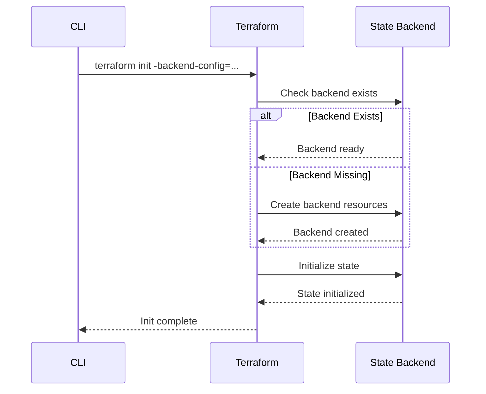
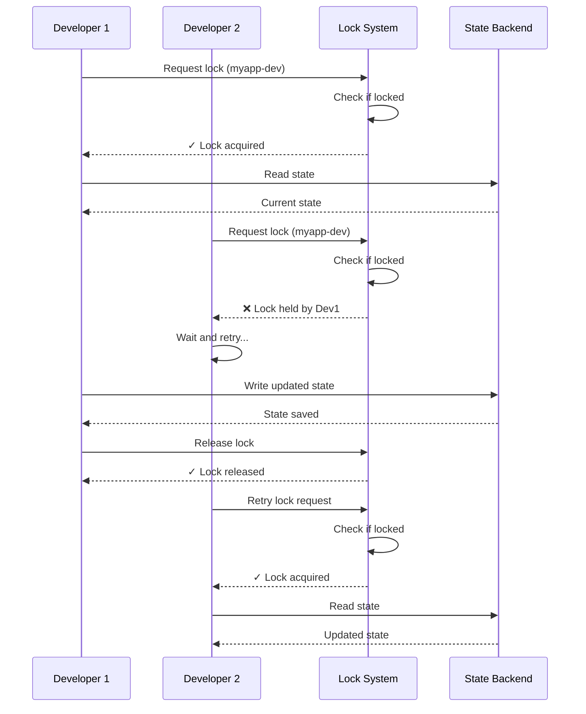

DevPlatform CLI uses Terraform state to track infrastructure resources and coordinate changes across team members. Understanding state management is crucial for reliable, collaborative infrastructure operations.

## Overview

Terraform state is a JSON file that maps your configuration to real-world resources. The CLI stores state remotely in cloud storage with locking to enable team collaboration and prevent conflicts.

<CardGroup cols={3}>
  <Card title="Remote State" icon="cloud" href="#remote-state-backends">
    Store state in S3 or Azure Storage
  </Card>
  <Card title="State Locking" icon="lock" href="#state-locking">
    Prevent concurrent modifications
  </Card>
  <Card title="State Operations" icon="gears" href="#state-operations">
    Inspect and manipulate state
  </Card>
</CardGroup>

## What is Terraform State?

Terraform state is a record of all resources managed by Terraform, including:

- Resource IDs and attributes
- Resource dependencies
- Metadata (timestamps, versions)
- Outputs

### State File Structure

```json
{
  "version": 4,
  "terraform_version": "1.5.0",
  "serial": 42,
  "lineage": "abc123-def456-ghi789",
  "outputs": {
    "database_endpoint": {
      "value": "myapp-dev.abc123.us-east-1.rds.amazonaws.com",
      "type": "string"
    }
  },
  "resources": [
    {
      "mode": "managed",
      "type": "aws_vpc",
      "name": "main",
      "provider": "provider[\"registry.terraform.io/hashicorp/aws\"]",
      "instances": [
        {
          "schema_version": 1,
          "attributes": {
            "id": "vpc-abc123",
            "cidr_block": "10.0.0.0/16",
            "tags": {
              "Name": "myapp-dev",
              "Environment": "dev"
            }
          }
        }
      ]
    }
  ]
}
```

<Note>
The state file contains sensitive information like database passwords and API keys. Always store it securely and never commit it to version control.
</Note>

## Remote State Backends

DevPlatform CLI configures remote state backends automatically based on your cloud provider.

### Backend Configuration

<Tabs>
  <Tab title="AWS (S3 + DynamoDB)">
    
**S3 Backend for State Storage:**

```hcl
terraform {
  backend "s3" {
    bucket         = "devplatform-terraform-state"
    key            = "myapp-dev/terraform.tfstate"
    region         = "us-east-1"
    encrypt        = true
    kms_key_id     = "arn:aws:kms:us-east-1:123456789012:key/abc123"
    dynamodb_table = "devplatform-state-lock"
  }
}
```

**Configuration Details:**

| Setting | Value | Purpose |
|---------|-------|---------|
| `bucket` | `devplatform-terraform-state` | S3 bucket for state files |
| `key` | `{app}-{env}/terraform.tfstate` | Unique path per environment |
| `region` | User-specified or `us-east-1` | AWS region |
| `encrypt` | `true` | Server-side encryption (AES-256) |
| `kms_key_id` | KMS key ARN | Customer-managed encryption key |
| `dynamodb_table` | `devplatform-state-lock` | Lock table for concurrency control |

**S3 Bucket Configuration:**

```bash
# Bucket versioning enabled
aws s3api get-bucket-versioning --bucket devplatform-terraform-state
{
  "Status": "Enabled"
}

# Encryption enabled
aws s3api get-bucket-encryption --bucket devplatform-terraform-state
{
  "ServerSideEncryptionConfiguration": {
    "Rules": [{
      "ApplyServerSideEncryptionByDefault": {
        "SSEAlgorithm": "aws:kms",
        "KMSMasterKeyID": "arn:aws:kms:us-east-1:123456789012:key/abc123"
      }
    }]
  }
}

# Lifecycle policy for old versions
aws s3api get-bucket-lifecycle-configuration --bucket devplatform-terraform-state
{
  "Rules": [{
    "Id": "DeleteOldVersions",
    "Status": "Enabled",
    "NoncurrentVersionExpiration": {
      "NoncurrentDays": 90
    }
  }]
}
```

**DynamoDB Lock Table:**

```bash
# Table schema
aws dynamodb describe-table --table-name devplatform-state-lock
{
  "Table": {
    "TableName": "devplatform-state-lock",
    "KeySchema": [
      {
        "AttributeName": "LockID",
        "KeyType": "HASH"
      }
    ],
    "AttributeDefinitions": [
      {
        "AttributeName": "LockID",
        "AttributeType": "S"
      }
    ],
    "BillingMode": "PAY_PER_REQUEST"
  }
}
```

  </Tab>
  <Tab title="Azure (Storage + Lease)">
    
**Azure Storage Backend:**

```hcl
terraform {
  backend "azurerm" {
    resource_group_name  = "devplatform-state-rg"
    storage_account_name = "devplatformtfstate"
    container_name       = "tfstate"
    key                  = "myapp-dev.tfstate"
    use_azuread_auth     = true
  }
}
```

**Configuration Details:**

| Setting | Value | Purpose |
|---------|-------|---------|
| `resource_group_name` | `devplatform-state-rg` | Resource group for state storage |
| `storage_account_name` | `devplatformtfstate` | Storage account name |
| `container_name` | `tfstate` | Blob container for state files |
| `key` | `{app}-{env}.tfstate` | Unique blob name per environment |
| `use_azuread_auth` | `true` | Use Azure AD authentication |

**Storage Account Configuration:**

```bash
# Check storage account properties
az storage account show \
  --name devplatformtfstate \
  --resource-group devplatform-state-rg

# Encryption enabled by default
{
  "encryption": {
    "services": {
      "blob": {
        "enabled": true,
        "keyType": "Account"
      }
    },
    "keySource": "Microsoft.Storage"
  }
}

# Blob versioning enabled
az storage account blob-service-properties show \
  --account-name devplatformtfstate \
  --resource-group devplatform-state-rg

{
  "isVersioningEnabled": true,
  "deleteRetentionPolicy": {
    "enabled": true,
    "days": 90
  }
}
```

**Blob Lease for Locking:**

Azure uses blob leases for state locking:

```bash
# Lease properties
Lease Duration: 60 seconds (auto-renewed)
Lease State: Available | Leased | Expired | Breaking | Broken
Lease ID: UUID (e.g., abc123-def456-ghi789)

# When locked, lease state is "Leased"
# Other operations must wait until lease expires or is released
```

  </Tab>
</Tabs>

### Backend Initialization

The CLI automatically initializes the backend during the first `create` operation:



## State Locking

State locking prevents multiple users from modifying infrastructure simultaneously, which could cause corruption or conflicts.

### How Locking Works



### Lock Information

When a lock is held, Terraform stores metadata about the lock:

<Tabs>
  <Tab title="AWS (DynamoDB)">
```json
{
  "LockID": "devplatform-terraform-state/myapp-dev/terraform.tfstate",
  "Info": {
    "ID": "abc123-def456-ghi789",
    "Operation": "OperationTypeApply",
    "Who": "john@example.com",
    "Version": "1.5.0",
    "Created": "2024-01-15T10:30:45Z",
    "Path": "devplatform-terraform-state/myapp-dev/terraform.tfstate"
  },
  "Digest": "sha256:abc123..."
}
```
  </Tab>
  <Tab title="Azure (Blob Lease)">
```json
{
  "LeaseID": "abc123-def456-ghi789",
  "LeaseState": "Leased",
  "LeaseDuration": "60",
  "Metadata": {
    "terraform_lock_id": "abc123-def456-ghi789",
    "terraform_operation": "apply",
    "terraform_who": "john@example.com",
    "terraform_version": "1.5.0",
    "terraform_created": "2024-01-15T10:30:45Z"
  }
}
```
  </Tab>
</Tabs>

### Lock Timeout & Retry

The CLI implements automatic retry with exponential backoff:

```bash
# Lock acquisition attempt
Attempting to acquire state lock...

# If locked by another user
State lock held by: john@example.com
Lock ID: abc123-def456-ghi789
Operation: terraform apply
Created: 2024-01-15 10:30:45 UTC

Waiting for lock to be released...
Retry 1/10 in 5 seconds...
Retry 2/10 in 10 seconds...
Retry 3/10 in 20 seconds...
```

**Retry Configuration:**

| Parameter | Value |
|-----------|-------|
| Max retries | 10 |
| Initial delay | 5 seconds |
| Max delay | 60 seconds |
| Backoff strategy | Exponential |
| Total timeout | ~10 minutes |

### Force Unlock

If a lock becomes stale (e.g., process crashed), you can force-release it:

<Warning>
Only force-unlock if you're certain no other operation is running. Force-unlocking during an active operation can cause state corruption.
</Warning>

```bash
# Get lock ID from error message
terraform force-unlock abc123-def456-ghi789

# Confirm force unlock
Do you really want to force-unlock?
  Terraform will remove the lock on the remote state.
  This will allow local Terraform commands to modify this state, even though it
  may still be in use. Only 'yes' will be accepted to confirm.

  Enter a value: yes

Terraform state has been successfully unlocked!
```

## State Operations

The CLI provides commands to inspect and manipulate state.

### Viewing State

<Tabs>
  <Tab title="List Resources">
```bash
# List all resources in state
terraform state list

# Example output
aws_vpc.main
aws_subnet.public[0]
aws_subnet.public[1]
aws_subnet.private[0]
aws_subnet.private[1]
aws_security_group.app
aws_db_instance.main
kubernetes_namespace.app
```
  </Tab>
  <Tab title="Show Resource Details">
```bash
# Show details for a specific resource
terraform state show aws_db_instance.main

# Example output
resource "aws_db_instance" "main" {
    id                     = "myapp-dev"
    allocated_storage      = 100
    engine                 = "postgres"
    engine_version         = "15.3"
    instance_class         = "db.t3.medium"
    db_name                = "myapp"
    username               = "admin"
    endpoint               = "myapp-dev.abc123.us-east-1.rds.amazonaws.com:5432"
    status                 = "available"
    multi_az               = false
    publicly_accessible    = false
    storage_encrypted      = true
    kms_key_id             = "arn:aws:kms:us-east-1:123456789012:key/abc123"
    backup_retention_period = 7
    backup_window          = "03:00-04:00"
    maintenance_window     = "sun:04:00-sun:05:00"
}
```
  </Tab>
  <Tab title="View Outputs">
```bash
# View all outputs
terraform output

# Example output
database_endpoint = "myapp-dev.abc123.us-east-1.rds.amazonaws.com"
database_name = "myapp"
database_port = 5432
namespace_name = "myapp-dev"
network_id = "vpc-abc123"

# View specific output
terraform output database_endpoint
"myapp-dev.abc123.us-east-1.rds.amazonaws.com"

# JSON format
terraform output -json
{
  "database_endpoint": {
    "sensitive": false,
    "type": "string",
    "value": "myapp-dev.abc123.us-east-1.rds.amazonaws.com"
  }
}
```
  </Tab>
</Tabs>

### State Manipulation

<Warning>
State manipulation commands should be used with caution. Always backup state before making changes.
</Warning>

<AccordionGroup>
  <Accordion title="Remove Resource from State">
    
Remove a resource from state without destroying it:

```bash
# Remove resource from state
terraform state rm aws_security_group.app

# Resource still exists in cloud, but Terraform no longer manages it
# Useful for:
# - Importing resources into different state
# - Transferring resource management to another tool
# - Removing resources that were manually deleted
```

  </Accordion>

  <Accordion title="Move Resource in State">
    
Rename a resource in state:

```bash
# Rename resource
terraform state mv aws_db_instance.main aws_db_instance.database

# Move resource to module
terraform state mv aws_vpc.main module.network.aws_vpc.main

# Useful for:
# - Refactoring Terraform configuration
# - Reorganizing modules
# - Renaming resources without recreating them
```

  </Accordion>

  <Accordion title="Import Existing Resource">
    
Import an existing cloud resource into state:

```bash
# Import VPC
terraform import aws_vpc.main vpc-abc123

# Import RDS instance
terraform import aws_db_instance.main myapp-dev

# Import Kubernetes namespace
terraform import kubernetes_namespace.app myapp-dev

# After import, update configuration to match imported resource
# Then run terraform plan to verify no changes needed
```

  </Accordion>

  <Accordion title="Pull/Push State">
    
Download or upload state manually:

```bash
# Pull state to local file
terraform state pull > terraform.tfstate.backup

# Push state from local file (dangerous!)
terraform state push terraform.tfstate.backup

# Useful for:
# - Creating backups before risky operations
# - Recovering from state corruption
# - Migrating state between backends
```

  </Accordion>
</AccordionGroup>

## State Versioning & History

Both S3 and Azure Storage support versioning, allowing you to recover previous state versions.

### State Version History

<Tabs>
  <Tab title="AWS S3 Versions">
```bash
# List all versions of state file
aws s3api list-object-versions \
  --bucket devplatform-terraform-state \
  --prefix myapp-dev/terraform.tfstate

# Example output
{
  "Versions": [
    {
      "Key": "myapp-dev/terraform.tfstate",
      "VersionId": "abc123",
      "IsLatest": true,
      "LastModified": "2024-01-15T10:35:45Z",
      "Size": 45678
    },
    {
      "Key": "myapp-dev/terraform.tfstate",
      "VersionId": "def456",
      "IsLatest": false,
      "LastModified": "2024-01-15T09:20:30Z",
      "Size": 42345
    }
  ]
}

# Download specific version
aws s3api get-object \
  --bucket devplatform-terraform-state \
  --key myapp-dev/terraform.tfstate \
  --version-id def456 \
  terraform.tfstate.old
```
  </Tab>
  <Tab title="Azure Blob Versions">
```bash
# List blob versions
az storage blob list \
  --account-name devplatformtfstate \
  --container-name tfstate \
  --prefix myapp-dev.tfstate \
  --include v

# Example output
[
  {
    "name": "myapp-dev.tfstate",
    "versionId": "2024-01-15T10:35:45.1234567Z",
    "isCurrentVersion": true,
    "lastModified": "2024-01-15T10:35:45+00:00",
    "contentLength": 45678
  },
  {
    "name": "myapp-dev.tfstate",
    "versionId": "2024-01-15T09:20:30.9876543Z",
    "isCurrentVersion": false,
    "lastModified": "2024-01-15T09:20:30+00:00",
    "contentLength": 42345
  }
]

# Download specific version
az storage blob download \
  --account-name devplatformtfstate \
  --container-name tfstate \
  --name myapp-dev.tfstate \
  --version-id "2024-01-15T09:20:30.9876543Z" \
  --file terraform.tfstate.old
```
  </Tab>
</Tabs>

### Recovering from State Corruption

If state becomes corrupted, you can restore from a previous version:

<Steps>
  <Step title="Identify Good Version">
    List versions and identify the last known good state:
    
```bash
# AWS
aws s3api list-object-versions \
  --bucket devplatform-terraform-state \
  --prefix myapp-dev/terraform.tfstate

# Azure
az storage blob list \
  --account-name devplatformtfstate \
  --container-name tfstate \
  --prefix myapp-dev.tfstate \
  --include v
```
  </Step>

  <Step title="Download Good Version">
    Download the good version to a local file:
    
```bash
# AWS
aws s3api get-object \
  --bucket devplatform-terraform-state \
  --key myapp-dev/terraform.tfstate \
  --version-id <good-version-id> \
  terraform.tfstate.good

# Azure
az storage blob download \
  --account-name devplatformtfstate \
  --container-name tfstate \
  --name myapp-dev.tfstate \
  --version-id "<good-version-id>" \
  --file terraform.tfstate.good
```
  </Step>

  <Step title="Verify State">
    Verify the downloaded state is valid:
    
```bash
# Check JSON syntax
cat terraform.tfstate.good | jq .

# Verify version and lineage
cat terraform.tfstate.good | jq '{version, terraform_version, lineage}'
```
  </Step>

  <Step title="Restore State">
    Push the good state back to the backend:
    
```bash
# Initialize Terraform with backend config
terraform init

# Push good state
terraform state push terraform.tfstate.good

# Verify restoration
terraform plan
# Should show no changes if state matches reality
```
  </Step>
</Steps>

## State Security

State files contain sensitive information and must be protected.

### Security Best Practices

<CardGroup cols={2}>
  <Card title="Encryption at Rest" icon="lock">
    Always enable encryption for state storage (S3 KMS or Azure Storage encryption)
  </Card>
  <Card title="Encryption in Transit" icon="shield">
    Use HTTPS/TLS for all state backend communication
  </Card>
  <Card title="Access Control" icon="user-lock">
    Restrict state backend access using IAM policies or Azure RBAC
  </Card>
  <Card title="Audit Logging" icon="file-lines">
    Enable CloudTrail (AWS) or Activity Log (Azure) for state access auditing
  </Card>
</CardGroup>

### Access Control Examples

<Tabs>
  <Tab title="AWS IAM Policy">
```json
{
  "Version": "2012-10-17",
  "Statement": [
    {
      "Effect": "Allow",
      "Action": [
        "s3:GetObject",
        "s3:PutObject",
        "s3:DeleteObject"
      ],
      "Resource": "arn:aws:s3:::devplatform-terraform-state/*"
    },
    {
      "Effect": "Allow",
      "Action": [
        "s3:ListBucket"
      ],
      "Resource": "arn:aws:s3:::devplatform-terraform-state"
    },
    {
      "Effect": "Allow",
      "Action": [
        "dynamodb:GetItem",
        "dynamodb:PutItem",
        "dynamodb:DeleteItem"
      ],
      "Resource": "arn:aws:dynamodb:us-east-1:123456789012:table/devplatform-state-lock"
    },
    {
      "Effect": "Allow",
      "Action": [
        "kms:Decrypt",
        "kms:Encrypt",
        "kms:GenerateDataKey"
      ],
      "Resource": "arn:aws:kms:us-east-1:123456789012:key/abc123"
    }
  ]
}
```
  </Tab>
  <Tab title="Azure RBAC">
```bash
# Assign Storage Blob Data Contributor role
az role assignment create \
  --role "Storage Blob Data Contributor" \
  --assignee user@example.com \
  --scope /subscriptions/<subscription-id>/resourceGroups/devplatform-state-rg/providers/Microsoft.Storage/storageAccounts/devplatformtfstate

# Custom role for state management
az role definition create --role-definition '{
  "Name": "Terraform State Manager",
  "Description": "Can read and write Terraform state",
  "Actions": [
    "Microsoft.Storage/storageAccounts/blobServices/containers/blobs/read",
    "Microsoft.Storage/storageAccounts/blobServices/containers/blobs/write",
    "Microsoft.Storage/storageAccounts/blobServices/containers/blobs/delete",
    "Microsoft.Storage/storageAccounts/blobServices/containers/blobs/lease/action"
  ],
  "AssignableScopes": [
    "/subscriptions/<subscription-id>/resourceGroups/devplatform-state-rg"
  ]
}'
```
  </Tab>
</Tabs>

### Sensitive Data in State

<Warning>
State files may contain:
- Database passwords
- API keys and tokens
- Private keys
- Connection strings
- Other secrets

Never commit state files to version control or share them insecurely.
</Warning>

**Mitigation Strategies:**

1. **Use Secret Management Services:**
   - AWS Secrets Manager / Azure Key Vault for secrets
   - Reference secrets by ID in Terraform, not by value

2. **Mark Outputs as Sensitive:**
```hcl
output "database_password" {
  value     = aws_db_instance.main.password
  sensitive = true
}
```

3. **Restrict State Access:**
   - Limit IAM/RBAC permissions to only necessary users
   - Use separate state backends per environment
   - Enable audit logging for state access

## State Migration

When changing backends or reorganizing state, you may need to migrate state.

### Backend Migration Process

<Steps>
  <Step title="Backup Current State">
```bash
# Pull current state to local backup
terraform state pull > terraform.tfstate.backup

# Verify backup
cat terraform.tfstate.backup | jq .
```
  </Step>

  <Step title="Update Backend Configuration">
```hcl
# Old backend
terraform {
  backend "s3" {
    bucket = "old-bucket"
    key    = "terraform.tfstate"
    region = "us-east-1"
  }
}

# New backend
terraform {
  backend "s3" {
    bucket = "new-bucket"
    key    = "terraform.tfstate"
    region = "us-west-2"
  }
}
```
  </Step>

  <Step title="Reinitialize Terraform">
```bash
# Reinitialize with new backend
terraform init -migrate-state

# Terraform will prompt:
# Do you want to copy existing state to the new backend?
#   Enter a value: yes

# State will be copied to new backend
```
  </Step>

  <Step title="Verify Migration">
```bash
# Verify state in new backend
terraform state list

# Run plan to ensure no changes
terraform plan
# Should show: No changes. Your infrastructure matches the configuration.
```
  </Step>
</Steps>

## Troubleshooting State Issues

<AccordionGroup>
  <Accordion title="State Lock Timeout">
    
**Problem:** Lock acquisition times out after 10 minutes.

**Solutions:**
1. Wait for the other operation to complete
2. Check if the lock is stale (process crashed)
3. Force-unlock if certain no operation is running:
```bash
terraform force-unlock <lock-id>
```

  </Accordion>

  <Accordion title="State Drift">
    
**Problem:** State doesn't match actual infrastructure (manual changes made).

**Solutions:**
1. Run `terraform plan` to see drift
2. Import manually created resources:
```bash
terraform import <resource_type>.<name> <resource_id>
```
3. Remove manually deleted resources:
```bash
terraform state rm <resource_type>.<name>
```
4. Refresh state to sync with reality:
```bash
terraform refresh
```

  </Accordion>

  <Accordion title="State Corruption">
    
**Problem:** State file is corrupted or invalid JSON.

**Solutions:**
1. Restore from version history (see [Recovering from State Corruption](#recovering-from-state-corruption))
2. If no good version exists, rebuild state:
```bash
# Import all resources one by one
terraform import aws_vpc.main vpc-abc123
terraform import aws_subnet.public[0] subnet-abc123
# ... etc
```

  </Accordion>

  <Accordion title="Backend Access Denied">
    
**Problem:** Cannot read or write state due to permission errors.

**Solutions:**
1. Verify cloud credentials are valid:
```bash
# AWS
aws sts get-caller-identity

# Azure
az account show
```
2. Check IAM/RBAC permissions for state backend
3. Verify KMS key permissions (AWS) or storage account access (Azure)

  </Accordion>
</AccordionGroup>

## Best Practices

<CardGroup cols={2}>
  <Card title="Use Remote State" icon="cloud">
    Always use remote state backends (S3/Azure Storage) for team collaboration
  </Card>
  <Card title="Enable Versioning" icon="clock-rotate-left">
    Enable versioning on state storage for easy recovery
  </Card>
  <Card title="Separate State Per Environment" icon="layer-group">
    Use different state files for dev, staging, and prod
  </Card>
  <Card title="Backup Before Changes" icon="floppy-disk">
    Pull state backup before risky operations
  </Card>
  <Card title="Restrict Access" icon="user-lock">
    Limit state backend access to authorized users only
  </Card>
  <Card title="Enable Encryption" icon="lock">
    Always encrypt state at rest and in transit
  </Card>
  <Card title="Monitor State Access" icon="eye">
    Enable audit logging for state backend operations
  </Card>
  <Card title="Never Commit State" icon="ban">
    Never commit state files to version control
  </Card>
</CardGroup>

## Related Resources

<CardGroup cols={2}>
  <Card title="Architecture" icon="sitemap" href="/concepts/architecture">
    Understand the system architecture
  </Card>
  <Card title="Workflows" icon="diagram-project" href="/concepts/workflows">
    Learn about operational workflows
  </Card>
  <Card title="Security" icon="shield" href="/security/overview">
    Security best practices
  </Card>
  <Card title="Troubleshooting" icon="wrench" href="/guides/troubleshooting">
    Common issues and solutions
  </Card>
</CardGroup>

