DevPlatform CLI orchestrates complex multi-step workflows that coordinate Terraform infrastructure provisioning, Helm application deployment, and Kubernetes resource management. This page details the complete operational workflows for each command.

## Overview

Each CLI command follows a structured workflow that ensures reliable, repeatable operations across both AWS and Azure cloud providers. The workflows include:

- Input validation and credential verification
- Infrastructure provisioning with Terraform
- Application deployment with Helm
- Health checks and verification
- Rollback handling on failures

<CardGroup cols={3}>
  <Card title="Create Workflow" icon="plus" href="#create-command-workflow">
    Provision infrastructure and deploy applications
  </Card>
  <Card title="Status Workflow" icon="chart-line" href="#status-command-workflow">
    Monitor environment health and resources
  </Card>
  <Card title="Destroy Workflow" icon="trash" href="#destroy-command-workflow">
    Clean up resources and calculate savings
  </Card>
</CardGroup>

## Create Command Workflow

The create command orchestrates the complete provisioning and deployment process, from validating inputs to deploying your application on Kubernetes.

### High-Level Flow

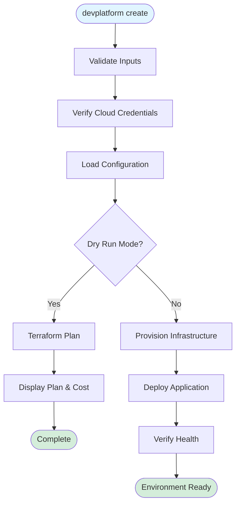

### Detailed Create Flow

<AccordionGroup>
  <Accordion title="Phase 1: Validation & Configuration">
    
The CLI first validates all inputs and loads configuration:

1. **Parse Command Arguments** - Extract flags like `--app`, `--env`, `--provider`
2. **Validate App Name** - Ensure alphanumeric format (3-32 characters)
3. **Validate Environment** - Check env type is `dev`, `staging`, or `prod`
4. **Select Cloud Provider** - Default to AWS, or use `--provider azure`
5. **Verify Credentials** - Check AWS/Azure authentication
6. **Load Configuration** - Read `.devplatform.yaml` if present
7. **Merge Configuration** - CLI flags override config file values

<Tabs>
  <Tab title="AWS">
```bash
# AWS credential check
aws sts get-caller-identity

# If successful, proceed with AWS provider
devplatform create --app myapp --env dev --provider aws
```
  </Tab>
  <Tab title="Azure">
```bash
# Azure credential check
az account show

# If successful, proceed with Azure provider
devplatform create --app myapp --env dev --provider azure
```
  </Tab>
</Tabs>

  </Accordion>

  <Accordion title="Phase 2: Terraform Infrastructure Provisioning">
    
Terraform provisions all cloud infrastructure:

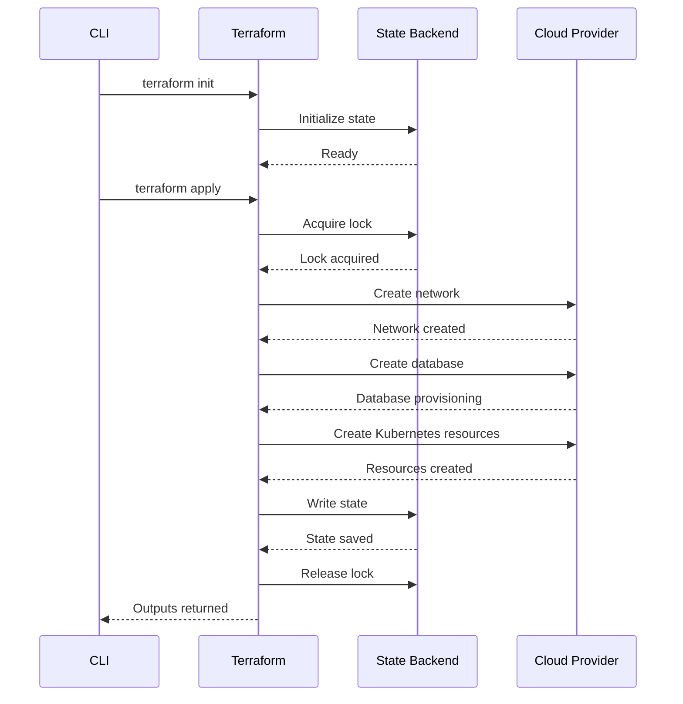

**Resources Created:**

<Tabs>
  <Tab title="AWS">
- VPC with public/private subnets
- RDS PostgreSQL instance
- Security groups
- EKS namespace and RBAC
- S3 bucket for state (if needed)

</Tab>
  <Tab title="Azure">
- VNet with subnets
- Azure Database for PostgreSQL
- Network Security Groups (NSGs)
- AKS namespace and RBAC
- Azure Storage for state (if needed)

</Tab>
</Tabs>

**Terraform Outputs:**
- Database endpoint
- Network ID
- Namespace name
- Kubeconfig details

</Accordion>

  <Accordion title="Phase 3: Helm Application Deployment">
    
Helm deploys your application to Kubernetes:

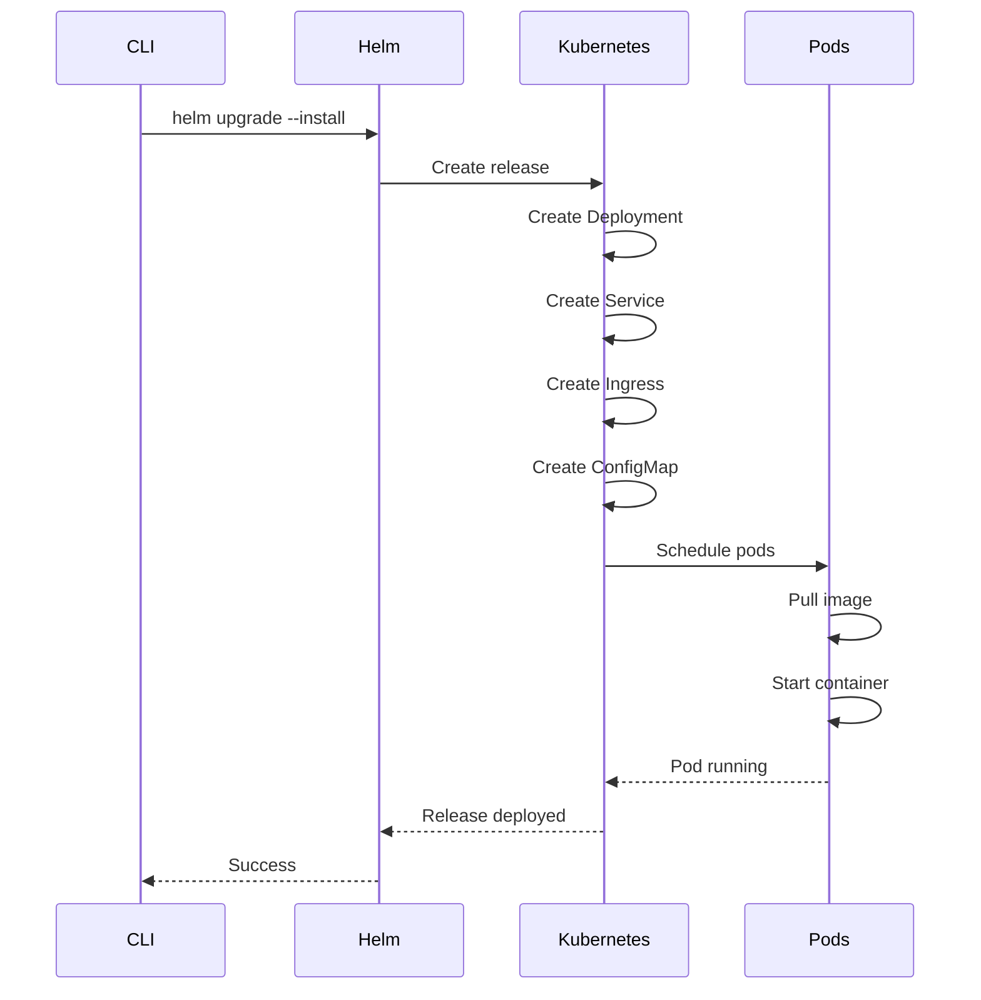

**Kubernetes Resources Created:**
- Deployment (with replicas based on environment)
- Service (ClusterIP)
- Ingress (with TLS if configured)
- ConfigMap (with database connection details)
- ServiceAccount (with IRSA/Workload Identity)

</Accordion>

  <Accordion title="Phase 4: Verification & Health Checks">
    
The CLI verifies the deployment is healthy:

1. **Check Pod Status** - Ensure all pods are running
2. **Wait for Ready State** - Pods pass readiness probes
3. **Verify Ingress** - Ingress controller assigns URL
4. **Test Database Connection** - Validate connectivity
5. **Display Outputs** - Show access information

```bash
# Example success output
✓ Infrastructure provisioned successfully
✓ Application deployed to namespace: myapp-dev
✓ 3/3 pods running and ready
✓ Database: myapp-dev.abc123.us-east-1.rds.amazonaws.com
✓ Ingress URL: https://myapp-dev.example.com

Next steps:
  1. Update kubeconfig: aws eks update-kubeconfig --name my-cluster
  2. View pods: kubectl get pods -n myapp-dev
  3. View logs: kubectl logs -n myapp-dev -l app=myapp
```

  </Accordion>

  <Accordion title="Error Handling & Rollback">
    
If any step fails, the CLI automatically rolls back:

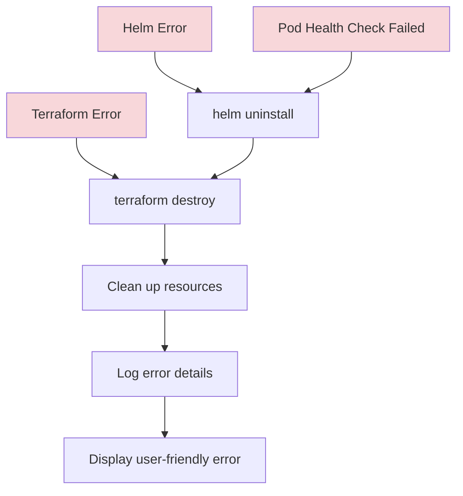

**Rollback Scenarios:**

| Failure Point | Rollback Action | Resources Cleaned |
|---------------|-----------------|-------------------|
| Terraform apply fails | `terraform destroy` | All cloud resources |
| Helm install fails | `helm uninstall` + `terraform destroy` | K8s resources + cloud resources |
| Pods fail to start | `helm uninstall` + `terraform destroy` | K8s resources + cloud resources |
| Health check timeout | `helm uninstall` + `terraform destroy` | K8s resources + cloud resources |

  </Accordion>
</AccordionGroup>

### Dry Run Mode

Use `--dry-run` to preview changes without applying them:

```bash
devplatform create --app myapp --env dev --dry-run
```

**Dry Run Output:**
- Terraform plan showing resources to be created
- Estimated monthly cost
- No actual resources provisioned

## Status Command Workflow

The status command provides real-time visibility into your environment's health and resource status.

### Status Check Flow

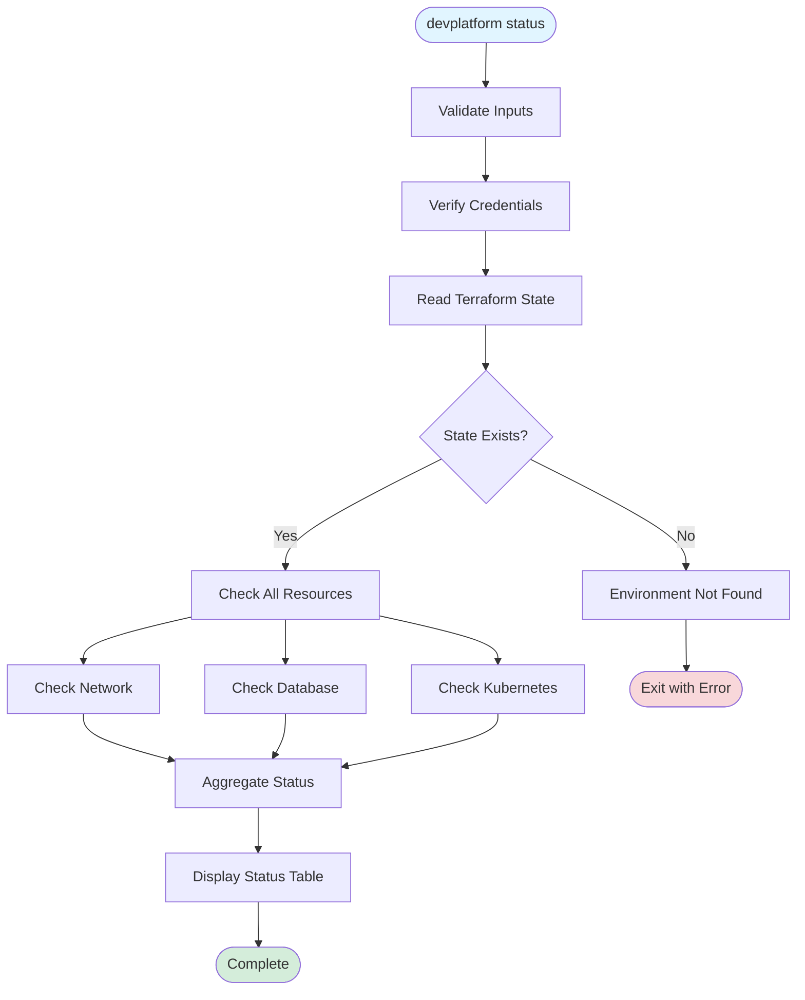

### Resource Status Checks

<Tabs>
  <Tab title="Infrastructure Status">
    
**Network Status:**
- VPC/VNet existence and state
- Subnet configuration
- Security group/NSG rules
- Internet gateway/NAT gateway

**Database Status:**
- Instance state (available, backing-up, etc.)
- Endpoint accessibility
- Storage utilization
- Backup status

```bash
# Example status output
Environment: myapp-dev (AWS)
Status: Healthy

Infrastructure:
  Network (VPC):     ✓ vpc-abc123 (Active)
  Database (RDS):    ✓ myapp-dev.abc123.us-east-1.rds.amazonaws.com (Available)
  Storage Used:      15.2 GB / 100 GB
```

  </Tab>
  <Tab title="Kubernetes Status">
    
**Namespace Status:**
- Namespace existence
- Resource quotas
- RBAC configuration

**Pod Status:**
- Running pods vs desired replicas
- Pod health (readiness/liveness probes)
- Container restart counts
- Resource usage (CPU/memory)

**Ingress Status:**
- Ingress controller status
- Assigned URL
- TLS certificate status
- Backend service health

```bash
Kubernetes:
  Namespace:         ✓ myapp-dev
  Pods:              ✓ 3/3 running
  Ingress:           ✓ https://myapp-dev.example.com
  Certificate:       ✓ Valid (expires in 89 days)

Pod Details:
  myapp-dev-7d9f8-abc12   Running   0 restarts   CPU: 45m   Memory: 128Mi
  myapp-dev-7d9f8-def34   Running   0 restarts   CPU: 52m   Memory: 142Mi
  myapp-dev-7d9f8-ghi56   Running   0 restarts   CPU: 48m   Memory: 135Mi
```

  </Tab>
</Tabs>

### Status Check Sequence

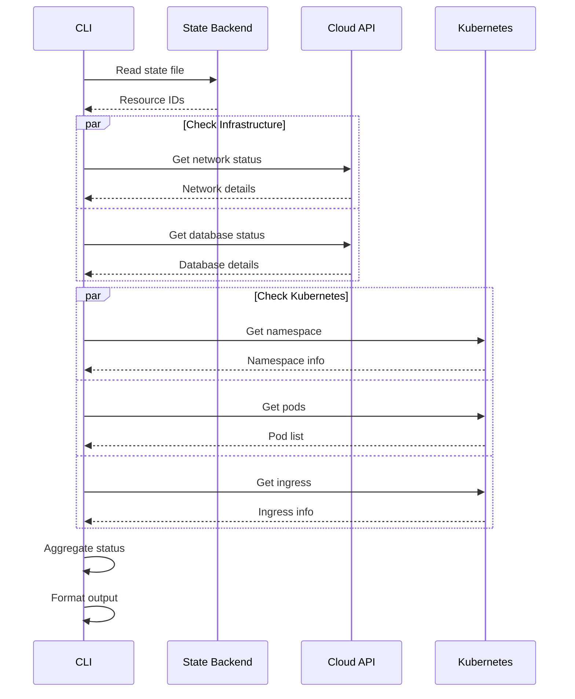

## Destroy Command Workflow

The destroy command safely tears down all resources in the correct order, with confirmation prompts and cost savings calculations.

### Destroy Flow

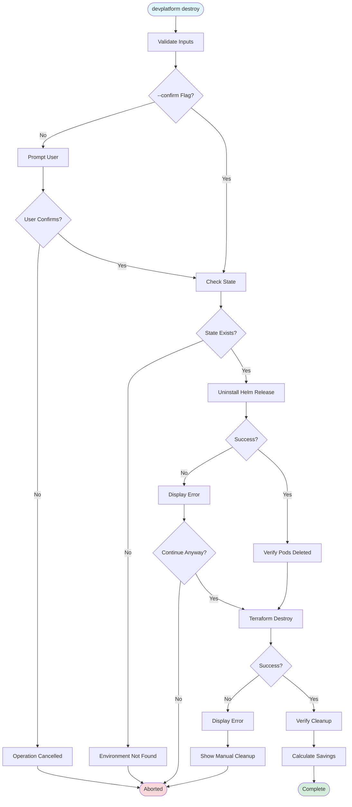

### Destruction Sequence

<Steps>
  <Step title="Confirmation">
    Prompt user to confirm destruction (unless `--confirm` flag is used):
    
```bash
⚠️  WARNING: This will destroy the following resources:
    
    Environment: myapp-dev (AWS)
    - VPC: vpc-abc123
    - RDS Instance: myapp-dev
    - Kubernetes Namespace: myapp-dev
    - All pods and services in namespace
    
    Estimated monthly savings: $245.00
    
    Type 'myapp-dev' to confirm: _
```
  </Step>

  <Step title="Helm Uninstall">
    Remove Kubernetes resources first:
    
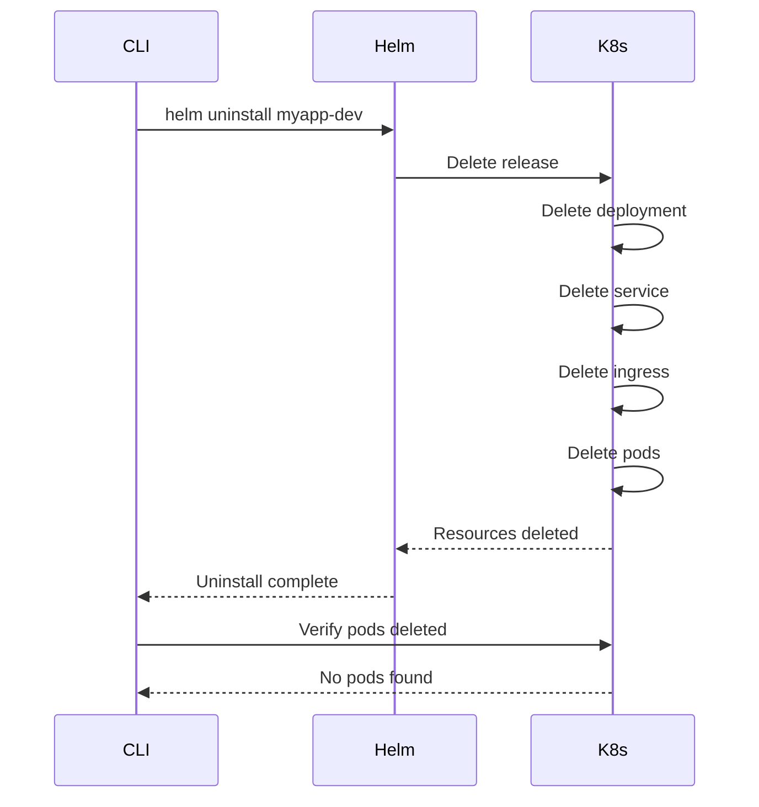

**Resources Deleted:**
- Deployment
- Pods
- Service
- Ingress
- ConfigMap
- ServiceAccount

</Step>

  <Step title="Terraform Destroy">
    Destroy cloud infrastructure:
    
<Tabs>
  <Tab title="AWS">
```bash
# Deletion order (managed by Terraform)
1. Kubernetes namespace
2. RDS instance (with final snapshot)
3. Security groups
4. Subnets
5. Internet gateway
6. VPC
```
  </Tab>
  <Tab title="Azure">
```bash
# Deletion order (managed by Terraform)
1. Kubernetes namespace
2. Azure Database (with backup)
3. Network Security Groups
4. Subnets
5. VNet
```
  </Tab>
</Tabs>

**State Management:**
- State lock acquired before destruction
- State file deleted after successful destroy
- Lock released after completion

</Step>

  <Step title="Verification & Reporting">
    Verify cleanup and report savings:
    
```bash
✓ Helm release uninstalled
✓ Kubernetes resources deleted
✓ Database instance deleted (final snapshot: myapp-dev-final-2024-01-15)
✓ Network resources deleted
✓ Terraform state cleaned up

Estimated monthly savings: $245.00

Resources destroyed:
  - 1 VPC
  - 1 RDS instance (db.t3.medium)
  - 3 subnets
  - 2 security groups
  - 1 Kubernetes namespace
  - 3 pods
```
  </Step>
</Steps>

### Error Handling

<Warning>
If Terraform destroy fails, manual cleanup may be required. The CLI provides detailed instructions for manual resource deletion.
</Warning>

```bash
# Example error with manual cleanup instructions
❌ Terraform destroy failed: Resource still in use

Manual cleanup required:
  1. Delete Kubernetes namespace manually:
     kubectl delete namespace myapp-dev --force --grace-period=0
     
  2. Delete RDS instance via AWS Console or CLI:
     aws rds delete-db-instance --db-instance-identifier myapp-dev --skip-final-snapshot
     
  3. Delete VPC after all resources are removed:
     aws ec2 delete-vpc --vpc-id vpc-abc123
     
  4. Clean up Terraform state:
     terraform state rm aws_vpc.main
```

## Configuration Loading Workflow

The CLI merges configuration from multiple sources with a clear precedence order.

### Configuration Sources

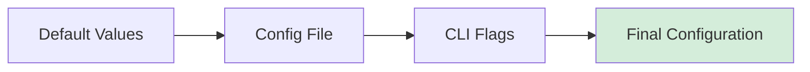

**Precedence Order (highest to lowest):**
1. CLI flags (highest priority)
2. `.devplatform.yaml` config file
3. Default values (lowest priority)

### Configuration File Loading

<Tabs>
  <Tab title="File Structure">
```yaml
# .devplatform.yaml
provider: aws  # or azure

aws:
  region: us-east-1
  vpc_cidr: 10.0.0.0/16
  database:
    instance_class: db.t3.medium
    allocated_storage: 100

azure:
  location: eastus
  vnet_cidr: 10.0.0.0/16
  database:
    sku_name: GP_Gen5_2
    storage_mb: 102400

kubernetes:
  replicas:
    dev: 2
    staging: 3
    prod: 5
```
  </Tab>
  <Tab title="Loading Process">
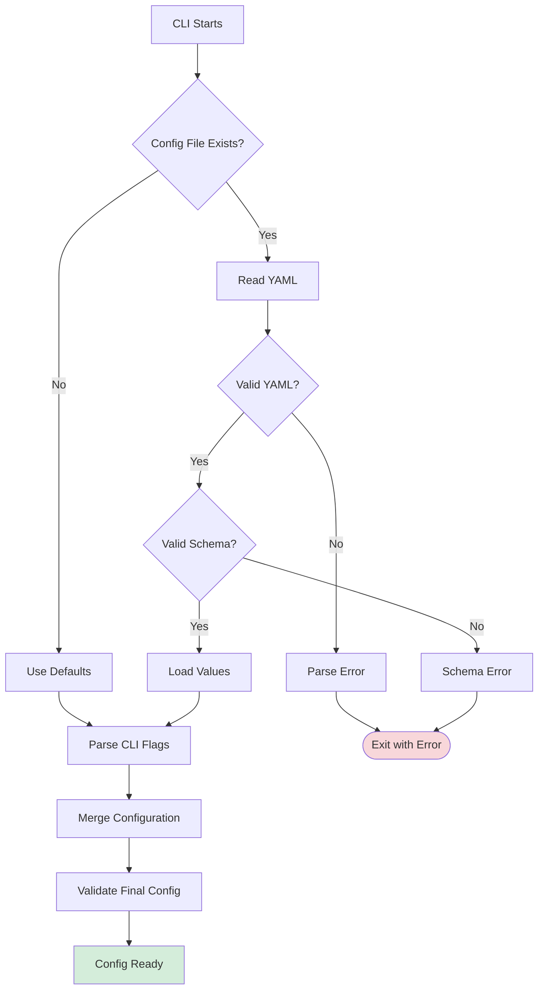
  </Tab>
</Tabs>

## Concurrent Execution & Locking

The CLI uses Terraform state locking to prevent concurrent modifications to the same environment.

### State Locking Mechanism

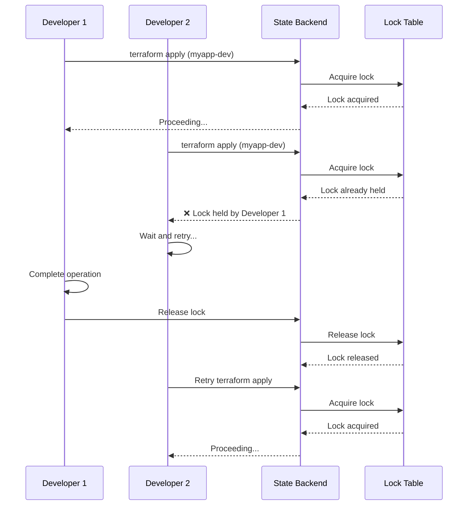

### Lock Behavior

<Tabs>
  <Tab title="AWS (DynamoDB)">
```bash
# Lock table configuration
Table: devplatform-state-lock
Partition Key: LockID
Attributes:
  - LockID: myapp-dev-terraform.tfstate
  - Info: User, timestamp, operation
  - Digest: State file hash

# Lock timeout: 10 minutes
# Retry interval: 5 seconds
```
  </Tab>
  <Tab title="Azure (Storage Lease)">
```bash
# Lease configuration
Container: tfstate
Blob: myapp-dev.tfstate
Lease Duration: 60 seconds (auto-renewed)
Lease ID: Generated UUID

# Lock timeout: 10 minutes
# Retry interval: 5 seconds
```
  </Tab>
</Tabs>

<Note>
If a lock is held for more than 10 minutes, it's considered stale and can be force-released using `terraform force-unlock`.
</Note>

## Error Handling & Retry Logic

The CLI implements comprehensive error handling with automatic retries for transient failures.

### Error Classification

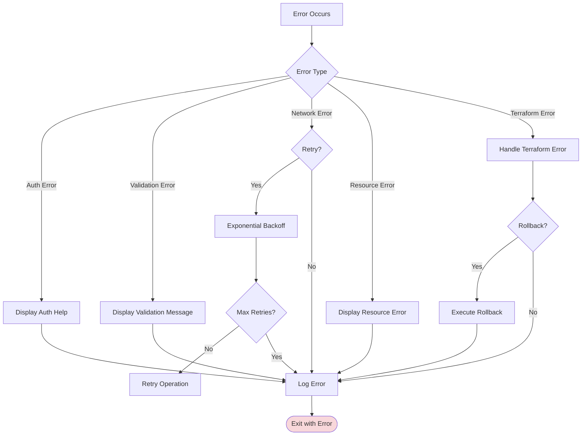

### Retry Strategy

| Error Type | Retry | Max Attempts | Backoff |
|------------|-------|--------------|---------|
| Network timeout | Yes | 3 | Exponential (2s, 4s, 8s) |
| Rate limiting | Yes | 5 | Exponential (1s, 2s, 4s, 8s, 16s) |
| Resource not ready | Yes | 10 | Linear (30s intervals) |
| Authentication | No | 1 | N/A |
| Validation | No | 1 | N/A |
| Resource conflict | No | 1 | N/A |

## Logging & Observability

The CLI provides detailed logging for troubleshooting and audit purposes.

### Log Levels

<Tabs>
  <Tab title="Log Levels">
```bash
# Set log level via environment variable
export DEVPLATFORM_LOG_LEVEL=debug

# Available levels:
# - debug: Detailed debugging information
# - info: General informational messages (default)
# - warn: Warning messages
# - error: Error messages only
```

**Log Output:**
```
2024-01-15T10:30:45Z [INFO] Starting create operation
2024-01-15T10:30:45Z [DEBUG] Parsed flags: app=myapp, env=dev, provider=aws
2024-01-15T10:30:46Z [INFO] AWS credentials validated
2024-01-15T10:30:46Z [DEBUG] Loading configuration from .devplatform.yaml
2024-01-15T10:30:47Z [INFO] Executing terraform init
2024-01-15T10:31:02Z [INFO] Terraform initialized successfully
2024-01-15T10:31:02Z [INFO] Executing terraform apply
2024-01-15T10:35:18Z [INFO] Infrastructure provisioned successfully
2024-01-15T10:35:18Z [DEBUG] Database endpoint: myapp-dev.abc123.us-east-1.rds.amazonaws.com
2024-01-15T10:35:19Z [INFO] Executing helm install
2024-01-15T10:35:45Z [INFO] Application deployed successfully
2024-01-15T10:35:45Z [INFO] Create operation completed in 5m 0s
```
  </Tab>
  <Tab title="Log Files">
```bash
# Log file location
~/.devplatform/logs/devplatform.log

# Log rotation
# - Max size: 100 MB
# - Max files: 5
# - Compression: gzip

# View recent logs
tail -f ~/.devplatform/logs/devplatform.log

# Search logs
grep "ERROR" ~/.devplatform/logs/devplatform.log

# View logs for specific operation
grep "myapp-dev" ~/.devplatform/logs/devplatform.log
```
  </Tab>
</Tabs>

## Best Practices

<CardGroup cols={2}>
  <Card title="Use Dry Run First" icon="eye">
    Always run with `--dry-run` to preview changes before applying them
  </Card>
  <Card title="Monitor Status Regularly" icon="chart-line">
    Use `status` command to monitor environment health and resource usage
  </Card>
  <Card title="Clean Up Unused Environments" icon="trash">
    Destroy dev/staging environments when not in use to save costs
  </Card>
  <Card title="Use Configuration Files" icon="file-code">
    Store common settings in `.devplatform.yaml` for consistency
  </Card>
</CardGroup>

## Related Resources

<CardGroup cols={2}>
  <Card title="Architecture" icon="sitemap" href="/concepts/architecture">
    Understand the system architecture
  </Card>
  <Card title="Multi-Cloud Support" icon="cloud" href="/concepts/multi-cloud">
    Learn about AWS and Azure support
  </Card>
  <Card title="Create Command" icon="plus" href="/api-reference/create">
    Detailed create command reference
  </Card>
  <Card title="Troubleshooting" icon="wrench" href="/guides/troubleshooting">
    Common issues and solutions
  </Card>
</CardGroup>

