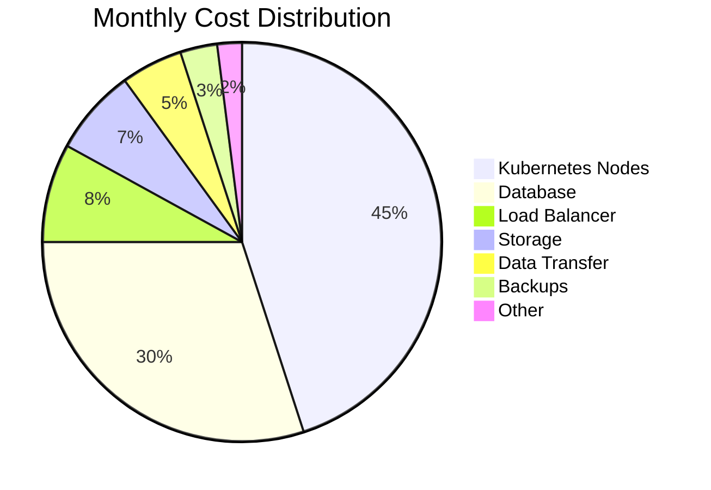

Learn strategies to optimize your cloud costs with DevPlatform CLI deployments.

## Cost Breakdown

Typical monthly costs for a production deployment:



## Quick Wins

<CardGroup cols={2}>
  <Card title="Right-Size Instances" icon="arrows-left-right">
    Match instance sizes to actual usage
    
    **Savings**: 30-50%
  </Card>
  <Card title="Use Spot/Preemptible" icon="tag">
    Use spot instances for non-critical workloads
    
    **Savings**: 60-90%
  </Card>
  <Card title="Auto-Scaling" icon="chart-line">
    Scale down during off-peak hours
    
    **Savings**: 20-40%
  </Card>
  <Card title="Reserved Instances" icon="calendar-check">
    Commit to 1-3 year terms for predictable workloads
    
    **Savings**: 30-70%
  </Card>
</CardGroup>

## Compute Optimization

<Tabs>
  <Tab title="Right-Sizing">
    ### Analyze Current Usage
    
    <Tabs>
      <Tab title="AWS">
        ```bash
        # Check node utilization
        kubectl top nodes
        
        # Check pod resource usage
        kubectl top pods --all-namespaces
        
        # Get Cost Explorer recommendations
        aws ce get-rightsizing-recommendation \
          --service AmazonEC2 \
          --configuration '{"RecommendationTarget":"SAME_INSTANCE_FAMILY"}'
        ```
      </Tab>
      <Tab title="Azure">
        ```bash
        # Check node utilization
        kubectl top nodes
        
        # Check pod resource usage
        kubectl top pods --all-namespaces
        
        # Get Azure Advisor recommendations
        az advisor recommendation list \
          --category Cost \
          --query "[?contains(impactedValue, 'VirtualMachines')]"
        ```
      </Tab>
    </Tabs>
    
    ### Optimize Instance Types
    
    ```yaml
    # Before: Over-provisioned
    kubernetes:
      node_instance_type: t3.2xlarge  # 8 vCPU, 32GB RAM
      node_count: 5
    # Monthly cost: ~$600
    
    # After: Right-sized
    kubernetes:
      node_instance_type: t3.large    # 2 vCPU, 8GB RAM
      node_count: 5
    # Monthly cost: ~$300
    # Savings: $300/month (50%)
    ```
  </Tab>
  
  <Tab title="Spot Instances">
    ### Use Spot/Preemptible Nodes
    
    <Tabs>
      <Tab title="AWS">
        ```yaml
        # Mixed node groups
        kubernetes:
          node_groups:
            - name: on-demand
              instance_type: t3.medium
              desired_size: 2
              min_size: 2
              max_size: 3
              capacity_type: ON_DEMAND
            
            - name: spot
              instance_type: t3.medium
              desired_size: 3
              min_size: 0
              max_size: 10
              capacity_type: SPOT
              spot_max_price: "0.05"  # Max price per hour
        ```
        
        **Best for**:
        - Batch processing
        - CI/CD workloads
        - Development environments
        - Stateless applications
        
        **Savings**: 60-90% vs on-demand
      </Tab>
      <Tab title="Azure">
        ```yaml
        # Mixed node pools
        kubernetes:
          node_pools:
            - name: system
              vm_size: Standard_D2s_v3
              node_count: 2
              priority: Regular
            
            - name: spot
              vm_size: Standard_D2s_v3
              node_count: 3
              priority: Spot
              spot_max_price: 0.05  # Max price per hour
              eviction_policy: Delete
        ```
        
        **Best for**:
        - Batch processing
        - CI/CD workloads
        - Development environments
        - Stateless applications
        
        **Savings**: 60-90% vs regular
      </Tab>
    </Tabs>
    
    ### Handle Spot Interruptions
    
    ```yaml
    # Pod Disruption Budget
    apiVersion: policy/v1
    kind: PodDisruptionBudget
    metadata:
      name: my-app-pdb
    spec:
      minAvailable: 1
      selector:
        matchLabels:
          app: my-app
    ---
    # Node affinity for critical pods
    apiVersion: apps/v1
    kind: Deployment
    metadata:
      name: my-app-critical
    spec:
      template:
        spec:
          affinity:
            nodeAffinity:
              requiredDuringSchedulingIgnoredDuringExecution:
                nodeSelectorTerms:
                - matchExpressions:
                  - key: capacity-type
                    operator: In
                    values:
                    - on-demand
    ```
  </Tab>
  
  <Tab title="Auto-Scaling">
    ### Cluster Autoscaler
    
    ```yaml
    kubernetes:
      autoscaling:
        enabled: true
        min_nodes: 2
        max_nodes: 10
        
        # Scale down aggressively
        scale_down_delay_after_add: "5m"
        scale_down_unneeded_time: "5m"
        scale_down_utilization_threshold: 0.5
    ```
    
    ### Horizontal Pod Autoscaler
    
    ```yaml
    apiVersion: autoscaling/v2
    kind: HorizontalPodAutoscaler
    metadata:
      name: my-app-hpa
    spec:
      scaleTargetRef:
        apiVersion: apps/v1
        kind: Deployment
        name: my-app
      minReplicas: 2
      maxReplicas: 10
      metrics:
      - type: Resource
        resource:
          name: cpu
          target:
            type: Utilization
            averageUtilization: 70
      - type: Resource
        resource:
          name: memory
          target:
            type: Utilization
            averageUtilization: 80
      behavior:
        scaleDown:
          stabilizationWindowSeconds: 300
          policies:
          - type: Percent
            value: 50
            periodSeconds: 60
    ```
    
    ### Schedule-Based Scaling
    
    ```yaml
    # Scale down during nights/weekends
    # Using Kubernetes CronJob
    apiVersion: batch/v1
    kind: CronJob
    metadata:
      name: scale-down-evening
    spec:
      schedule: "0 20 * * *"  # 8 PM daily
      jobTemplate:
        spec:
          template:
            spec:
              containers:
              - name: kubectl
                image: bitnami/kubectl
                command:
                - kubectl
                - scale
                - deployment/my-app
                - --replicas=1
              restartPolicy: OnFailure
    ---
    apiVersion: batch/v1
    kind: CronJob
    metadata:
      name: scale-up-morning
    spec:
      schedule: "0 8 * * *"  # 8 AM daily
      jobTemplate:
        spec:
          template:
            spec:
              containers:
              - name: kubectl
                image: bitnami/kubectl
                command:
                - kubectl
                - scale
                - deployment/my-app
                - --replicas=3
              restartPolicy: OnFailure
    ```
  </Tab>
  
  <Tab title="Reserved Capacity">
    ### Reserved Instances/Commitments
    
    <Tabs>
      <Tab title="AWS">
        ```bash
        # Purchase Reserved Instances
        aws ec2 purchase-reserved-instances-offering \
          --reserved-instances-offering-id abc123 \
          --instance-count 3
        
        # Or use Savings Plans
        aws savingsplans create-savings-plan \
          --savings-plan-type ComputeSavingsPlans \
          --commitment 100 \
          --upfront-payment-amount 0 \
          --term-duration-in-years 1
        ```
        
        **Savings**:
        - 1-year: 30-40%
        - 3-year: 50-70%
      </Tab>
      <Tab title="Azure">
        ```bash
        # Purchase Reserved VM Instances
        az reservations reservation-order purchase \
          --reservation-order-id abc123 \
          --sku Standard_D2s_v3 \
          --location eastus \
          --quantity 3 \
          --term P1Y
        ```
        
        **Savings**:
        - 1-year: 30-40%
        - 3-year: 50-70%
      </Tab>
    </Tabs>
    
    **Best for**:
    - Predictable workloads
    - Production environments
    - Baseline capacity
  </Tab>
</Tabs>

## Database Optimization

<Tabs>
  <Tab title="Right-Sizing">
    ### Analyze Database Usage
    
    <Tabs>
      <Tab title="AWS RDS">
        ```bash
        # Check CPU utilization
        aws cloudwatch get-metric-statistics \
          --namespace AWS/RDS \
          --metric-name CPUUtilization \
          --dimensions Name=DBInstanceIdentifier,Value=my-app-prod \
          --start-time 2024-01-01T00:00:00Z \
          --end-time 2024-01-31T23:59:59Z \
          --period 3600 \
          --statistics Average
        
        # Get Performance Insights
        aws pi get-resource-metrics \
          --service-type RDS \
          --identifier db-ABC123 \
          --metric-queries file://queries.json
        ```
      </Tab>
      <Tab title="Azure Database">
        ```bash
        # Check CPU utilization
        az monitor metrics list \
          --resource /subscriptions/{sub-id}/resourceGroups/{rg}/providers/Microsoft.DBforPostgreSQL/flexibleServers/my-app-prod \
          --metric cpu_percent \
          --start-time 2024-01-01T00:00:00Z \
          --end-time 2024-01-31T23:59:59Z
        ```
      </Tab>
    </Tabs>
    
    ### Downsize Underutilized Databases
    
    ```yaml
    # Before: Over-provisioned
    database:
      instance_class: db.r6g.2xlarge  # 8 vCPU, 64GB RAM
    # Monthly cost: ~$600
    
    # After: Right-sized
    database:
      instance_class: db.t3.large     # 2 vCPU, 8GB RAM
    # Monthly cost: ~$150
    # Savings: $450/month (75%)
    ```
  </Tab>
  
  <Tab title="Storage Optimization">
    ### Use Appropriate Storage Types
    
    <Tabs>
      <Tab title="AWS">
        ```yaml
        database:
          storage_type: gp3  # General Purpose SSD (cheaper than io1)
          allocated_storage: 100
          iops: 3000  # Baseline, increase only if needed
        ```
        
        **Storage Types**:
        - gp3: $0.08/GB-month (best for most workloads)
        - gp2: $0.10/GB-month
        - io1: $0.125/GB-month + $0.065/IOPS
      </Tab>
      <Tab title="Azure">
        ```yaml
        database:
          storage_mb: 102400  # 100GB
          storage_tier: P10   # Standard SSD
        ```
        
        **Storage Tiers**:
        - P10 (128GB): $19.71/month
        - P20 (512GB): $73.22/month
        - P30 (1TB): $135.17/month
      </Tab>
    </Tabs>
    
    ### Enable Storage Autoscaling
    
    ```yaml
    database:
      storage_autoscaling: true
      max_allocated_storage: 500  # Maximum size
    ```
  </Tab>
  
  <Tab title="Backup Optimization">
    ### Optimize Backup Retention
    
    ```yaml
    # Development
    database:
      backup_retention_period: 1  # 1 day
      backup_window: "03:00-04:00"
    
    # Production
    database:
      backup_retention_period: 7  # 7 days (not 30)
      backup_window: "03:00-04:00"
      
      # Use snapshots for long-term retention
      snapshot_retention: 30
    ```
    
    **Cost Impact**:
    - Automated backups: $0.095/GB-month
    - Manual snapshots: $0.095/GB-month
    - Reduce retention from 30 to 7 days: ~70% savings on backup costs
  </Tab>
  
  <Tab title="Read Replicas">
    ### Use Read Replicas Wisely
    
    ```yaml
    # Only for production with high read load
    database:
      read_replicas: 1  # Not 3
      read_replica_instance_class: db.t3.medium  # Smaller than primary
    ```
    
    **When to use**:
    - Read-heavy workloads (>70% reads)
    - Reporting/analytics queries
    - Geographic distribution
    
    **When NOT to use**:
    - Write-heavy workloads
    - Low traffic applications
    - Development/staging
  </Tab>
</Tabs>

## Storage Optimization

<Tabs>
  <Tab title="Object Storage">
    ### Lifecycle Policies
    
    <Tabs>
      <Tab title="AWS S3">
        ```json
        {
          "Rules": [
            {
              "Id": "Archive old logs",
              "Status": "Enabled",
              "Transitions": [
                {
                  "Days": 30,
                  "StorageClass": "STANDARD_IA"
                },
                {
                  "Days": 90,
                  "StorageClass": "GLACIER"
                }
              ],
              "Expiration": {
                "Days": 365
              }
            }
          ]
        }
        ```
        
        **Storage Classes**:
        - Standard: $0.023/GB
        - Standard-IA: $0.0125/GB (50% savings)
        - Glacier: $0.004/GB (83% savings)
      </Tab>
      <Tab title="Azure Blob">
        ```json
        {
          "rules": [
            {
              "name": "archive-old-logs",
              "enabled": true,
              "type": "Lifecycle",
              "definition": {
                "actions": {
                  "baseBlob": {
                    "tierToCool": {
                      "daysAfterModificationGreaterThan": 30
                    },
                    "tierToArchive": {
                      "daysAfterModificationGreaterThan": 90
                    },
                    "delete": {
                      "daysAfterModificationGreaterThan": 365
                    }
                  }
                }
              }
            }
          ]
        }
        ```
        
        **Access Tiers**:
        - Hot: $0.0184/GB
        - Cool: $0.01/GB (46% savings)
        - Archive: $0.002/GB (89% savings)
      </Tab>
    </Tabs>
  </Tab>
  
  <Tab title="Block Storage">
    ### Delete Unused Volumes
    
    <Tabs>
      <Tab title="AWS">
        ```bash
        # Find unattached volumes
        aws ec2 describe-volumes \
          --filters Name=status,Values=available \
          --query 'Volumes[*].[VolumeId,Size,CreateTime]' \
          --output table
        
        # Delete unused volume
        aws ec2 delete-volume --volume-id vol-abc123
        ```
      </Tab>
      <Tab title="Azure">
        ```bash
        # Find unattached disks
        az disk list \
          --query "[?diskState=='Unattached'].[name,diskSizeGb,timeCreated]" \
          --output table
        
        # Delete unused disk
        az disk delete --name my-disk --resource-group my-rg --yes
        ```
      </Tab>
    </Tabs>
  </Tab>
  
  <Tab title="Snapshots">
    ### Optimize Snapshot Retention
    
    ```yaml
    # Automated snapshot cleanup
    snapshots:
      retention_policy:
        daily: 7
        weekly: 4
        monthly: 3
        yearly: 0  # Disable if not needed
    ```
  </Tab>
</Tabs>

## Network Optimization

<Tabs>
  <Tab title="Data Transfer">
    ### Minimize Cross-Region Transfer
    
    ```yaml
    # Keep resources in same region
    infrastructure:
      region: us-east-1
      
      database:
        region: us-east-1  # Same region
      
      storage:
        region: us-east-1  # Same region
    ```
    
    **Data Transfer Costs**:
    - Within AZ: Free
    - Between AZs: $0.01/GB
    - Between regions: $0.02/GB
    - To internet: $0.09/GB
  </Tab>
  
  <Tab title="Load Balancer">
    ### Use Application Load Balancer
    
    <Tabs>
      <Tab title="AWS">
        ```yaml
        # ALB is cheaper than NLB for HTTP/HTTPS
        load_balancer:
          type: application  # Not network
        ```
        
        **Costs**:
        - ALB: $0.0225/hour + $0.008/LCU
        - NLB: $0.0225/hour + $0.006/NLCU
      </Tab>
      <Tab title="Azure">
        ```yaml
        # Application Gateway is feature-rich
        load_balancer:
          type: application_gateway
          sku: Standard_v2  # Not WAF_v2 unless needed
        ```
      </Tab>
    </Tabs>
  </Tab>
  
  <Tab title="NAT Gateway">
    ### Optimize NAT Gateway Usage
    
    <Tabs>
      <Tab title="AWS">
        ```yaml
        # Use single NAT Gateway for dev/staging
        infrastructure:
          nat_gateway:
            high_availability: false  # Single NAT for non-prod
        
        # Use HA NAT for production only
        infrastructure:
          nat_gateway:
            high_availability: true  # Multi-AZ for prod
        ```
        
        **Costs**:
        - Single NAT: $0.045/hour = $32/month
        - Multi-AZ NAT: $0.09/hour = $65/month
      </Tab>
      <Tab title="Azure">
        ```yaml
        # Use NAT Gateway instead of public IPs
        infrastructure:
          nat_gateway:
            enabled: true
            idle_timeout: 4  # Minimum timeout
        ```
      </Tab>
    </Tabs>
  </Tab>
</Tabs>

## Monitoring and Alerts

<Steps>
  <Step title="Set Up Cost Alerts">
    <Tabs>
      <Tab title="AWS">
        ```bash
        # Create budget alert
        aws budgets create-budget \
          --account-id 123456789012 \
          --budget file://budget.json \
          --notifications-with-subscribers file://notifications.json
        ```
      </Tab>
      <Tab title="Azure">
        ```bash
        # Create budget
        az consumption budget create \
          --budget-name monthly-budget \
          --amount 1000 \
          --time-grain Monthly \
          --start-date 2024-01-01 \
          --end-date 2024-12-31
        ```
      </Tab>
    </Tabs>
  </Step>
  
  <Step title="Track Cost Trends">
    Use cost management tools to identify trends and anomalies
  </Step>
  
  <Step title="Regular Reviews">
    Review costs monthly and optimize based on usage patterns
  </Step>
</Steps>

## Cost Optimization Checklist

<AccordionGroup>
  <Accordion title="Compute">
    - [ ] Right-size instances based on actual usage
    - [ ] Use spot/preemptible instances for non-critical workloads
    - [ ] Enable cluster autoscaling
    - [ ] Configure HPA for applications
    - [ ] Consider reserved instances for baseline capacity
    - [ ] Schedule scale-down during off-hours
  </Accordion>
  
  <Accordion title="Database">
    - [ ] Right-size database instances
    - [ ] Use appropriate storage type (gp3 vs io1)
    - [ ] Enable storage autoscaling
    - [ ] Optimize backup retention
    - [ ] Use read replicas only when needed
    - [ ] Consider Aurora Serverless for variable workloads
  </Accordion>
  
  <Accordion title="Storage">
    - [ ] Implement lifecycle policies
    - [ ] Delete unused volumes and snapshots
    - [ ] Use appropriate storage tiers
    - [ ] Compress data before storage
    - [ ] Clean up old logs and backups
  </Accordion>
  
  <Accordion title="Network">
    - [ ] Keep resources in same region
    - [ ] Use single NAT Gateway for non-prod
    - [ ] Optimize data transfer patterns
    - [ ] Use CloudFront/CDN for static content
    - [ ] Enable compression for API responses
  </Accordion>
  
  <Accordion title="Monitoring">
    - [ ] Set up cost alerts
    - [ ] Track cost trends
    - [ ] Review monthly bills
    - [ ] Identify cost anomalies
    - [ ] Tag resources for cost allocation
  </Accordion>
</AccordionGroup>

## Estimated Savings

| Optimization | Typical Savings | Effort |
|--------------|----------------|--------|
| Right-sizing instances | 30-50% | Low |
| Spot instances | 60-90% | Medium |
| Auto-scaling | 20-40% | Low |
| Reserved capacity | 30-70% | Low |
| Database optimization | 40-60% | Medium |
| Storage lifecycle | 50-80% | Low |
| Network optimization | 20-30% | Medium |

## Related Resources

<CardGroup cols={2}>
  <Card title="Multi-Environment Setup" icon="layer-group" href="/guides/multi-environment">
    Optimize costs across environments
  </Card>
  <Card title="Monitoring" icon="chart-line" href="/concepts/workflows">
    Set up cost monitoring
  </Card>
</CardGroup>
