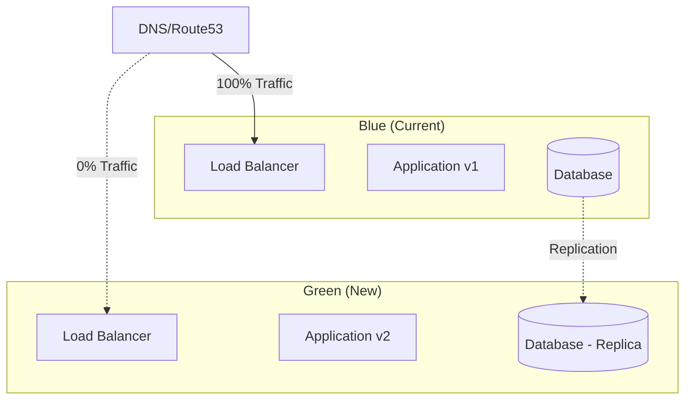

Learn how to migrate existing cloud infrastructure and applications to DevPlatform CLI management.

## Migration Strategies

<CardGroup cols={2}>
  <Card title="Greenfield" icon="seedling">
    Deploy new infrastructure alongside existing setup
    
    **Best for**: New projects, isolated environments
  </Card>
  <Card title="Import Existing" icon="file-import">
    Import existing resources into Terraform state
    
    **Best for**: Existing infrastructure, gradual migration
  </Card>
  <Card title="Recreate" icon="rotate">
    Destroy and recreate with DevPlatform CLI
    
    **Best for**: Development environments, non-critical workloads
  </Card>
  <Card title="Blue-Green" icon="circle-half-stroke">
    Deploy new stack, switch traffic, decommission old
    
    **Best for**: Production, zero-downtime migration
  </Card>
</CardGroup>

## Pre-Migration Checklist

<Steps>
  <Step title="Inventory Current Resources">
    Document all existing resources:
    
    - VPC/VNet and subnets
    - Databases and storage
    - Kubernetes clusters
    - Load balancers
    - Security groups/NSGs
    - IAM roles and policies
  </Step>
  
  <Step title="Backup Everything">
    Create backups before migration:
    
    <Tabs>
      <Tab title="AWS">
        ```bash
        # Database snapshot
        aws rds create-db-snapshot \
          --db-instance-identifier mydb \
          --db-snapshot-identifier mydb-pre-migration
        
        # EBS snapshots
        aws ec2 create-snapshot \
          --volume-id vol-abc123 \
          --description "Pre-migration backup"
        ```
      </Tab>
      <Tab title="Azure">
        ```bash
        # Database backup
        az postgres server backup create \
          --resource-group myapp-rg \
          --server-name mydb \
          --backup-name pre-migration
        
        # Disk snapshots
        az snapshot create \
          --resource-group myapp-rg \
          --name disk-snapshot \
          --source /subscriptions/{sub-id}/resourceGroups/{rg}/providers/Microsoft.Compute/disks/mydisk
        ```
      </Tab>
    </Tabs>
  </Step>
  
  <Step title="Test in Non-Production">
    Always test migration in dev/staging first
  </Step>
  
  <Step title="Plan Downtime Window">
    Schedule maintenance window for production migration
  </Step>
</Steps>

## Migration Approach 1: Import Existing Resources

### Step 1: Identify Resources to Import

<Tabs>
  <Tab title="AWS">
    ```bash
    # List VPCs
    aws ec2 describe-vpcs --query 'Vpcs[*].[VpcId,Tags[?Key==`Name`].Value|[0]]' --output table
    
    # List RDS instances
    aws rds describe-db-instances --query 'DBInstances[*].[DBInstanceIdentifier,Engine]' --output table
    
    # List EKS clusters
    aws eks list-clusters --output table
    ```
  </Tab>
  <Tab title="Azure">
    ```bash
    # List VNets
    az network vnet list --query '[*].[name,resourceGroup]' --output table
    
    # List databases
    az postgres server list --query '[*].[name,resourceGroup]' --output table
    
    # List AKS clusters
    az aks list --query '[*].[name,resourceGroup]' --output table
    ```
  </Tab>
</Tabs>

### Step 2: Create DevPlatform Configuration

Create `.devplatform.yaml` matching your existing infrastructure:

```yaml
provider: aws  # or azure

application:
  name: my-app
  environment: prod

infrastructure:
  vpc:
    cidr: "10.0.0.0/16"  # Match existing VPC
  
  database:
    engine: postgres
    version: "15.3"
    instance_class: db.r5.large  # Match existing instance
  
  kubernetes:
    version: "1.28"  # Match existing cluster
    node_instance_type: t3.large
    node_count: 3
```

### Step 3: Import Resources into Terraform

<Tabs>
  <Tab title="AWS">
    ```bash
    # Initialize Terraform
    devplatform init --app my-app --env prod
    
    # Import VPC
    cd .devplatform/terraform/my-app/prod
    terraform import aws_vpc.main vpc-abc123
    
    # Import subnets
    terraform import aws_subnet.public[0] subnet-abc123
    terraform import aws_subnet.private[0] subnet-def456
    
    # Import RDS
    terraform import aws_db_instance.main mydb-instance
    
    # Import security groups
    terraform import aws_security_group.rds sg-abc123
    ```
  </Tab>
  <Tab title="Azure">
    ```bash
    # Initialize Terraform
    devplatform init --app my-app --env prod
    
    # Import resource group
    cd .devplatform/terraform/my-app/prod
    terraform import azurerm_resource_group.main /subscriptions/{sub-id}/resourceGroups/myapp-rg
    
    # Import VNet
    terraform import azurerm_virtual_network.main /subscriptions/{sub-id}/resourceGroups/myapp-rg/providers/Microsoft.Network/virtualNetworks/myapp-vnet
    
    # Import database
    terraform import azurerm_postgresql_flexible_server.main /subscriptions/{sub-id}/resourceGroups/myapp-rg/providers/Microsoft.DBforPostgreSQL/flexibleServers/mydb
    ```
  </Tab>
</Tabs>

### Step 4: Verify Import

```bash
# Check Terraform state
terraform show

# Verify no changes needed
terraform plan

# If plan shows changes, adjust configuration to match existing resources
```

## Migration Approach 2: Blue-Green Deployment

### Architecture



### Step 1: Deploy Green Environment

```bash
# Deploy new environment with DevPlatform CLI
devplatform create \
  --app my-app \
  --env prod-green \
  --config .devplatform.prod.yaml
```

### Step 2: Replicate Data

<Tabs>
  <Tab title="AWS">
    ```bash
    # Create read replica from existing database
    aws rds create-db-instance-read-replica \
      --db-instance-identifier myapp-prod-green \
      --source-db-instance-identifier myapp-prod-blue
    
    # Promote replica to standalone
    aws rds promote-read-replica \
      --db-instance-identifier myapp-prod-green
    ```
  </Tab>
  <Tab title="Azure">
    ```bash
    # Create replica
    az postgres server replica create \
      --name myapp-prod-green \
      --resource-group myapp-rg \
      --source-server myapp-prod-blue
    
    # Stop replication
    az postgres server replica stop \
      --name myapp-prod-green \
      --resource-group myapp-rg
    ```
  </Tab>
</Tabs>

### Step 3: Test Green Environment

```bash
# Test application
curl https://myapp-prod-green.example.com/health

# Run smoke tests
npm run test:smoke -- --env=prod-green
```

### Step 4: Switch Traffic

<Tabs>
  <Tab title="Gradual (Recommended)">
    ```bash
    # Route 10% traffic to green
    aws route53 change-resource-record-sets \
      --hosted-zone-id Z123456 \
      --change-batch file://weighted-routing-10.json
    
    # Monitor metrics
    # If successful, increase to 50%
    # Then 100%
    ```
  </Tab>
  <Tab title="Instant">
    ```bash
    # Switch DNS to green
    aws route53 change-resource-record-sets \
      --hosted-zone-id Z123456 \
      --change-batch file://switch-to-green.json
    ```
  </Tab>
</Tabs>

### Step 5: Decommission Blue

```bash
# After successful migration
devplatform destroy --app my-app --env prod-blue --confirm
```

## Migration Approach 3: Database Migration

### Export from Existing Database

<Tabs>
  <Tab title="PostgreSQL">
    ```bash
    # Export data
    pg_dump -h old-db.example.com \
      -U admin \
      -d myapp \
      -F c \
      -f myapp-backup.dump
    
    # Or use logical replication for zero-downtime
    ```
  </Tab>
  <Tab title="MySQL">
    ```bash
    # Export data
    mysqldump -h old-db.example.com \
      -u admin \
      -p myapp > myapp-backup.sql
    ```
  </Tab>
</Tabs>

### Import to New Database

<Tabs>
  <Tab title="PostgreSQL">
    ```bash
    # Get new database endpoint
    DB_ENDPOINT=$(devplatform status --app my-app --env prod --output json | jq -r '.database.endpoint')
    
    # Import data
    pg_restore -h $DB_ENDPOINT \
      -U admin \
      -d myapp \
      myapp-backup.dump
    ```
  </Tab>
  <Tab title="MySQL">
    ```bash
    # Get new database endpoint
    DB_ENDPOINT=$(devplatform status --app my-app --env prod --output json | jq -r '.database.endpoint')
    
    # Import data
    mysql -h $DB_ENDPOINT \
      -u admin \
      -p myapp < myapp-backup.sql
    ```
  </Tab>
</Tabs>

## Kubernetes Migration

### Export Existing Resources

```bash
# Export deployments
kubectl get deployment -n old-namespace -o yaml > deployments.yaml

# Export services
kubectl get service -n old-namespace -o yaml > services.yaml

# Export configmaps
kubectl get configmap -n old-namespace -o yaml > configmaps.yaml

# Export secrets
kubectl get secret -n old-namespace -o yaml > secrets.yaml
```

### Adapt to DevPlatform Format

Convert exported resources to Helm values:

```yaml
# values.yaml
image:
  repository: myapp
  tag: v1.0.0

replicas: 3

resources:
  requests:
    cpu: "500m"
    memory: "512Mi"
  limits:
    cpu: "2000m"
    memory: "2Gi"

env:
  - name: DATABASE_URL
    valueFrom:
      secretKeyRef:
        name: db-credentials
        key: url
```

### Deploy with DevPlatform

```bash
devplatform update \
  --app my-app \
  --env prod \
  --values-file values.yaml
```

## Post-Migration Tasks

<Steps>
  <Step title="Verify All Services">
    ```bash
    # Check application health
    curl https://myapp.example.com/health
    
    # Check database connectivity
    kubectl exec -it <pod-name> -n prod-myapp -- psql -h <db-endpoint> -U admin -d myapp -c "SELECT 1"
    
    # Check logs
    kubectl logs -n prod-myapp -l app=myapp --tail=100
    ```
  </Step>
  
  <Step title="Update DNS">
    Point DNS to new load balancer
  </Step>
  
  <Step title="Monitor Metrics">
    Watch for errors, latency, and resource usage
  </Step>
  
  <Step title="Update Documentation">
    Document new infrastructure and procedures
  </Step>
  
  <Step title="Decommission Old Resources">
    After successful migration and monitoring period:
    
    ```bash
    # Delete old resources
    # Be careful - verify backups first!
    ```
  </Step>
</Steps>

## Rollback Plan

Always have a rollback plan:

<Tabs>
  <Tab title="DNS Rollback">
    ```bash
    # Switch DNS back to old infrastructure
    aws route53 change-resource-record-sets \
      --hosted-zone-id Z123456 \
      --change-batch file://rollback-to-blue.json
    ```
  </Tab>
  <Tab title="Database Rollback">
    ```bash
    # Restore from snapshot
    aws rds restore-db-instance-from-db-snapshot \
      --db-instance-identifier myapp-prod \
      --db-snapshot-identifier myapp-pre-migration
    ```
  </Tab>
  <Tab title="Application Rollback">
    ```bash
    # Rollback Helm release
    helm rollback myapp -n prod-myapp
    
    # Or redeploy previous version
    devplatform update --app my-app --env prod --image myapp:v1.0.0
    ```
  </Tab>
</Tabs>

## Common Migration Issues

<AccordionGroup>
  <Accordion title="Resource Name Conflicts">
    **Issue**: Resource names already exist
    
    **Solution**: Use different names or import existing resources
  </Accordion>
  
  <Accordion title="Data Loss During Migration">
    **Issue**: Data not properly migrated
    
    **Solution**: Always backup first, verify data after migration
  </Accordion>
  
  <Accordion title="Downtime Longer Than Expected">
    **Issue**: Migration takes longer than planned
    
    **Solution**: Use blue-green deployment for zero-downtime
  </Accordion>
  
  <Accordion title="Configuration Drift">
    **Issue**: New infrastructure doesn't match old
    
    **Solution**: Carefully document and replicate all settings
  </Accordion>
</AccordionGroup>

## Related Resources

<CardGroup cols={2}>
  <Card title="First Deployment" icon="rocket" href="/guides/first-deployment">
    Deploy new infrastructure
  </Card>
  <Card title="Disaster Recovery" icon="life-ring" href="/advanced/disaster-recovery">
    Backup and recovery strategies
  </Card>
</CardGroup>
