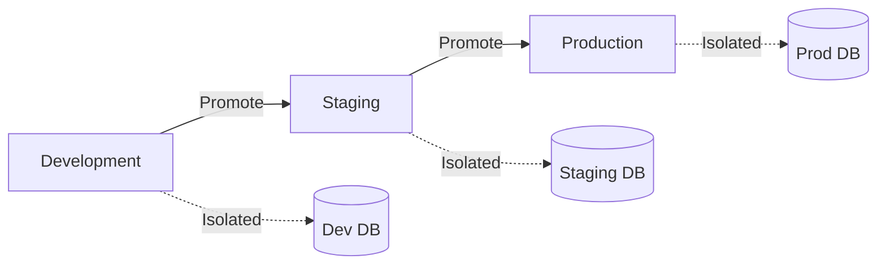

Learn how to set up and manage multiple environments (dev, staging, production) with DevPlatform CLI.

## Environment Strategy



## Environment Configurations

<Tabs>
  <Tab title="Development">
    Development environment for active development and testing:
    
    ```yaml
    # .devplatform.dev.yaml
    provider: aws
    
    application:
      name: my-app
      environment: dev
    
    infrastructure:
      vpc:
        cidr: "10.0.0.0/16"
      
      database:
        engine: postgres
        version: "15.3"
        instance_class: db.t3.micro  # Small instance
        backup_retention: 1           # Minimal backups
        multi_az: false               # Single AZ
      
      kubernetes:
        version: "1.28"
        node_instance_type: t3.small  # Small nodes
        node_count: 2                 # Minimal nodes
        autoscaling:
          enabled: false
    
    deployment:
      image: my-app:dev
      replicas: 1                     # Single replica
      resources:
        requests:
          cpu: "100m"
          memory: "128Mi"
        limits:
          cpu: "500m"
          memory: "512Mi"
    
    features:
      monitoring: basic
      logging: standard
      backup: minimal
    ```
    
    **Characteristics**:
    - Lowest cost configuration
    - Minimal redundancy
    - Frequent deployments
    - Short backup retention
    - Relaxed security (within VPC)
  </Tab>
  
  <Tab title="Staging">
    Staging environment that mirrors production:
    
    ```yaml
    # .devplatform.staging.yaml
    provider: aws
    
    application:
      name: my-app
      environment: staging
    
    infrastructure:
      vpc:
        cidr: "10.1.0.0/16"
      
      database:
        engine: postgres
        version: "15.3"
        instance_class: db.t3.medium  # Medium instance
        backup_retention: 7            # 7 days backups
        multi_az: true                 # Multi-AZ for HA
      
      kubernetes:
        version: "1.28"
        node_instance_type: t3.medium  # Medium nodes
        node_count: 3                  # Multiple nodes
        autoscaling:
          enabled: true
          min_nodes: 2
          max_nodes: 5
    
    deployment:
      image: my-app:staging
      replicas: 2                      # Multiple replicas
      resources:
        requests:
          cpu: "200m"
          memory: "256Mi"
        limits:
          cpu: "1000m"
          memory: "1Gi"
    
    features:
      monitoring: enhanced
      logging: detailed
      backup: standard
    ```
    
    **Characteristics**:
    - Production-like configuration
    - High availability
    - Performance testing
    - Standard backup retention
    - Production-grade security
  </Tab>
  
  <Tab title="Production">
    Production environment with maximum reliability:
    
    ```yaml
    # .devplatform.prod.yaml
    provider: aws
    
    application:
      name: my-app
      environment: prod
    
    infrastructure:
      vpc:
        cidr: "10.2.0.0/16"
      
      database:
        engine: postgres
        version: "15.3"
        instance_class: db.r6g.xlarge  # Large instance
        backup_retention: 30            # 30 days backups
        multi_az: true                  # Multi-AZ for HA
        read_replicas: 2                # Read replicas
      
      kubernetes:
        version: "1.28"
        node_instance_type: t3.large   # Large nodes
        node_count: 5                   # Multiple nodes
        autoscaling:
          enabled: true
          min_nodes: 3
          max_nodes: 10
    
    deployment:
      image: my-app:v1.0.0             # Versioned image
      replicas: 3                       # Multiple replicas
      resources:
        requests:
          cpu: "500m"
          memory: "512Mi"
        limits:
          cpu: "2000m"
          memory: "2Gi"
      
      hpa:                              # Horizontal Pod Autoscaler
        enabled: true
        min_replicas: 3
        max_replicas: 10
        target_cpu: 70
    
    features:
      monitoring: comprehensive
      logging: audit
      backup: enterprise
      disaster_recovery: enabled
    ```
    
    **Characteristics**:
    - Maximum reliability
    - High availability
    - Auto-scaling
    - Long backup retention
    - Strict security controls
    - Disaster recovery
  </Tab>
</Tabs>

## Deploy Multiple Environments

<Steps>
  <Step title="Deploy Development">
    ```bash
    devplatform create \
      --app my-app \
      --env dev \
      --config .devplatform.dev.yaml
    ```
  </Step>
  
  <Step title="Deploy Staging">
    ```bash
    devplatform create \
      --app my-app \
      --env staging \
      --config .devplatform.staging.yaml
    ```
  </Step>
  
  <Step title="Deploy Production">
    ```bash
    devplatform create \
      --app my-app \
      --env prod \
      --config .devplatform.prod.yaml
    ```
  </Step>
</Steps>

## Environment Isolation

<Tabs>
  <Tab title="Network Isolation">
    Each environment uses separate VPCs/VNets:
    
    ```mermaid
    graph TB
        subgraph "Development VPC (10.0.0.0/16)"
            DevSubnet1[Public Subnet]
            DevSubnet2[Private Subnet]
            DevDB[(Dev DB)]
        end
        
        subgraph "Staging VPC (10.1.0.0/16)"
            StagingSubnet1[Public Subnet]
            StagingSubnet2[Private Subnet]
            StagingDB[(Staging DB)]
        end
        
        subgraph "Production VPC (10.2.0.0/16)"
            ProdSubnet1[Public Subnet]
            ProdSubnet2[Private Subnet]
            ProdDB[(Prod DB)]
        end
    ```
    
    **Benefits**:
    - Complete network isolation
    - Independent security groups
    - No cross-environment traffic
    - Separate IP ranges
  </Tab>
  
  <Tab title="IAM/RBAC Isolation">
    Separate permissions per environment:
    
    <Tabs>
      <Tab title="AWS">
        ```json
        {
          "Version": "2012-10-17",
          "Statement": [
            {
              "Effect": "Allow",
              "Action": ["eks:*", "rds:*", "ec2:*"],
              "Resource": "*",
              "Condition": {
                "StringEquals": {
                  "aws:RequestedRegion": "us-east-1",
                  "ec2:ResourceTag/Environment": "dev"
                }
              }
            }
          ]
        }
        ```
      </Tab>
      <Tab title="Azure">
        ```bash
        # Assign role to specific resource group
        az role assignment create \
          --assignee user@example.com \
          --role Contributor \
          --scope /subscriptions/{sub-id}/resourceGroups/my-app-dev-rg
        ```
      </Tab>
    </Tabs>
  </Tab>
  
  <Tab title="Kubernetes Isolation">
    Separate clusters per environment:
    
    ```bash
    # Development cluster
    kubectl config use-context my-app-dev-eks
    
    # Staging cluster
    kubectl config use-context my-app-staging-eks
    
    # Production cluster
    kubectl config use-context my-app-prod-eks
    ```
    
    Or use namespaces within shared cluster:
    
    ```yaml
    # Namespace per environment
    apiVersion: v1
    kind: Namespace
    metadata:
      name: dev-my-app
      labels:
        environment: dev
    ---
    apiVersion: v1
    kind: Namespace
    metadata:
      name: staging-my-app
      labels:
        environment: staging
    ---
    apiVersion: v1
    kind: Namespace
    metadata:
      name: prod-my-app
      labels:
        environment: prod
    ```
  </Tab>
</Tabs>

## Environment Promotion Workflow

<Steps>
  <Step title="Develop in Dev">
    ```bash
    # Deploy to dev
    devplatform update --app my-app --env dev --image my-app:feature-123
    
    # Test in dev
    curl https://my-app-dev.example.com/health
    ```
  </Step>
  
  <Step title="Promote to Staging">
    ```bash
    # Tag image for staging
    docker tag my-app:feature-123 my-app:staging
    docker push my-app:staging
    
    # Deploy to staging
    devplatform update --app my-app --env staging --image my-app:staging
    
    # Run integration tests
    npm run test:integration -- --env=staging
    ```
  </Step>
  
  <Step title="Promote to Production">
    ```bash
    # Tag with version
    docker tag my-app:staging my-app:v1.2.0
    docker push my-app:v1.2.0
    
    # Deploy to production
    devplatform update --app my-app --env prod --image my-app:v1.2.0
    
    # Monitor deployment
    kubectl rollout status deployment/my-app -n prod-my-app
    ```
  </Step>
</Steps>

## Environment-Specific Configuration

<Tabs>
  <Tab title="ConfigMaps">
    ```yaml
    # dev-config.yaml
    apiVersion: v1
    kind: ConfigMap
    metadata:
      name: app-config
      namespace: dev-my-app
    data:
      LOG_LEVEL: "debug"
      API_TIMEOUT: "30s"
      FEATURE_FLAGS: "all-enabled"
    ---
    # staging-config.yaml
    apiVersion: v1
    kind: ConfigMap
    metadata:
      name: app-config
      namespace: staging-my-app
    data:
      LOG_LEVEL: "info"
      API_TIMEOUT: "10s"
      FEATURE_FLAGS: "beta-enabled"
    ---
    # prod-config.yaml
    apiVersion: v1
    kind: ConfigMap
    metadata:
      name: app-config
      namespace: prod-my-app
    data:
      LOG_LEVEL: "warn"
      API_TIMEOUT: "5s"
      FEATURE_FLAGS: "stable-only"
    ```
  </Tab>
  
  <Tab title="Secrets">
    <Tabs>
      <Tab title="AWS">
        ```bash
        # Dev secrets
        aws secretsmanager create-secret \
          --name my-app-dev-api-key \
          --secret-string "dev-api-key-123"
        
        # Staging secrets
        aws secretsmanager create-secret \
          --name my-app-staging-api-key \
          --secret-string "staging-api-key-456"
        
        # Production secrets
        aws secretsmanager create-secret \
          --name my-app-prod-api-key \
          --secret-string "prod-api-key-789"
        ```
      </Tab>
      <Tab title="Azure">
        ```bash
        # Dev secrets
        az keyvault secret set \
          --vault-name my-app-dev-kv \
          --name api-key \
          --value "dev-api-key-123"
        
        # Staging secrets
        az keyvault secret set \
          --vault-name my-app-staging-kv \
          --name api-key \
          --value "staging-api-key-456"
        
        # Production secrets
        az keyvault secret set \
          --vault-name my-app-prod-kv \
          --name api-key \
          --value "prod-api-key-789"
        ```
      </Tab>
    </Tabs>
  </Tab>
  
  <Tab title="Environment Variables">
    ```yaml
    # Deployment with environment-specific variables
    apiVersion: apps/v1
    kind: Deployment
    metadata:
      name: my-app
    spec:
      template:
        spec:
          containers:
          - name: app
            image: my-app:latest
            env:
            - name: ENVIRONMENT
              value: "{{ .Values.environment }}"
            - name: DATABASE_URL
              valueFrom:
                secretKeyRef:
                  name: db-credentials
                  key: url
            - name: LOG_LEVEL
              valueFrom:
                configMapKeyRef:
                  name: app-config
                  key: LOG_LEVEL
    ```
  </Tab>
</Tabs>

## Cost Comparison

| Resource | Development | Staging | Production |
|----------|-------------|---------|------------|
| **Database** | db.t3.micro ($15/mo) | db.t3.medium ($60/mo) | db.r6g.xlarge ($300/mo) |
| **Kubernetes Nodes** | 2x t3.small ($30/mo) | 3x t3.medium ($90/mo) | 5x t3.large ($300/mo) |
| **Load Balancer** | ALB ($20/mo) | ALB ($20/mo) | ALB ($20/mo) |
| **Storage** | 20GB ($2/mo) | 50GB ($5/mo) | 200GB ($20/mo) |
| **Backups** | Minimal ($5/mo) | Standard ($15/mo) | Enterprise ($50/mo) |
| **Total** | ~$72/mo | ~$190/mo | ~$690/mo |

<Note>
Costs are approximate and vary by region, usage, and specific configurations.
</Note>

## Best Practices

<AccordionGroup>
  <Accordion title="Use Infrastructure as Code">
    Store all environment configurations in version control:
    
    ```
    .
    ├── .devplatform.dev.yaml
    ├── .devplatform.staging.yaml
    ├── .devplatform.prod.yaml
    └── environments/
        ├── dev/
        │   ├── configmap.yaml
        │   └── secrets.yaml
        ├── staging/
        │   ├── configmap.yaml
        │   └── secrets.yaml
        └── prod/
            ├── configmap.yaml
            └── secrets.yaml
    ```
  </Accordion>
  
  <Accordion title="Automate Promotions">
    Use CI/CD pipelines for environment promotions:
    
    ```yaml
    # .github/workflows/promote.yml
    name: Promote to Production
    
    on:
      workflow_dispatch:
        inputs:
          version:
            description: 'Version to promote'
            required: true
    
    jobs:
      promote:
        runs-on: ubuntu-latest
        steps:
          - name: Promote to Production
            run: |
              devplatform update \
                --app my-app \
                --env prod \
                --image my-app:${{ github.event.inputs.version }}
    ```
  </Accordion>
  
  <Accordion title="Monitor All Environments">
    Set up monitoring and alerting for each environment:
    
    - Development: Basic monitoring, Slack notifications
    - Staging: Enhanced monitoring, email notifications
    - Production: Comprehensive monitoring, PagerDuty alerts
  </Accordion>
  
  <Accordion title="Regular Sync from Production">
    Periodically sync staging with production data:
    
    ```bash
    # Create production snapshot
    devplatform backup --app my-app --env prod
    
    # Restore to staging (sanitized)
    devplatform restore \
      --app my-app \
      --env staging \
      --from prod \
      --sanitize
    ```
  </Accordion>
</AccordionGroup>

## Managing Multiple Environments

<Tabs>
  <Tab title="List All Environments">
    ```bash
    devplatform list --app my-app
    ```
    
    Output:
    ```
    Application: my-app
    
    Environments:
    ├─ dev (us-east-1)
    │  ├─ Status: ACTIVE
    │  ├─ Cluster: my-app-dev-eks
    │  └─ URL: https://my-app-dev.example.com
    │
    ├─ staging (us-east-1)
    │  ├─ Status: ACTIVE
    │  ├─ Cluster: my-app-staging-eks
    │  └─ URL: https://my-app-staging.example.com
    │
    └─ prod (us-east-1)
       ├─ Status: ACTIVE
       ├─ Cluster: my-app-prod-eks
       └─ URL: https://my-app.example.com
    ```
  </Tab>
  
  <Tab title="Switch Between Environments">
    ```bash
    # Set default environment
    devplatform config set-env dev
    
    # Commands now default to dev
    devplatform status --app my-app
    
    # Override for specific command
    devplatform status --app my-app --env prod
    ```
  </Tab>
  
  <Tab title="Compare Environments">
    ```bash
    devplatform diff --app my-app --from dev --to prod
    ```
    
    Output:
    ```
    Configuration Differences:
    
    Database:
    - dev: db.t3.micro
    + prod: db.r6g.xlarge
    
    Kubernetes:
    - dev: 2 nodes (t3.small)
    + prod: 5 nodes (t3.large)
    
    Application:
    - dev: 1 replica
    + prod: 3 replicas
    ```
  </Tab>
</Tabs>

## Related Resources

<CardGroup cols={2}>
  <Card title="First Deployment" icon="rocket" href="/guides/first-deployment">
    Deploy your first application
  </Card>
  <Card title="Cost Optimization" icon="dollar-sign" href="/guides/cost-optimization">
    Optimize costs across environments
  </Card>
  <Card title="CI/CD Integration" icon="code-branch" href="/advanced/ci-cd-integration">
    Automate environment promotions
  </Card>
  <Card title="Disaster Recovery" icon="life-ring" href="/advanced/disaster-recovery">
    Set up disaster recovery for production
  </Card>
</CardGroup>
