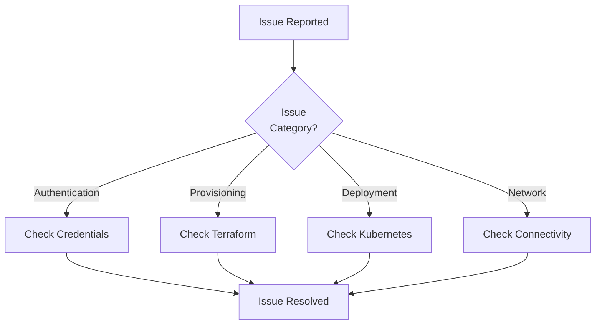

Quick reference for diagnosing and resolving common issues with DevPlatform CLI deployments.

## Diagnostic Flow



## Authentication Issues

<AccordionGroup>
  <Accordion title="No AWS Credentials Found">
    **Error**: `No AWS credentials found`
    
    **Diagnosis**:
    ```bash
    # Check AWS CLI configuration
    aws sts get-caller-identity
    
    # Check credentials file
    cat ~/.aws/credentials
    ```
    
    **Solutions**:
    <Tabs>
      <Tab title="Configure AWS CLI">
        ```bash
        aws configure
        # Enter Access Key ID and Secret Access Key
        ```
      </Tab>
      <Tab title="Environment Variables">
        ```bash
        export AWS_ACCESS_KEY_ID=your_key
        export AWS_SECRET_ACCESS_KEY=your_secret
        export AWS_DEFAULT_REGION=us-east-1
        ```
      </Tab>
      <Tab title="Use Profile">
        ```bash
        devplatform create --app myapp --env dev --profile my-profile
        ```
      </Tab>
    </Tabs>
  </Accordion>
  
  <Accordion title="Azure CLI Not Configured">
    **Error**: `No Azure credentials found`
    
    **Diagnosis**:
    ```bash
    # Check if logged in
    az account show
    
    # List subscriptions
    az account list --output table
    ```
    
    **Solutions**:
    <Tabs>
      <Tab title="Interactive Login">
        ```bash
        az login
        # Follow browser authentication
        ```
      </Tab>
      <Tab title="Service Principal">
        ```bash
        az login --service-principal \
          --username <app-id> \
          --password <password> \
          --tenant <tenant-id>
        ```
      </Tab>
      <Tab title="Set Subscription">
        ```bash
        az account set --subscription <subscription-id>
        ```
      </Tab>
    </Tabs>
  </Accordion>
  
  <Accordion title="Insufficient Permissions">
    **Error**: `User is not authorized to perform: <action>`
    
    **Diagnosis**:
    ```bash
    # Check current identity
    aws sts get-caller-identity  # AWS
    az account show              # Azure
    
    # Test specific permissions
    aws ec2 describe-vpcs --dry-run
    ```
    
    **Solution**: Contact your administrator to grant required permissions. See [Authentication Guide](/security/authentication) for details.
  </Accordion>
  
  <Accordion title="Expired Credentials">
    **Error**: `The security token included in the request is expired`
    
    **Solutions**:
    <Tabs>
      <Tab title="AWS SSO">
        ```bash
        aws sso login --profile my-profile
        ```
      </Tab>
      <Tab title="Azure">
        ```bash
        az login
        ```
      </Tab>
      <Tab title="Reconfigure">
        ```bash
        aws configure  # AWS
        az login       # Azure
        ```
      </Tab>
    </Tabs>
  </Accordion>
</AccordionGroup>

## Provisioning Issues

<AccordionGroup>
  <Accordion title="Terraform State Locked">
    **Error**: `Error acquiring the state lock`
    
    **Diagnosis**:
    <Tabs>
      <Tab title="AWS">
        ```bash
        # Check DynamoDB lock table
        aws dynamodb scan --table-name terraform-locks
        
        # Check specific lock
        aws dynamodb get-item --table-name terraform-locks \
          --key '{"LockID": {"S": "terraform-state-bucket/myapp-dev.tfstate"}}'
        ```
      </Tab>
      <Tab title="Azure">
        ```bash
        # Check blob lease status
        az storage blob show \
          --account-name <storage-account> \
          --container-name tfstate \
          --name myapp-dev.tfstate \
          --query "properties.lease"
        ```
      </Tab>
    </Tabs>
    
    **Solutions**:
    <Tabs>
      <Tab title="Wait">
        Wait for lock to be released automatically (usually within minutes)
      </Tab>
      <Tab title="Force Unlock">
        ```bash
        cd terraform/environments/dev
        terraform force-unlock <lock-id>
        ```
        
        <Warning>Use with caution - only if you're certain no other process is running</Warning>
      </Tab>
      <Tab title="Manual Cleanup (AWS)">
        ```bash
        aws dynamodb delete-item --table-name terraform-locks \
          --key '{"LockID": {"S": "terraform-state-bucket/myapp-dev.tfstate"}}'
        ```
      </Tab>
      <Tab title="Manual Cleanup (Azure)">
        ```bash
        az storage blob lease break \
          --account-name <storage-account> \
          --container-name tfstate \
          --blob-name myapp-dev.tfstate
        ```
      </Tab>
    </Tabs>
  </Accordion>
  
  <Accordion title="Resource Quota Exceeded">
    **Error**: `You have exceeded your quota for <resource>`
    
    **Diagnosis**:
    <Tabs>
      <Tab title="AWS">
        ```bash
        # Check VPC quota
        aws ec2 describe-vpcs --query 'Vpcs[*].VpcId' | jq length
        
        # Check service quotas
        aws service-quotas get-service-quota \
          --service-code ec2 \
          --quota-code L-F678F1CE
        ```
      </Tab>
      <Tab title="Azure">
        ```bash
        # Check resource usage
        az vm list-usage --location eastus --output table
        
        # Get quota limits
        az quota show \
          --scope /subscriptions/{sub-id} \
          --resource-name standardDSv3Family
        ```
      </Tab>
    </Tabs>
    
    **Solutions**:
    1. Delete unused resources
    2. Request quota increase from cloud provider
    3. Use smaller instance types
  </Accordion>
  
  <Accordion title="Terraform Apply Failed">
    **Error**: Terraform exits with error during apply
    
    **Diagnosis**:
    ```bash
    # Check Terraform state
    cd terraform/environments/dev
    terraform show
    
    # Check for drift
    terraform plan
    
    # View detailed logs
    devplatform create --app myapp --env dev --verbose --debug
    ```
    
    **Solutions**:
    1. Review error message and fix configuration
    2. Import existing resources if partially created
    3. Rollback and retry:
    ```bash
    devplatform destroy --app myapp --env dev --confirm
    devplatform create --app myapp --env dev
    ```
  </Accordion>
</AccordionGroup>

## Deployment Issues

<AccordionGroup>
  <Accordion title="Helm Install Failed">
    **Error**: `Helm install failed`
    
    **Diagnosis**:
    ```bash
    # Check Helm release status
    helm status myapp -n dev-myapp
    
    # Check pod status
    kubectl get pods -n dev-myapp
    
    # Check pod events
    kubectl describe pod <pod-name> -n dev-myapp
    ```
    
    **Solutions**:
    <Tabs>
      <Tab title="Image Pull Error">
        ```bash
        # Verify image exists
        docker pull <image-name>
        
        # Check image pull secrets
        kubectl get secrets -n dev-myapp
        ```
      </Tab>
      <Tab title="Resource Quota">
        ```bash
        # Check quota
        kubectl describe resourcequota -n dev-myapp
        
        # Reduce resource requests or increase quota
        ```
      </Tab>
      <Tab title="Manifest Error">
        ```bash
        # Validate chart
        helm lint ./charts/devplatform-base
        
        # Dry-run install
        helm install myapp ./charts/devplatform-base --dry-run --debug
        ```
      </Tab>
    </Tabs>
  </Accordion>
  
  <Accordion title="Pods Not Ready">
    **Error**: Pods stuck in Pending, ContainerCreating, or CrashLoopBackOff
    
    **Diagnosis**:
    ```bash
    # Check pod status
    kubectl get pods -n dev-myapp -o wide
    
    # Check events
    kubectl get events -n dev-myapp --sort-by='.lastTimestamp'
    
    # Check logs
    kubectl logs <pod-name> -n dev-myapp --previous
    
    # Describe pod
    kubectl describe pod <pod-name> -n dev-myapp
    ```
    
    **Common Causes**:
    <Tabs>
      <Tab title="ImagePullBackOff">
        - Image doesn't exist
        - Wrong image name/tag
        - Missing image pull secrets
        - Registry authentication failed
      </Tab>
      <Tab title="CrashLoopBackOff">
        - Application error on startup
        - Missing environment variables
        - Failed health checks
        - Insufficient resources
      </Tab>
      <Tab title="Pending">
        - Insufficient node resources
        - Node selector mismatch
        - Pod affinity/anti-affinity rules
        - Volume mount issues
      </Tab>
    </Tabs>
  </Accordion>
</AccordionGroup>

## Network Issues

<AccordionGroup>
  <Accordion title="Cannot Connect to Database">
    **Error**: Connection timeout to database
    
    **Diagnosis**:
    <Tabs>
      <Tab title="AWS">
        ```bash
        # Check RDS endpoint
        aws rds describe-db-instances --db-instance-identifier myapp-dev
        
        # Check security group rules
        aws ec2 describe-security-groups --group-ids sg-abc123
        
        # Test from pod
        kubectl exec -it <pod-name> -n dev-myapp -- nc -zv <rds-endpoint> 5432
        
        # Check DNS
        kubectl exec -it <pod-name> -n dev-myapp -- nslookup <rds-endpoint>
        ```
      </Tab>
      <Tab title="Azure">
        ```bash
        # Check database endpoint
        az postgres server show --name myapp-dev --resource-group myapp-rg
        
        # Check NSG rules
        az network nsg rule list \
          --nsg-name myapp-dev-nsg \
          --resource-group myapp-rg \
          --output table
        
        # Test from pod
        kubectl exec -it <pod-name> -n dev-myapp -- nc -zv <db-endpoint> 5432
        ```
      </Tab>
    </Tabs>
    
    **Solutions**:
    <Tabs>
      <Tab title="Fix Security Groups (AWS)">
        ```bash
        # Add ingress rule
        aws ec2 authorize-security-group-ingress \
          --group-id <rds-sg-id> \
          --protocol tcp \
          --port 5432 \
          --source-group <eks-sg-id>
        ```
      </Tab>
      <Tab title="Fix NSG Rules (Azure)">
        ```bash
        # Add inbound rule
        az network nsg rule create \
          --nsg-name myapp-dev-nsg \
          --resource-group myapp-rg \
          --name AllowAKSToDatabase \
          --priority 100 \
          --source-address-prefixes <aks-subnet-cidr> \
          --destination-port-ranges 5432 \
          --protocol Tcp \
          --access Allow
        ```
      </Tab>
      <Tab title="Fix Credentials">
        ```bash
        # Get password (AWS)
        aws secretsmanager get-secret-value --secret-id myapp-dev-db-password
        
        # Get password (Azure)
        az keyvault secret show --vault-name myapp-dev-kv --name db-password
        
        # Update Kubernetes secret
        kubectl create secret generic db-creds \
          --from-literal=password=<new-password> \
          -n dev-myapp --dry-run=client -o yaml | kubectl apply -f -
        ```
      </Tab>
    </Tabs>
  </Accordion>
  
  <Accordion title="Ingress Not Working">
    **Error**: Cannot access application via ingress URL
    
    **Diagnosis**:
    ```bash
    # Check ingress resource
    kubectl get ingress -n dev-myapp
    kubectl describe ingress -n dev-myapp
    
    # Check load balancer controller logs
    kubectl logs -n kube-system -l app.kubernetes.io/name=aws-load-balancer-controller
    
    # Check service endpoints
    kubectl get endpoints -n dev-myapp
    ```
    
    **Solutions**:
    1. Verify ingress annotations
    2. Check service selector matches pod labels
    3. Verify load balancer controller is running
    4. Check DNS configuration
  </Accordion>
</AccordionGroup>

## Performance Issues

<AccordionGroup>
  <Accordion title="Slow Provisioning">
    **Symptoms**: Deployment takes longer than expected
    
    **Diagnosis**:
    ```bash
    # Enable verbose logging
    devplatform create --app myapp --env dev --verbose --debug
    
    # Check cloud service health
    aws health describe-events --filter eventTypeCategories=issue
    ```
    
    **Solutions**:
    - Use closer cloud region
    - Check network connectivity
    - Verify cloud service health
    - Increase timeout values
  </Accordion>
  
  <Accordion title="High Resource Usage">
    **Symptoms**: Pods using excessive CPU/memory
    
    **Diagnosis**:
    ```bash
    # Check pod resource usage
    kubectl top pods -n dev-myapp
    
    # Check node resource usage
    kubectl top nodes
    
    # Check detailed metrics
    kubectl describe pod <pod-name> -n dev-myapp | grep -A 10 "Limits\|Requests"
    ```
    
    **Solutions**:
    - Adjust resource requests/limits
    - Enable horizontal pod autoscaling
    - Optimize application code
    - Scale up instance types
  </Accordion>
</AccordionGroup>

## Debug Commands

<Tabs>
  <Tab title="Enable Debug Logging">
    ```bash
    # CLI debug mode
    devplatform create --app myapp --env dev --debug
    
    # Terraform debug
    export TF_LOG=DEBUG
    devplatform create --app myapp --env dev
    
    # Helm debug
    devplatform create --app myapp --env dev --verbose
    ```
  </Tab>
  
  <Tab title="Access Logs">
    ```bash
    # CLI logs
    cat ~/.devplatform/logs/devplatform.log
    
    # Terraform logs
    cat ~/.devplatform/logs/terraform.log
    
    # Pod logs
    kubectl logs <pod-name> -n dev-myapp
    
    # Previous pod logs (after crash)
    kubectl logs <pod-name> -n dev-myapp --previous
    ```
  </Tab>
  
  <Tab title="Collect Diagnostics">
    ```bash
    # Create diagnostic bundle
    devplatform diagnose --app myapp --env dev --output diagnostic.tar.gz
    
    # Bundle includes:
    # - CLI logs
    # - Terraform state
    # - Kubernetes resources
    # - Pod logs
    # - Events
    # - Configuration files
    ```
  </Tab>
</Tabs>

## Getting Help

<CardGroup cols={2}>
  <Card title="Check Documentation" icon="book">
    Review relevant documentation sections for detailed guidance
  </Card>
  <Card title="Enable Debug Mode" icon="bug">
    Run commands with `--debug` flag for detailed output
  </Card>
  <Card title="Check Cloud Status" icon="cloud">
    Verify cloud provider service health
  </Card>
  <Card title="Review Logs" icon="file-lines">
    Check CLI, Terraform, and Kubernetes logs
  </Card>
</CardGroup>

## Related Resources

<CardGroup cols={2}>
  <Card title="Authentication Guide" icon="key" href="/security/authentication">
    Resolve authentication issues
  </Card>
  <Card title="First Deployment" icon="rocket" href="/guides/first-deployment">
    Step-by-step deployment guide
  </Card>
</CardGroup>
