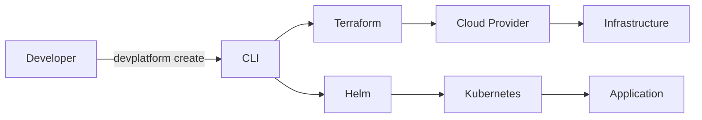

## What is DevPlatform CLI?

DevPlatform CLI is an Internal Developer Platform (IDP) command-line tool that enables developers to self-service provision complete, isolated infrastructure environments on **AWS** or **Azure** in minutes.

<CardGroup cols={2}>
  <Card
    title="Multi-Cloud Support"
    icon="cloud"
    href="/concepts/multi-cloud"
  >
    Deploy to AWS or Azure with a consistent developer experience
  </Card>
  <Card
    title="Quick Start"
    icon="rocket"
    href="/quickstart"
  >
    Get started in under 5 minutes
  </Card>
  <Card
    title="API Reference"
    icon="code"
    href="/api-reference/introduction"
  >
    Explore all CLI commands and options
  </Card>
  <Card
    title="Security"
    icon="shield"
    href="/security/overview"
  >
    Learn about authentication, RBAC, and encryption
  </Card>
</CardGroup>

## Key Features

<AccordionGroup>
  <Accordion icon="gauge" title="3-Minute Provisioning">
    Reduce environment provisioning time from 2 days (via DevOps tickets) to approximately 3 minutes of automated execution.
  </Accordion>

  <Accordion icon="cloud-arrow-up" title="Multi-Cloud Ready">
    Support for both AWS and Azure with provider abstraction. Switch between clouds with a single flag: `--provider aws` or `--provider azure`.
  </Accordion>

  <Accordion icon="lock" title="Enterprise Security">
    Built-in security best practices including IAM/RBAC, encryption at rest and in transit, network isolation, and comprehensive audit logging.
  </Accordion>

  <Accordion icon="dollar-sign" title="Cost Awareness">
    Automatic cost estimation before provisioning and cost savings calculation on teardown. Promotes FinOps practices.
  </Accordion>

  <Accordion icon="rotate" title="Automatic Rollback">
    Intelligent error handling with automatic rollback of partial deployments to prevent orphaned resources.
  </Accordion>

  <Accordion icon="chart-network" title="State Management">
    Safe concurrent operations through remote state locking (S3+DynamoDB for AWS, Azure Storage+blob lease for Azure).
  </Accordion>
</AccordionGroup>

## How It Works

DevPlatform CLI orchestrates **Terraform** for infrastructure management and **Helm** for Kubernetes application deployment:



### What Gets Provisioned

<Steps>
  <Step title="Network Infrastructure">
    VPC/VNet with public and private subnets, NAT gateways, security groups/NSGs
  </Step>
  <Step title="Database">
    RDS (AWS) or Azure Database for PostgreSQL with automated backups
  </Step>
  <Step title="Kubernetes Namespace">
    Isolated namespace in shared EKS/AKS cluster with resource quotas
  </Step>
  <Step title="Application Deployment">
    Helm chart deployment with configurable resources and ingress
  </Step>
</Steps>

## Quick Example

```bash
# AWS Deployment
devplatform create --app payment --env dev --provider aws

# Azure Deployment
devplatform create --app payment --env dev --provider azure

# Check Status
devplatform status --app payment --env dev

# Teardown
devplatform destroy --app payment --env dev --confirm
```

## Architecture Overview

The CLI follows a layered architecture with clear separation of concerns:

- **CLI Interface Layer**: Cobra commands (create, status, destroy, version)
- **Business Logic Layer**: Config validation, orchestration, error handling
- **Cloud Provider Abstraction**: Provider interface with AWS and Azure implementations
- **Infrastructure Adapters**: Terraform wrapper, Helm wrapper, cloud utilities
- **External Dependencies**: Terraform, Helm, AWS SDK, Azure SDK, Kubernetes API

<Card
  title="View Full Architecture"
  icon="diagram-project"
  href="/concepts/architecture"
>
  Explore the complete system architecture with detailed diagrams
</Card>

## Next Steps

<CardGroup cols={2}>
  <Card
    title="Installation"
    icon="download"
    href="/installation"
  >
    Install DevPlatform CLI on your system
  </Card>
  <Card
    title="Quick Start"
    icon="play"
    href="/quickstart"
  >
    Deploy your first environment
  </Card>
  <Card
    title="AWS Guide"
    icon="aws"
    href="/aws/overview"
  >
    Learn about AWS-specific features
  </Card>
  <Card
    title="Azure Guide"
    icon="microsoft"
    href="/azure/overview"
  >
    Learn about Azure-specific features
  </Card>
</CardGroup>
