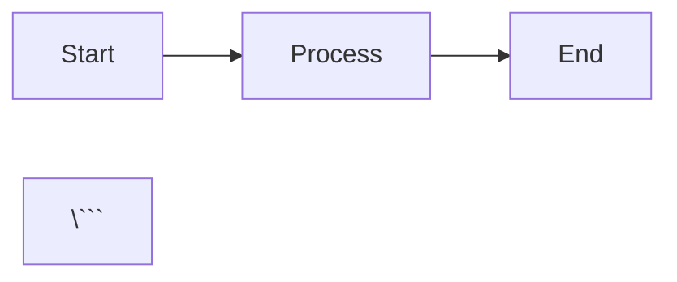

# DevPlatform CLI - Mintlify Documentation

This directory contains the Mintlify documentation for DevPlatform CLI.

## Overview

Mintlify is a modern documentation platform that creates beautiful, interactive documentation from Markdown/MDX files. This setup provides comprehensive documentation for the DevPlatform CLI including:

- Getting started guides
- API reference
- Cloud-specific guides (AWS & Azure)
- Security documentation
- Advanced topics

## Directory Structure

```
mintlify-docs/
├── introduction.mdx          # Landing page
├── quickstart.mdx            # Quick start guide
├── installation.mdx          # Installation instructions
├── concepts/                 # Core concepts
│   ├── architecture.mdx
│   ├── multi-cloud.mdx
│   ├── workflows.mdx
│   └── state-management.mdx
├── aws/                      # AWS-specific guides
│   ├── overview.mdx
│   ├── authentication.mdx
│   ├── networking.mdx
│   ├── database.mdx
│   └── kubernetes.mdx
├── azure/                    # Azure-specific guides
│   ├── overview.mdx
│   ├── authentication.mdx
│   ├── networking.mdx
│   ├── database.mdx
│   └── kubernetes.mdx
├── security/                 # Security documentation
│   ├── overview.mdx
│   ├── authentication.mdx
│   ├── rbac.mdx
│   ├── encryption.mdx
│   └── audit-logging.mdx
├── api-reference/            # CLI command reference
│   ├── introduction.mdx
│   ├── create.mdx
│   ├── status.mdx
│   ├── destroy.mdx
│   └── version.mdx
├── guides/                   # How-to guides
│   ├── first-deployment.mdx
│   ├── multi-environment.mdx
│   ├── cost-optimization.mdx
│   ├── troubleshooting.mdx
│   └── migration.mdx
└── advanced/                 # Advanced topics
    ├── custom-modules.mdx
    ├── helm-customization.mdx
    ├── ci-cd-integration.mdx
    └── disaster-recovery.mdx
```

## Setup Instructions

### 1. Install Mintlify CLI

```bash
npm i -g mintlify
```

### 2. Initialize Documentation

The documentation is already configured with `mintlify.json` in the project root.

### 3. Run Development Server

```bash
# From the project root
mintlify dev

# Or specify the docs directory
cd mintlify-docs
mintlify dev
```

The documentation will be available at `http://localhost:3000`

### 4. Build for Production

```bash
mintlify build
```

## Configuration

The main configuration file is `mintlify.json` in the project root. Key sections:

### Navigation

The navigation structure is defined in the `navigation` array:

```json
{
  "navigation": [
    {
      "group": "Get Started",
      "pages": [
        "introduction",
        "quickstart",
        "installation"
      ]
    }
  ]
}
```

### Branding

Customize colors, logos, and favicon:

```json
{
  "colors": {
    "primary": "#0D9373",
    "light": "#07C983",
    "dark": "#0D9373"
  },
  "logo": {
    "dark": "/logo/dark.svg",
    "light": "/logo/light.svg"
  }
}
```

### Tabs

Add tabs for different sections:

```json
{
  "tabs": [
    {
      "name": "API Reference",
      "url": "api-reference"
    },
    {
      "name": "Guides",
      "url": "guides"
    }
  ]
}
```

## Writing Documentation

### MDX Format

Documentation files use MDX (Markdown + JSX), allowing you to use React components:

```mdx
---
title: 'Page Title'
description: 'Page description'
icon: 'rocket'
---

## Content

Regular markdown content...

<Card title="Card Title" icon="star">
  Card content
</Card>
```

### Available Components

Mintlify provides many built-in components:

#### Cards

```mdx
<Card title="Title" icon="icon-name" href="/link">
  Card content
</Card>

<CardGroup cols={2}>
  <Card title="Card 1">Content 1</Card>
  <Card title="Card 2">Content 2</Card>
</CardGroup>
```

#### Accordions

```mdx
<AccordionGroup>
  <Accordion title="Question 1">
    Answer 1
  </Accordion>
  <Accordion title="Question 2">
    Answer 2
  </Accordion>
</AccordionGroup>
```

#### Tabs

```mdx
<Tabs>
  <Tab title="AWS">
    AWS content
  </Tab>
  <Tab title="Azure">
    Azure content
  </Tab>
</Tabs>
```

#### Code Blocks

```mdx
```bash
devplatform create --app myapp --env dev
\```
```

#### Callouts

```mdx
<Note>
  This is a note
</Note>

<Warning>
  This is a warning
</Warning>

<Tip>
  This is a tip
</Tip>
```

#### Steps

```mdx
<Steps>
  <Step title="First Step">
    Step 1 content
  </Step>
  <Step title="Second Step">
    Step 2 content
  </Step>
</Steps>
```

#### Parameters

```mdx
<ParamField path="name" type="string" required>
  Parameter description
</ParamField>
```

## Deployment

### Deploy to Mintlify

1. Sign up at [mintlify.com](https://mintlify.com)
2. Connect your GitHub repository
3. Mintlify will automatically deploy on push to main

### Custom Domain

Configure a custom domain in the Mintlify dashboard:

1. Go to Settings > Domain
2. Add your custom domain (e.g., docs.devplatform.io)
3. Update DNS records as instructed

### Environment Variables

Set environment variables in the Mintlify dashboard if needed.

## Content Guidelines

### Writing Style

- Use clear, concise language
- Write in second person ("you")
- Use active voice
- Include code examples
- Add diagrams where helpful

### Structure

Each page should have:

1. **Title and description** (in frontmatter)
2. **Overview** section
3. **Main content** with clear headings
4. **Examples** with code snippets
5. **Related links** at the end

### Code Examples

- Provide complete, runnable examples
- Include both AWS and Azure examples where applicable
- Add comments to explain complex code
- Show expected output

### Diagrams

Use Mermaid for diagrams:

```mdx


## Maintenance

### Updating Documentation

1. Edit MDX files in `mintlify-docs/`
2. Test locally with `mintlify dev`
3. Commit and push changes
4. Mintlify auto-deploys on push

### Adding New Pages

1. Create new MDX file
2. Add to `mintlify.json` navigation
3. Link from related pages

### Versioning

To support multiple versions:

1. Create version directories (e.g., `v1.0/`, `v2.0/`)
2. Update `mintlify.json` with version configuration
3. Add version selector in UI

## Resources

- [Mintlify Documentation](https://mintlify.com/docs)
- [MDX Documentation](https://mdxjs.com/)
- [Mermaid Diagrams](https://mermaid.js.org/)
- [DevPlatform CLI GitHub](https://github.com/your-org/devplatform-cli)

## Support

For documentation issues:

- Open an issue on GitHub
- Contact the documentation team
- Join the Slack community

## License

This documentation is licensed under the same license as the DevPlatform CLI project.
