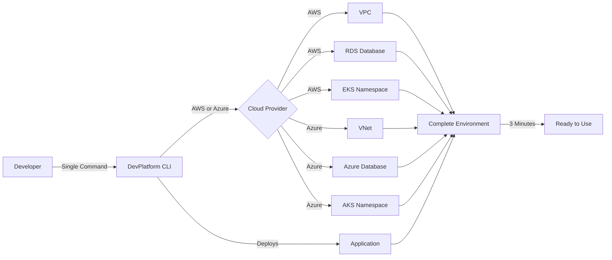
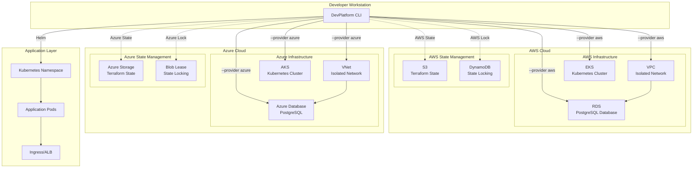

# DevPlatform CLI

> A powerful Internal Developer Platform (IDP) CLI tool that enables developers to self-service provision complete infrastructure environments on AWS or Azure in minutes, not days.

[](https://golang.org)
[](https://terraform.io)
[](https://kubernetes.io)
[](https://aws.amazon.com)
[](https://azure.microsoft.com)

## 🎯 Overview

DevPlatform CLI automates the provisioning of isolated infrastructure environments on AWS or Azure, eliminating the need for DevOps tickets and reducing environment setup time from **2 days to 3 minutes** (95% reduction).



## ✨ Key Features

- **🚀 One-Command Provisioning**: Create complete environments with a single CLI command
- **☁️ Multi-Cloud Support**: Deploy to AWS or Azure with the same CLI interface
- **🔒 Secure by Default**: Built-in security best practices, encryption, and IAM/Azure AD integration
- **💰 Cost Optimized**: Easy teardown, cost estimation, and environment-specific sizing
- **🔄 Idempotent Operations**: Safe to run multiple times, handles state management automatically
- **📊 Real-time Status**: Check environment health and resource status instantly
- **🎨 Beautiful Output**: Colored, formatted terminal output with progress indicators
- **🔍 Comprehensive Logging**: Detailed logs for troubleshooting and audit trails

## 📋 Prerequisites

- **Go**: 1.21 or higher
- **Terraform**: 1.5 or higher
- **Helm**: 3.0 or higher
- **kubectl**: 1.27 or higher
- **AWS CLI**: 2.0 or higher (for AWS deployments)
- **Azure CLI**: 2.0 or higher (for Azure deployments)
- **Cloud Account**: AWS Account or Azure Subscription with appropriate permissions

## 🚀 Quick Start

### Installation

```bash
# Download the latest release
curl -LO https://github.com/yourusername/devplatform-cli/releases/latest/download/devplatform-linux-amd64

# Make it executable
chmod +x devplatform-linux-amd64

# Move to PATH
sudo mv devplatform-linux-amd64 /usr/local/bin/devplatform

# Verify installation
devplatform version
```

### First Environment

```bash
# For AWS: Configure AWS credentials
aws configure

# For Azure: Login to Azure
az login

# Create your first environment on AWS (default)
devplatform create --app payment --env dev

# Or create on Azure
devplatform create --app payment --env dev --provider azure

# Check status
devplatform status --app payment --env dev

# When done, destroy to save costs
devplatform destroy --app payment --env dev --confirm
```

## 📖 Documentation

### Architecture



### Complete Documentation

- **[Architecture Guide](docs/architecture.md)**: System design, components, and data flow
- **[Workflow Guide](docs/workflows.md)**: Detailed command workflows and sequences
- **[Deployment Guide](docs/deployment-guide.md)**: Infrastructure patterns and scaling
- **[Security Guide](docs/security-guide.md)**: Authentication, authorization, and compliance
- **[API Reference](docs/api-reference.md)**: Complete CLI command reference
- **[Troubleshooting Guide](docs/troubleshooting.md)**: Common issues and solutions

## 🎮 Usage

### Create Command

Provision a complete environment with infrastructure and application:

```bash
devplatform create --app <app-name> --env <env-type> [--provider <aws|azure>] [options]
```

**Examples:**

```bash
# Create development environment on AWS (default)
devplatform create --app payment --env dev

# Create on Azure
devplatform create --app payment --env dev --provider azure

# Preview changes without applying (dry-run)
devplatform create --app payment --env staging --dry-run

# Create with custom Helm values
devplatform create --app payment --env prod --values-file custom-values.yaml --provider azure

# Create with verbose output for debugging
devplatform create --app payment --env dev --verbose
```

**Output (AWS):**
```
✓ Validating inputs...
✓ Checking AWS credentials...
✓ Initializing Terraform...
✓ Creating VPC... (10.0.0.0/16)
✓ Creating RDS instance... (db.t3.micro)
✓ Creating EKS namespace... (dev-payment)
✓ Deploying application...
✓ Verifying pods...

Environment created successfully!

RDS Endpoint: payment-dev.abc123.us-east-1.rds.amazonaws.com:5432
Ingress URL:  https://payment-dev.example.com
Namespace:    dev-payment

Estimated monthly cost: $75
```

**Output (Azure):**
```
✓ Validating inputs...
✓ Checking Azure credentials...
✓ Initializing Terraform...
✓ Creating VNet... (10.0.0.0/16)
✓ Creating Azure Database... (Standard_B1ms)
✓ Creating AKS namespace... (dev-payment)
✓ Deploying application...
✓ Verifying pods...

Environment created successfully!

Database Endpoint: payment-dev.postgres.database.azure.com:5432
Ingress URL:  https://payment-dev.example.com
Namespace:    dev-payment

Estimated monthly cost: $70
```

### Status Command

Check the health and status of an existing environment:

```bash
devplatform status --app <app-name> --env <env-type> [--provider <aws|azure>] [options]
```

**Examples:**

```bash
# Check status on AWS (default)
devplatform status --app payment --env dev

# Check status on Azure
devplatform status --app payment --env dev --provider azure

# Output as JSON
devplatform status --app payment --env dev --output json

# Watch mode (refresh every 5 seconds)
devplatform status --app payment --env dev --watch 5
```

**Output (AWS):**
```
Environment Status: payment-dev (AWS)

Component       Status    Details
---------       ------    -------
VPC             OK        vpc-abc123 (10.0.0.0/16)
RDS             OK        payment-dev.abc123.us-east-1.rds.amazonaws.com
Namespace       OK        dev-payment
Pods            OK        2/2 Ready
Ingress         OK        https://payment-dev.example.com

Last Updated: 2026-04-06 10:30:45 UTC
```

**Output (Azure):**
```
Environment Status: payment-dev (Azure)

Component       Status    Details
---------       ------    -------
VNet            OK        vnet-abc123 (10.0.0.0/16)
Azure Database  OK        payment-dev.postgres.database.azure.com
Namespace       OK        dev-payment
Pods            OK        2/2 Ready
Ingress         OK        https://payment-dev.example.com

Last Updated: 2026-04-06 10:30:45 UTC
```

### Destroy Command

Tear down an environment to save costs:

```bash
devplatform destroy --app <app-name> --env <env-type> [options]
```

**Examples:**

```bash
# Destroy with confirmation prompt
devplatform destroy --app payment --env dev

# Destroy without confirmation
devplatform destroy --app payment --env dev --confirm

# Force destroy (ignore errors)
devplatform destroy --app payment --env dev --confirm --force
```

**Output:**
```
⚠ WARNING: This will destroy all resources for payment-dev

The following resources will be deleted:
  - VPC: vpc-abc123
  - RDS Instance: payment-dev
  - EKS Namespace: dev-payment
  - All application pods and services

Are you sure? (yes/no): yes

✓ Uninstalling Helm release...
✓ Deleting Kubernetes resources...
✓ Destroying RDS instance...
✓ Destroying VPC...
✓ Cleaning up Terraform state...

Environment destroyed successfully!

Estimated monthly savings: $75
```

## ⚙️ Configuration

### Configuration File

Create a `.devplatform.yaml` file in your project root:

```yaml
# Global settings
global:
  cloud_provider: aws  # or azure
  timeout: 30
  log_level: info

# AWS-specific settings
aws:
  region: us-east-1
  profile: default

# Azure-specific settings
azure:
  subscription_id: "12345678-1234-1234-1234-123456789012"
  location: eastus
  tenant_id: "87654321-4321-4321-4321-210987654321"

# Environment-specific settings (same for both clouds)
environments:
  dev:
    network_cidr: 10.0.0.0/16
    database_instance_class: small  # Maps to db.t3.micro (AWS) or Standard_B1ms (Azure)
    database_allocated_storage: 20
    k8s_node_count: 2
    
  staging:
    network_cidr: 10.1.0.0/16
    database_instance_class: medium  # Maps to db.t3.medium (AWS) or Standard_B2s (Azure)
    database_allocated_storage: 100
    k8s_node_count: 3
    
  prod:
    network_cidr: 10.2.0.0/16
    database_instance_class: large  # Maps to db.r5.large (AWS) or Standard_D4s_v3 (Azure)
    database_allocated_storage: 500
    database_multi_zone: true
    k8s_node_count: 5

# Terraform settings
terraform:
  backend:
    # For AWS
    type: s3
    bucket: terraform-state-bucket
    dynamodb_table: terraform-locks
    region: us-east-1
    
    # For Azure (alternative)
    # type: azurerm
    # storage_account: tfstatestorage
    # container_name: tfstate
    # resource_group: terraform-state-rg
  
  modules_path: ./terraform/modules
  
# Helm settings (same for both clouds)
helm:
  chart_path: ./charts/devplatform-base
  default_values:
    image:
      repository: nginx
      tag: latest
    resources:
      requests:
        cpu: 100m
        memory: 128Mi
```

### Environment Variables

```bash
# AWS Configuration
export AWS_PROFILE=my-profile
export AWS_REGION=us-east-1

# Azure Configuration
export AZURE_SUBSCRIPTION_ID=12345678-1234-1234-1234-123456789012
export AZURE_TENANT_ID=87654321-4321-4321-4321-210987654321

# CLI Configuration
export DEVPLATFORM_CONFIG=~/.devplatform.yaml
export DEVPLATFORM_LOG_LEVEL=debug
```

## 🏗️ Project Structure

```
devplatform-cli/
├── cmd/                       # CLI commands
│   ├── root.go               # Root command
│   ├── create.go             # Create command
│   ├── status.go             # Status command
│   ├── destroy.go            # Destroy command
│   └── version.go            # Version command
├── internal/                  # Internal packages
│   ├── config/               # Configuration management
│   ├── provider/             # Cloud provider abstraction
│   ├── terraform/            # Terraform wrapper
│   ├── helm/                 # Helm wrapper
│   ├── aws/                  # AWS utilities
│   └── azure/                # Azure utilities
├── terraform/                 # Terraform modules
│   ├── modules/
│   │   ├── aws/
│   │   │   ├── network/      # VPC, subnets, security groups
│   │   │   ├── database/     # RDS configuration
│   │   │   └── k8s-tenant/   # EKS namespace setup
│   │   └── azure/
│   │       ├── network/      # VNet, subnets, NSG
│   │       ├── database/     # Azure Database configuration
│   │       └── k8s-tenant/   # AKS namespace setup
│   └── environments/
│       ├── aws/
│       │   ├── dev/          # AWS dev environment config
│       │   ├── staging/      # AWS staging environment config
│       │   └── prod/         # AWS prod environment config
│       └── azure/
│           ├── dev/          # Azure dev environment config
│           ├── staging/      # Azure staging environment config
│           └── prod/         # Azure prod environment config
├── charts/
│   └── devplatform-base/     # Base Helm chart
├── docs/                      # Documentation
│   ├── architecture.md
│   ├── workflows.md
│   ├── deployment-guide.md
│   ├── security-guide.md
│   ├── api-reference.md
│   └── troubleshooting.md
├── .github/
│   └── workflows/
│       ├── ci.yml            # CI pipeline
│       └── release.yml       # Release pipeline
├── go.mod
├── go.sum
└── README.md
```

## 🔒 Security

### AWS IAM Permissions

The CLI requires the following AWS IAM permissions:

```json
{
  "Version": "2012-10-17",
  "Statement": [
    {
      "Effect": "Allow",
      "Action": [
        "ec2:*",
        "rds:*",
        "eks:DescribeCluster",
        "s3:GetObject",
        "s3:PutObject",
        "dynamodb:PutItem",
        "dynamodb:GetItem",
        "secretsmanager:CreateSecret",
        "secretsmanager:GetSecretValue"
      ],
      "Resource": "*"
    }
  ]
}
```

### Azure RBAC Roles

The CLI requires the following Azure RBAC roles:

- **Contributor** role on the subscription or resource group
- **User Access Administrator** role for managed identity assignments
- Or specific permissions:
  - `Microsoft.Network/*`
  - `Microsoft.DBforPostgreSQL/*`
  - `Microsoft.ContainerService/managedClusters/*`
  - `Microsoft.Storage/*`
  - `Microsoft.KeyVault/*`

### Security Features

- **Encryption at Rest**: All data encrypted using AWS KMS or Azure Key Vault
- **Encryption in Transit**: TLS 1.2+ for all connections
- **Network Isolation**: Resources in private subnets
- **Cloud Authentication**: Uses AWS IAM or Azure AD for authentication
- **Audit Logging**: CloudTrail/VPC Flow Logs (AWS) or Azure Monitor/Network Watcher (Azure)
- **Secret Management**: AWS Secrets Manager or Azure Key Vault for credentials

## 💰 Cost Optimization

### Environment Costs

#### AWS
| Environment | Monthly Cost | Resources |
|-------------|--------------|-----------|
| Dev | $50-75 | Small instances, single AZ |
| Staging | $200-300 | Medium instances, single AZ |
| Prod | $800-1200 | Large instances, multi-AZ, HA |

#### Azure
| Environment | Monthly Cost | Resources |
|-------------|--------------|-----------|
| Dev | $45-70 | Small SKUs, single zone |
| Staging | $180-280 | Medium SKUs, single zone |
| Prod | $750-1100 | Large SKUs, zone-redundant, HA |

### Cost Saving Tips

1. **Destroy unused environments**: Use `devplatform destroy` when not needed
2. **Use appropriate sizing**: Don't over-provision dev/staging
3. **Enable auto-shutdown**: Schedule destruction of dev environments overnight
4. **Monitor usage**: Use `devplatform status` to track resource usage
5. **Compare cloud providers**: Use `--dry-run` to compare costs between AWS and Azure

## 🤝 Contributing

Contributions are welcome! Please read our [Contributing Guide](CONTRIBUTING.md) for details.

### Development Setup

```bash
# Clone repository
git clone https://github.com/yourusername/devplatform-cli.git
cd devplatform-cli

# Install dependencies
go mod download

# Run tests
go test ./...

# Build binary
go build -o devplatform main.go

# Run locally
./devplatform version
```

## 📊 Metrics & Impact

- **95% reduction** in environment provisioning time (2 days → 3 minutes)
- **Zero DevOps tickets** for environment provisioning
- **Consistent environments** across dev, staging, and production
- **Automated cost management** through easy teardown
- **Improved developer productivity** through self-service

## 🗺️ Roadmap

- [x] Multi-cloud support (AWS and Azure)
- [ ] GCP support
- [ ] GitOps integration
- [ ] Environment templates
- [ ] Cost optimization recommendations
- [ ] Automated scaling policies
- [ ] Disaster recovery automation
- [ ] Compliance reporting
- [ ] Multi-region deployments

## 📝 License

This project is licensed under the MIT License - see the [LICENSE](LICENSE) file for details.

## 🙏 Acknowledgments

- Built with [Cobra](https://github.com/spf13/cobra) for CLI framework
- Infrastructure managed by [Terraform](https://www.terraform.io/)
- Application deployment via [Helm](https://helm.sh/)
- Powered by [AWS](https://aws.amazon.com/)

## 📞 Support

- **Documentation**: [docs/](docs/)
- **Issues**: [GitHub Issues](https://github.com/yourusername/devplatform-cli/issues)
- **Discussions**: [GitHub Discussions](https://github.com/yourusername/devplatform-cli/discussions)

---

**Made with ❤️ for developers who want to move fast without breaking things.**
