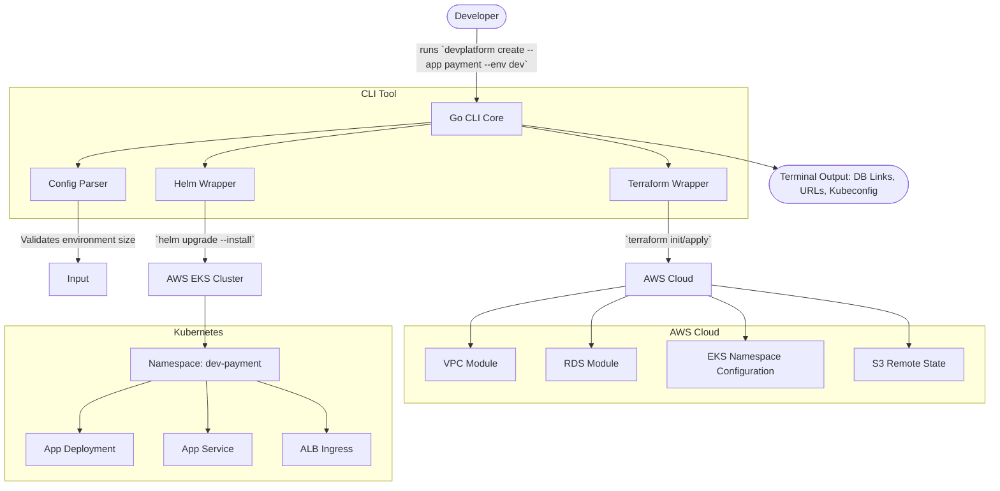
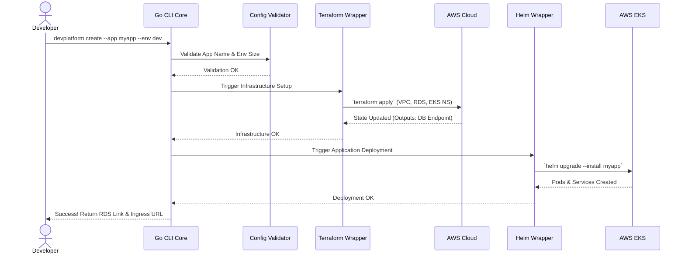
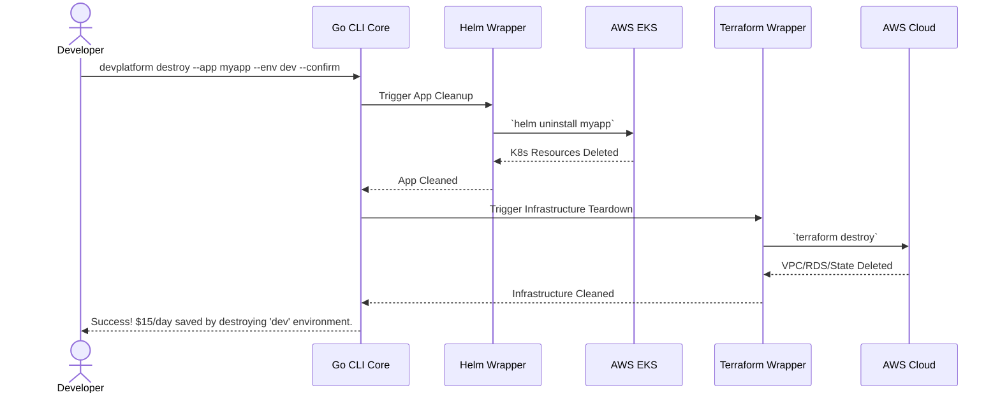

# 🚀 DevPlatform CLI: Comprehensive Project Specification

**Goal:** Build a command-line interface tool in Go that acts as an Internal Developer Platform (IDP). It enables developers to provision self-service, isolated infrastructure environments (VPC, RDS, EKS namespace, and initial deployment) for their applications without raising tickets to the DevOps team.

---

## 🏗️ 1. Complete Architecture Diagram



---

## 📂 2. Recommended Repository Structure

```text
devplatform-cli/
├── README.md                  # Comprehensive documentation, diagrams, problem/solution
├── cmd/                       # Standard Go CLI entry points (Cobra framework)
│   ├── root.go                # devplatform base command setup
│   ├── create.go              # devplatform create ...
│   ├── destroy.go             # devplatform destroy ...
│   └── status.go              # devplatform status ...
├── internal/                  # Private application and library code
│   ├── config/                # Environment config reading (yaml generation)
│   ├── terraform/             # Go wrappers to execute 'terraform' binary natively
│   ├── helm/                  # Helm client implementation or 'helm' CLI wrapper
│   └── aws/                   # Utilities for connecting to AWS / updating kubeconfig
├── terraform/                 # Infrastructure as Code
│   ├── modules/
│   │   ├── network/           # VPC, Subnets, SG
│   │   ├── database/          # RDS logic
│   │   └── eks-tenant/        # IAM bindings, namespaces, quotas
│   └── environments/
│       ├── dev/               # Small footprint configurations
│       ├── staging/           # Medium footprint
│       └── prod/              # High Availability footprint
├── charts/
│   └── devplatform-base/      # Universal base helm chart for deploying newly provisioned apps
├── .github/
│   └── workflows/
│       ├── ci.yml             # Builds Go CLI, run tests, linting
│       └── release.yml        # Build binaries upon GitHub tag/release
├── go.mod                     # Go dependencies
├── go.sum                     # Go checksums
└── docs/                      # Extensive docs including runbooks for standard ops
```

---

## 💻 3. Command Usage Specifications

### `devplatform create`
Provisions an environment or spins up infrastructure for a target app.

**Command:** 
`devplatform create --app <app-name> --env <env-type> [--dry-run]`

**Execution Sequence Diagram:**


**Workflow Step-by-Step:**
1. Validates inputs and authenticates with AWS (checking active profiles/tokens).
2. Uses the `terraform` internal package to call the `dev` environment backend.
3. Overrides Terraform variables using `-var="app_name=..." -var="env=..."`.
4. Executes `terraform init` and `terraform apply -auto-approve`.
5. Uses the `helm` internal package to install the application's base chart inside EKS in its dedicated namespace.
6. Returns the RDS Endpoint, S3 Bucket URI, and Application Ingress URL back to the developer in the terminal.

### `devplatform status`
Checks the state of an existing provisioned environment.

**Command:**
`devplatform status --app <app-name> --env <env-type>`

**Workflow Step-by-Step:**
1. Triggers `terraform workspace show` or inspects remote state to ensure resources exist.
2. Uses Kubernetes client-go to check Pod Health and Ingress mapping in the specific namespace.
3. Aggregates the results into a clean table (e.g., Database: OK, Pods: 2/2, URL: app.dev.internal).

### `devplatform destroy`
Cleans up the environment, critical for FinOps / Cost Savings.

**Command:**
`devplatform destroy --app <app-name> --env <env-type> --confirm`

**Execution Sequence Diagram:**


**Workflow Step-by-Step:**
1. Requires the `--confirm` tag or an interactive terminal prompt to prevent accidents.
2. Destroys the Helm deployment to clear Kubernetes resources.
3. Triggers `terraform destroy -auto-approve`.
4. Outputs the estimated "money saved" message to enforce cost-mindfulness.

---

## 🛠️ 4. Tech Stack Justifications (Interview Points)

- **Go (Golang) for CLI:** Most cloud-native tools (Kubernetes, Terraform, Docker) are built using Go. Using Go shows deep alignment with modern infrastructure engineering. The standard library makes CLI building (via Cobra framework) incredibly fast and portable across OSes.
- **Terraform Modules:** By modularizing infrastructure, the CLI abstracts complex security group and networking knowledge away from the developer. They just say "give me a dev database."
- **Helm:** Parameterizes Kubernetes manifests efficiently. The CLI passes `--set env=dev --set name=myapp`.
- **AWS Remote State (S3/DynamoDB):** Essential for maintaining states when developers run commands from different laptops or instances.

---

## 📈 5. Expected Business Impact (Metrics to Add to Resume)

If you configure this correctly, you can add powerful bullet points like this to your resume:

- *"Designed an Internal Developer Platform (IDP) CLI in Go, empowering engineering teams to self-service cloud environments."*
- *"Reduced environment provisioning lead-time by **95%** (from 2 days resolving DevOps Jira tickets to 3 minutes of automated Terraform/Helm execution)."*
- *"Enforced automated FinOps cleanup protocols ensuring forgotten developer environments are destroyed, limiting AWS footprint."*

---

## 🛠️ 6. Implementation Milestones (Suggested Progress Tracking)

1. **Week 1: Go CLI Scaffold & Local Logic**
   - Goal: Learn Cobra CLI framework in Go. Set up `create`, `status`, `destroy` basic hooks.
   - Outcome: A working binary that parses arguments and prints expected actions.
2. **Week 2: The Terraform Engine**
   - Goal: Build the AWS Terraform modules for VPC and RDS. Make the Go CLI able to successfully execute `terraform apply` locally using `os/exec` libraries.
3. **Week 3: Kubernetes & Helm Integration**
   - Goal: Program the CLI to interface with EKS or a local KinD/Minikube cluster. Have it execute a standard Helm chart installation.
4. **Week 4: Polish & Documentation**
   - Goal: Wrap outputs in beautiful terminal colors using libraries like `fatih/color`. Output the architecture diagram to your GitHub Readme. Record an asciinema or GIF of the tool in action to embed in the repo.
