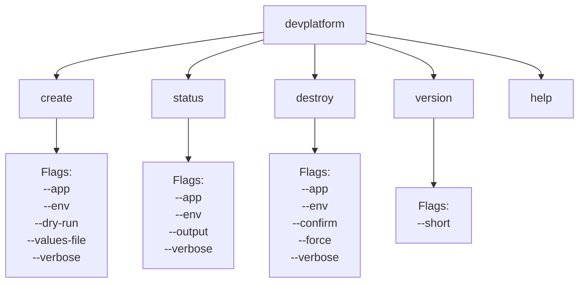
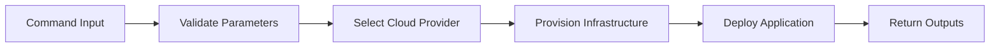
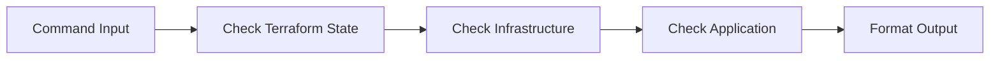
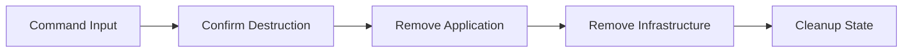
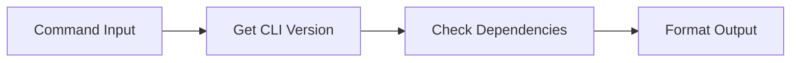
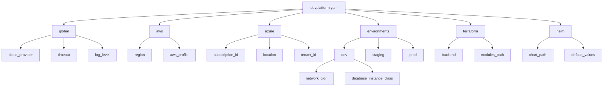
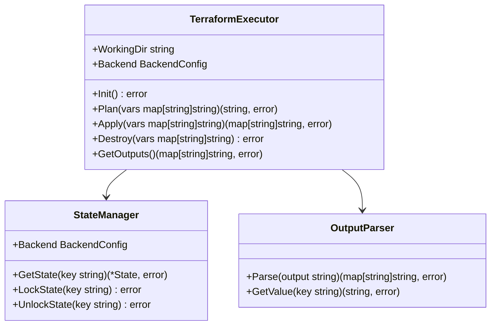
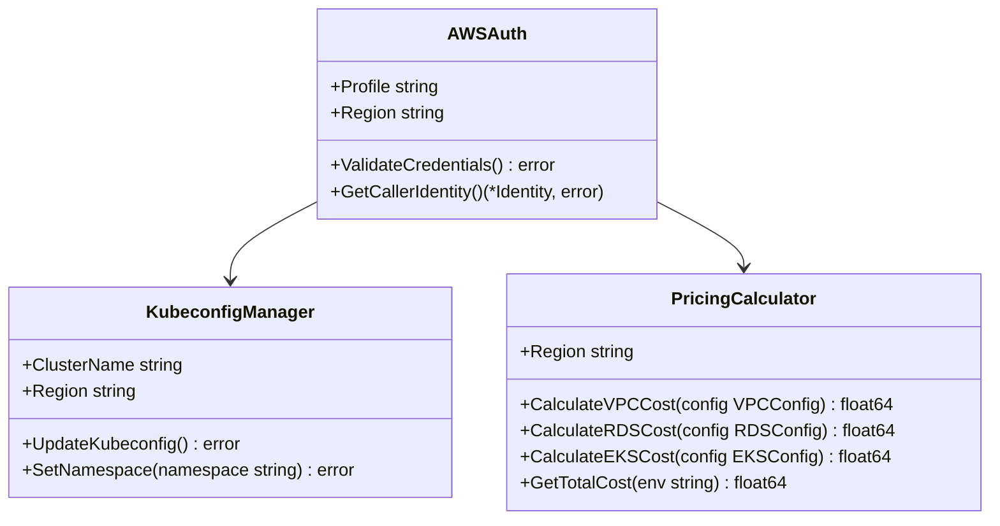
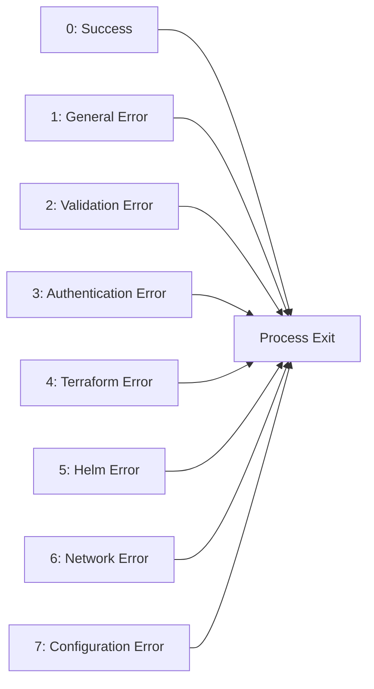

# DevPlatform CLI - API Reference

## CLI Command Structure



## Command Reference

### devplatform create

Creates a new environment with infrastructure and application deployment on AWS or Azure.



**Syntax:**
```bash
devplatform create --app <app-name> --env <env-type> --provider <aws|azure> [options]
```

**Required Flags:**
- `--app, -a`: Application name (3-32 characters, lowercase alphanumeric and hyphens)
- `--env, -e`: Environment type (dev, staging, prod)
- `--provider, -p`: Cloud provider (aws or azure) (default: aws)

**Optional Flags:**
- `--dry-run`: Preview changes without applying them
- `--values-file`: Path to custom Helm values file
- `--config`: Path to custom configuration file (default: .devplatform.yaml)
- `--verbose, -v`: Enable verbose output
- `--debug`: Enable debug logging
- `--no-color`: Disable colored output
- `--timeout`: Operation timeout in minutes (default: 30)

**Examples:**
```bash
# Create dev environment on AWS (default)
devplatform create --app payment --env dev

# Create dev environment on AWS (explicit)
devplatform create --app payment --env dev --provider aws

# Create dev environment on Azure
devplatform create --app payment --env dev --provider azure

# Create with dry-run on Azure
devplatform create --app payment --env staging --provider azure --dry-run

# Create with custom values on AWS
devplatform create --app payment --env prod --provider aws --values-file custom-values.yaml

# Create with verbose output
devplatform create --app payment --env dev --provider azure --verbose
```

**Output (AWS):**
```
✓ Validating inputs...
✓ Checking AWS credentials...
✓ Initializing Terraform...
✓ Creating VPC... (10.0.0.0/16)
✓ Creating RDS instance... (db.t3.micro)
✓ Creating EKS namespace... (dev-payment)
✓ Deploying application...
✓ Verifying pods...

Environment created successfully!

Database Endpoint: payment-dev.abc123.us-east-1.rds.amazonaws.com:5432
Ingress URL:       https://payment-dev.example.com
Namespace:         dev-payment
Cloud Provider:    AWS (us-east-1)

To configure kubectl access:
  aws eks update-kubeconfig --name shared-devplatform-cluster --region us-east-1
  kubectl config set-context --current --namespace=dev-payment
```

**Output (Azure):**
```
✓ Validating inputs...
✓ Checking Azure credentials...
✓ Initializing Terraform...
✓ Creating VNet... (10.0.0.0/16)
✓ Creating Azure Database... (B_Gen5_1)
✓ Creating AKS namespace... (dev-payment)
✓ Deploying application...
✓ Verifying pods...

Environment created successfully!

Database Endpoint: payment-dev.postgres.database.azure.com:5432
Ingress URL:       https://payment-dev.example.com
Namespace:         dev-payment
Cloud Provider:    Azure (eastus)

To configure kubectl access:
  az aks get-credentials --name shared-devplatform-cluster --resource-group devplatform-rg
  kubectl config set-context --current --namespace=dev-payment
```

### devplatform status

Checks the status of an existing environment on AWS or Azure.



**Syntax:**
```bash
devplatform status --app <app-name> --env <env-type> --provider <aws|azure> [options]
```

**Required Flags:**
- `--app, -a`: Application name
- `--env, -e`: Environment type
- `--provider, -p`: Cloud provider (aws or azure) (default: aws)

**Optional Flags:**
- `--output, -o`: Output format (table, json, yaml) (default: table)
- `--verbose, -v`: Enable verbose output
- `--watch, -w`: Watch mode (refresh every N seconds)
- `--no-color`: Disable colored output

**Examples:**
```bash
# Check status on AWS
devplatform status --app payment --env dev --provider aws

# Check status on Azure
devplatform status --app payment --env dev --provider azure

# JSON output
devplatform status --app payment --env dev --provider azure --output json

# Watch mode
devplatform status --app payment --env dev --provider aws --watch 5
```

**Output (Table Format - AWS):**
```
Environment Status: payment-dev (AWS)

Component       Status    Details
---------       ------    -------
VPC             OK        vpc-abc123 (10.0.0.0/16)
RDS             OK        payment-dev.abc123.us-east-1.rds.amazonaws.com
Namespace       OK        dev-payment
Pods            OK        2/2 Ready
Ingress         OK        https://payment-dev.example.com

Last Updated: 2026-04-06 10:30:45 UTC
```

**Output (Table Format - Azure):**
```
Environment Status: payment-dev (Azure)

Component       Status    Details
---------       ------    -------
VNet            OK        vnet-abc123 (10.0.0.0/16)
Azure Database  OK        payment-dev.postgres.database.azure.com
Namespace       OK        dev-payment
Pods            OK        2/2 Ready
Ingress         OK        https://payment-dev.example.com

Last Updated: 2026-04-06 10:30:45 UTC
```

**Output (JSON Format):**
```json
{
  "app": "payment",
  "env": "dev",
  "status": "healthy",
  "components": {
    "vpc": {
      "status": "ok",
      "id": "vpc-abc123",
      "cidr": "10.0.0.0/16"
    },
    "rds": {
      "status": "ok",
      "endpoint": "payment-dev.abc123.us-east-1.rds.amazonaws.com",
      "engine": "postgres",
      "version": "14.7"
    },
    "namespace": {
      "status": "ok",
      "name": "dev-payment"
    },
    "pods": {
      "status": "ok",
      "ready": 2,
      "total": 2
    },
    "ingress": {
      "status": "ok",
      "url": "https://payment-dev.example.com"
    }
  },
  "last_updated": "2026-04-06T10:30:45Z"
}
```

### devplatform destroy

Destroys an existing environment and all associated resources on AWS or Azure.



**Syntax:**
```bash
devplatform destroy --app <app-name> --env <env-type> --provider <aws|azure> [options]
```

**Required Flags:**
- `--app, -a`: Application name
- `--env, -e`: Environment type
- `--provider, -p`: Cloud provider (aws or azure) (default: aws)

**Optional Flags:**
- `--confirm, -y`: Skip confirmation prompt
- `--force`: Force destruction even if errors occur
- `--keep-state`: Keep Terraform state file after destruction
- `--verbose, -v`: Enable verbose output
- `--no-color`: Disable colored output

**Examples:**
```bash
# Destroy with confirmation prompt (AWS)
devplatform destroy --app payment --env dev --provider aws

# Destroy without confirmation (Azure)
devplatform destroy --app payment --env dev --provider azure --confirm

# Force destroy
devplatform destroy --app payment --env dev --provider aws --confirm --force
```

**Output (AWS):**
```
⚠ WARNING: This will destroy all resources for payment-dev on AWS

The following resources will be deleted:
  - VPC: vpc-abc123
  - RDS Instance: payment-dev
  - EKS Namespace: dev-payment
  - All application pods and services

Are you sure? (yes/no): yes

✓ Uninstalling Helm release...
✓ Deleting Kubernetes resources...
✓ Destroying RDS instance...
✓ Destroying VPC...
✓ Cleaning up Terraform state...

Environment destroyed successfully!

Estimated monthly savings: $75
```

**Output (Azure):**
```
⚠ WARNING: This will destroy all resources for payment-dev on Azure

The following resources will be deleted:
  - VNet: vnet-abc123
  - Azure Database: payment-dev
  - AKS Namespace: dev-payment
  - All application pods and services

Are you sure? (yes/no): yes

✓ Uninstalling Helm release...
✓ Deleting Kubernetes resources...
✓ Destroying Azure Database...
✓ Destroying VNet...
✓ Cleaning up Terraform state...

Environment destroyed successfully!

Estimated monthly savings: $75
```

### devplatform version

Displays version information for the CLI and dependencies.



**Syntax:**
```bash
devplatform version [options]
```

**Optional Flags:**
- `--short, -s`: Display only version number
- `--check-deps`: Check dependency versions

**Examples:**
```bash
# Full version info
devplatform version

# Short version
devplatform version --short

# Check dependencies
devplatform version --check-deps
```

**Output:**
```
DevPlatform CLI
Version:    1.0.0
Git Commit: a1b2c3d
Build Date: 2026-04-01T12:00:00Z
Go Version: go1.21.5
Platform:   linux/amd64

Dependencies:
  Terraform:  1.5.7 ✓
  Helm:       3.12.0 ✓
  Kubectl:    1.27.3 ✓
  AWS CLI:    2.13.0 ✓
  Azure CLI:  2.50.0 ✓
```

## Configuration File Schema

### .devplatform.yaml Structure



**Example Configuration:**
```yaml
# Global settings
global:
  cloud_provider: aws  # or azure
  timeout: 30
  log_level: info

# AWS-specific settings
aws:
  region: us-east-1
  profile: default

# Azure-specific settings
azure:
  subscription_id: "12345678-1234-1234-1234-123456789012"
  location: eastus
  tenant_id: "87654321-4321-4321-4321-210987654321"

# Environment-specific settings (same for both clouds)
environments:
  dev:
    network_cidr: 10.0.0.0/16
    database_instance_class: small  # Maps to db.t3.micro (AWS) or B_Gen5_1 (Azure)
    database_allocated_storage: 20
    k8s_node_count: 2
    
  staging:
    network_cidr: 10.1.0.0/16
    database_instance_class: medium  # Maps to db.t3.medium (AWS) or GP_Gen5_2 (Azure)
    database_allocated_storage: 100
    k8s_node_count: 3
    
  prod:
    network_cidr: 10.2.0.0/16
    database_instance_class: large  # Maps to db.r5.large (AWS) or MO_Gen5_4 (Azure)
    database_allocated_storage: 500
    database_multi_zone: true
    k8s_node_count: 5

# Terraform settings
terraform:
  backend:
    # For AWS
    type: s3
    bucket: terraform-state-bucket
    dynamodb_table: terraform-locks
    region: us-east-1
    
    # For Azure (alternative)
    # type: azurerm
    # storage_account: tfstatestorage
    # container_name: tfstate
    # resource_group: terraform-state-rg
  
  modules_path: ./terraform/modules
  
# Helm settings (same for both clouds)
helm:
  chart_path: ./charts/devplatform-base
  default_values:
    image:
      repository: nginx
      tag: latest
    resources:
      requests:
        cpu: 100m
        memory: 128Mi
```

## Internal Package APIs

### Config Package

```mermaid
classDiagram
    class Config {
        +Global GlobalConfig
        +Environments map[string]EnvironmentConfig
        +Terraform TerraformConfig
        +Helm HelmConfig
        +Load(path string) error
        +Validate() error
        +GetEnvironment(env string) EnvironmentConfig
    }
    
    class GlobalConfig {
        +Region string
        +AWSProfile string
        +Timeout int
        +LogLevel string
    }
    
    class EnvironmentConfig {
        +VPCCIDR string
        +RDSInstanceClass string
        +RDSAllocatedStorage int
        +RDSMultiAZ bool
        +EKSNodeCount int
    }
    
    class TerraformConfig {
        +Backend BackendConfig
        +ModulesPath string
    }
    
    class HelmConfig {
        +ChartPath string
        +DefaultValues map[string]interface{}
    }
    
    Config --> GlobalConfig
    Config --> EnvironmentConfig
    Config --> TerraformConfig
    Config --> HelmConfig
```

**Functions:**
```go
// Load configuration from file
func Load(path string) (*Config, error)

// Validate configuration
func (c *Config) Validate() error

// Get environment-specific configuration
func (c *Config) GetEnvironment(env string) (*EnvironmentConfig, error)

// Merge CLI flags with config
func (c *Config) MergeFlags(flags map[string]interface{}) error
```

### Terraform Package



**Functions:**
```go
// Initialize Terraform
func (te *TerraformExecutor) Init() error

// Generate execution plan
func (te *TerraformExecutor) Plan(vars map[string]string) (string, error)

// Apply infrastructure changes
func (te *TerraformExecutor) Apply(vars map[string]string) (map[string]string, error)

// Destroy infrastructure
func (te *TerraformExecutor) Destroy(vars map[string]string) error

// Get Terraform outputs
func (te *TerraformExecutor) GetOutputs() (map[string]string, error)

// Get state from backend
func (sm *StateManager) GetState(key string) (*State, error)

// Acquire state lock
func (sm *StateManager) LockState(key string) error

// Release state lock
func (sm *StateManager) UnlockState(key string) error
```

### Helm Package

```mermaid
classDiagram
    class HelmClient {
        +ChartPath string
        +Namespace string
        +Install(name string, values map[string]interface{}) error
        +Upgrade(name string, values map[string]interface{}) error
        +Uninstall(name string) error
        +Status(name string) (*ReleaseStatus, error)
    }
    
    class ChartManager {
        +LoadChart(path string) (*Chart, error)
        +ValidateChart(chart *Chart) error
    }
    
    class ValuesMerger {
        +MergeValues(base, override map[string]interface{}) map[string]interface{}
        +LoadValuesFile(path string) (map[string]interface{}, error)
    }
    
    HelmClient --> ChartManager
    HelmClient --> ValuesMerger
```

**Functions:**
```go
// Install Helm release
func (hc *HelmClient) Install(name string, values map[string]interface{}) error

// Upgrade existing release
func (hc *HelmClient) Upgrade(name string, values map[string]interface{}) error

// Uninstall release
func (hc *HelmClient) Uninstall(name string) error

// Get release status
func (hc *HelmClient) Status(name string) (*ReleaseStatus, error)

// Load chart from path
func (cm *ChartManager) LoadChart(path string) (*Chart, error)

// Validate chart structure
func (cm *ChartManager) ValidateChart(chart *Chart) error

// Merge values with priority
func (vm *ValuesMerger) MergeValues(base, override map[string]interface{}) map[string]interface{}
```

### AWS Package



**Functions:**
```go
// Validate AWS credentials
func (aa *AWSAuth) ValidateCredentials() error

// Get caller identity
func (aa *AWSAuth) GetCallerIdentity() (*Identity, error)

// Update kubeconfig for EKS
func (km *KubeconfigManager) UpdateKubeconfig() error

// Set default namespace
func (km *KubeconfigManager) SetNamespace(namespace string) error

// Calculate infrastructure costs
func (pc *PricingCalculator) CalculateVPCCost(config VPCConfig) float64
func (pc *PricingCalculator) CalculateRDSCost(config RDSConfig) float64
func (pc *PricingCalculator) CalculateEKSCost(config EKSConfig) float64
func (pc *PricingCalculator) GetTotalCost(env string) float64
```

## Error Codes

```mermaid
graph TB
    Errors[Error Codes] --> Auth[Authentication Errors<br/>1000-1099]
    Errors --> Validation[Validation Errors<br/>1100-1199]
    Errors --> Terraform[Terraform Errors<br/>1200-1299]
    Errors --> Helm[Helm Errors<br/>1300-1399]
    Errors --> Network[Network Errors<br/>1400-1499]
    Errors --> Config[Configuration Errors<br/>1500-1599]
    Errors --> AzureAuth[Azure Authentication Errors<br/>2000-2099]
    Errors --> AzureResource[Azure Resource Errors<br/>2100-2199]
    
    Auth --> E1001[1001: No AWS Credentials]
    Auth --> E1002[1002: Expired Credentials]
    Auth --> E1003[1003: Insufficient Permissions]
    
    Validation --> E1101[1101: Invalid App Name]
    Validation --> E1102[1102: Invalid Environment]
    Validation --> E1103[1103: Missing Required Flag]
    
    Terraform --> E1201[1201: Init Failed]
    Terraform --> E1202[1202: Apply Failed]
    Terraform --> E1203[1203: State Locked]
    
    Helm --> E1301[1301: Chart Not Found]
    Helm --> E1302[1302: Install Failed]
    Helm --> E1303[1303: Pods Not Ready]
    
    Network --> E1401[1401: Connection Timeout]
    Network --> E1402[1402: DNS Resolution Failed]
    
    Config --> E1501[1501: Config File Not Found]
    Config --> E1502[1502: Invalid YAML Syntax]
    
    AzureAuth --> E2001[2001: No Azure Credentials]
    AzureAuth --> E2002[2002: Azure CLI Not Configured]
    AzureAuth --> E2003[2003: Subscription Not Found]
    
    AzureResource --> E2101[2101: Azure Resource Creation Failed]
    AzureResource --> E2102[2102: Azure Storage Backend Error]
    AzureResource --> E2103[2103: AKS Connection Failed]
```



**Error Code Reference:**

| Code | Category | Description | Resolution |
|------|----------|-------------|------------|
| 1001 | Auth | No AWS credentials found | Configure AWS CLI credentials |
| 1002 | Auth | AWS credentials expired | Refresh credentials or re-authenticate |
| 1003 | Auth | Insufficient IAM permissions | Grant required IAM permissions |
| 1101 | Validation | Invalid application name format | Use lowercase alphanumeric and hyphens |
| 1102 | Validation | Invalid environment type | Use dev, staging, or prod |
| 1103 | Validation | Missing required flag | Provide all required flags |
| 1201 | Terraform | Terraform init failed | Check Terraform configuration |
| 1202 | Terraform | Terraform apply failed | Review Terraform error output |
| 1203 | Terraform | State locked by another process | Wait for lock release or force unlock |
| 1301 | Helm | Helm chart not found | Verify chart path |
| 1302 | Helm | Helm install failed | Check Helm error output |
| 1303 | Helm | Pods not ready after timeout | Check pod logs and events |
| 1401 | Network | Connection timeout | Check network connectivity |
| 1402 | Network | DNS resolution failed | Verify DNS configuration |
| 1501 | Config | Configuration file not found | Create .devplatform.yaml |
| 1502 | Config | Invalid YAML syntax | Fix YAML syntax errors |
| 2001 | Azure Auth | No Azure credentials found | Run `az login` |
| 2002 | Azure Auth | Azure CLI not configured | Install and configure Azure CLI |
| 2003 | Azure Auth | Azure subscription not found | Verify subscription ID |
| 2101 | Azure Resource | Azure resource creation failed | Check Azure error details |
| 2102 | Azure Resource | Azure Storage backend error | Verify storage account configuration |
| 2103 | Azure Resource | AKS connection failed | Check AKS cluster status |

## Exit Codes



| Exit Code | Description |
|-----------|-------------|
| 0 | Success |
| 1 | General error |
| 2 | Validation error |
| 3 | Authentication error |
| 4 | Terraform error |
| 5 | Helm error |
| 6 | Network error |
| 7 | Configuration error |
