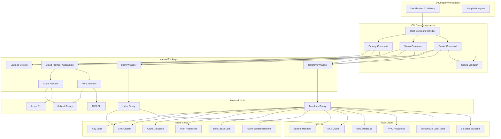
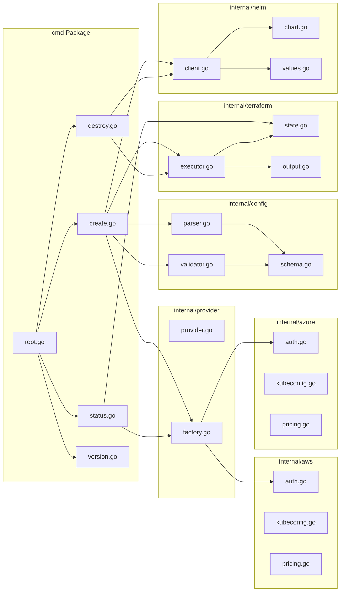
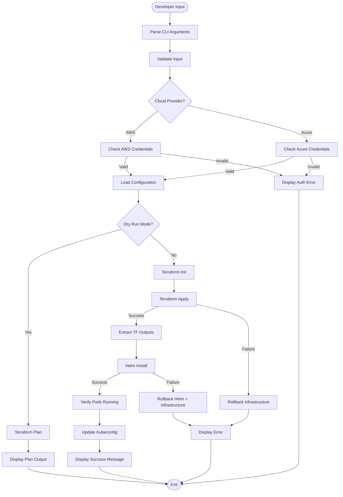
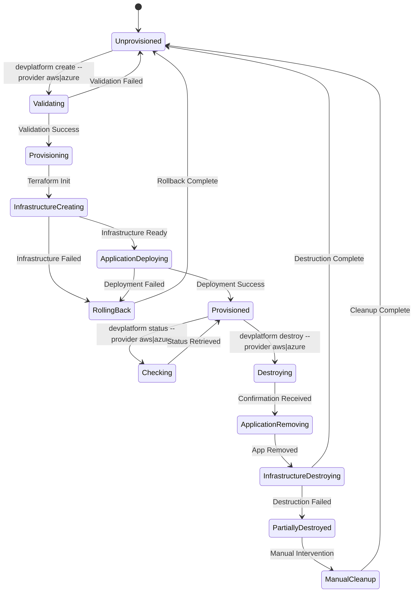
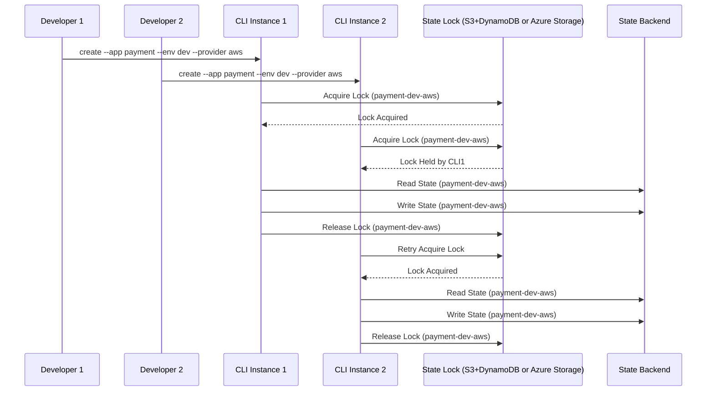
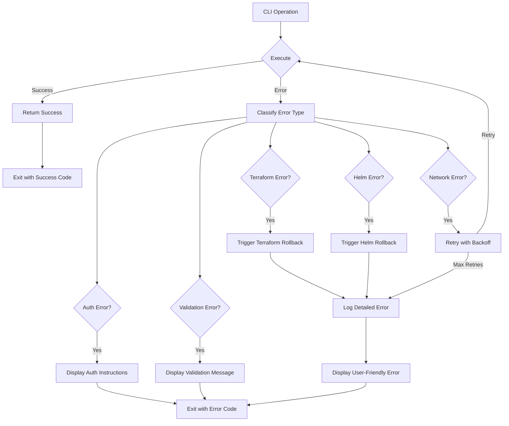
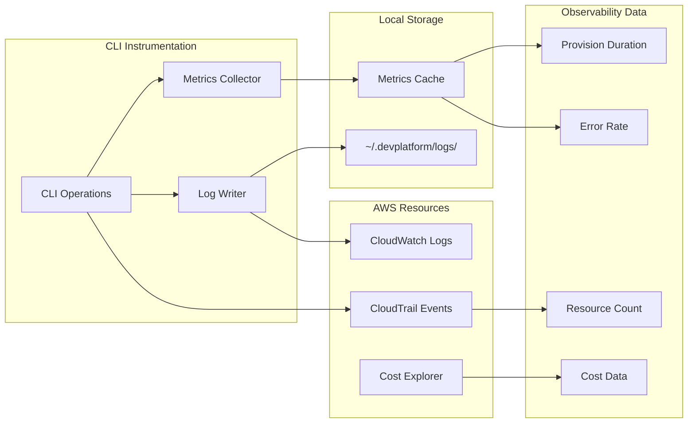
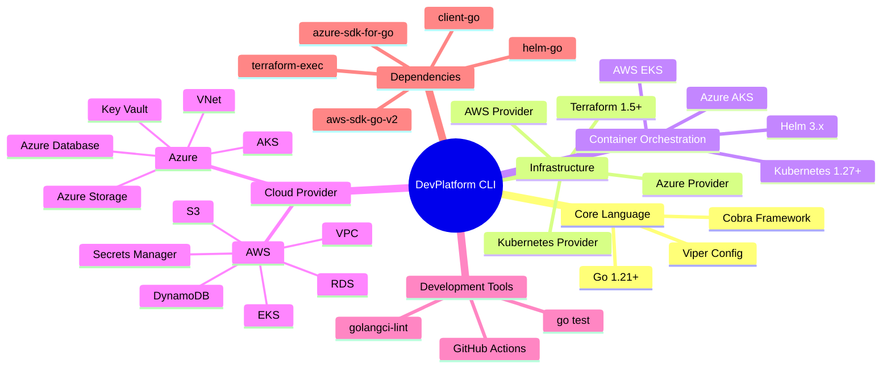
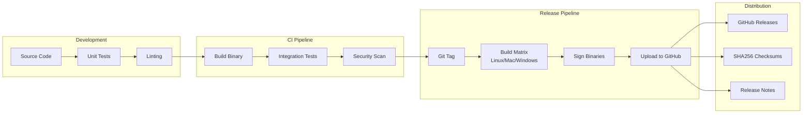

# DevPlatform CLI - Architecture Documentation

## System Overview

The DevPlatform CLI is an Internal Developer Platform (IDP) that enables self-service infrastructure provisioning on AWS or Azure. It orchestrates Terraform for infrastructure management and Helm for Kubernetes deployments, providing a consistent developer experience across both cloud providers.

## High-Level Architecture



## Component Architecture



## Data Flow Architecture



## Deployment Architecture

```mermaid
graph TB
    subgraph "Developer Machine"
        CLI[DevPlatform CLI]
    end
    
    subgraph "AWS Account"
        subgraph "Shared Infrastructure (AWS)"
            S3State[S3 Bucket<br/>terraform-state]
            DynamoLock[DynamoDB Table<br/>terraform-locks]
            EKSCluster[EKS Cluster<br/>shared-cluster]
        end
        
        subgraph "App Environment: payment-dev (AWS)"
            VPC1[VPC<br/>10.0.0.0/16]
            RDS1[RDS Instance<br/>db.t3.micro]
            NS1[Namespace<br/>dev-payment]
            Pods1[Application Pods]
            Ingress1[ALB Ingress]
        end
    end
    
    subgraph "Azure Subscription"
        subgraph "Shared Infrastructure (Azure)"
            AzureStorageState[Azure Storage<br/>terraform-state]
            BlobLease[Blob Lease Lock]
            AKSCluster[AKS Cluster<br/>shared-cluster]
        end
        
        subgraph "App Environment: payment-dev (Azure)"
            VNet1[VNet<br/>10.0.0.0/16]
            AzureDB1[Azure Database<br/>B_Gen5_1]
            NS2[Namespace<br/>dev-payment]
            Pods2[Application Pods]
            Ingress2[Azure LB Ingress]
        end
    end
    
    CLI -->|--provider aws| VPC1
    CLI -->|--provider aws| RDS1
    CLI -->|--provider aws| NS1
    
    CLI -->|--provider azure| VNet1
    CLI -->|--provider azure| AzureDB1
    CLI -->|--provider azure| NS2
    
    VPC1 --> RDS1
    NS1 --> Pods1
    Pods1 --> Ingress1
    Pods1 -.->|Connect| RDS1
    
    VNet1 --> AzureDB1
    NS2 --> Pods2
    Pods2 --> Ingress2
    Pods2 -.->|Connect| AzureDB1
    
    CLI -.->|State (AWS)| S3State
    CLI -.->|Lock (AWS)| DynamoLock
    NS1 -.->|Runs in| EKSCluster
    
    CLI -.->|State (Azure)| AzureStorageState
    CLI -.->|Lock (Azure)| BlobLease
    NS2 -.->|Runs in| AKSCluster
```

## Security Architecture

```mermaid
graph TB
    subgraph "Authentication Layer"
        DevCreds[Developer Credentials]
        AWSAuth[AWS IAM Role/User]
        AzureAuth[Azure Service Principal/Managed Identity]
        AssumeRole[Assume Role / Get Token]
    end
    
    subgraph "Authorization Layer"
        IAMPolicies[IAM Policies (AWS)]
        AzureRBAC[Azure RBAC]
        K8sRBAC[Kubernetes RBAC]
        IRSA[IRSA (AWS)]
        WorkloadIdentity[Workload Identity (Azure)]
    end
    
    subgraph "Network Security"
        AWSSG[Security Groups (AWS)]
        AzureNSG[Network Security Groups (Azure)]
        NACL[Network ACLs (AWS)]
        PrivateSubnet[Private Subnets]
        NAT[NAT Gateway]
    end
    
    subgraph "Data Security"
        Encryption[Database Encryption at Rest]
        SecretsManager[Secrets Manager (AWS)]
        KeyVault[Key Vault (Azure)]
        TLS[TLS in Transit]
    end
    
    subgraph "Audit & Compliance"
        CloudTrail[CloudTrail (AWS)]
        ActivityLog[Activity Log (Azure)]
        VPCFlowLogs[VPC Flow Logs (AWS)]
        NSGFlowLogs[NSG Flow Logs (Azure)]
        Tags[Resource Tags]
    end
    
    DevCreds --> AWSAuth
    DevCreds --> AzureAuth
    AWSAuth --> AssumeRole
    AzureAuth --> AssumeRole
    AssumeRole --> IAMPolicies
    AssumeRole --> AzureRBAC
    
    IAMPolicies --> AWSSG
    IAMPolicies --> SecretsManager
    IAMPolicies --> CloudTrail
    
    AzureRBAC --> AzureNSG
    AzureRBAC --> KeyVault
    AzureRBAC --> ActivityLog
    
    K8sRBAC --> IRSA
    K8sRBAC --> WorkloadIdentity
    IRSA --> IAMPolicies
    WorkloadIdentity --> AzureRBAC
    
    AWSSG --> PrivateSubnet
    AzureNSG --> PrivateSubnet
    PrivateSubnet --> NAT
    AWSSG --> RDS[Database Instance]
    AzureNSG --> RDS
    
    RDS --> Encryption
    RDS --> TLS
    
    SecretsManager --> DBPassword[Database Password]
    KeyVault --> DBPassword
    
    CloudTrail --> AuditLog[Audit Logs]
    ActivityLog --> AuditLog
    VPCFlowLogs --> NetworkLog[Network Logs]
    NSGFlowLogs --> NetworkLog
    Tags --> CostTracking[Cost Tracking]
```

## State Management Architecture



## Concurrency Model



## Error Handling Architecture



## Monitoring and Observability



## Technology Stack



## Build and Release Pipeline


