# DevPlatform CLI - Deployment Guide

## Infrastructure Deployment Patterns

### Environment Topology

#### AWS Topology

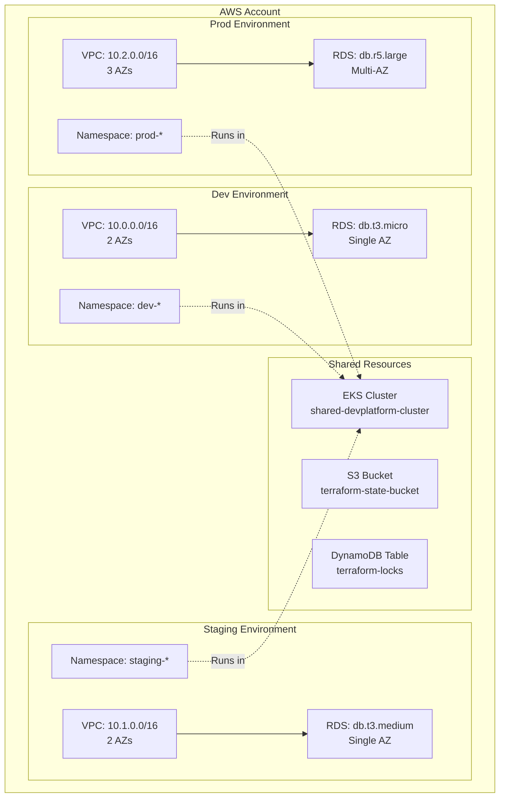
```mermaid
graph TB
    subgraph "AWS Account"
        subgraph "Shared Resources"
            S3[S3 Bucket<br/>terraform-state-bucket]
            Dynamo[DynamoDB Table<br/>terraform-locks]
            EKS[EKS Cluster<br/>shared-devplatform-cluster]
        end
        
        subgraph "Dev Environment"
            DevVPC[VPC: 10.0.0.0/16<br/>2 AZs]
            DevRDS[RDS: db.t3.micro<br/>Single AZ]
            DevNS[Namespace: dev-*]
        end
        
        subgraph "Staging Environment"
            StagingVPC[VPC: 10.1.0.0/16<br/>2 AZs]
            StagingRDS[RDS: db.t3.medium<br/>Single AZ]
            StagingNS[Namespace: staging-*]
        end
        
        subgraph "Prod Environment"
            ProdVPC[VPC: 10.2.0.0/16<br/>3 AZs]
            ProdRDS[RDS: db.r5.large<br/>Multi-AZ]
            ProdNS[Namespace: prod-*]
        end
    end
    
    DevNS -.->|Runs in| EKS
    StagingNS -.->|Runs in| EKS
    ProdNS -.->|Runs in| EKS
    
    DevVPC --> DevRDS
    StagingVPC --> StagingRDS
    ProdVPC --> ProdRDS
```

#### Azure Topology

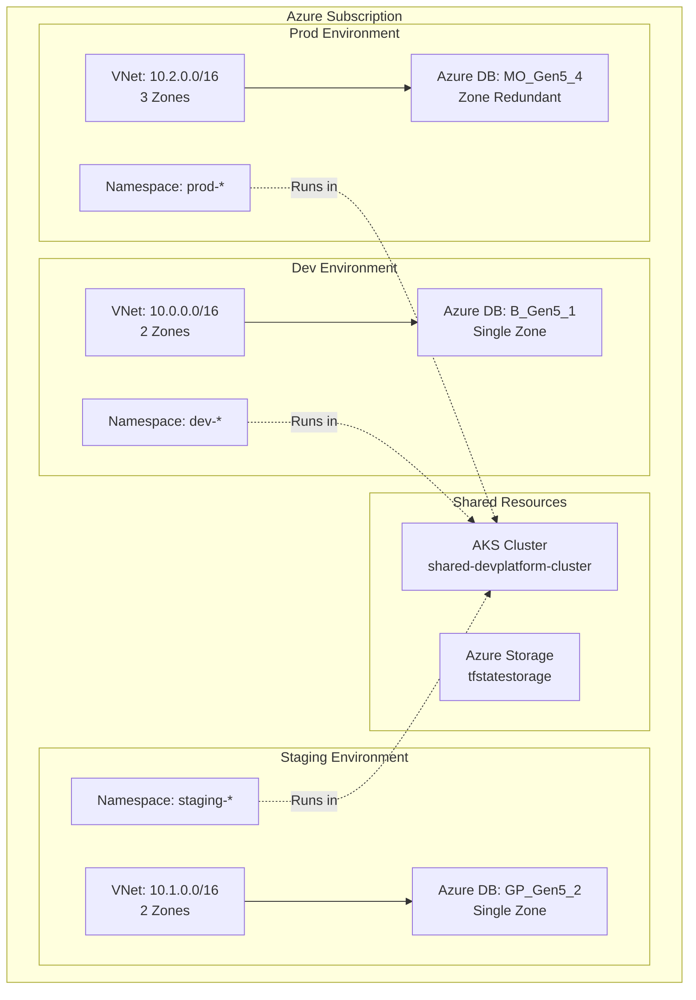
```mermaid
graph TB
    subgraph "Azure Subscription"
        subgraph "Shared Resources"
            Storage[Azure Storage<br/>tfstatestorage]
            AKS[AKS Cluster<br/>shared-devplatform-cluster]
        end
        
        subgraph "Dev Environment"
            DevVNet[VNet: 10.0.0.0/16<br/>2 Zones]
            DevDB[Azure DB: B_Gen5_1<br/>Single Zone]
            DevNS[Namespace: dev-*]
        end
        
        subgraph "Staging Environment"
            StagingVNet[VNet: 10.1.0.0/16<br/>2 Zones]
            StagingDB[Azure DB: GP_Gen5_2<br/>Single Zone]
            StagingNS[Namespace: staging-*]
        end
        
        subgraph "Prod Environment"
            ProdVNet[VNet: 10.2.0.0/16<br/>3 Zones]
            ProdDB[Azure DB: MO_Gen5_4<br/>Zone Redundant]
            ProdNS[Namespace: prod-*]
        end
    end
    
    DevNS -.->|Runs in| AKS
    StagingNS -.->|Runs in| AKS
    ProdNS -.->|Runs in| AKS
    
    DevVNet --> DevDB
    StagingVNet --> StagingDB
    ProdVNet --> ProdDB
```

### Network Architecture per Environment

#### AWS Network Architecture

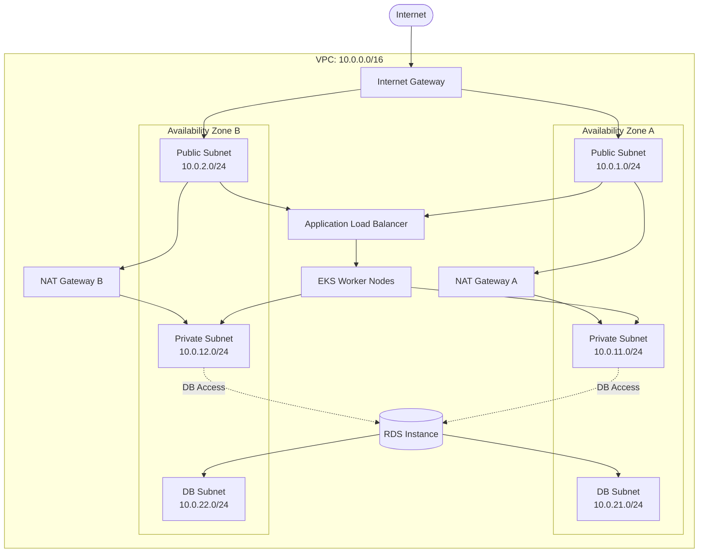
```mermaid
graph TB
    subgraph "VPC: 10.0.0.0/16"
        subgraph "Availability Zone A"
            PublicA[Public Subnet<br/>10.0.1.0/24]
            PrivateA[Private Subnet<br/>10.0.11.0/24]
            DBA[DB Subnet<br/>10.0.21.0/24]
        end
        
        subgraph "Availability Zone B"
            PublicB[Public Subnet<br/>10.0.2.0/24]
            PrivateB[Private Subnet<br/>10.0.12.0/24]
            DBB[DB Subnet<br/>10.0.22.0/24]
        end
        
        IGW[Internet Gateway]
        NATA[NAT Gateway A]
        NATB[NAT Gateway B]
        
        ALB[Application Load Balancer]
        RDS[(RDS Instance)]
        EKSNodes[EKS Worker Nodes]
    end
    
    Internet([Internet]) --> IGW
    IGW --> PublicA
    IGW --> PublicB
    
    PublicA --> NATA
    PublicB --> NATB
    
    NATA --> PrivateA
    NATB --> PrivateB
    
    PublicA --> ALB
    PublicB --> ALB
    
    ALB --> EKSNodes
    EKSNodes --> PrivateA
    EKSNodes --> PrivateB
    
    PrivateA -.->|DB Access| RDS
    PrivateB -.->|DB Access| RDS
    
    RDS --> DBA
    RDS --> DBB
```

#### Azure Network Architecture

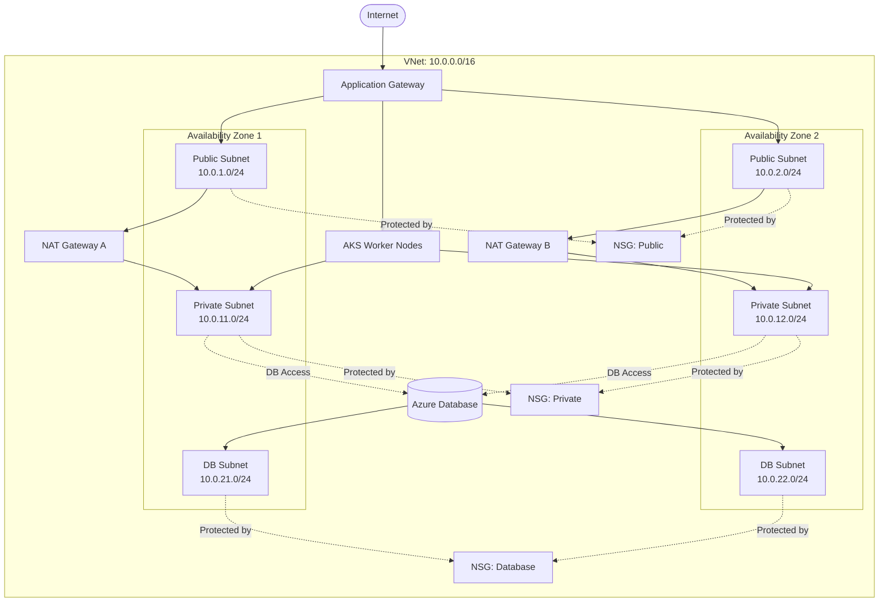
```mermaid
graph TB
    subgraph "VNet: 10.0.0.0/16"
        subgraph "Availability Zone 1"
            PublicA[Public Subnet<br/>10.0.1.0/24]
            PrivateA[Private Subnet<br/>10.0.11.0/24]
            DBA[DB Subnet<br/>10.0.21.0/24]
        end
        
        subgraph "Availability Zone 2"
            PublicB[Public Subnet<br/>10.0.2.0/24]
            PrivateB[Private Subnet<br/>10.0.12.0/24]
            DBB[DB Subnet<br/>10.0.22.0/24]
        end
        
        NATA[NAT Gateway A]
        NATB[NAT Gateway B]
        
        AppGW[Application Gateway]
        AzureDB[(Azure Database)]
        AKSNodes[AKS Worker Nodes]
        
        NSG1[NSG: Public]
        NSG2[NSG: Private]
        NSG3[NSG: Database]
    end
    
    Internet([Internet]) --> AppGW
    AppGW --> PublicA
    AppGW --> PublicB
    
    PublicA --> NATA
    PublicB --> NATB
    
    NATA --> PrivateA
    NATB --> PrivateB
    
    AppGW --> AKSNodes
    AKSNodes --> PrivateA
    AKSNodes --> PrivateB
    
    PrivateA -.->|DB Access| AzureDB
    PrivateB -.->|DB Access| AzureDB
    
    AzureDB --> DBA
    AzureDB --> DBB
    
    PublicA -.->|Protected by| NSG1
    PublicB -.->|Protected by| NSG1
    PrivateA -.->|Protected by| NSG2
    PrivateB -.->|Protected by| NSG2
    DBA -.->|Protected by| NSG3
    DBB -.->|Protected by| NSG3
```

## Kubernetes Deployment Architecture

### Namespace Structure

#### AWS (EKS)

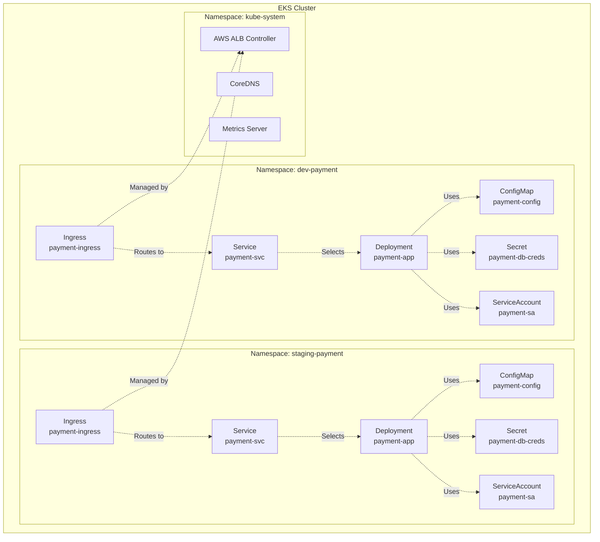
```mermaid
graph TB
    subgraph "EKS Cluster"
        subgraph "Namespace: dev-payment"
            DevDeploy[Deployment<br/>payment-app]
            DevService[Service<br/>payment-svc]
            DevIngress[Ingress<br/>payment-ingress]
            DevCM[ConfigMap<br/>payment-config]
            DevSA[ServiceAccount<br/>payment-sa]
            DevSecret[Secret<br/>payment-db-creds]
        end
        
        subgraph "Namespace: staging-payment"
            StageDeploy[Deployment<br/>payment-app]
            StageService[Service<br/>payment-svc]
            StageIngress[Ingress<br/>payment-ingress]
            StageCM[ConfigMap<br/>payment-config]
            StageSA[ServiceAccount<br/>payment-sa]
            StageSecret[Secret<br/>payment-db-creds]
        end
        
        subgraph "Namespace: kube-system"
            ALBController[AWS ALB Controller]
            CoreDNS[CoreDNS]
            MetricsServer[Metrics Server]
        end
    end
    
    DevIngress -.->|Routes to| DevService
    DevService -.->|Selects| DevDeploy
    DevDeploy -.->|Uses| DevCM
    DevDeploy -.->|Uses| DevSecret
    DevDeploy -.->|Uses| DevSA
    
    StageIngress -.->|Routes to| StageService
    StageService -.->|Selects| StageDeploy
    StageDeploy -.->|Uses| StageCM
    StageDeploy -.->|Uses| StageSecret
    StageDeploy -.->|Uses| StageSA
    
    DevIngress -.->|Managed by| ALBController
    StageIngress -.->|Managed by| ALBController
```

#### Azure (AKS)

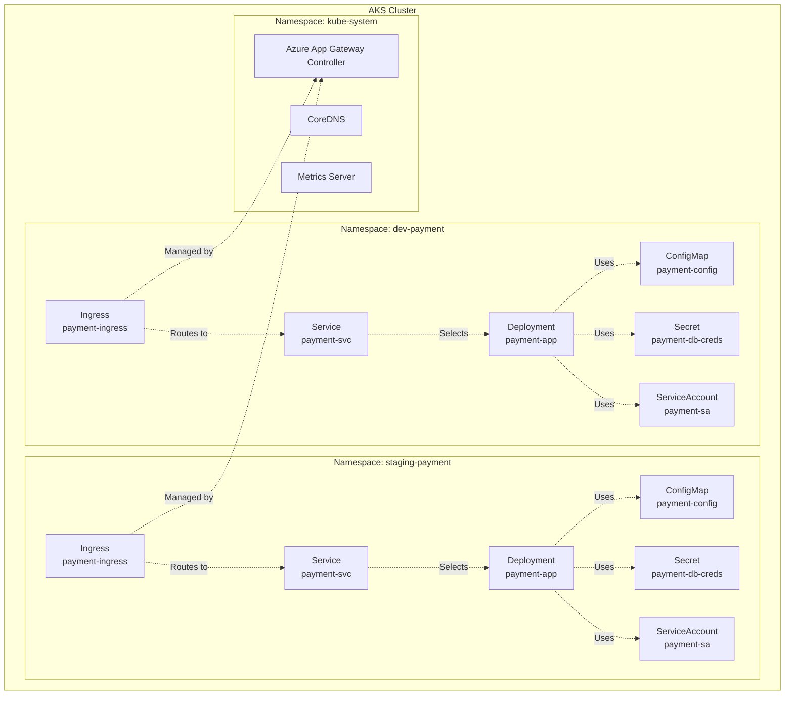
```mermaid
graph TB
    subgraph "AKS Cluster"
        subgraph "Namespace: dev-payment"
            DevDeploy[Deployment<br/>payment-app]
            DevService[Service<br/>payment-svc]
            DevIngress[Ingress<br/>payment-ingress]
            DevCM[ConfigMap<br/>payment-config]
            DevSA[ServiceAccount<br/>payment-sa]
            DevSecret[Secret<br/>payment-db-creds]
        end
        
        subgraph "Namespace: staging-payment"
            StageDeploy[Deployment<br/>payment-app]
            StageService[Service<br/>payment-svc]
            StageIngress[Ingress<br/>payment-ingress]
            StageCM[ConfigMap<br/>payment-config]
            StageSA[ServiceAccount<br/>payment-sa]
            StageSecret[Secret<br/>payment-db-creds]
        end
        
        subgraph "Namespace: kube-system"
            AppGWController[Azure App Gateway Controller]
            CoreDNS[CoreDNS]
            MetricsServer[Metrics Server]
        end
    end
    
    DevIngress -.->|Routes to| DevService
    DevService -.->|Selects| DevDeploy
    DevDeploy -.->|Uses| DevCM
    DevDeploy -.->|Uses| DevSecret
    DevDeploy -.->|Uses| DevSA
    
    StageIngress -.->|Routes to| StageService
    StageService -.->|Selects| StageDeploy
    StageDeploy -.->|Uses| StageCM
    StageDeploy -.->|Uses| StageSecret
    StageDeploy -.->|Uses| StageSA
    
    DevIngress -.->|Managed by| AppGWController
    StageIngress -.->|Managed by| AppGWController
```

### Pod Deployment Flow

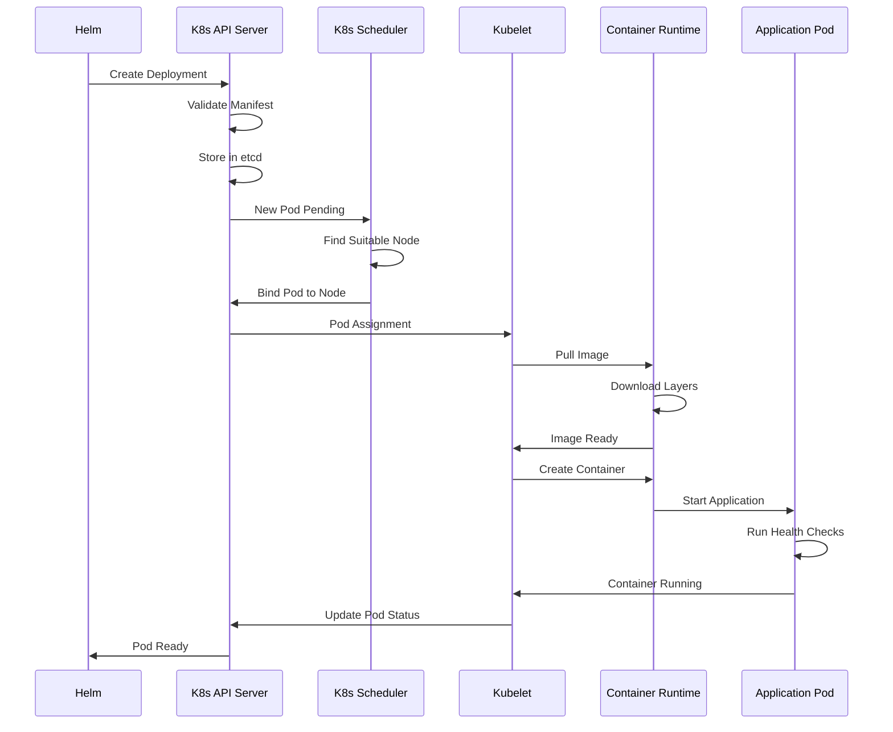
```mermaid
sequenceDiagram
    participant Helm as Helm
    participant API as K8s API Server
    participant Scheduler as K8s Scheduler
    participant Kubelet as Kubelet
    participant Container as Container Runtime
    participant Pod as Application Pod
    
    Helm->>API: Create Deployment
    API->>API: Validate Manifest
    API->>API: Store in etcd
    
    API->>Scheduler: New Pod Pending
    Scheduler->>Scheduler: Find Suitable Node
    Scheduler->>API: Bind Pod to Node
    
    API->>Kubelet: Pod Assignment
    Kubelet->>Container: Pull Image
    Container->>Container: Download Layers
    Container->>Kubelet: Image Ready
    
    Kubelet->>Container: Create Container
    Container->>Pod: Start Application
    Pod->>Pod: Run Health Checks
    Pod->>Kubelet: Container Running
    
    Kubelet->>API: Update Pod Status
    API->>Helm: Pod Ready
```

## Resource Sizing by Environment

### Development Environment

#### AWS Resources

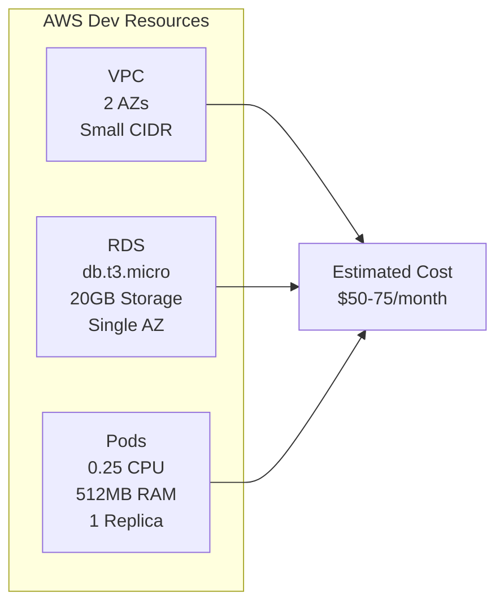
```mermaid
graph LR
    subgraph "AWS Dev Resources"
        VPC[VPC<br/>2 AZs<br/>Small CIDR]
        RDS[RDS<br/>db.t3.micro<br/>20GB Storage<br/>Single AZ]
        Pods[Pods<br/>0.25 CPU<br/>512MB RAM<br/>1 Replica]
    end
    
    Cost[Estimated Cost<br/>$50-75/month]
    
    VPC --> Cost
    RDS --> Cost
    Pods --> Cost
```

#### Azure Resources

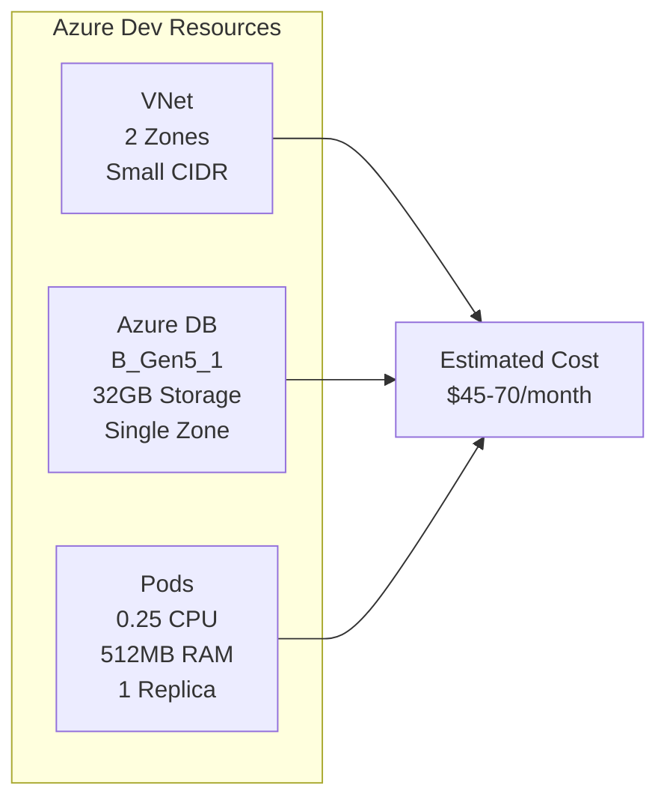
```mermaid
graph LR
    subgraph "Azure Dev Resources"
        VNet[VNet<br/>2 Zones<br/>Small CIDR]
        AzureDB[Azure DB<br/>B_Gen5_1<br/>32GB Storage<br/>Single Zone]
        Pods[Pods<br/>0.25 CPU<br/>512MB RAM<br/>1 Replica]
    end
    
    Cost[Estimated Cost<br/>$45-70/month]
    
    VNet --> Cost
    AzureDB --> Cost
    Pods --> Cost
```

### Staging Environment

#### AWS Resources

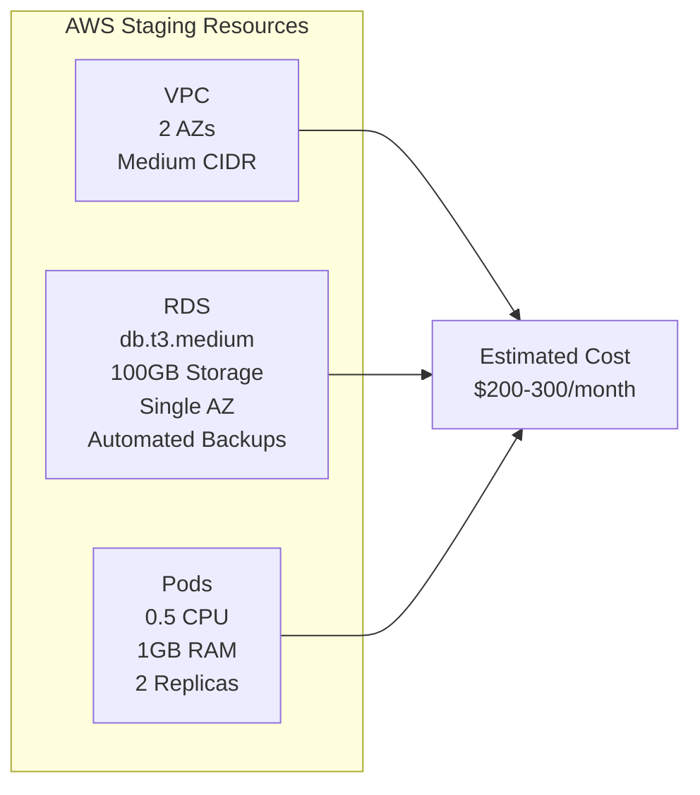
```mermaid
graph LR
    subgraph "AWS Staging Resources"
        VPC[VPC<br/>2 AZs<br/>Medium CIDR]
        RDS[RDS<br/>db.t3.medium<br/>100GB Storage<br/>Single AZ<br/>Automated Backups]
        Pods[Pods<br/>0.5 CPU<br/>1GB RAM<br/>2 Replicas]
    end
    
    Cost[Estimated Cost<br/>$200-300/month]
    
    VPC --> Cost
    RDS --> Cost
    Pods --> Cost
```

#### Azure Resources

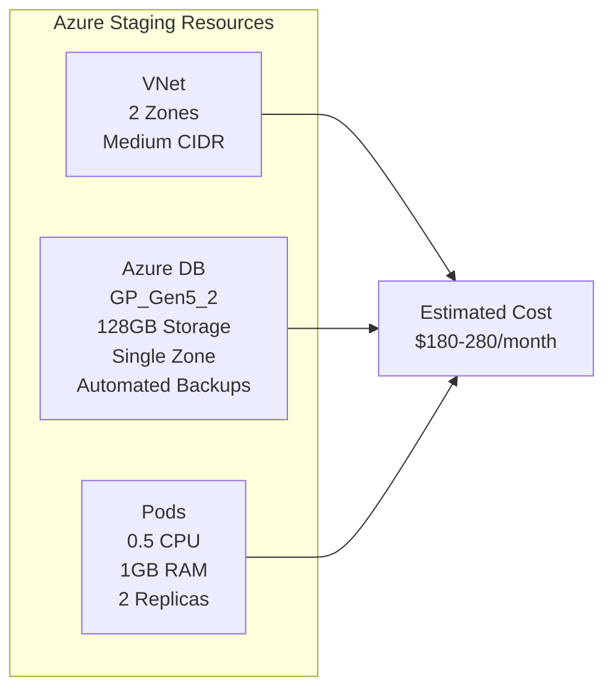
```mermaid
graph LR
    subgraph "Azure Staging Resources"
        VNet[VNet<br/>2 Zones<br/>Medium CIDR]
        AzureDB[Azure DB<br/>GP_Gen5_2<br/>128GB Storage<br/>Single Zone<br/>Automated Backups]
        Pods[Pods<br/>0.5 CPU<br/>1GB RAM<br/>2 Replicas]
    end
    
    Cost[Estimated Cost<br/>$180-280/month]
    
    VNet --> Cost
    AzureDB --> Cost
    Pods --> Cost
```

### Production Environment

#### AWS Resources

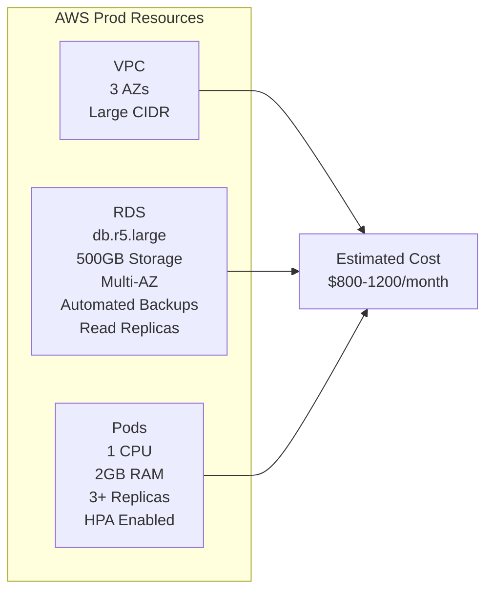
```mermaid
graph LR
    subgraph "AWS Prod Resources"
        VPC[VPC<br/>3 AZs<br/>Large CIDR]
        RDS[RDS<br/>db.r5.large<br/>500GB Storage<br/>Multi-AZ<br/>Automated Backups<br/>Read Replicas]
        Pods[Pods<br/>1 CPU<br/>2GB RAM<br/>3+ Replicas<br/>HPA Enabled]
    end
    
    Cost[Estimated Cost<br/>$800-1200/month]
    
    VPC --> Cost
    RDS --> Cost
    Pods --> Cost
```

#### Azure Resources

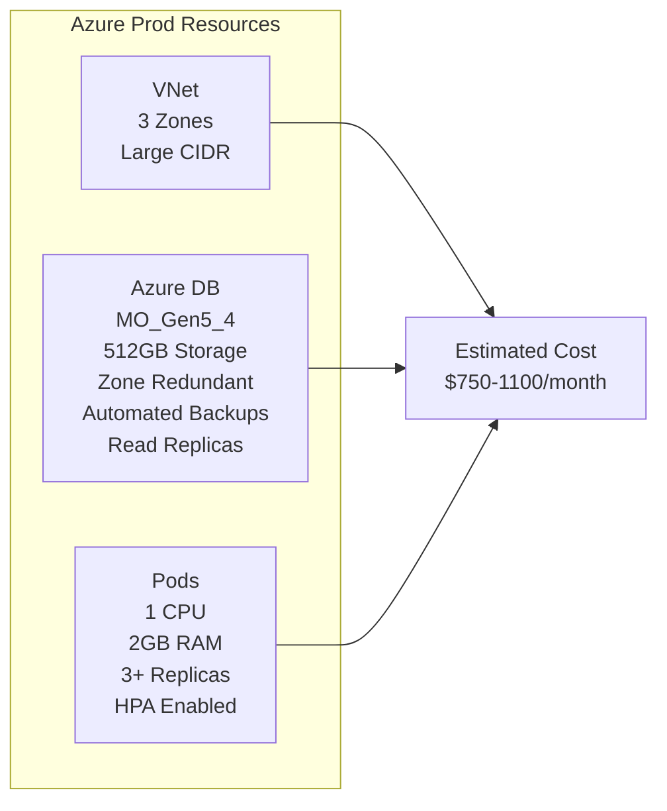
```mermaid
graph LR
    subgraph "Azure Prod Resources"
        VNet[VNet<br/>3 Zones<br/>Large CIDR]
        AzureDB[Azure DB<br/>MO_Gen5_4<br/>512GB Storage<br/>Zone Redundant<br/>Automated Backups<br/>Read Replicas]
        Pods[Pods<br/>1 CPU<br/>2GB RAM<br/>3+ Replicas<br/>HPA Enabled]
    end
    
    Cost[Estimated Cost<br/>$750-1100/month]
    
    VNet --> Cost
    AzureDB --> Cost
    Pods --> Cost
```

## Terraform Module Structure

### Module Dependency Graph

#### AWS Modules

```mermaid
graph TD
    Root[Root Module<br/>environments/dev|staging|prod]
    
    Network[Network Module<br/>modules/aws/network]
    Database[Database Module<br/>modules/aws/database]
    EKSTenant[EKS Tenant Module<br/>modules/aws/eks-tenant]
    
    Root --> Network
    Root --> Database
    Root --> EKSTenant
    
    Network --> VPC[VPC]
    Network --> Subnets[Subnets]
    Network --> SG[Security Groups]
    Network --> NAT[NAT Gateways]
    Network --> IGW[Internet Gateway]
    
    Database --> RDSInstance[RDS Instance]
    Database --> DBSubnetGroup[DB Subnet Group]
    Database --> DBSecrets[Secrets Manager]
    
    EKSTenant --> Namespace[K8s Namespace]
    EKSTenant --> ResourceQuota[Resource Quota]
    EKSTenant --> ServiceAccount[Service Account]
    EKSTenant --> IRSA[IAM Role for SA]
    
    Database -.->|Depends on| Network
    EKSTenant -.->|Depends on| Network
```

#### Azure Modules

```mermaid
graph TD
    Root[Root Module<br/>environments/dev|staging|prod]
    
    Network[Network Module<br/>modules/azure/network]
    Database[Database Module<br/>modules/azure/database]
    AKSTenant[AKS Tenant Module<br/>modules/azure/aks-tenant]
    
    Root --> Network
    Root --> Database
    Root --> AKSTenant
    
    Network --> VNet[VNet]
    Network --> Subnets[Subnets]
    Network --> NSG[Network Security Groups]
    Network --> NAT[NAT Gateway]
    
    Database --> AzureDBInstance[Azure Database Instance]
    Database --> DBSubnetDelegation[Subnet Delegation]
    Database --> KeyVault[Key Vault Secrets]
    
    AKSTenant --> Namespace[K8s Namespace]
    AKSTenant --> ResourceQuota[Resource Quota]
    AKSTenant --> ServiceAccount[Service Account]
    AKSTenant --> WorkloadIdentity[Workload Identity]
    
    Database -.->|Depends on| Network
    AKSTenant -.->|Depends on| Network
```

### Terraform State Management

#### AWS State Backend

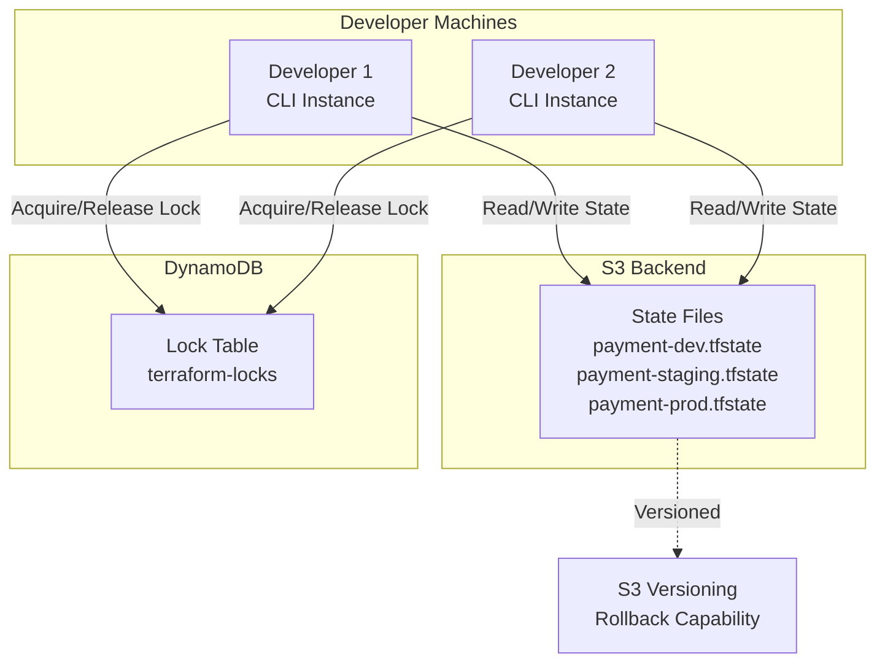
```mermaid
graph TB
    subgraph "Developer Machines"
        Dev1[Developer 1<br/>CLI Instance]
        Dev2[Developer 2<br/>CLI Instance]
    end
    
    subgraph "S3 Backend"
        StateFiles[State Files<br/>payment-dev.tfstate<br/>payment-staging.tfstate<br/>payment-prod.tfstate]
    end
    
    subgraph "DynamoDB"
        LockTable[Lock Table<br/>terraform-locks]
    end
    
    Dev1 -->|Read/Write State| StateFiles
    Dev2 -->|Read/Write State| StateFiles
    
    Dev1 -->|Acquire/Release Lock| LockTable
    Dev2 -->|Acquire/Release Lock| LockTable
    
    StateFiles -.->|Versioned| S3Versions[S3 Versioning<br/>Rollback Capability]
```

#### Azure State Backend

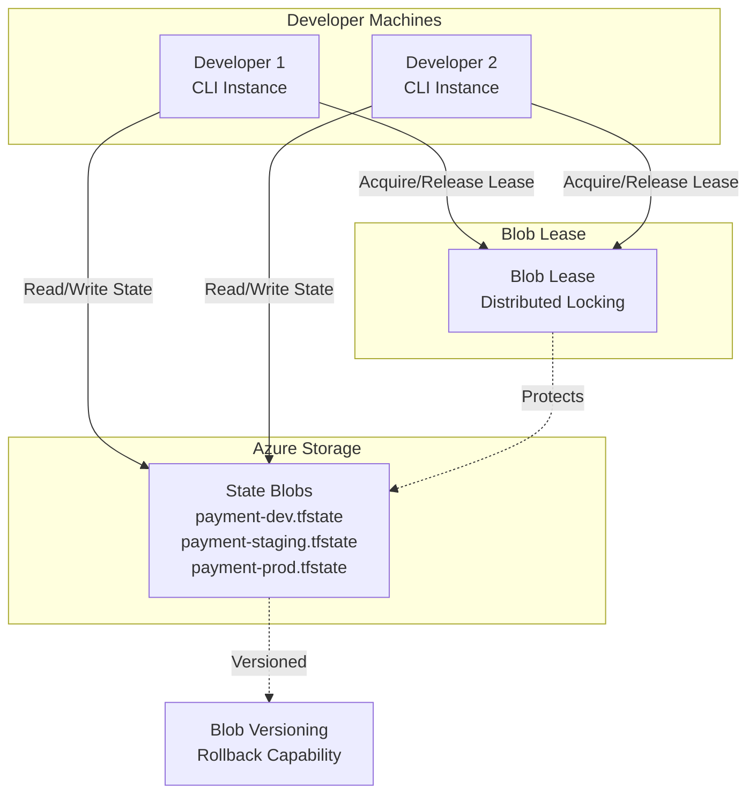
```mermaid
graph TB
    subgraph "Developer Machines"
        Dev1[Developer 1<br/>CLI Instance]
        Dev2[Developer 2<br/>CLI Instance]
    end
    
    subgraph "Azure Storage"
        StateFiles[State Blobs<br/>payment-dev.tfstate<br/>payment-staging.tfstate<br/>payment-prod.tfstate]
    end
    
    subgraph "Blob Lease"
        LockMechanism[Blob Lease<br/>Distributed Locking]
    end
    
    Dev1 -->|Read/Write State| StateFiles
    Dev2 -->|Read/Write State| StateFiles
    
    Dev1 -->|Acquire/Release Lease| LockMechanism
    Dev2 -->|Acquire/Release Lease| LockMechanism
    
    StateFiles -.->|Versioned| BlobVersions[Blob Versioning<br/>Rollback Capability]
    LockMechanism -.->|Protects| StateFiles
```

## Helm Chart Structure

### Chart Template Hierarchy

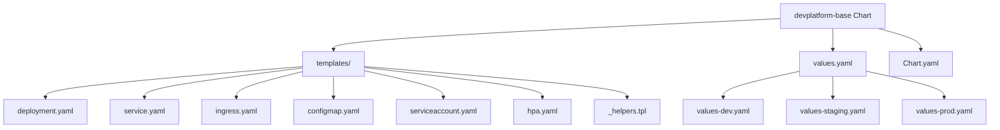
```mermaid
graph TB
    Chart[devplatform-base Chart]
    
    Chart --> Templates[templates/]
    Chart --> Values[values.yaml]
    Chart --> ChartYAML[Chart.yaml]
    
    Templates --> Deployment[deployment.yaml]
    Templates --> Service[service.yaml]
    Templates --> Ingress[ingress.yaml]
    Templates --> ConfigMap[configmap.yaml]
    Templates --> ServiceAccount[serviceaccount.yaml]
    Templates --> HPA[hpa.yaml]
    Templates --> Helpers[_helpers.tpl]
    
    Values --> DevValues[values-dev.yaml]
    Values --> StagingValues[values-staging.yaml]
    Values --> ProdValues[values-prod.yaml]
```

### Helm Values Merging

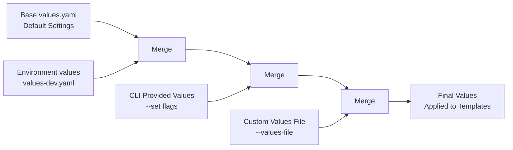
```mermaid
flowchart LR
    BaseValues[Base values.yaml<br/>Default Settings] --> Merge1[Merge]
    EnvValues[Environment values<br/>values-dev.yaml] --> Merge1
    
    Merge1 --> Merge2[Merge]
    CLIFlags[CLI Provided Values<br/>--set flags] --> Merge2
    
    Merge2 --> Merge3[Merge]
    CustomFile[Custom Values File<br/>--values-file] --> Merge3
    
    Merge3 --> FinalValues[Final Values<br/>Applied to Templates]
```

## Deployment Sequence

### Complete Provisioning Timeline

```mermaid
gantt
    title Environment Provisioning Timeline
    dateFormat  ss
    axisFormat %S
    
    section Validation
    Parse Arguments           :a1, 00, 2s
    Validate Inputs          :a2, after a1, 3s
    Check AWS Credentials    :a3, after a2, 2s
    
    section Terraform
    Terraform Init           :b1, after a3, 10s
    Create VPC               :b2, after b1, 20s
    Create Subnets           :b3, after b2, 15s
    Create Security Groups   :b4, after b3, 10s
    Create RDS Instance      :b5, after b4, 120s
    Create EKS Namespace     :b6, after b5, 5s
    
    section Helm
    Prepare Chart            :c1, after b6, 5s
    Install Release          :c2, after c1, 10s
    Wait for Pods            :c3, after c2, 30s
    Verify Health            :c4, after c3, 5s
    
    section Finalization
    Get Outputs              :d1, after c4, 3s
    Display Results          :d2, after d1, 2s
```

### Parallel Resource Creation

```mermaid
graph TB
    Start[Terraform Apply Starts] --> Plan[Generate Execution Plan]
    Plan --> Parallel{Parallel<br/>Creation}
    
    Parallel --> VPC[Create VPC]
    Parallel --> IAM[Create IAM Roles]
    Parallel --> S3Logs[Create S3 Log Bucket]
    
    VPC --> Subnets[Create Subnets]
    Subnets --> SG[Create Security Groups]
    
    SG --> RDS[Create RDS]
    SG --> EKSNodes[Configure EKS Nodes]
    
    IAM --> IRSA[Setup IRSA]
    IRSA --> EKSNodes
    
    RDS --> Complete[All Resources Created]
    EKSNodes --> Complete
    S3Logs --> Complete
```

## High Availability Deployment

### Multi-AZ Production Setup

```mermaid
graph TB
    subgraph "Production VPC"
        subgraph "AZ-1a"
            Public1a[Public Subnet]
            Private1a[Private Subnet]
            DB1a[DB Subnet]
            NAT1a[NAT Gateway]
            Pods1a[Application Pods]
        end
        
        subgraph "AZ-1b"
            Public1b[Public Subnet]
            Private1b[Private Subnet]
            DB1b[DB Subnet]
            NAT1b[NAT Gateway]
            Pods1b[Application Pods]
        end
        
        subgraph "AZ-1c"
            Public1c[Public Subnet]
            Private1c[Private Subnet]
            DB1c[DB Subnet]
            NAT1c[NAT Gateway]
            Pods1c[Application Pods]
        end
        
        ALB[Application Load Balancer<br/>Multi-AZ]
        RDSPrimary[(RDS Primary<br/>AZ-1a)]
        RDSStandby[(RDS Standby<br/>AZ-1b)]
    end
    
    Internet([Internet]) --> ALB
    
    ALB --> Pods1a
    ALB --> Pods1b
    ALB --> Pods1c
    
    Public1a --> NAT1a
    Public1b --> NAT1b
    Public1c --> NAT1c
    
    NAT1a --> Private1a
    NAT1b --> Private1b
    NAT1c --> Private1c
    
    Pods1a --> Private1a
    Pods1b --> Private1b
    Pods1c --> Private1c
    
    Pods1a -.->|DB Connection| RDSPrimary
    Pods1b -.->|DB Connection| RDSPrimary
    Pods1c -.->|DB Connection| RDSPrimary
    
    RDSPrimary -.->|Synchronous Replication| RDSStandby
    RDSPrimary --> DB1a
    RDSStandby --> DB1b
```

## Disaster Recovery

### Backup and Recovery Flow

```mermaid
flowchart TD
    Production[Production Environment] --> AutoBackup[Automated Backups]
    
    AutoBackup --> RDSSnapshot[RDS Automated Snapshots<br/>Daily, 7-day retention]
    AutoBackup --> TFState[Terraform State Versions<br/>S3 Versioning Enabled]
    AutoBackup --> ConfigBackup[Configuration Backups<br/>Git Repository]
    
    Disaster[Disaster Event] --> Assess[Assess Damage]
    
    Assess --> DataLoss{Data<br/>Loss?}
    DataLoss -->|Yes| RestoreRDS[Restore RDS from Snapshot]
    DataLoss -->|No| CheckInfra{Infrastructure<br/>Damaged?}
    
    RestoreRDS --> CheckInfra
    
    CheckInfra -->|Yes| RestoreTF[Restore from Terraform State]
    CheckInfra -->|No| CheckApp{Application<br/>Issue?}
    
    RestoreTF --> ReapplyTF[Terraform Apply]
    ReapplyTF --> CheckApp
    
    CheckApp -->|Yes| RedeployHelm[Redeploy Helm Chart]
    CheckApp -->|No| Verify[Verify Recovery]
    
    RedeployHelm --> Verify
    Verify --> Complete[Recovery Complete]
```

### State Recovery Process

```mermaid
sequenceDiagram
    participant Admin as Administrator
    participant S3 as S3 State Bucket
    participant Local as Local Terraform
    participant AWS as AWS Resources
    
    Admin->>S3: List State Versions
    S3-->>Admin: Version History
    
    Admin->>Admin: Identify Good State Version
    Admin->>S3: Download State Version
    S3-->>Admin: State File
    
    Admin->>Local: terraform state push
    Local->>S3: Upload State
    
    Admin->>Local: terraform plan
    Local->>AWS: Query Current Resources
    AWS-->>Local: Resource Status
    Local-->>Admin: Show Drift
    
    Admin->>Local: terraform apply
    Local->>AWS: Reconcile Resources
    AWS-->>Local: Resources Updated
    Local-->>Admin: Infrastructure Restored
```

## Scaling Patterns

### Horizontal Pod Autoscaling

```mermaid
graph TB
    Metrics[Metrics Server] --> HPA[Horizontal Pod Autoscaler]
    
    HPA --> Monitor{CPU > 70%<br/>or<br/>Memory > 80%?}
    
    Monitor -->|Yes| ScaleUp[Scale Up Pods]
    Monitor -->|No| CheckDown{CPU < 30%<br/>and<br/>Memory < 40%?}
    
    ScaleUp --> UpdateDeployment[Update Deployment Replicas]
    UpdateDeployment --> NewPods[Create New Pods]
    NewPods --> LoadBalancer[Update Load Balancer]
    
    CheckDown -->|Yes| ScaleDown[Scale Down Pods]
    CheckDown -->|No| Maintain[Maintain Current Scale]
    
    ScaleDown --> RemovePods[Terminate Excess Pods]
    RemovePods --> LoadBalancer
    
    LoadBalancer --> Monitor
    Maintain --> Monitor
```

### Database Scaling Strategy

```mermaid
graph LR
    subgraph "Vertical Scaling"
        Small[db.t3.micro] -->|Upgrade| Medium[db.t3.medium]
        Medium -->|Upgrade| Large[db.r5.large]
        Large -->|Upgrade| XLarge[db.r5.xlarge]
    end
    
    subgraph "Horizontal Scaling"
        Primary[(Primary DB)] --> ReadReplica1[(Read Replica 1)]
        Primary --> ReadReplica2[(Read Replica 2)]
        
        AppWrites[Application Writes] --> Primary
        AppReads[Application Reads] --> ReadReplica1
        AppReads --> ReadReplica2
    end
```

## Cost Optimization

### Resource Lifecycle

```mermaid
stateDiagram-v2
    [*] --> Created: devplatform create
    
    Created --> Active: In Use
    Active --> Idle: No Activity
    
    Idle --> Active: Activity Detected
    Idle --> Tagged: 7 Days Idle
    
    Tagged --> Warning: Tag Applied
    Warning --> Destroyed: devplatform destroy
    Warning --> Active: Activity Resumed
    
    Destroyed --> [*]
    
    note right of Tagged
        Auto-tag idle resources
        for cost tracking
    end note
    
    note right of Warning
        Send notification to
        resource owner
    end note
```

### Cost Breakdown by Environment

```mermaid
pie title Dev Environment Monthly Cost ($75)
    "RDS Instance" : 35
    "NAT Gateway" : 20
    "EKS Compute" : 15
    "Data Transfer" : 3
    "Other" : 2

pie title Staging Environment Monthly Cost ($250)
    "RDS Instance" : 120
    "NAT Gateway" : 40
    "EKS Compute" : 70
    "Data Transfer" : 15
    "Other" : 5

pie title Prod Environment Monthly Cost ($1000)
    "RDS Instance" : 450
    "NAT Gateway" : 120
    "EKS Compute" : 350
    "Data Transfer" : 60
    "Other" : 20
```
