# DevPlatform CLI - Security Guide

## Security Architecture Overview

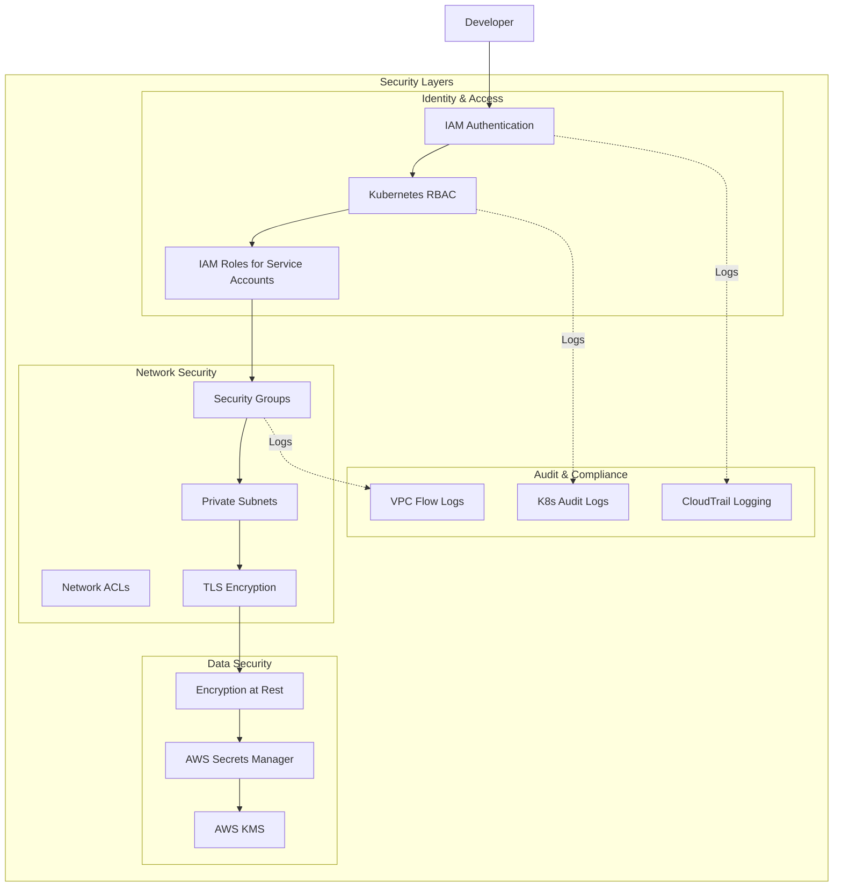
```mermaid
graph TB
    subgraph "Security Layers"
        subgraph "Identity & Access"
            IAM[IAM Authentication]
            RBAC[Kubernetes RBAC]
            IRSA[IAM Roles for Service Accounts]
        end
        
        subgraph "Network Security"
            SG[Security Groups]
            NACL[Network ACLs]
            PrivateSubnets[Private Subnets]
            TLS[TLS Encryption]
        end
        
        subgraph "Data Security"
            Encryption[Encryption at Rest]
            SecretsManager[AWS Secrets Manager]
            KMS[AWS KMS]
        end
        
        subgraph "Audit & Compliance"
            CloudTrail[CloudTrail Logging]
            VPCFlowLogs[VPC Flow Logs]
            K8sAudit[K8s Audit Logs]
        end
    end
    
    Developer[Developer] --> IAM
    IAM --> RBAC
    RBAC --> IRSA
    
    IRSA --> SG
    SG --> PrivateSubnets
    PrivateSubnets --> TLS
    
    TLS --> Encryption
    Encryption --> SecretsManager
    SecretsManager --> KMS
    
    IAM -.->|Logs| CloudTrail
    SG -.->|Logs| VPCFlowLogs
    RBAC -.->|Logs| K8sAudit
```

## Authentication Flow

### AWS Authentication

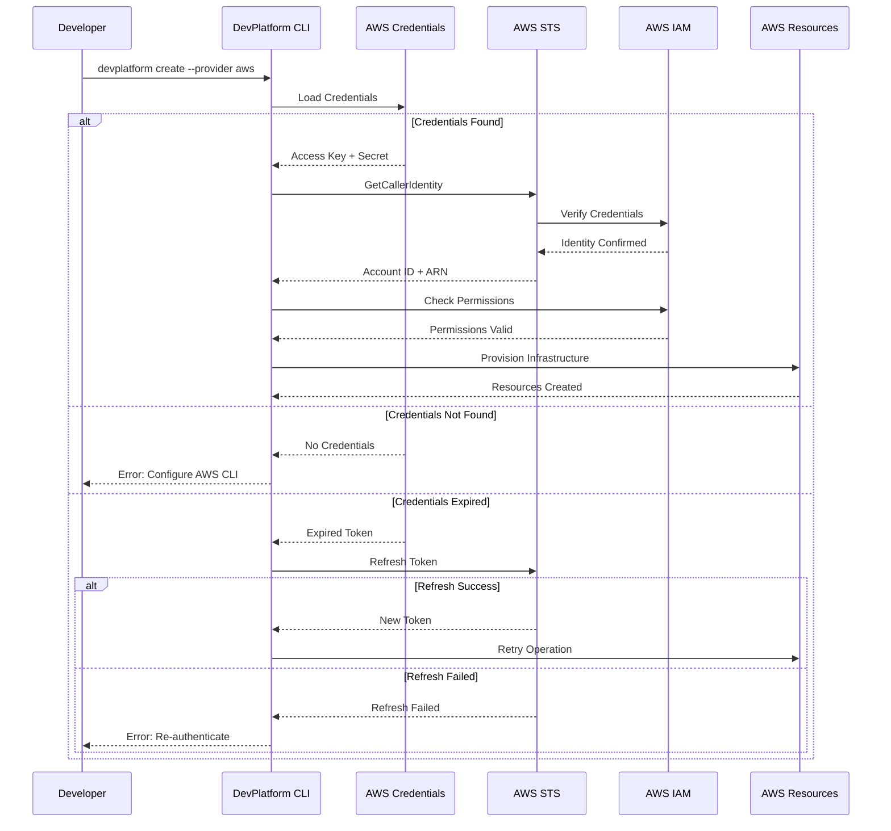
```mermaid
sequenceDiagram
    participant Dev as Developer
    participant CLI as DevPlatform CLI
    participant AWSCreds as AWS Credentials
    participant STS as AWS STS
    participant IAM as AWS IAM
    participant Resources as AWS Resources
    
    Dev->>CLI: devplatform create --provider aws
    CLI->>AWSCreds: Load Credentials
    
    alt Credentials Found
        AWSCreds-->>CLI: Access Key + Secret
        CLI->>STS: GetCallerIdentity
        STS->>IAM: Verify Credentials
        IAM-->>STS: Identity Confirmed
        STS-->>CLI: Account ID + ARN
        
        CLI->>IAM: Check Permissions
        IAM-->>CLI: Permissions Valid
        
        CLI->>Resources: Provision Infrastructure
        Resources-->>CLI: Resources Created
    else Credentials Not Found
        AWSCreds-->>CLI: No Credentials
        CLI-->>Dev: Error: Configure AWS CLI
    else Credentials Expired
        AWSCreds-->>CLI: Expired Token
        CLI->>STS: Refresh Token
        
        alt Refresh Success
            STS-->>CLI: New Token
            CLI->>Resources: Retry Operation
        else Refresh Failed
            STS-->>CLI: Refresh Failed
            CLI-->>Dev: Error: Re-authenticate
        end
    end
```

### Azure Authentication

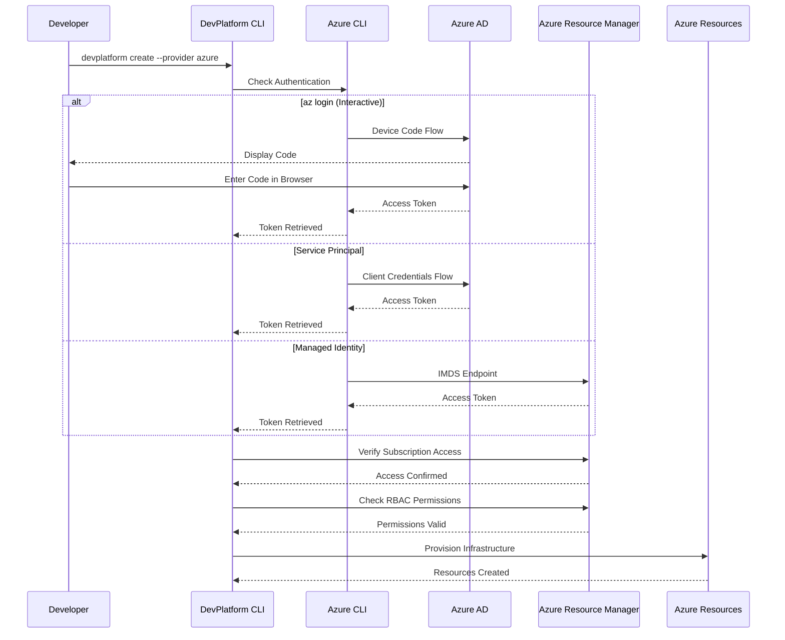
```mermaid
sequenceDiagram
    participant Dev as Developer
    participant CLI as DevPlatform CLI
    participant AzCLI as Azure CLI
    participant AAD as Azure AD
    participant ARM as Azure Resource Manager
    participant Resources as Azure Resources
    
    Dev->>CLI: devplatform create --provider azure
    CLI->>AzCLI: Check Authentication
    
    alt az login (Interactive)
        AzCLI->>AAD: Device Code Flow
        AAD-->>Dev: Display Code
        Dev->>AAD: Enter Code in Browser
        AAD-->>AzCLI: Access Token
        AzCLI-->>CLI: Token Retrieved
    else Service Principal
        AzCLI->>AAD: Client Credentials Flow
        AAD-->>AzCLI: Access Token
        AzCLI-->>CLI: Token Retrieved
    else Managed Identity
        AzCLI->>ARM: IMDS Endpoint
        ARM-->>AzCLI: Access Token
        AzCLI-->>CLI: Token Retrieved
    end
    
    CLI->>ARM: Verify Subscription Access
    ARM-->>CLI: Access Confirmed
    
    CLI->>ARM: Check RBAC Permissions
    ARM-->>CLI: Permissions Valid
    
    CLI->>Resources: Provision Infrastructure
    Resources-->>CLI: Resources Created
```

### Azure Authentication Methods

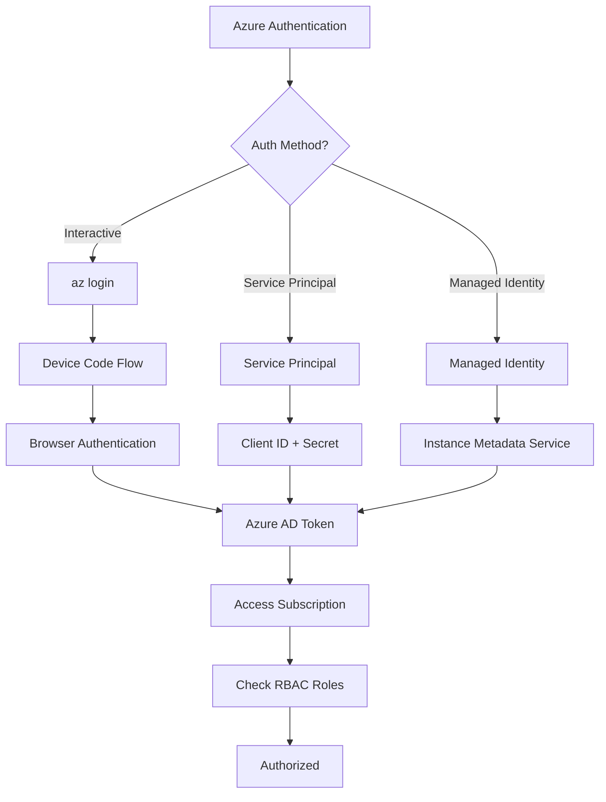
```mermaid
graph TB
    Start[Azure Authentication] --> Method{Auth Method?}
    
    Method -->|Interactive| AzLogin[az login]
    Method -->|Service Principal| SP[Service Principal]
    Method -->|Managed Identity| MI[Managed Identity]
    
    AzLogin --> DeviceCode[Device Code Flow]
    DeviceCode --> Browser[Browser Authentication]
    Browser --> AADToken[Azure AD Token]
    
    SP --> ClientCreds[Client ID + Secret]
    ClientCreds --> AADToken
    
    MI --> IMDS[Instance Metadata Service]
    IMDS --> AADToken
    
    AADToken --> Subscription[Access Subscription]
    Subscription --> RBAC[Check RBAC Roles]
    RBAC --> Authorized[Authorized]
```

### Kubernetes Authentication

#### AWS EKS Authentication

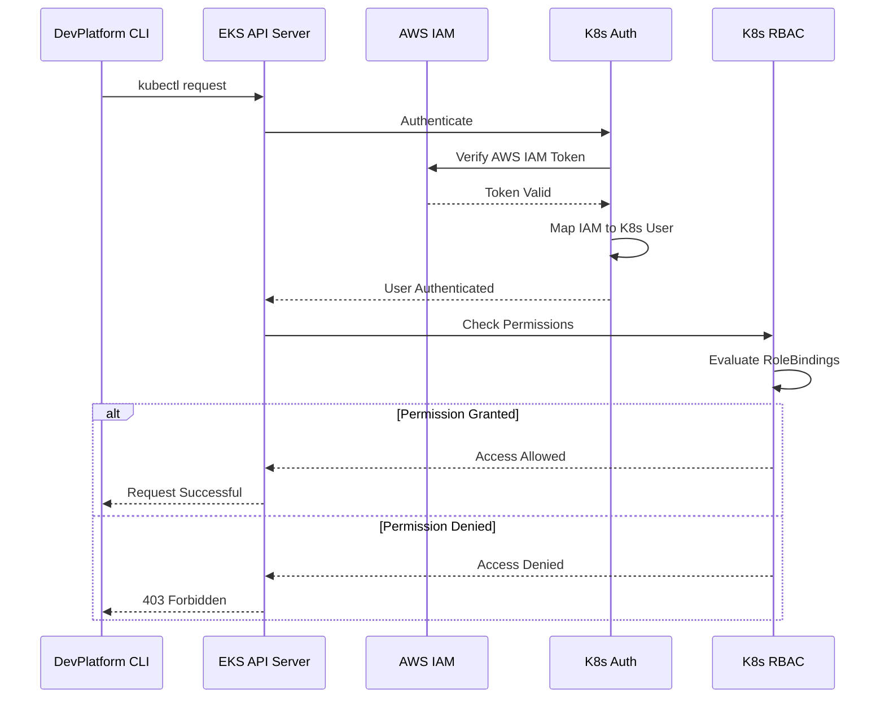
```mermaid
sequenceDiagram
    participant CLI as DevPlatform CLI
    participant EKS as EKS API Server
    participant IAM as AWS IAM
    participant K8sAuth as K8s Auth
    participant RBAC as K8s RBAC
    
    CLI->>EKS: kubectl request
    EKS->>K8sAuth: Authenticate
    
    K8sAuth->>IAM: Verify AWS IAM Token
    IAM-->>K8sAuth: Token Valid
    
    K8sAuth->>K8sAuth: Map IAM to K8s User
    K8sAuth-->>EKS: User Authenticated
    
    EKS->>RBAC: Check Permissions
    RBAC->>RBAC: Evaluate RoleBindings
    
    alt Permission Granted
        RBAC-->>EKS: Access Allowed
        EKS-->>CLI: Request Successful
    else Permission Denied
        RBAC-->>EKS: Access Denied
        EKS-->>CLI: 403 Forbidden
    end
```

#### Azure AKS Authentication

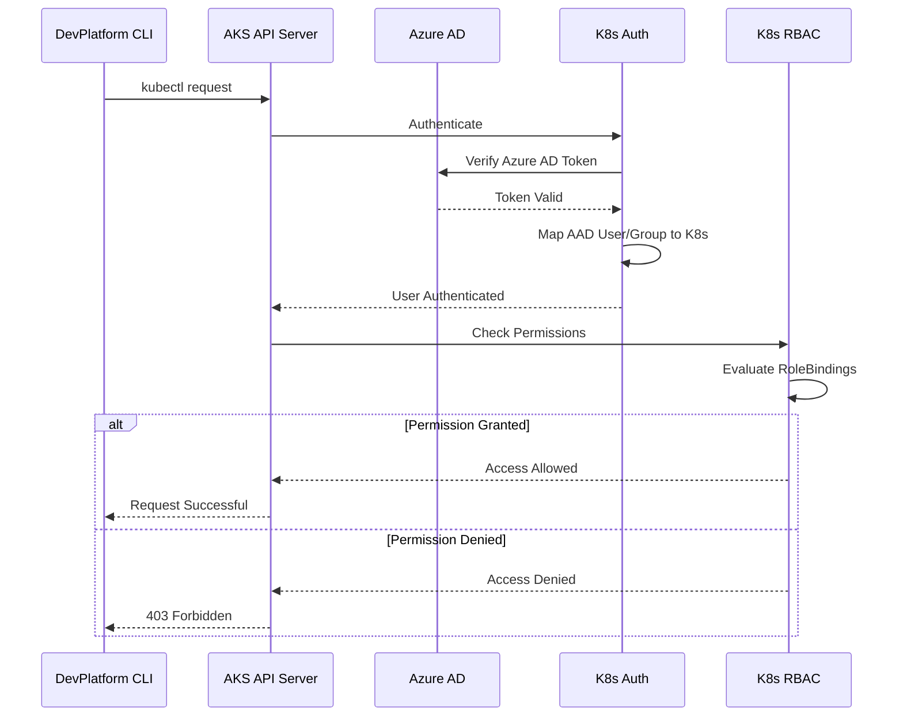
```mermaid
sequenceDiagram
    participant CLI as DevPlatform CLI
    participant AKS as AKS API Server
    participant AAD as Azure AD
    participant K8sAuth as K8s Auth
    participant RBAC as K8s RBAC
    
    CLI->>AKS: kubectl request
    AKS->>K8sAuth: Authenticate
    
    K8sAuth->>AAD: Verify Azure AD Token
    AAD-->>K8sAuth: Token Valid
    
    K8sAuth->>K8sAuth: Map AAD User/Group to K8s
    K8sAuth-->>AKS: User Authenticated
    
    AKS->>RBAC: Check Permissions
    RBAC->>RBAC: Evaluate RoleBindings
    
    alt Permission Granted
        RBAC-->>AKS: Access Allowed
        AKS-->>CLI: Request Successful
    else Permission Denied
        RBAC-->>AKS: Access Denied
        AKS-->>CLI: 403 Forbidden
    end
```

## IAM Permissions Model

### AWS IAM Required Policies

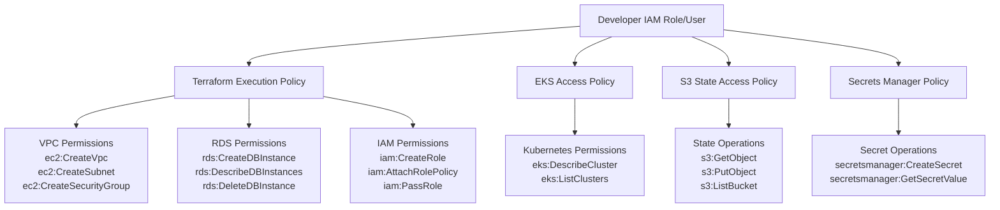
```mermaid
graph TB
    DevRole[Developer IAM Role/User]
    
    DevRole --> TFPolicy[Terraform Execution Policy]
    DevRole --> EKSPolicy[EKS Access Policy]
    DevRole --> S3Policy[S3 State Access Policy]
    DevRole --> SecretsPolicy[Secrets Manager Policy]
    
    TFPolicy --> VPCPerms[VPC Permissions<br/>ec2:CreateVpc<br/>ec2:CreateSubnet<br/>ec2:CreateSecurityGroup]
    TFPolicy --> RDSPerms[RDS Permissions<br/>rds:CreateDBInstance<br/>rds:DescribeDBInstances<br/>rds:DeleteDBInstance]
    TFPolicy --> IAMPerms[IAM Permissions<br/>iam:CreateRole<br/>iam:AttachRolePolicy<br/>iam:PassRole]
    
    EKSPolicy --> K8sPerms[Kubernetes Permissions<br/>eks:DescribeCluster<br/>eks:ListClusters]
    
    S3Policy --> StatePerms[State Operations<br/>s3:GetObject<br/>s3:PutObject<br/>s3:ListBucket]
    
    SecretsPolicy --> SecretPerms[Secret Operations<br/>secretsmanager:CreateSecret<br/>secretsmanager:GetSecretValue]
```

### Azure RBAC Required Roles

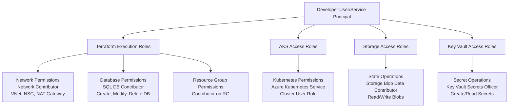
```mermaid
graph TB
    DevUser[Developer User/Service Principal]
    
    DevUser --> TFRole[Terraform Execution Roles]
    DevUser --> AKSRole[AKS Access Roles]
    DevUser --> StorageRole[Storage Access Roles]
    DevUser --> KeyVaultRole[Key Vault Access Roles]
    
    TFRole --> NetworkPerms[Network Permissions<br/>Network Contributor<br/>VNet, NSG, NAT Gateway]
    TFRole --> DBPerms[Database Permissions<br/>SQL DB Contributor<br/>Create, Modify, Delete DB]
    TFRole --> RGPerms[Resource Group Permissions<br/>Contributor on RG]
    
    AKSRole --> K8sPerms[Kubernetes Permissions<br/>Azure Kubernetes Service<br/>Cluster User Role]
    
    StorageRole --> StatePerms[State Operations<br/>Storage Blob Data Contributor<br/>Read/Write Blobs]
    
    KeyVaultRole --> SecretPerms[Secret Operations<br/>Key Vault Secrets Officer<br/>Create/Read Secrets]
```

### IAM Policy Structure

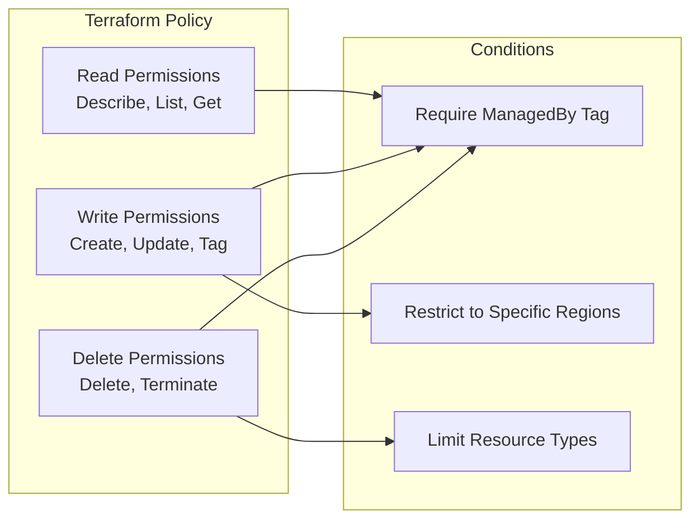
```mermaid
graph LR
    subgraph "Terraform Policy"
        TFRead[Read Permissions<br/>Describe, List, Get]
        TFWrite[Write Permissions<br/>Create, Update, Tag]
        TFDelete[Delete Permissions<br/>Delete, Terminate]
    end
    
    subgraph "Conditions"
        TagCondition[Require ManagedBy Tag]
        RegionCondition[Restrict to Specific Regions]
        ResourceCondition[Limit Resource Types]
    end
    
    TFRead --> TagCondition
    TFWrite --> TagCondition
    TFWrite --> RegionCondition
    TFDelete --> TagCondition
    TFDelete --> ResourceCondition
```

## Network Security

### AWS Security Group Architecture

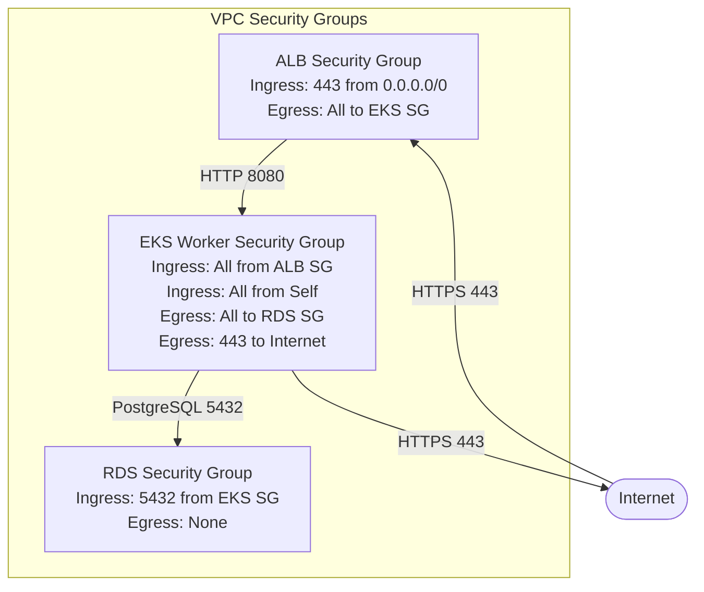
```mermaid
graph TB
    subgraph "VPC Security Groups"
        ALBSG[ALB Security Group<br/>Ingress: 443 from 0.0.0.0/0<br/>Egress: All to EKS SG]
        
        EKSSG[EKS Worker Security Group<br/>Ingress: All from ALB SG<br/>Ingress: All from Self<br/>Egress: All to RDS SG<br/>Egress: 443 to Internet]
        
        RDSSG[RDS Security Group<br/>Ingress: 5432 from EKS SG<br/>Egress: None]
    end
    
    Internet([Internet]) -->|HTTPS 443| ALBSG
    ALBSG -->|HTTP 8080| EKSSG
    EKSSG -->|PostgreSQL 5432| RDSSG
    EKSSG -->|HTTPS 443| Internet
```

### Azure Network Security Group Architecture

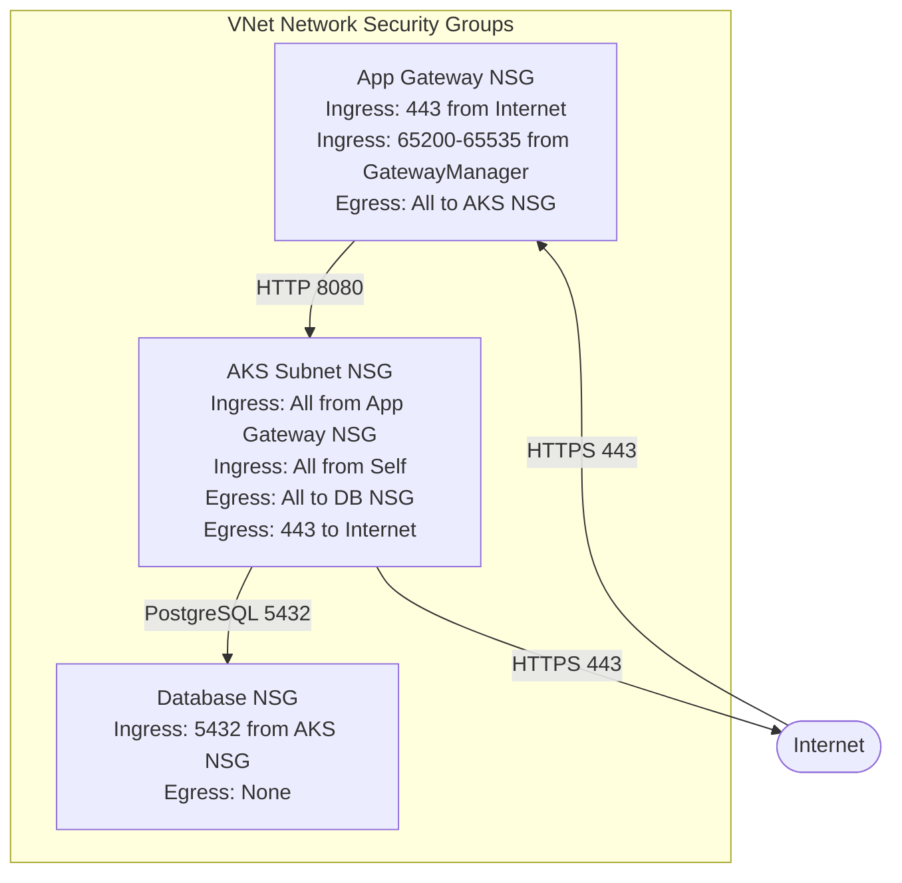
```mermaid
graph TB
    subgraph "VNet Network Security Groups"
        AppGWNSG[App Gateway NSG<br/>Ingress: 443 from Internet<br/>Ingress: 65200-65535 from GatewayManager<br/>Egress: All to AKS NSG]
        
        AKSNSG[AKS Subnet NSG<br/>Ingress: All from App Gateway NSG<br/>Ingress: All from Self<br/>Egress: All to DB NSG<br/>Egress: 443 to Internet]
        
        DBNSG[Database NSG<br/>Ingress: 5432 from AKS NSG<br/>Egress: None]
    end
    
    Internet([Internet]) -->|HTTPS 443| AppGWNSG
    AppGWNSG -->|HTTP 8080| AKSNSG
    AKSNSG -->|PostgreSQL 5432| DBNSG
    AKSNSG -->|HTTPS 443| Internet
```

### Traffic Flow with Security Controls

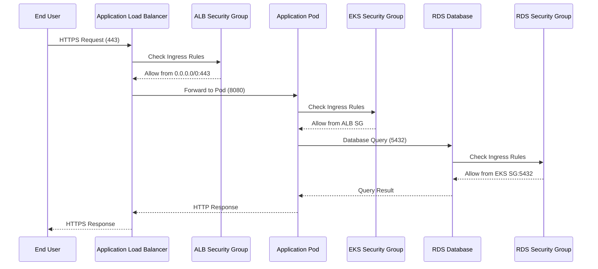
```mermaid
sequenceDiagram
    participant User as End User
    participant ALB as Application Load Balancer
    participant SG1 as ALB Security Group
    participant Pod as Application Pod
    participant SG2 as EKS Security Group
    participant RDS as RDS Database
    participant SG3 as RDS Security Group
    
    User->>ALB: HTTPS Request (443)
    ALB->>SG1: Check Ingress Rules
    SG1-->>ALB: Allow from 0.0.0.0/0:443
    
    ALB->>Pod: Forward to Pod (8080)
    Pod->>SG2: Check Ingress Rules
    SG2-->>Pod: Allow from ALB SG
    
    Pod->>RDS: Database Query (5432)
    RDS->>SG3: Check Ingress Rules
    SG3-->>RDS: Allow from EKS SG:5432
    
    RDS-->>Pod: Query Result
    Pod-->>ALB: HTTP Response
    ALB-->>User: HTTPS Response
```

### Network ACL Configuration

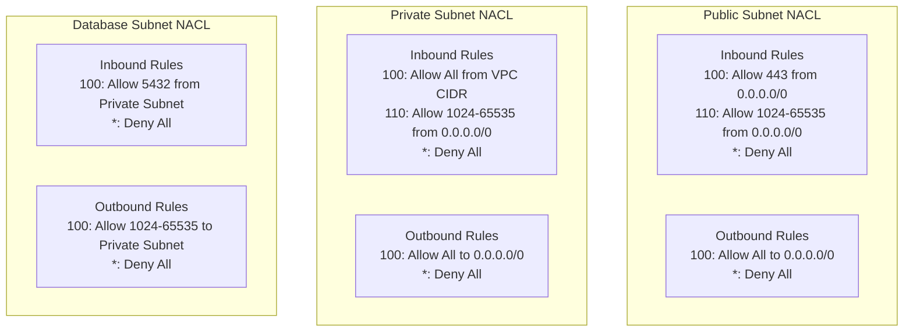
```mermaid
graph TB
    subgraph "Public Subnet NACL"
        PubIn[Inbound Rules<br/>100: Allow 443 from 0.0.0.0/0<br/>110: Allow 1024-65535 from 0.0.0.0/0<br/>*: Deny All]
        PubOut[Outbound Rules<br/>100: Allow All to 0.0.0.0/0<br/>*: Deny All]
    end
    
    subgraph "Private Subnet NACL"
        PrivIn[Inbound Rules<br/>100: Allow All from VPC CIDR<br/>110: Allow 1024-65535 from 0.0.0.0/0<br/>*: Deny All]
        PrivOut[Outbound Rules<br/>100: Allow All to 0.0.0.0/0<br/>*: Deny All]
    end
    
    subgraph "Database Subnet NACL"
        DBIn[Inbound Rules<br/>100: Allow 5432 from Private Subnet<br/>*: Deny All]
        DBOut[Outbound Rules<br/>100: Allow 1024-65535 to Private Subnet<br/>*: Deny All]
    end
```

## Data Encryption

### Encryption at Rest

#### AWS Encryption

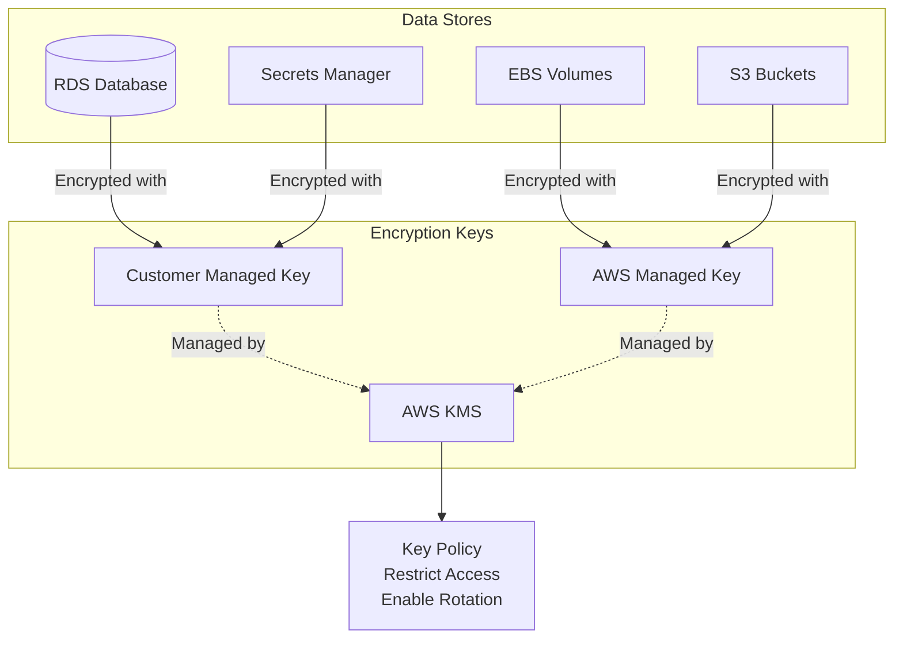
```mermaid
graph TB
    subgraph "Data Stores"
        RDS[(RDS Database)]
        EBS[EBS Volumes]
        S3[S3 Buckets]
        Secrets[Secrets Manager]
    end
    
    subgraph "Encryption Keys"
        KMS[AWS KMS]
        CMK[Customer Managed Key]
        DefaultKey[AWS Managed Key]
    end
    
    RDS -->|Encrypted with| CMK
    EBS -->|Encrypted with| DefaultKey
    S3 -->|Encrypted with| DefaultKey
    Secrets -->|Encrypted with| CMK
    
    CMK -.->|Managed by| KMS
    DefaultKey -.->|Managed by| KMS
    
    KMS --> KeyPolicy[Key Policy<br/>Restrict Access<br/>Enable Rotation]
```

#### Azure Encryption

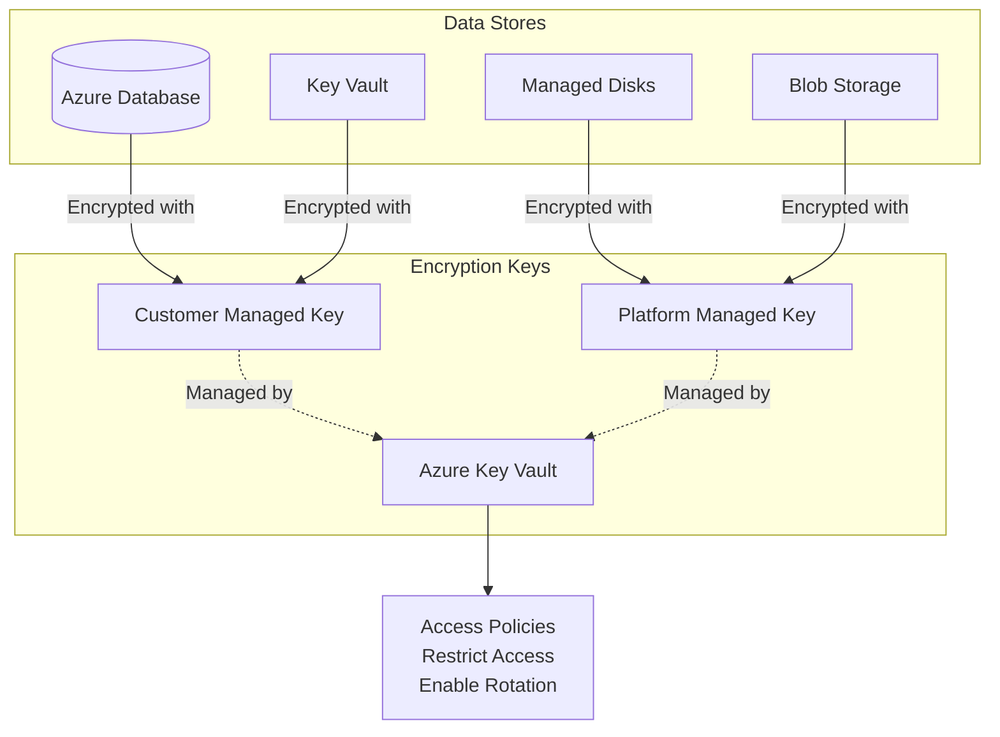
```mermaid
graph TB
    subgraph "Data Stores"
        AzureDB[(Azure Database)]
        ManagedDisks[Managed Disks]
        BlobStorage[Blob Storage]
        KeyVault[Key Vault]
    end
    
    subgraph "Encryption Keys"
        AzureKeyVault[Azure Key Vault]
        CMK[Customer Managed Key]
        PMK[Platform Managed Key]
    end
    
    AzureDB -->|Encrypted with| CMK
    ManagedDisks -->|Encrypted with| PMK
    BlobStorage -->|Encrypted with| PMK
    KeyVault -->|Encrypted with| CMK
    
    CMK -.->|Managed by| AzureKeyVault
    PMK -.->|Managed by| AzureKeyVault
    
    AzureKeyVault --> KeyPolicy[Access Policies<br/>Restrict Access<br/>Enable Rotation]
```

### Encryption in Transit

#### AWS TLS Flow

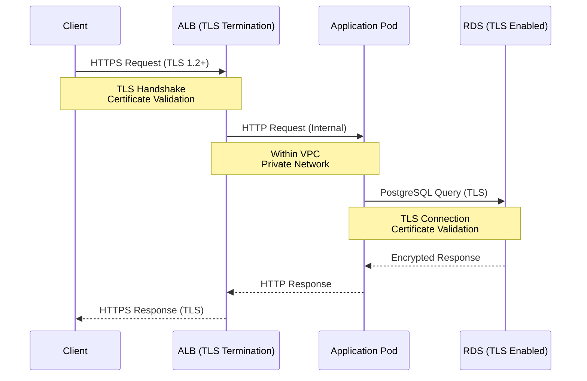
```mermaid
sequenceDiagram
    participant Client as Client
    participant ALB as ALB (TLS Termination)
    participant Pod as Application Pod
    participant RDS as RDS (TLS Enabled)
    
    Client->>ALB: HTTPS Request (TLS 1.2+)
    Note over Client,ALB: TLS Handshake<br/>Certificate Validation
    
    ALB->>Pod: HTTP Request (Internal)
    Note over ALB,Pod: Within VPC<br/>Private Network
    
    Pod->>RDS: PostgreSQL Query (TLS)
    Note over Pod,RDS: TLS Connection<br/>Certificate Validation
    
    RDS-->>Pod: Encrypted Response
    Pod-->>ALB: HTTP Response
    ALB-->>Client: HTTPS Response (TLS)
```

#### Azure TLS Flow

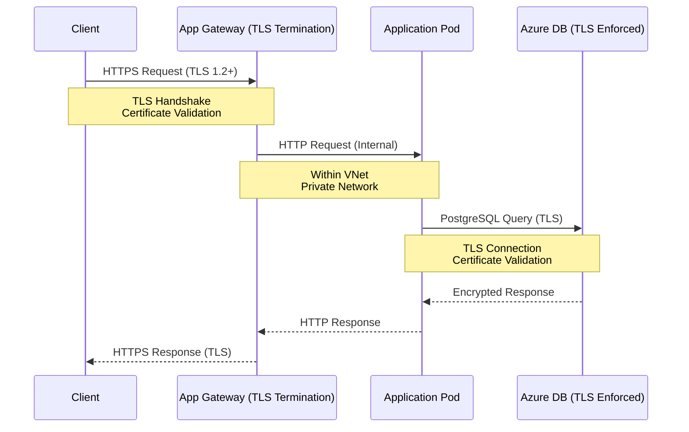
```mermaid
sequenceDiagram
    participant Client as Client
    participant AppGW as App Gateway (TLS Termination)
    participant Pod as Application Pod
    participant AzureDB as Azure DB (TLS Enforced)
    
    Client->>AppGW: HTTPS Request (TLS 1.2+)
    Note over Client,AppGW: TLS Handshake<br/>Certificate Validation
    
    AppGW->>Pod: HTTP Request (Internal)
    Note over AppGW,Pod: Within VNet<br/>Private Network
    
    Pod->>AzureDB: PostgreSQL Query (TLS)
    Note over Pod,AzureDB: TLS Connection<br/>Certificate Validation
    
    AzureDB-->>Pod: Encrypted Response
    Pod-->>AppGW: HTTP Response
    AppGW-->>Client: HTTPS Response (TLS)
```

### Secret Management Flow

#### AWS Secrets Manager

```mermaid
flowchart TD
    TF[Terraform] --> GeneratePassword[Generate Random Password]
    GeneratePassword --> StoreSecret[Store in Secrets Manager]
    
    StoreSecret --> Encrypt[Encrypt with KMS]
    Encrypt --> SecretARN[Return Secret ARN]
    
    SecretARN --> TFOutput[Terraform Output]
    TFOutput --> HelmValues[Pass to Helm Values]
    
    HelmValues --> K8sSecret[Create Kubernetes Secret]
    K8sSecret --> PodEnv[Inject as Environment Variable]
    
    Pod[Application Pod] --> ReadEnv[Read Environment Variable]
    ReadEnv --> ConnectDB[Connect to Database]
    
    alt Direct Secrets Manager Access
        Pod --> IRSA[Use IRSA Credentials]
        IRSA --> FetchSecret[Fetch from Secrets Manager]
        FetchSecret --> Decrypt[Decrypt with KMS]
        Decrypt --> UseSecret[Use Secret]
    end
```

#### Azure Key Vault

```mermaid
flowchart TD
    TF[Terraform] --> GeneratePassword[Generate Random Password]
    GeneratePassword --> StoreSecret[Store in Key Vault]
    
    StoreSecret --> Encrypt[Encrypt with Key Vault Key]
    Encrypt --> SecretURI[Return Secret URI]
    
    SecretURI --> TFOutput[Terraform Output]
    TFOutput --> HelmValues[Pass to Helm Values]
    
    HelmValues --> K8sSecret[Create Kubernetes Secret]
    K8sSecret --> PodEnv[Inject as Environment Variable]
    
    Pod[Application Pod] --> ReadEnv[Read Environment Variable]
    ReadEnv --> ConnectDB[Connect to Database]
    
    alt Direct Key Vault Access
        Pod --> WorkloadID[Use Workload Identity]
        WorkloadID --> FetchSecret[Fetch from Key Vault]
        FetchSecret --> Decrypt[Decrypt with Key Vault]
        Decrypt --> UseSecret[Use Secret]
    end
```

## Kubernetes RBAC

### RBAC Model

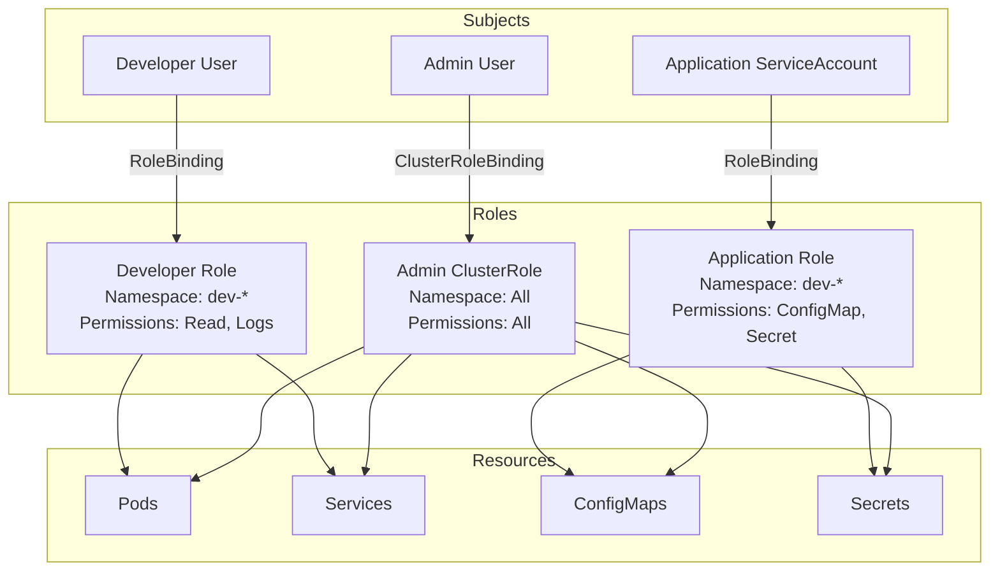
```mermaid
graph TB
    subgraph "Subjects"
        DevUser[Developer User]
        AppSA[Application ServiceAccount]
        AdminUser[Admin User]
    end
    
    subgraph "Roles"
        DevRole[Developer Role<br/>Namespace: dev-*<br/>Permissions: Read, Logs]
        
        AppRole[Application Role<br/>Namespace: dev-*<br/>Permissions: ConfigMap, Secret]
        
        AdminRole[Admin ClusterRole<br/>Namespace: All<br/>Permissions: All]
    end
    
    subgraph "Resources"
        Pods[Pods]
        Services[Services]
        ConfigMaps[ConfigMaps]
        Secrets[Secrets]
    end
    
    DevUser -->|RoleBinding| DevRole
    AppSA -->|RoleBinding| AppRole
    AdminUser -->|ClusterRoleBinding| AdminRole
    
    DevRole --> Pods
    DevRole --> Services
    
    AppRole --> ConfigMaps
    AppRole --> Secrets
    
    AdminRole --> Pods
    AdminRole --> Services
    AdminRole --> ConfigMaps
    AdminRole --> Secrets
```

### Permission Evaluation Flow

```mermaid
flowchart TD
    Request[API Request] --> AuthN{Authenticated?}
    
    AuthN -->|No| Deny[Deny: 401 Unauthorized]
    AuthN -->|Yes| GetUser[Get User Identity]
    
    GetUser --> FindBindings[Find RoleBindings/ClusterRoleBindings]
    FindBindings --> HasBindings{Bindings<br/>Found?}
    
    HasBindings -->|No| Deny2[Deny: 403 Forbidden]
    HasBindings -->|Yes| EvaluateRoles[Evaluate Role Permissions]
    
    EvaluateRoles --> CheckVerb{Verb<br/>Allowed?}
    CheckVerb -->|No| Deny2
    CheckVerb -->|Yes| CheckResource{Resource<br/>Allowed?}
    
    CheckResource -->|No| Deny2
    CheckResource -->|Yes| CheckNamespace{Namespace<br/>Allowed?}
    
    CheckNamespace -->|No| Deny2
    CheckNamespace -->|Yes| Allow[Allow: 200 OK]
```

### IAM to Kubernetes Mapping

```mermaid
sequenceDiagram
    participant IAM as AWS IAM
    participant ConfigMap as aws-auth ConfigMap
    participant K8s as Kubernetes
    participant User as User/ServiceAccount
    
    IAM->>ConfigMap: IAM Role ARN
    ConfigMap->>ConfigMap: Map to K8s Username/Group
    
    ConfigMap->>K8s: Register Mapping
    
    User->>K8s: Request with IAM Token
    K8s->>IAM: Validate Token
    IAM-->>K8s: Token Valid
    
    K8s->>ConfigMap: Lookup IAM ARN
    ConfigMap-->>K8s: K8s Username/Groups
    
    K8s->>K8s: Apply RBAC Rules
    K8s-->>User: Access Decision
```

## IAM Roles for Service Accounts (IRSA)

### AWS IRSA Architecture

```mermaid
graph TB
    subgraph "Kubernetes"
        Pod[Application Pod]
        SA[ServiceAccount]
        SAAnnotation[Annotation:<br/>eks.amazonaws.com/role-arn]
    end
    
    subgraph "AWS IAM"
        IAMRole[IAM Role]
        TrustPolicy[Trust Policy<br/>OIDC Provider]
        IAMPolicy[IAM Policy<br/>AWS Permissions]
    end
    
    subgraph "EKS"
        OIDC[OIDC Provider]
        Webhook[Webhook]
    end
    
    Pod --> SA
    SA --> SAAnnotation
    SAAnnotation -.->|References| IAMRole
    
    IAMRole --> TrustPolicy
    IAMRole --> IAMPolicy
    
    TrustPolicy -.->|Trusts| OIDC
    
    Pod --> Webhook
    Webhook --> OIDC
    OIDC --> IAMRole
    
    IAMRole --> AWSServices[AWS Services<br/>S3, Secrets Manager, etc.]
```

### Azure Workload Identity Architecture

```mermaid
graph TB
    subgraph "Kubernetes"
        Pod[Application Pod]
        SA[ServiceAccount]
        SAAnnotation[Annotation:<br/>azure.workload.identity/client-id]
        SALabel[Label:<br/>azure.workload.identity/use: true]
    end
    
    subgraph "Azure AD"
        ManagedIdentity[User-Assigned<br/>Managed Identity]
        FederatedCred[Federated Identity<br/>Credential]
        AADToken[Azure AD Token]
    end
    
    subgraph "AKS"
        OIDC[OIDC Issuer]
        Webhook[Mutating Webhook]
    end
    
    Pod --> SA
    SA --> SAAnnotation
    SA --> SALabel
    SAAnnotation -.->|References| ManagedIdentity
    
    ManagedIdentity --> FederatedCred
    FederatedCred -.->|Trusts| OIDC
    
    Pod --> Webhook
    Webhook --> OIDC
    OIDC --> ManagedIdentity
    ManagedIdentity --> AADToken
    
    AADToken --> AzureServices[Azure Services<br/>Storage, Key Vault, etc.]
```

### AWS IRSA Token Exchange

```mermaid
sequenceDiagram
    participant Pod as Application Pod
    participant Webhook as Mutating Webhook
    participant OIDC as OIDC Provider
    participant STS as AWS STS
    participant AWS as AWS Service
    
    Pod->>Webhook: Pod Creation
    Webhook->>Webhook: Inject OIDC Token
    Webhook-->>Pod: Token Mounted
    
    Pod->>Pod: Application Starts
    Pod->>Pod: Read OIDC Token
    
    Pod->>STS: AssumeRoleWithWebIdentity
    Note over Pod,STS: OIDC Token + IAM Role ARN
    
    STS->>OIDC: Validate Token
    OIDC-->>STS: Token Valid
    
    STS->>STS: Check Trust Policy
    STS-->>Pod: Temporary AWS Credentials
    
    Pod->>AWS: API Call with Credentials
    AWS->>AWS: Validate Credentials
    AWS->>AWS: Check IAM Policy
    AWS-->>Pod: API Response
```

### Azure Workload Identity Token Exchange

```mermaid
sequenceDiagram
    participant Pod as Application Pod
    participant Webhook as Mutating Webhook
    participant OIDC as OIDC Issuer
    participant AAD as Azure AD
    participant Azure as Azure Service
    
    Pod->>Webhook: Pod Creation
    Webhook->>Webhook: Inject Service Account Token
    Webhook-->>Pod: Token Mounted
    
    Pod->>Pod: Application Starts
    Pod->>Pod: Read SA Token
    
    Pod->>AAD: Request Azure AD Token
    Note over Pod,AAD: SA Token + Client ID
    
    AAD->>OIDC: Validate SA Token
    OIDC-->>AAD: Token Valid
    
    AAD->>AAD: Check Federated Credential
    AAD-->>Pod: Azure AD Access Token
    
    Pod->>Azure: API Call with Token
    Azure->>Azure: Validate Token
    Azure->>Azure: Check RBAC Permissions
    Azure-->>Pod: API Response
```

## Audit and Compliance

### Audit Logging Architecture

#### AWS Audit Logging

```mermaid
graph TB
    subgraph "Event Sources"
        CLI[CLI Operations]
        TF[Terraform Changes]
        K8s[Kubernetes API]
        AWS[AWS API Calls]
    end
    
    subgraph "Log Destinations"
        CloudTrail[CloudTrail]
        VPCFlow[VPC Flow Logs]
        K8sAudit[K8s Audit Logs]
        CLILogs[CLI Logs]
    end
    
    subgraph "Analysis"
        CloudWatch[CloudWatch Logs Insights]
        Athena[Amazon Athena]
        QuickSight[QuickSight Dashboards]
    end
    
    CLI --> CLILogs
    TF --> CloudTrail
    K8s --> K8sAudit
    AWS --> CloudTrail
    
    CloudTrail --> CloudWatch
    VPCFlow --> CloudWatch
    K8sAudit --> CloudWatch
    CLILogs --> CloudWatch
    
    CloudWatch --> Athena
    Athena --> QuickSight
```

#### Azure Audit Logging

```mermaid
graph TB
    subgraph "Event Sources"
        CLI[CLI Operations]
        TF[Terraform Changes]
        K8s[Kubernetes API]
        Azure[Azure API Calls]
    end
    
    subgraph "Log Destinations"
        ActivityLog[Activity Log]
        NSGFlow[NSG Flow Logs]
        K8sAudit[K8s Audit Logs]
        CLILogs[CLI Logs]
    end
    
    subgraph "Analysis"
        LogAnalytics[Log Analytics]
        KQL[Kusto Query Language]
        Workbooks[Azure Workbooks]
    end
    
    CLI --> CLILogs
    TF --> ActivityLog
    K8s --> K8sAudit
    Azure --> ActivityLog
    
    ActivityLog --> LogAnalytics
    NSGFlow --> LogAnalytics
    K8sAudit --> LogAnalytics
    CLILogs --> LogAnalytics
    
    LogAnalytics --> KQL
    KQL --> Workbooks
```

### CloudTrail Event Flow

```mermaid
sequenceDiagram
    participant User as User/CLI
    participant AWS as AWS Service
    participant CloudTrail as CloudTrail
    participant S3 as S3 Bucket
    participant CloudWatch as CloudWatch Logs
    
    User->>AWS: API Call
    AWS->>AWS: Process Request
    AWS->>CloudTrail: Log Event
    
    CloudTrail->>CloudTrail: Enrich Event Data
    CloudTrail->>S3: Store Event (JSON)
    CloudTrail->>CloudWatch: Stream Event
    
    AWS-->>User: API Response
    
    Note over S3: Long-term Storage<br/>Compliance Archive
    Note over CloudWatch: Real-time Monitoring<br/>Alerting
```

### Compliance Monitoring

```mermaid
graph TB
    Resources[AWS Resources] --> Tags{Properly<br/>Tagged?}
    
    Tags -->|No| Alert1[Alert: Missing Tags]
    Tags -->|Yes| Encryption{Encryption<br/>Enabled?}
    
    Encryption -->|No| Alert2[Alert: Unencrypted Resource]
    Encryption -->|Yes| Network{In Private<br/>Subnet?}
    
    Network -->|No| Alert3[Alert: Public Resource]
    Network -->|Yes| Backup{Backup<br/>Enabled?}
    
    Backup -->|No| Alert4[Alert: No Backup]
    Backup -->|Yes| Compliant[Compliant Resource]
    
    Alert1 --> Remediation[Automated Remediation]
    Alert2 --> Remediation
    Alert3 --> Remediation
    Alert4 --> Remediation
    
    Remediation --> ApplyTags[Apply Tags]
    Remediation --> EnableEncryption[Enable Encryption]
    Remediation --> MoveToPrivate[Move to Private Subnet]
    Remediation --> EnableBackup[Enable Backup]
```

## Security Best Practices

### Least Privilege Model

```mermaid
graph TB
    Start[New User/Application] --> MinimalPerms[Grant Minimal Permissions]
    
    MinimalPerms --> Monitor[Monitor Usage]
    Monitor --> NeedMore{Additional<br/>Permissions<br/>Needed?}
    
    NeedMore -->|Yes| RequestAccess[Request Additional Access]
    NeedMore -->|No| Continue[Continue Monitoring]
    
    RequestAccess --> Justify[Justify Business Need]
    Justify --> Approve{Approved?}
    
    Approve -->|Yes| GrantSpecific[Grant Specific Permission]
    Approve -->|No| Deny[Deny Request]
    
    GrantSpecific --> Document[Document Change]
    Document --> Monitor
    
    Continue --> Review[Periodic Review]
    Review --> StillNeeded{Still<br/>Needed?}
    
    StillNeeded -->|Yes| Continue
    StillNeeded -->|No| Revoke[Revoke Permission]
    
    Revoke --> Document
    Deny --> Monitor
```

### Security Incident Response

```mermaid
flowchart TD
    Detect[Security Event Detected] --> Classify{Severity?}
    
    Classify -->|Critical| IsolateImmediate[Immediate Isolation]
    Classify -->|High| IsolateScheduled[Scheduled Isolation]
    Classify -->|Medium| Investigate[Investigate]
    Classify -->|Low| Log[Log and Monitor]
    
    IsolateImmediate --> RevokeAccess[Revoke All Access]
    RevokeScheduled --> RevokeAccess
    
    RevokeAccess --> NotifyTeam[Notify Security Team]
    NotifyTeam --> ForensicAnalysis[Forensic Analysis]
    
    Investigate --> GatherLogs[Gather Logs]
    GatherLogs --> AnalyzeLogs[Analyze Logs]
    AnalyzeLogs --> ThreatConfirmed{Threat<br/>Confirmed?}
    
    ThreatConfirmed -->|Yes| RevokeAccess
    ThreatConfirmed -->|No| FalsePositive[Mark False Positive]
    
    ForensicAnalysis --> IdentifyRoot[Identify Root Cause]
    IdentifyRoot --> Remediate[Remediate Vulnerability]
    Remediate --> RestoreService[Restore Service]
    
    RestoreService --> PostMortem[Post-Mortem Analysis]
    PostMortem --> UpdatePolicies[Update Security Policies]
    UpdatePolicies --> Complete[Incident Resolved]
    
    FalsePositive --> TuneDetection[Tune Detection Rules]
    TuneDetection --> Complete
    
    Log --> PeriodicReview[Periodic Review]
    PeriodicReview --> Complete
```

### Vulnerability Management

```mermaid
graph LR
    subgraph "Detection"
        Scan[Security Scanning]
        CVE[CVE Monitoring]
        PenTest[Penetration Testing]
    end
    
    subgraph "Assessment"
        Triage[Triage Findings]
        Risk[Risk Assessment]
        Prioritize[Prioritize Remediation]
    end
    
    subgraph "Remediation"
        Patch[Apply Patches]
        Config[Update Configuration]
        Replace[Replace Component]
    end
    
    subgraph "Verification"
        Retest[Retest]
        Validate[Validate Fix]
        Document[Document Resolution]
    end
    
    Scan --> Triage
    CVE --> Triage
    PenTest --> Triage
    
    Triage --> Risk
    Risk --> Prioritize
    
    Prioritize --> Patch
    Prioritize --> Config
    Prioritize --> Replace
    
    Patch --> Retest
    Config --> Retest
    Replace --> Retest
    
    Retest --> Validate
    Validate --> Document
```
