# DevPlatform CLI - Troubleshooting Guide

## Diagnostic Flow

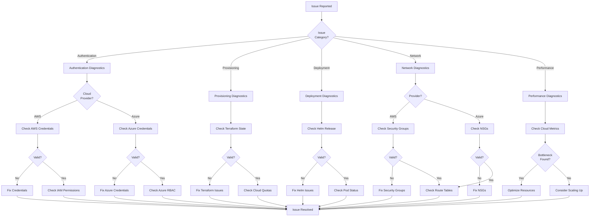

## Common Issues and Solutions

### Authentication Issues

#### Issue: No AWS Credentials Found

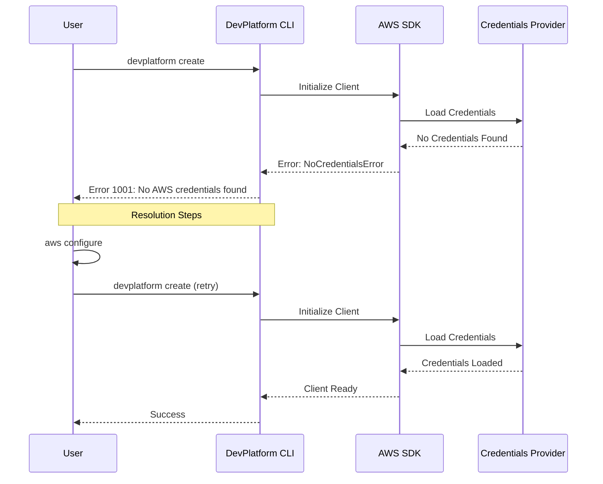

**Symptoms:**
- Error message: "No AWS credentials found"
- Error code: 1001

**Diagnosis:**
```bash
# Check if AWS CLI is configured
aws sts get-caller-identity

# Check credentials file
cat ~/.aws/credentials

# Check environment variables
echo $AWS_ACCESS_KEY_ID
echo $AWS_SECRET_ACCESS_KEY
```

**Solutions:**
1. Configure AWS CLI:
```bash
aws configure
```

2. Set environment variables:
```bash
export AWS_ACCESS_KEY_ID=your_access_key
export AWS_SECRET_ACCESS_KEY=your_secret_key
export AWS_DEFAULT_REGION=us-east-1
```

3. Use AWS profile:
```bash
devplatform create --app myapp --env dev --profile my-profile
```

#### Issue: Azure CLI Not Configured

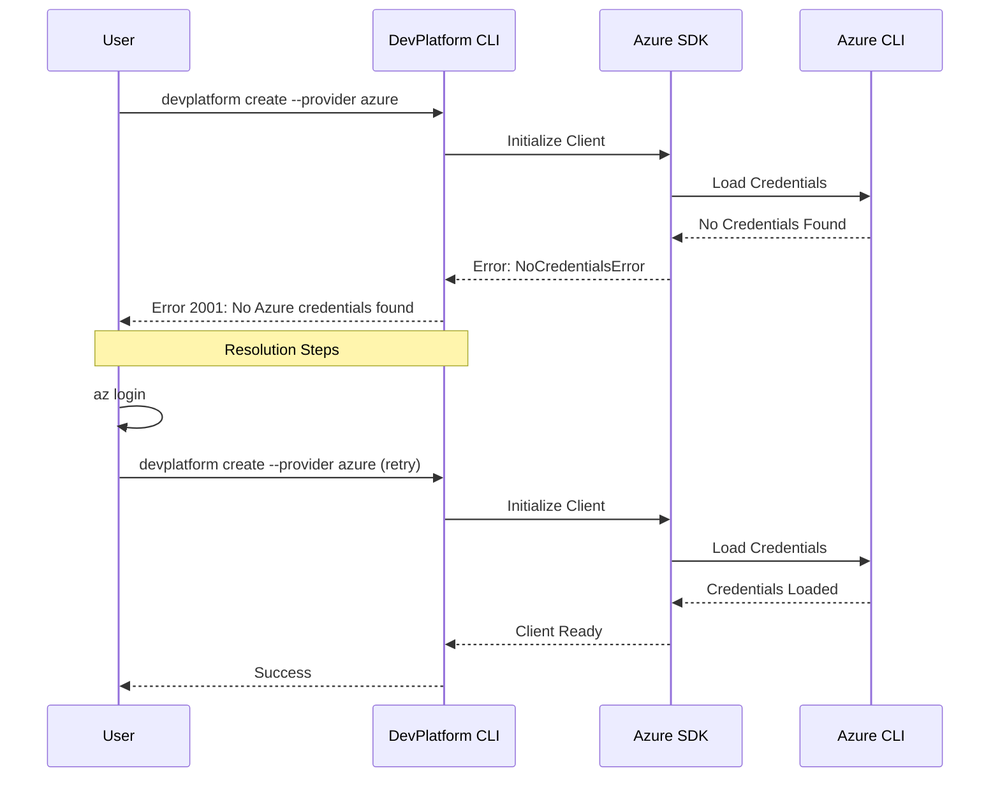

**Symptoms:**
- Error message: "No Azure credentials found"
- Error code: 2001

**Diagnosis:**
```bash
# Check if Azure CLI is installed
az --version

# Check if logged in
az account show

# List available subscriptions
az account list --output table
```

**Solutions:**
1. Install Azure CLI:
```bash
# On Linux
curl -sL https://aka.ms/InstallAzureCLIDeb | sudo bash

# On macOS
brew install azure-cli

# On Windows
# Download from https://aka.ms/installazurecliwindows
```

2. Login to Azure:
```bash
# Interactive login
az login

# Login with service principal
az login --service-principal \
  --username <app-id> \
  --password <password-or-cert> \
  --tenant <tenant-id>
```

3. Set default subscription:
```bash
az account set --subscription <subscription-id>
```

#### Issue: Azure Subscription Not Found

**Symptoms:**
- Error message: "Subscription not found"
- Error code: 2003

**Diagnosis:**
```bash
# List all subscriptions
az account list --output table

# Show current subscription
az account show

# Check subscription ID in config
cat .devplatform.yaml | grep subscription_id
```

**Solutions:**
1. Verify subscription ID in configuration:
```yaml
azure:
  subscription_id: "12345678-1234-1234-1234-123456789012"  # Verify this is correct
  location: eastus
  tenant_id: "87654321-4321-4321-4321-210987654321"
```

2. Set correct subscription:
```bash
az account set --subscription <correct-subscription-id>
```

3. Verify access to subscription:
```bash
az account show --subscription <subscription-id>
```

#### Issue: Expired Credentials

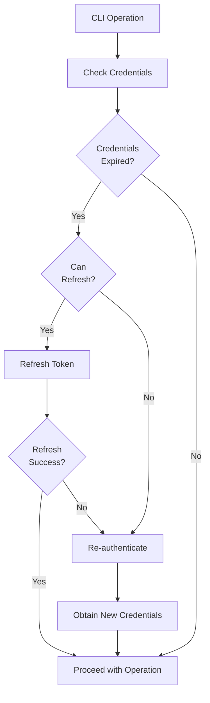

**Symptoms:**
- Error message: "The security token included in the request is expired"
- Error code: 1002

**Diagnosis:**
```bash
# Check token expiration
aws sts get-caller-identity

# Check session token
aws configure list
```

**Solutions:**
1. For temporary credentials (SSO/AssumeRole):
```bash
# Re-authenticate with SSO
aws sso login --profile my-profile

# Or assume role again
aws sts assume-role --role-arn arn:aws:iam::123456789012:role/MyRole --role-session-name my-session
```

2. For long-term credentials:
```bash
# Reconfigure with new credentials
aws configure
```

#### Issue: Insufficient IAM Permissions

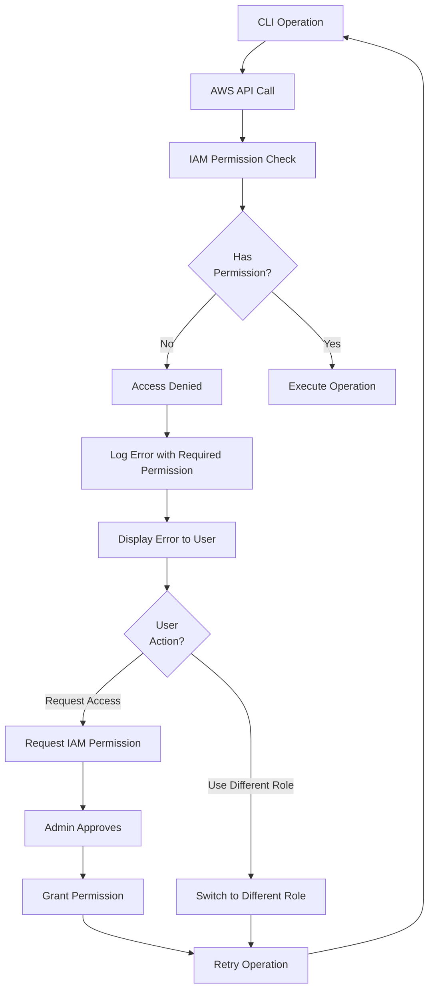

**Symptoms:**
- Error message: "User is not authorized to perform: [action]"
- Error code: 1003

**Diagnosis:**
```bash
# Check current identity
aws sts get-caller-identity

# Test specific permissions
aws ec2 describe-vpcs --dry-run
aws rds describe-db-instances --dry-run
```

**Required IAM Permissions:**
```json
{
  "Version": "2012-10-17",
  "Statement": [
    {
      "Effect": "Allow",
      "Action": [
        "ec2:CreateVpc",
        "ec2:CreateSubnet",
        "ec2:CreateSecurityGroup",
        "ec2:AuthorizeSecurityGroupIngress",
        "rds:CreateDBInstance",
        "rds:DescribeDBInstances",
        "eks:DescribeCluster",
        "s3:GetObject",
        "s3:PutObject",
        "dynamodb:PutItem",
        "dynamodb:GetItem"
      ],
      "Resource": "*"
    }
  ]
}
```

**Solutions:**
1. Request IAM permissions from administrator
2. Use a role with sufficient permissions
3. Check for permission boundaries or SCPs

### Provisioning Issues

#### Issue: Terraform State Locked

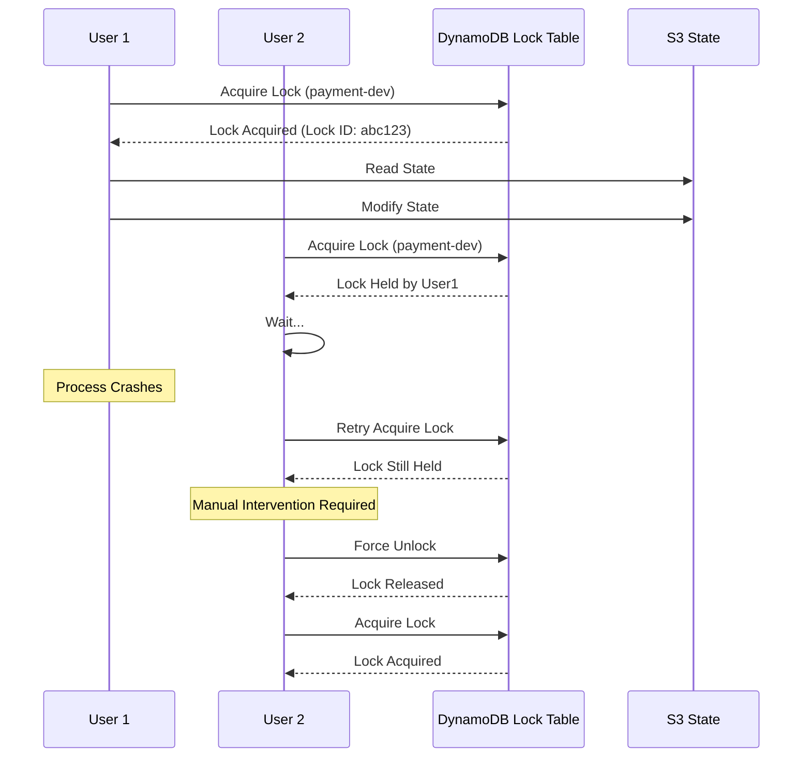

**Symptoms:**
- Error message: "Error acquiring the state lock"
- Error code: 1203
- Lock ID displayed in error

**Diagnosis:**
```bash
# Check DynamoDB lock table
aws dynamodb scan --table-name terraform-locks

# Check who holds the lock
aws dynamodb get-item --table-name terraform-locks \
  --key '{"LockID": {"S": "terraform-state-bucket/payment-dev.tfstate"}}'
```

**Solutions:**
1. Wait for lock to be released automatically
2. Force unlock (use with caution):
```bash
cd terraform/environments/dev
terraform force-unlock <lock-id>
```

3. Manually delete lock from DynamoDB:
```bash
aws dynamodb delete-item --table-name terraform-locks \
  --key '{"LockID": {"S": "terraform-state-bucket/payment-dev.tfstate"}}'
```

#### Issue: Azure Storage Backend Lock

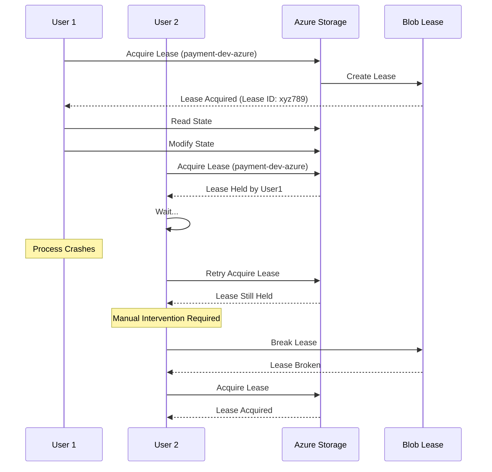

**Symptoms:**
- Error message: "Error acquiring the state lock"
- Error code: 2102
- Azure Storage blob lease error

**Diagnosis:**
```bash
# Check Azure Storage account
az storage account show --name <storage-account-name>

# List blobs in container
az storage blob list \
  --account-name <storage-account-name> \
  --container-name tfstate \
  --output table

# Check blob lease status
az storage blob show \
  --account-name <storage-account-name> \
  --container-name tfstate \
  --name payment-dev-azure.tfstate \
  --query "properties.lease"
```

**Solutions:**
1. Wait for lease to expire (typically 60 seconds)

2. Break the lease:
```bash
az storage blob lease break \
  --account-name <storage-account-name> \
  --container-name tfstate \
  --blob-name payment-dev-azure.tfstate
```

3. Force unlock in Terraform:
```bash
cd terraform/environments/dev
terraform force-unlock <lock-id>
```

#### Issue: Resource Quota Exceeded

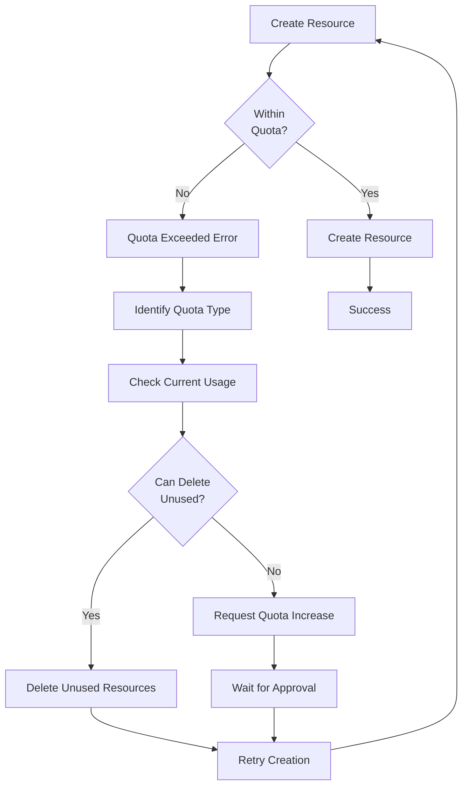

**Symptoms:**
- Error message: "You have exceeded your quota"
- Common quotas: VPCs per region, RDS instances, EIPs

**Diagnosis:**
```bash
# Check VPC quota
aws ec2 describe-vpcs --query 'Vpcs[*].VpcId' | jq length

# Check RDS quota
aws rds describe-db-instances --query 'DBInstances[*].DBInstanceIdentifier' | jq length

# Check service quotas
aws service-quotas get-service-quota \
  --service-code ec2 \
  --quota-code L-F678F1CE
```

**Solutions:**
1. Delete unused resources:
```bash
# List unused VPCs
aws ec2 describe-vpcs --filters "Name=tag:ManagedBy,Values=devplatform-cli"

# Destroy unused environments
devplatform destroy --app old-app --env dev --confirm
```

2. Request quota increase:
```bash
aws service-quotas request-service-quota-increase \
  --service-code ec2 \
  --quota-code L-F678F1CE \
  --desired-value 10
```

#### Issue: Terraform Apply Failed

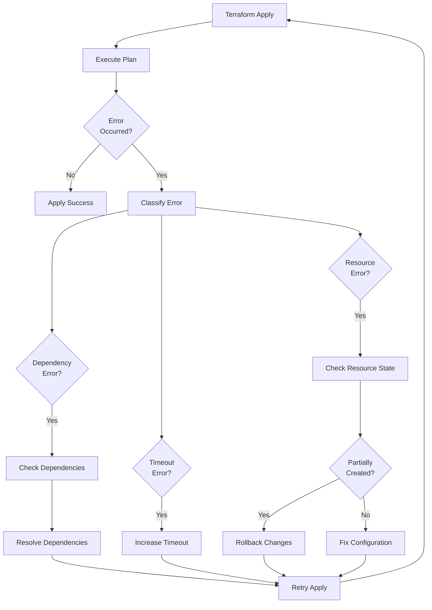

**Symptoms:**
- Terraform apply exits with error
- Partial infrastructure created
- Error code: 1202

**Diagnosis:**
```bash
# Check Terraform state
cd terraform/environments/dev
terraform show

# Check for drift
terraform plan

# View detailed logs
devplatform create --app myapp --env dev --verbose --debug
```

**Solutions:**
1. Review error message and fix configuration
2. Import existing resources:
```bash
terraform import aws_vpc.main vpc-abc123
```

3. Rollback and retry:
```bash
devplatform destroy --app myapp --env dev --confirm
devplatform create --app myapp --env dev
```

### Deployment Issues

#### Issue: Helm Install Failed

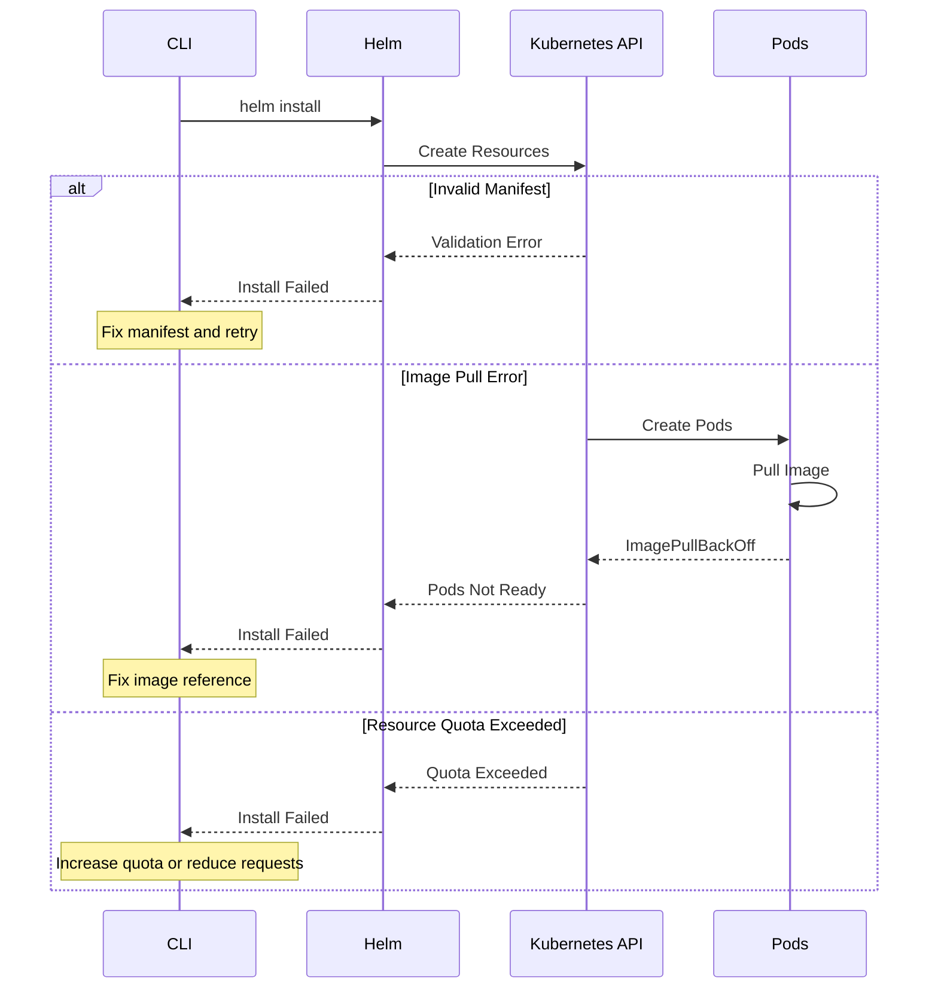

**Symptoms:**
- Error message: "Helm install failed"
- Error code: 1302
- Pods not starting

**Diagnosis:**
```bash
# Check Helm release status
helm status myapp -n dev-myapp

# Check pod status
kubectl get pods -n dev-myapp

# Check pod events
kubectl describe pod <pod-name> -n dev-myapp

# Check pod logs
kubectl logs <pod-name> -n dev-myapp
```

**Solutions:**
1. Fix image pull errors:
```bash
# Verify image exists
docker pull <image-name>

# Update image in values
devplatform create --app myapp --env dev --values-file fixed-values.yaml
```

2. Fix resource quota:
```bash
# Check quota
kubectl describe resourcequota -n dev-myapp

# Reduce resource requests or increase quota
```

3. Fix manifest errors:
```bash
# Validate chart locally
helm lint ./charts/devplatform-base

# Dry-run install
helm install myapp ./charts/devplatform-base --dry-run --debug
```

#### Issue: Pods Not Ready

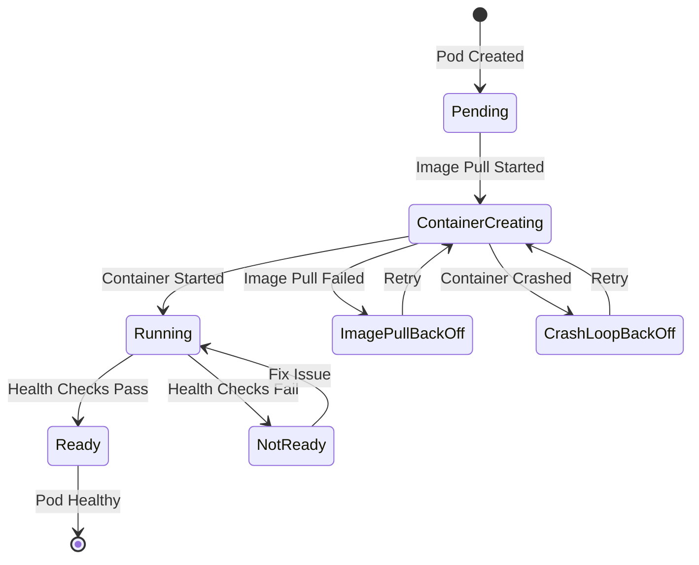

**Symptoms:**
- Pods stuck in Pending, ContainerCreating, or CrashLoopBackOff
- Error code: 1303

**Diagnosis:**
```bash
# Check pod status
kubectl get pods -n dev-myapp -o wide

# Check pod events
kubectl get events -n dev-myapp --sort-by='.lastTimestamp'

# Check pod logs
kubectl logs <pod-name> -n dev-myapp --previous

# Describe pod
kubectl describe pod <pod-name> -n dev-myapp
```

**Common Causes and Solutions:**

1. **ImagePullBackOff:**
```bash
# Check image name and tag
kubectl describe pod <pod-name> -n dev-myapp | grep Image

# Verify image exists
docker pull <image-name>

# Check image pull secrets
kubectl get secrets -n dev-myapp
```

2. **CrashLoopBackOff:**
```bash
# Check application logs
kubectl logs <pod-name> -n dev-myapp

# Check liveness/readiness probes
kubectl describe pod <pod-name> -n dev-myapp | grep -A 5 Liveness
```

3. **Pending (Insufficient Resources):**
```bash
# Check node resources
kubectl describe nodes

# Check resource requests
kubectl describe pod <pod-name> -n dev-myapp | grep -A 5 Requests
```

### Network Issues

#### Issue: Cannot Connect to Database

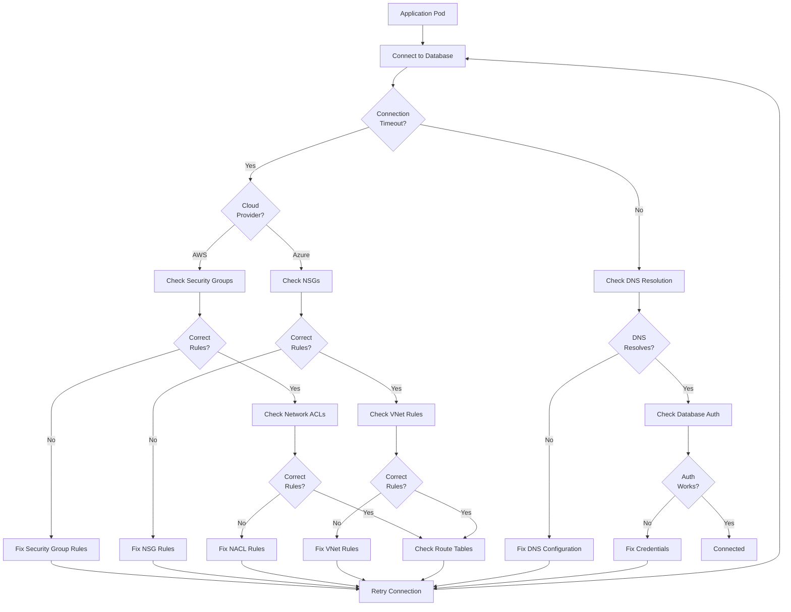

**Symptoms:**
- Connection timeout to database
- "Could not connect to database" errors

**Diagnosis (AWS):**
```bash
# Check RDS endpoint
aws rds describe-db-instances --db-instance-identifier payment-dev

# Check security group rules
aws ec2 describe-security-groups --group-ids sg-abc123

# Test connection from pod
kubectl exec -it <pod-name> -n dev-myapp -- nc -zv <rds-endpoint> 5432

# Check DNS resolution
kubectl exec -it <pod-name> -n dev-myapp -- nslookup <rds-endpoint>
```

**Diagnosis (Azure):**
```bash
# Check Azure Database endpoint
az postgres server show --name payment-dev --resource-group devplatform-rg

# Check NSG rules
az network nsg show --name payment-dev-nsg --resource-group devplatform-rg

# Check NSG rules for database subnet
az network nsg rule list \
  --nsg-name payment-dev-nsg \
  --resource-group devplatform-rg \
  --output table

# Test connection from pod
kubectl exec -it <pod-name> -n dev-myapp -- nc -zv <db-endpoint> 5432

# Check DNS resolution
kubectl exec -it <pod-name> -n dev-myapp -- nslookup <db-endpoint>
```

**Solutions (AWS):**
1. Fix security group rules:
```bash
# Add ingress rule for EKS security group
aws ec2 authorize-security-group-ingress \
  --group-id <rds-sg-id> \
  --protocol tcp \
  --port 5432 \
  --source-group <eks-sg-id>
```

2. Verify network connectivity:
```bash
# Check route tables
aws ec2 describe-route-tables --filters "Name=vpc-id,Values=<vpc-id>"

# Check NACL rules
aws ec2 describe-network-acls --filters "Name=vpc-id,Values=<vpc-id>"
```

**Solutions (Azure):**
1. Fix NSG rules:
```bash
# Add inbound rule for AKS subnet
az network nsg rule create \
  --nsg-name payment-dev-nsg \
  --resource-group devplatform-rg \
  --name AllowAKSToDatabase \
  --priority 100 \
  --source-address-prefixes <aks-subnet-cidr> \
  --destination-port-ranges 5432 \
  --protocol Tcp \
  --access Allow \
  --direction Inbound
```

2. Check Azure Database firewall rules:
```bash
# List firewall rules
az postgres server firewall-rule list \
  --server-name payment-dev \
  --resource-group devplatform-rg

# Add firewall rule for VNet
az postgres server vnet-rule create \
  --server-name payment-dev \
  --resource-group devplatform-rg \
  --name AllowAKSSubnet \
  --vnet-name payment-dev-vnet \
  --subnet aks-subnet
```

3. Verify VNet service endpoints:
```bash
# Check if service endpoint is enabled
az network vnet subnet show \
  --vnet-name payment-dev-vnet \
  --name aks-subnet \
  --resource-group devplatform-rg \
  --query "serviceEndpoints"
```

**Common Solutions (Both Clouds):**
Fix database credentials:
```bash
# Get password from secrets (AWS)
aws secretsmanager get-secret-value --secret-id payment-dev-db-password

# Get password from Key Vault (Azure)
az keyvault secret show --vault-name payment-dev-kv --name db-password

# Update Kubernetes secret
kubectl create secret generic db-creds \
  --from-literal=password=<new-password> \
  -n dev-myapp --dry-run=client -o yaml | kubectl apply -f -
```

#### Issue: Ingress Not Working

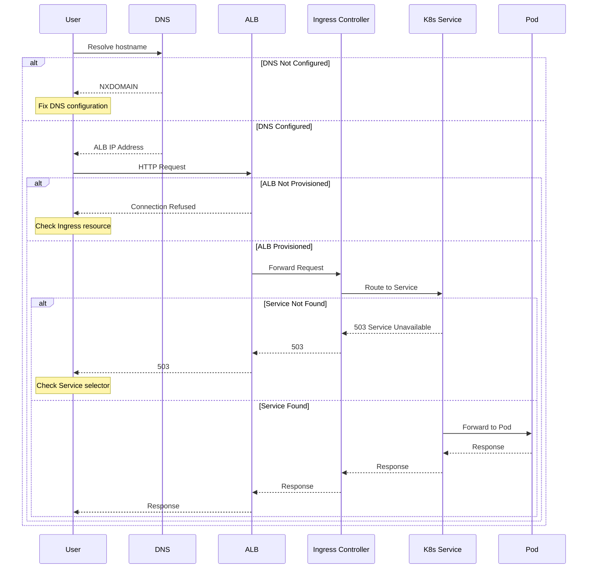

**Symptoms:**
- Cannot access application via ingress URL
- 503 Service Unavailable errors

**Diagnosis:**
```bash
# Check ingress resource
kubectl get ingress -n dev-myapp

# Describe ingress
kubectl describe ingress -n dev-myapp

# Check ALB controller logs
kubectl logs -n kube-system -l app.kubernetes.io/name=aws-load-balancer-controller

# Check service endpoints
kubectl get endpoints -n dev-myapp
```

**Solutions:**
1. Verify ingress configuration:
```bash
# Check ingress annotations
kubectl get ingress -n dev-myapp -o yaml

# Verify ALB is created
aws elbv2 describe-load-balancers
```

2. Fix service selector:
```bash
# Check service selector matches pod labels
kubectl get service -n dev-myapp -o yaml
kubectl get pods -n dev-myapp --show-labels
```

3. Check ALB controller:
```bash
# Verify controller is running
kubectl get pods -n kube-system -l app.kubernetes.io/name=aws-load-balancer-controller

# Check controller version
kubectl describe deployment -n kube-system aws-load-balancer-controller
```

## Performance Issues

### Slow Provisioning

```mermaid
gantt
    title Provisioning Performance Analysis
    dateFormat  ss
    axisFormat %S
    
    section Normal
    Validation           :a1, 00, 5s
    Terraform Init       :a2, after a1, 10s
    VPC Creation         :a3, after a2, 20s
    RDS Creation         :a4, after a3, 120s
    Helm Install         :a5, after a4, 30s
    
    section Slow
    Validation           :b1, 00, 5s
    Terraform Init       :b2, after b1, 30s
    VPC Creation         :b3, after b2, 60s
    RDS Creation         :b4, after b3, 300s
    Helm Install         :b5, after b4, 90s
```

**Diagnosis:**
```bash
# Enable verbose logging
devplatform create --app myapp --env dev --verbose --debug

# Check AWS service health
aws health describe-events --filter eventTypeCategories=issue

# Check network latency
ping dynamodb.us-east-1.amazonaws.com
```

**Solutions:**
1. Use closer AWS region
2. Check network connectivity
3. Verify AWS service health
4. Increase timeout values

### High Resource Usage

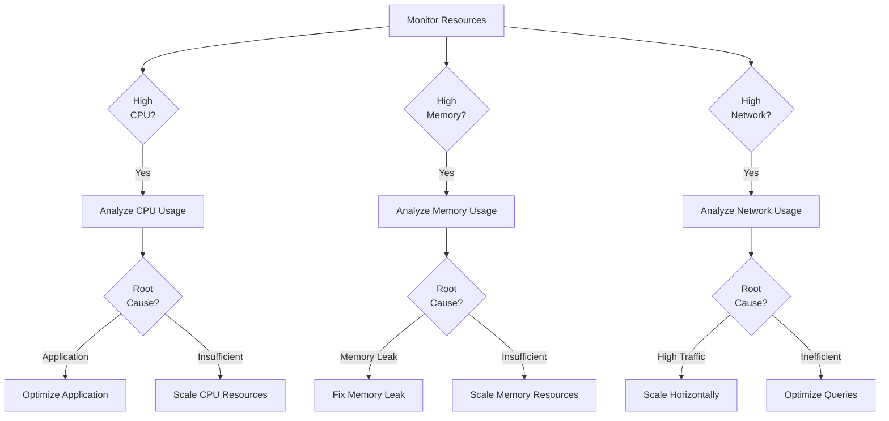

**Diagnosis:**
```bash
# Check pod resource usage
kubectl top pods -n dev-myapp

# Check node resource usage
kubectl top nodes

# Check detailed metrics
kubectl describe pod <pod-name> -n dev-myapp | grep -A 10 "Limits\|Requests"
```

**Solutions:**
1. Adjust resource requests/limits
2. Enable horizontal pod autoscaling
3. Optimize application code
4. Scale up instance types

## Logging and Debugging

### Enable Debug Logging

```bash
# CLI debug mode
devplatform create --app myapp --env dev --debug

# Terraform debug
export TF_LOG=DEBUG
devplatform create --app myapp --env dev

# Helm debug
devplatform create --app myapp --env dev --verbose
```

### Access Logs

```bash
# CLI logs
cat ~/.devplatform/logs/devplatform.log

# Terraform logs
cat ~/.devplatform/logs/terraform.log

# Helm logs
cat ~/.devplatform/logs/helm.log

# Pod logs
kubectl logs <pod-name> -n dev-myapp

# Previous pod logs (after crash)
kubectl logs <pod-name> -n dev-myapp --previous
```

### Collect Diagnostic Information

```bash
# Create diagnostic bundle
devplatform diagnose --app myapp --env dev --output diagnostic.tar.gz

# Bundle includes:
# - CLI logs
# - Terraform state
# - Kubernetes resources
# - Pod logs
# - Events
# - Configuration files
```
