# DevPlatform CLI - Workflow Documentation

## Create Command Workflow

### Complete Create Flow

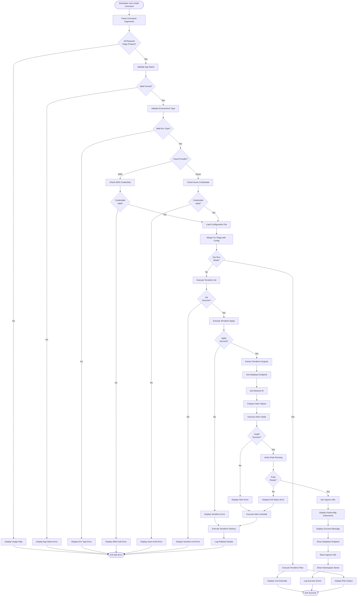

### Terraform Execution Detail

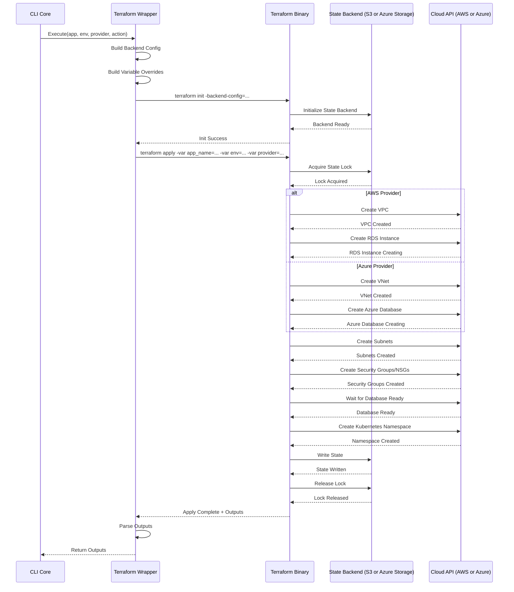

### Helm Deployment Detail

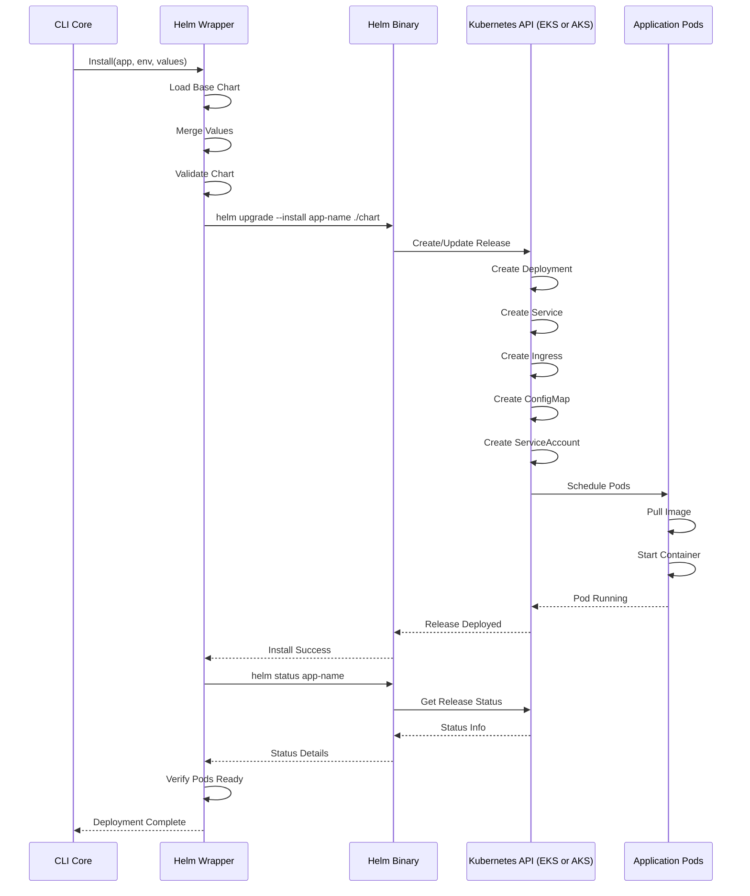

## Status Command Workflow

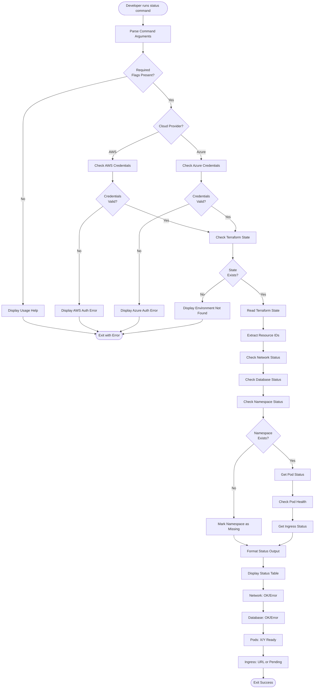

### Status Check Sequence

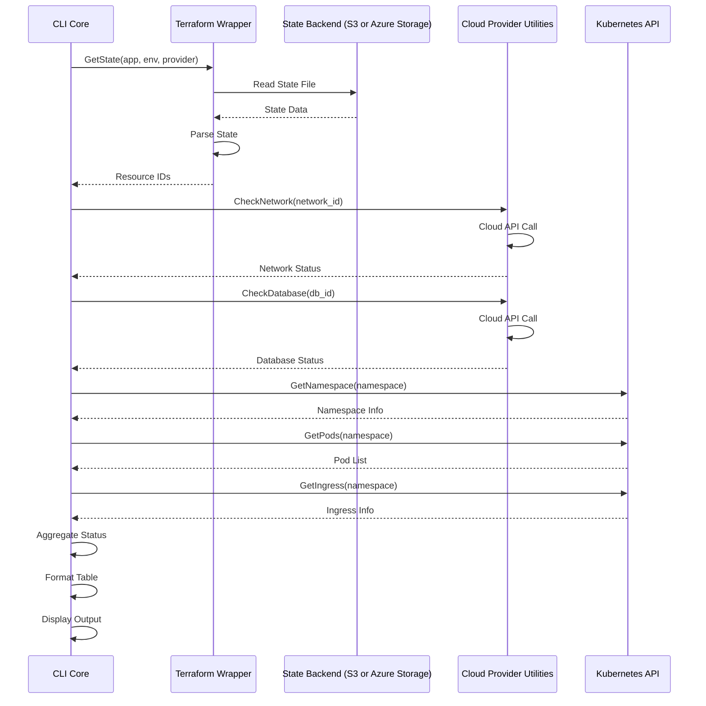

## Destroy Command Workflow

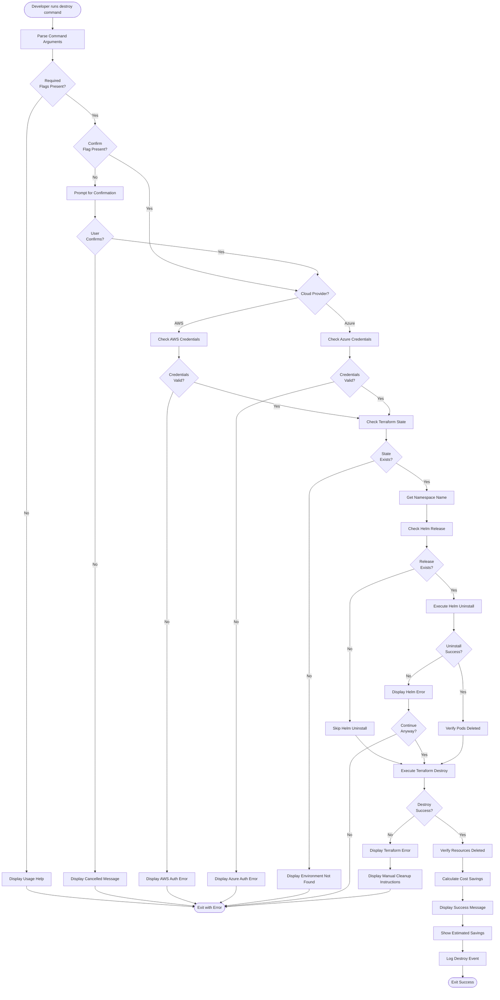

### Destroy Sequence with Rollback Handling

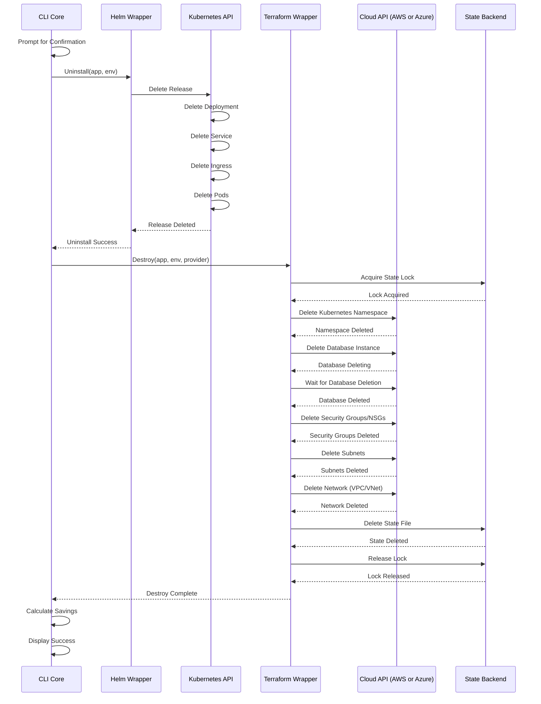

## Configuration Loading Workflow

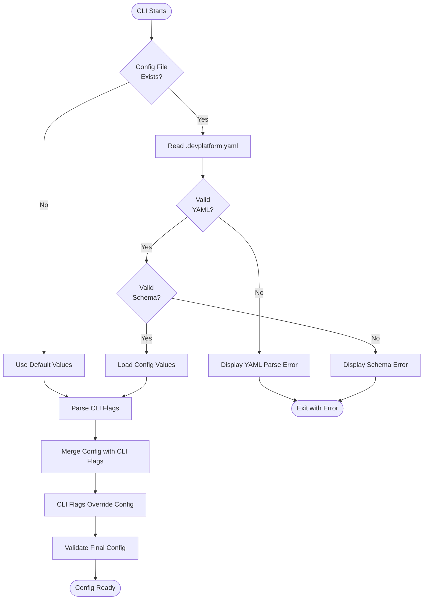

## Error Handling and Rollback Workflow

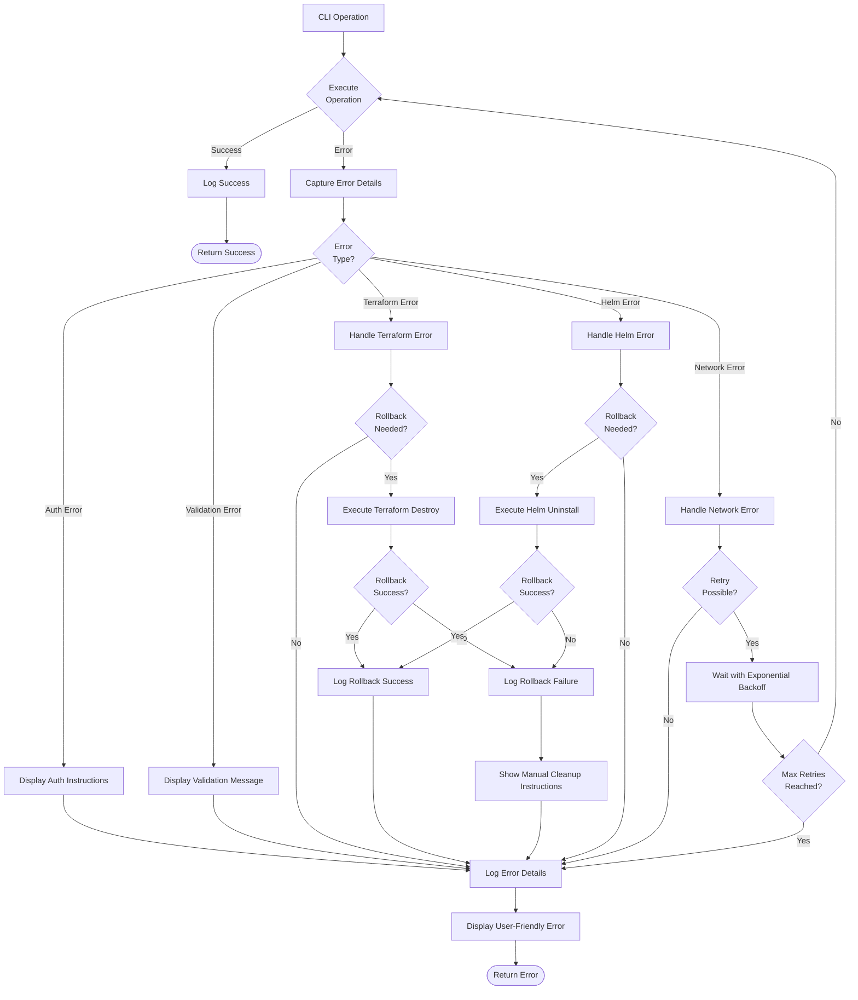

## Concurrent Execution Workflow

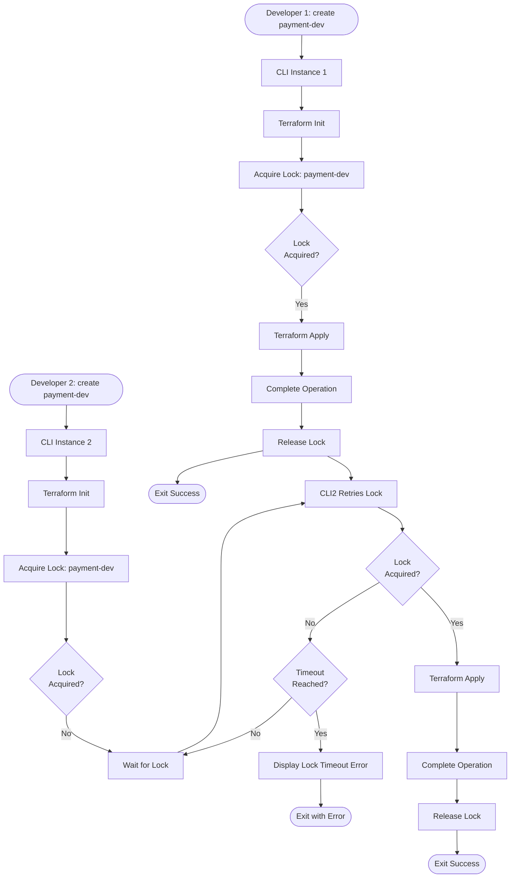

## Version Check Workflow

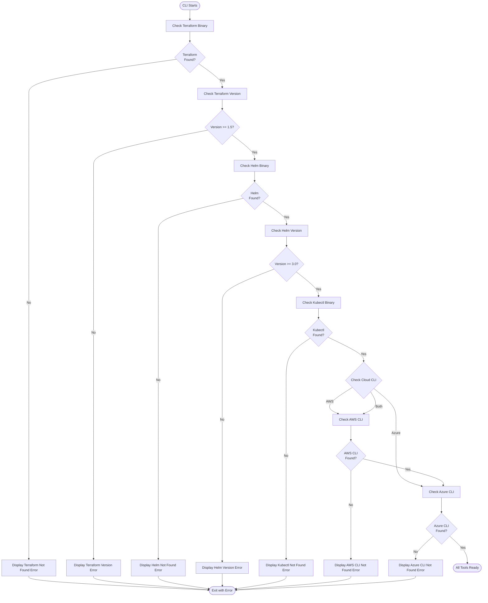

## Logging Workflow

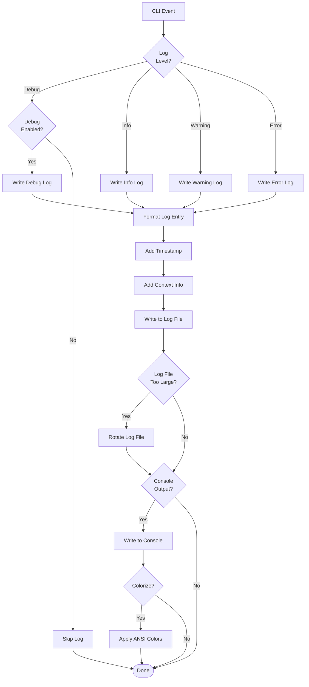
