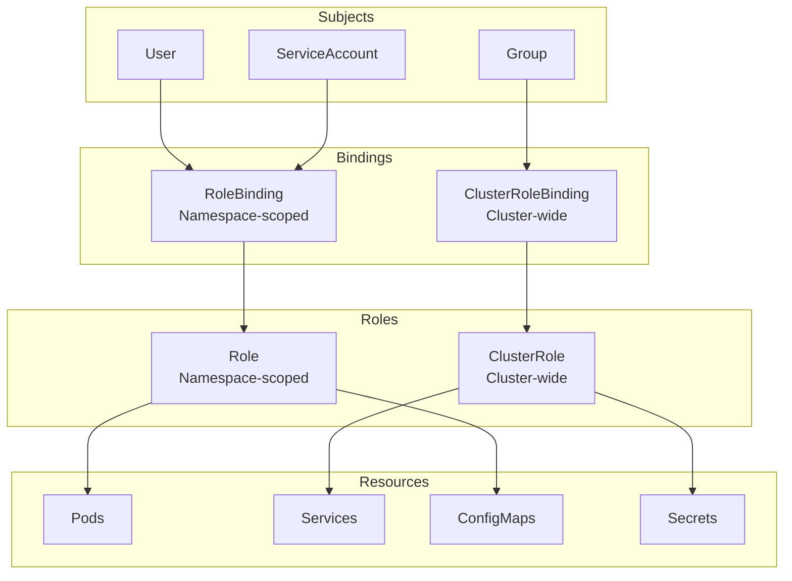
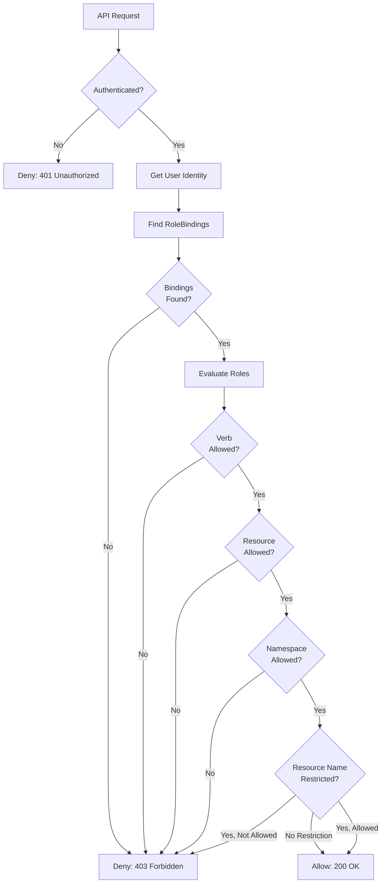

Role-Based Access Control (RBAC) provides fine-grained access management for Kubernetes resources and cloud infrastructure.

## Kubernetes RBAC Model



## RBAC Components

<CardGroup cols={2}>
  <Card title="Role" icon="user-tag">
    Namespace-scoped permissions for resources within a specific namespace
  </Card>
  <Card title="ClusterRole" icon="globe">
    Cluster-wide permissions for resources across all namespaces
  </Card>
  <Card title="RoleBinding" icon="link">
    Binds a Role to subjects (users, groups, service accounts) in a namespace
  </Card>
  <Card title="ClusterRoleBinding" icon="link-simple">
    Binds a ClusterRole to subjects across the entire cluster
  </Card>
</CardGroup>

## Common RBAC Patterns

<Tabs>
  <Tab title="Developer Access">
    ### Read-Only Developer Role
    
    Grant developers read access to specific namespaces:
    
    ```yaml
    apiVersion: rbac.authorization.k8s.io/v1
    kind: Role
    metadata:
      name: developer-reader
      namespace: development
    rules:
    - apiGroups: ["", "apps", "batch"]
      resources:
        - pods
        - pods/log
        - deployments
        - services
        - configmaps
        - jobs
      verbs: ["get", "list", "watch"]
    ---
    apiVersion: rbac.authorization.k8s.io/v1
    kind: RoleBinding
    metadata:
      name: developer-reader-binding
      namespace: development
    subjects:
    - kind: Group
      name: developers
      apiGroup: rbac.authorization.k8s.io
    roleRef:
      kind: Role
      name: developer-reader
      apiGroup: rbac.authorization.k8s.io
    ```
    
    ### Full Developer Role
    
    Grant developers full access to development namespace:
    
    ```yaml
    apiVersion: rbac.authorization.k8s.io/v1
    kind: Role
    metadata:
      name: developer-full
      namespace: development
    rules:
    - apiGroups: ["", "apps", "batch", "networking.k8s.io"]
      resources:
        - pods
        - pods/log
        - pods/exec
        - deployments
        - services
        - configmaps
        - secrets
        - ingresses
        - jobs
        - cronjobs
      verbs: ["*"]
    ---
    apiVersion: rbac.authorization.k8s.io/v1
    kind: RoleBinding
    metadata:
      name: developer-full-binding
      namespace: development
    subjects:
    - kind: Group
      name: developers
      apiGroup: rbac.authorization.k8s.io
    roleRef:
      kind: Role
      name: developer-full
      apiGroup: rbac.authorization.k8s.io
    ```
  </Tab>
  
  <Tab title="Application Access">
    ### Application ServiceAccount
    
    Grant application pods minimal required permissions:
    
    ```yaml
    apiVersion: v1
    kind: ServiceAccount
    metadata:
      name: my-app
      namespace: production
    ---
    apiVersion: rbac.authorization.k8s.io/v1
    kind: Role
    metadata:
      name: my-app-role
      namespace: production
    rules:
    - apiGroups: [""]
      resources: ["configmaps"]
      verbs: ["get", "list", "watch"]
    - apiGroups: [""]
      resources: ["secrets"]
      verbs: ["get"]
      resourceNames: ["my-app-secrets"]  # Restrict to specific secret
    ---
    apiVersion: rbac.authorization.k8s.io/v1
    kind: RoleBinding
    metadata:
      name: my-app-binding
      namespace: production
    subjects:
    - kind: ServiceAccount
      name: my-app
      namespace: production
    roleRef:
      kind: Role
      name: my-app-role
      apiGroup: rbac.authorization.k8s.io
    ```
    
    Use in deployment:
    
    ```yaml
    apiVersion: apps/v1
    kind: Deployment
    metadata:
      name: my-app
      namespace: production
    spec:
      template:
        spec:
          serviceAccountName: my-app
          containers:
          - name: app
            image: my-app:latest
    ```
  </Tab>
  
  <Tab title="Admin Access">
    ### Cluster Admin
    
    Grant full cluster access (use sparingly):
    
    ```yaml
    apiVersion: rbac.authorization.k8s.io/v1
    kind: ClusterRoleBinding
    metadata:
      name: admin-binding
    subjects:
    - kind: User
      name: admin@example.com
      apiGroup: rbac.authorization.k8s.io
    roleRef:
      kind: ClusterRole
      name: cluster-admin  # Built-in ClusterRole
      apiGroup: rbac.authorization.k8s.io
    ```
    
    ### Namespace Admin
    
    Grant admin access to specific namespace:
    
    ```yaml
    apiVersion: rbac.authorization.k8s.io/v1
    kind: RoleBinding
    metadata:
      name: namespace-admin-binding
      namespace: production
    subjects:
    - kind: User
      name: ops-admin@example.com
      apiGroup: rbac.authorization.k8s.io
    roleRef:
      kind: ClusterRole
      name: admin  # Built-in ClusterRole
      apiGroup: rbac.authorization.k8s.io
    ```
  </Tab>
  
  <Tab title="CI/CD Access">
    ### CI/CD ServiceAccount
    
    Grant CI/CD pipeline deployment permissions:
    
    ```yaml
    apiVersion: v1
    kind: ServiceAccount
    metadata:
      name: cicd-deployer
      namespace: production
    ---
    apiVersion: rbac.authorization.k8s.io/v1
    kind: Role
    metadata:
      name: cicd-deployer-role
      namespace: production
    rules:
    - apiGroups: ["apps"]
      resources: ["deployments", "replicasets"]
      verbs: ["get", "list", "watch", "create", "update", "patch"]
    - apiGroups: [""]
      resources: ["services", "configmaps"]
      verbs: ["get", "list", "watch", "create", "update", "patch"]
    - apiGroups: [""]
      resources: ["pods"]
      verbs: ["get", "list", "watch"]
    - apiGroups: [""]
      resources: ["pods/log"]
      verbs: ["get", "list"]
    ---
    apiVersion: rbac.authorization.k8s.io/v1
    kind: RoleBinding
    metadata:
      name: cicd-deployer-binding
      namespace: production
    subjects:
    - kind: ServiceAccount
      name: cicd-deployer
      namespace: production
    roleRef:
      kind: Role
      name: cicd-deployer-role
      apiGroup: rbac.authorization.k8s.io
    ```
    
    Get ServiceAccount token:
    
    ```bash
    # Create token
    kubectl create token cicd-deployer -n production --duration=8760h
    
    # Use in CI/CD
    kubectl --token=$TOKEN get pods -n production
    ```
  </Tab>
</Tabs>

## Cloud Provider IAM Integration

<Tabs>
  <Tab title="AWS EKS">
    ### aws-auth ConfigMap
    
    Map AWS IAM users and roles to Kubernetes RBAC:
    
    ```yaml
    apiVersion: v1
    kind: ConfigMap
    metadata:
      name: aws-auth
      namespace: kube-system
    data:
      mapRoles: |
        # EKS worker nodes
        - rolearn: arn:aws:iam::123456789012:role/eks-node-role
          username: system:node:{{EC2PrivateDNSName}}
          groups:
            - system:bootstrappers
            - system:nodes
        
        # Developer role
        - rolearn: arn:aws:iam::123456789012:role/DeveloperRole
          username: developer
          groups:
            - developers
        
        # Admin role
        - rolearn: arn:aws:iam::123456789012:role/AdminRole
          username: admin
          groups:
            - system:masters
      
      mapUsers: |
        # Individual IAM user
        - userarn: arn:aws:iam::123456789012:user/john.doe
          username: john.doe
          groups:
            - developers
    ```
    
    ### Authentication Flow
    
    ```mermaid
    sequenceDiagram
        participant User as IAM User/Role
        participant kubectl as kubectl
        participant EKS as EKS API Server
        participant IAM as AWS IAM
        participant ConfigMap as aws-auth
        participant RBAC as Kubernetes RBAC
        
        User->>kubectl: kubectl get pods
        kubectl->>kubectl: Generate IAM Token
        kubectl->>EKS: Request + IAM Token
        EKS->>IAM: Validate Token
        IAM-->>EKS: Token Valid + ARN
        EKS->>ConfigMap: Lookup ARN
        ConfigMap-->>EKS: Username + Groups
        EKS->>RBAC: Check Permissions
        RBAC-->>EKS: Access Decision
        EKS-->>kubectl: Response
    ```
    
    ### Update aws-auth ConfigMap
    
    ```bash
    # Edit ConfigMap
    kubectl edit configmap aws-auth -n kube-system
    
    # Or apply from file
    kubectl apply -f aws-auth-configmap.yaml
    ```
  </Tab>
  
  <Tab title="Azure AKS">
    ### Azure AD Integration
    
    Map Azure AD groups to Kubernetes RBAC:
    
    ```yaml
    # Bind Azure AD group to cluster-admin
    apiVersion: rbac.authorization.k8s.io/v1
    kind: ClusterRoleBinding
    metadata:
      name: aad-cluster-admin
    roleRef:
      apiGroup: rbac.authorization.k8s.io
      kind: ClusterRole
      name: cluster-admin
    subjects:
    - apiGroup: rbac.authorization.k8s.io
      kind: Group
      name: "aaaaaaaa-bbbb-cccc-dddd-eeeeeeeeeeee"  # Azure AD group object ID
    ---
    # Bind Azure AD group to namespace admin
    apiVersion: rbac.authorization.k8s.io/v1
    kind: RoleBinding
    metadata:
      name: aad-namespace-admin
      namespace: production
    roleRef:
      apiGroup: rbac.authorization.k8s.io
      kind: ClusterRole
      name: admin
    subjects:
    - apiGroup: rbac.authorization.k8s.io
      kind: Group
      name: "ffffffff-gggg-hhhh-iiii-jjjjjjjjjjjj"  # Azure AD group object ID
    ```
    
    ### Authentication Flow
    
    ```mermaid
    sequenceDiagram
        participant User as Azure AD User
        participant kubectl as kubectl
        participant AKS as AKS API Server
        participant AAD as Azure AD
        participant RBAC as Kubernetes RBAC
        
        User->>kubectl: kubectl get pods
        kubectl->>AAD: Request Token
        AAD-->>User: Browser Login
        User->>AAD: Authenticate
        AAD-->>kubectl: Access Token + Groups
        kubectl->>AKS: Request + AAD Token
        AKS->>AAD: Validate Token
        AAD-->>AKS: Token Valid + User Info
        AKS->>RBAC: Check Permissions (Groups)
        RBAC-->>AKS: Access Decision
        AKS-->>kubectl: Response
    ```
    
    ### Get Azure AD Group ID
    
    ```bash
    # List groups
    az ad group list --query "[].{Name:displayName, ObjectId:objectId}" -o table
    
    # Get specific group
    az ad group show --group "AKS Admins" --query objectId -o tsv
    ```
  </Tab>
</Tabs>

## Permission Evaluation



## Built-in ClusterRoles

Kubernetes provides several built-in ClusterRoles:

| ClusterRole | Description | Use Case |
|-------------|-------------|----------|
| **cluster-admin** | Full cluster access | Super admins only |
| **admin** | Full namespace access | Namespace administrators |
| **edit** | Read/write namespace access | Developers |
| **view** | Read-only namespace access | Read-only users, monitoring |

<Tabs>
  <Tab title="cluster-admin">
    Full cluster access - use sparingly:
    
    ```bash
    kubectl create clusterrolebinding admin-binding \
      --clusterrole=cluster-admin \
      --user=admin@example.com
    ```
    
    Permissions: All resources, all verbs, cluster-wide
  </Tab>
  
  <Tab title="admin">
    Full namespace access:
    
    ```bash
    kubectl create rolebinding namespace-admin \
      --clusterrole=admin \
      --user=ops@example.com \
      --namespace=production
    ```
    
    Permissions: All resources in namespace, cannot modify RBAC
  </Tab>
  
  <Tab title="edit">
    Read/write namespace access:
    
    ```bash
    kubectl create rolebinding developer-edit \
      --clusterrole=edit \
      --group=developers \
      --namespace=development
    ```
    
    Permissions: Create/update/delete resources, cannot view secrets
  </Tab>
  
  <Tab title="view">
    Read-only namespace access:
    
    ```bash
    kubectl create rolebinding readonly-view \
      --clusterrole=view \
      --group=readonly-users \
      --namespace=production
    ```
    
    Permissions: Read all resources except secrets
  </Tab>
</Tabs>

## Testing RBAC Permissions

<Steps>
  <Step title="Check Current User">
    ```bash
    # Kubernetes
    kubectl auth whoami
    
    # AWS
    aws sts get-caller-identity
    
    # Azure
    az account show
    ```
  </Step>
  
  <Step title="Test Specific Permission">
    ```bash
    # Can I create pods?
    kubectl auth can-i create pods -n production
    
    # Can I delete deployments?
    kubectl auth can-i delete deployments -n production
    
    # Can I get secrets?
    kubectl auth can-i get secrets -n production
    ```
  </Step>
  
  <Step title="Test as Different User">
    ```bash
    # Test as specific user
    kubectl auth can-i create pods \
      --as=john.doe \
      --as-group=developers \
      -n development
    
    # Test as ServiceAccount
    kubectl auth can-i get secrets \
      --as=system:serviceaccount:production:my-app \
      -n production
    ```
  </Step>
  
  <Step title="List All Permissions">
    ```bash
    # List all permissions for current user
    kubectl auth can-i --list -n production
    
    # List all permissions for specific user
    kubectl auth can-i --list \
      --as=john.doe \
      -n development
    ```
  </Step>
</Steps>

## Least Privilege Best Practices

<AccordionGroup>
  <Accordion title="Start with Minimal Permissions">
    Always start with the minimum required permissions and add more as needed:
    
    ```yaml
    # Start with read-only
    rules:
    - apiGroups: [""]
      resources: ["pods"]
      verbs: ["get", "list", "watch"]
    
    # Add write permissions only when needed
    # - apiGroups: [""]
    #   resources: ["pods"]
    #   verbs: ["create", "update", "delete"]
    ```
  </Accordion>
  
  <Accordion title="Use Namespace Isolation">
    Separate environments into different namespaces:
    
    ```bash
    # Create namespaces
    kubectl create namespace development
    kubectl create namespace staging
    kubectl create namespace production
    
    # Grant different permissions per namespace
    kubectl create rolebinding dev-full --clusterrole=edit --group=developers -n development
    kubectl create rolebinding staging-view --clusterrole=view --group=developers -n staging
    kubectl create rolebinding prod-view --clusterrole=view --group=developers -n production
    ```
  </Accordion>
  
  <Accordion title="Restrict Resource Names">
    Limit access to specific resources:
    
    ```yaml
    rules:
    - apiGroups: [""]
      resources: ["secrets"]
      verbs: ["get"]
      resourceNames: ["app-secrets", "db-credentials"]  # Only these secrets
    ```
  </Accordion>
  
  <Accordion title="Use ServiceAccounts for Applications">
    Never use user credentials in applications:
    
    ```yaml
    # Create dedicated ServiceAccount
    apiVersion: v1
    kind: ServiceAccount
    metadata:
      name: my-app
    ---
    # Grant minimal permissions
    apiVersion: rbac.authorization.k8s.io/v1
    kind: Role
    metadata:
      name: my-app-role
    rules:
    - apiGroups: [""]
      resources: ["configmaps"]
      verbs: ["get", "list"]
    ```
  </Accordion>
  
  <Accordion title="Regular Permission Audits">
    Periodically review and remove unused permissions:
    
    ```bash
    # List all RoleBindings
    kubectl get rolebindings --all-namespaces
    
    # List all ClusterRoleBindings
    kubectl get clusterrolebindings
    
    # Review specific binding
    kubectl describe rolebinding developer-binding -n development
    ```
  </Accordion>
</AccordionGroup>

## Troubleshooting

<AccordionGroup>
  <Accordion title="Forbidden: User cannot access resource">
    **Error**: `Error from server (Forbidden): pods is forbidden: User "john.doe" cannot list resource "pods"`
    
    **Solution**:
    ```bash
    # Check current permissions
    kubectl auth can-i list pods -n production
    
    # Check RoleBindings
    kubectl get rolebindings -n production
    
    # Describe specific binding
    kubectl describe rolebinding developer-binding -n production
    
    # Grant permission
    kubectl create rolebinding john-pods \
      --clusterrole=view \
      --user=john.doe \
      --namespace=production
    ```
  </Accordion>
  
  <Accordion title="ServiceAccount cannot access resource">
    **Error**: `Error from server (Forbidden): configmaps is forbidden: User "system:serviceaccount:default:my-app" cannot get resource "configmaps"`
    
    **Solution**:
    ```bash
    # Check ServiceAccount permissions
    kubectl auth can-i get configmaps \
      --as=system:serviceaccount:default:my-app
    
    # Create Role and RoleBinding
    kubectl create role configmap-reader \
      --verb=get,list \
      --resource=configmaps
    
    kubectl create rolebinding my-app-configmap \
      --role=configmap-reader \
      --serviceaccount=default:my-app
    ```
  </Accordion>
  
  <Accordion title="AWS: IAM user not in aws-auth">
    **Error**: `error: You must be logged in to the server (Unauthorized)`
    
    **Solution**:
    ```bash
    # Edit aws-auth ConfigMap
    kubectl edit configmap aws-auth -n kube-system
    
    # Add IAM user
    mapUsers: |
      - userarn: arn:aws:iam::123456789012:user/john.doe
        username: john.doe
        groups:
          - developers
    
    # Verify
    kubectl get configmap aws-auth -n kube-system -o yaml
    ```
  </Accordion>
  
  <Accordion title="Azure: AAD group not mapped">
    **Error**: `error: You must be logged in to the server (Forbidden)`
    
    **Solution**:
    ```bash
    # Get Azure AD group ID
    az ad group show --group "Developers" --query objectId -o tsv
    
    # Create RoleBinding with group ID
    kubectl create rolebinding aad-developers \
      --clusterrole=edit \
      --group={group-object-id} \
      --namespace=development
    ```
  </Accordion>
</AccordionGroup>

## Related Resources

<CardGroup cols={2}>
  <Card title="Authentication" icon="key" href="/security/authentication">
    Configure cloud and Kubernetes authentication
  </Card>
  <Card title="Security Overview" icon="shield-halved" href="/security/overview">
    Comprehensive security architecture
  </Card>
</CardGroup>
